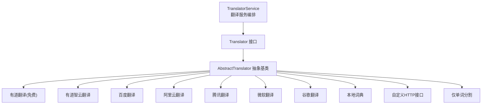
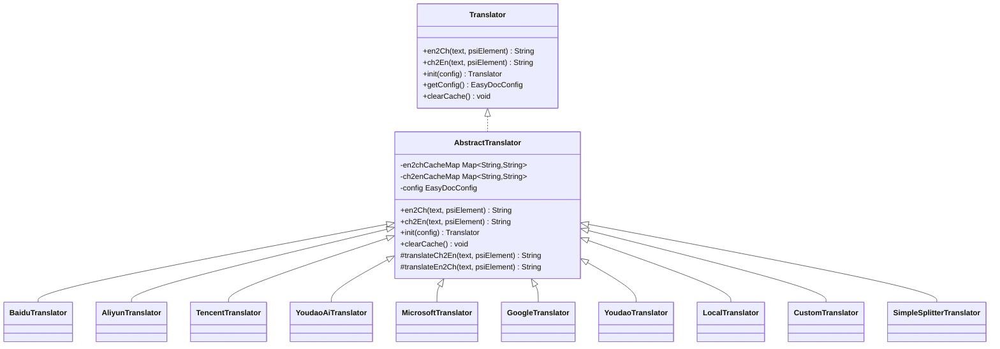
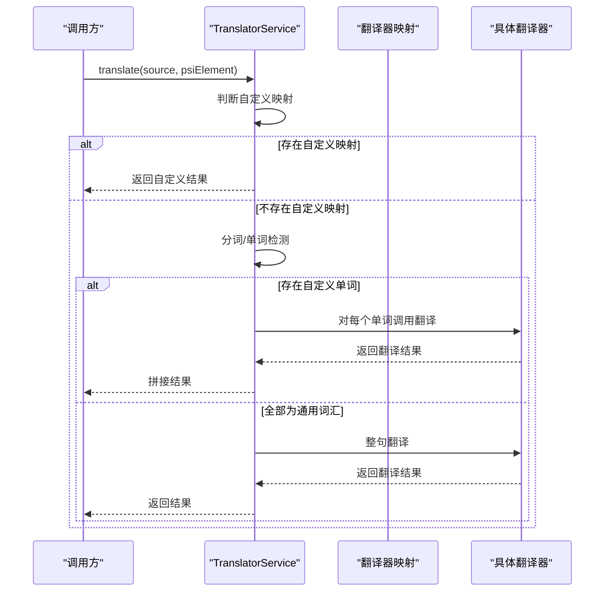
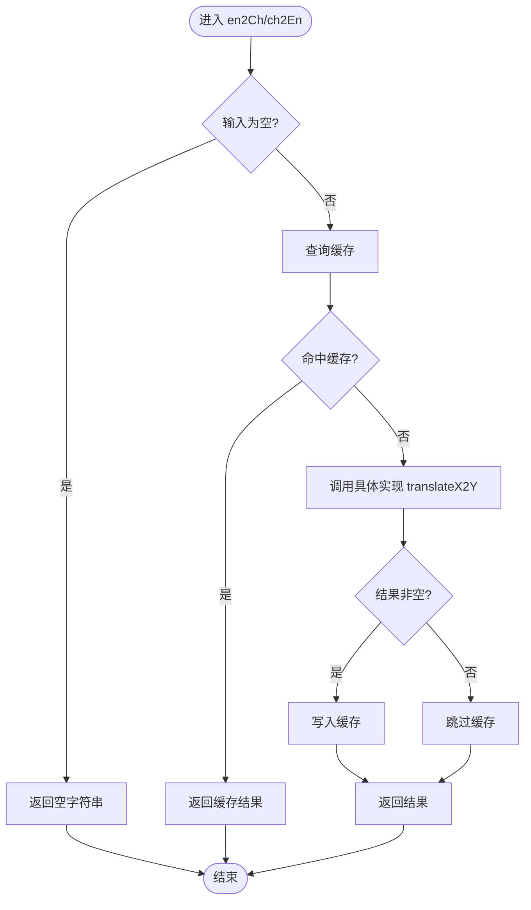
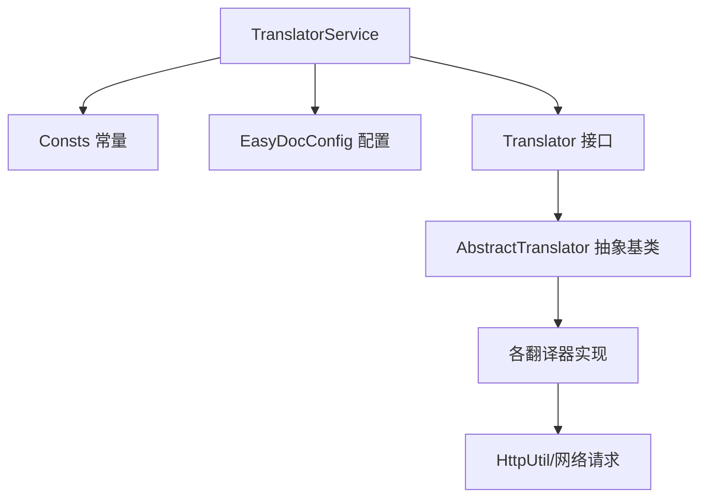

# 主流翻译器实现

<cite>
**本文档引用的文件**
- [TranslatorService.java](file://src/main/java/com/star/easydoc/service/translator/TranslatorService.java)
- [Translator.java](file://src/main/java/com/star/easydoc/service/translator/Translator.java)
- [AbstractTranslator.java](file://src/main/java/com/star/easydoc/service/translator/impl/AbstractTranslator.java)
- [YoudaoTranslator.java](file://src/main/java/com/star/easydoc/service/translator/impl/YoudaoTranslator.java)
- [BaiduTranslator.java](file://src/main/java/com/star/easydoc/service/translator/impl/BaiduTranslator.java)
- [AliyunTranslator.java](file://src/main/java/com/star/easydoc/service/translator/impl/AliyunTranslator.java)
- [TencentTranslator.java](file://src/main/java/com/star/easydoc/service/translator/impl/TencentTranslator.java)
- [MicrosoftTranslator.java](file://src/main/java/com/star/easydoc/service/translator/impl/MicrosoftTranslator.java)
- [GoogleTranslator.java](file://src/main/java/com/star/easydoc/service/translator/impl/GoogleTranslator.java)
- [YoudaoAiTranslator.java](file://src/main/java/com/star/easydoc/service/translator/impl/YoudaoAiTranslator.java)
- [LocalTranslator.java](file://src/main/java/com/star/easydoc/service/translator/impl/LocalTranslator.java)
- [CustomTranslator.java](file://src/main/java/com/star/easydoc/service/translator/impl/CustomTranslator.java)
- [SimpleSplitterTranslator.java](file://src/main/java/com/star/easydoc/service/translator/impl/SimpleSplitterTranslator.java)
- [Consts.java](file://src/main/java/com/star/easydoc/common/Consts.java)
- [EasyDocConfig.java](file://src/main/java/com/star/easydoc/config/EasyDocConfig.java)
</cite>

## 目录
1. [简介](#简介)
2. [项目结构](#项目结构)
3. [核心组件](#核心组件)
4. [架构总览](#架构总览)
5. [详细组件分析](#详细组件分析)
6. [依赖分析](#依赖分析)
7. [性能考虑](#性能考虑)
8. [故障排除指南](#故障排除指南)
9. [结论](#结论)
10. [附录](#附录)

## 简介
本文件面向“主流翻译器实现”的技术文档，系统性梳理并解读代码库中对多家翻译服务的集成实现，包括但不限于：有道翻译、百度翻译、阿里云翻译、腾讯翻译、微软翻译、谷歌翻译等。文档从架构设计、组件职责、数据流与处理逻辑、错误处理与重试机制、配置参数与密钥管理、性能与可靠性等方面进行深入分析，并提供各翻译器的优缺点对比、配置示例与使用场景建议、故障排除与性能优化建议。

## 项目结构
翻译模块采用“接口 + 抽象基类 + 多实现”的分层设计，核心入口通过服务类统一调度，具体翻译器以独立类实现各自 API 的调用细节。配置信息集中于配置类，常量定义位于常量类，便于统一管理与扩展。

图表来源
- [TranslatorService.java:41-77](file://src/main/java/com/star/easydoc/service/translator/TranslatorService.java#L41-L77)
- [Translator.java:13-53](file://src/main/java/com/star/easydoc/service/translator/Translator.java#L13-L53)
- [AbstractTranslator.java:14-91](file://src/main/java/com/star/easydoc/service/translator/impl/AbstractTranslator.java#L14-L91)
- [YoudaoTranslator.java:22](file://src/main/java/com/star/easydoc/service/translator/impl/YoudaoTranslator.java#L22)
- [YoudaoAiTranslator.java:24](file://src/main/java/com/star/easydoc/service/translator/impl/YoudaoAiTranslator.java#L24)
- [BaiduTranslator.java:21](file://src/main/java/com/star/easydoc/service/translator/impl/BaiduTranslator.java#L21)
- [AliyunTranslator.java:35](file://src/main/java/com/star/easydoc/service/translator/impl/AliyunTranslator.java#L35)
- [TencentTranslator.java:27](file://src/main/java/com/star/easydoc/service/translator/impl/TencentTranslator.java#L27)
- [MicrosoftTranslator.java:22](file://src/main/java/com/star/easydoc/service/translator/impl/MicrosoftTranslator.java#L22)
- [GoogleTranslator.java:19](file://src/main/java/com/star/easydoc/service/translator/impl/GoogleTranslator.java#L19)
- [LocalTranslator.java:25](file://src/main/java/com/star/easydoc/service/translator/impl/LocalTranslator.java#L25)
- [CustomTranslator.java:20](file://src/main/java/com/star/easydoc/service/translator/impl/CustomTranslator.java#L20)
- [SimpleSplitterTranslator.java:13](file://src/main/java/com/star/easydoc/service/translator/impl/SimpleSplitterTranslator.java#L13)

章节来源
- [TranslatorService.java:41-77](file://src/main/java/com/star/easydoc/service/translator/TranslatorService.java#L41-L77)
- [Consts.java:29-99](file://src/main/java/com/star/easydoc/common/Consts.java#L29-L99)

## 核心组件
- 接口层：定义统一的翻译能力抽象，包括英译中、中译英、初始化与缓存清理。
- 抽象基类：实现基础缓存策略与空值处理，子类只需关注具体 API 实现。
- 服务编排：根据配置选择具体翻译器，支持整句翻译与单词粒度翻译的混合策略。
- 配置中心：集中管理各翻译器所需的密钥、区域、超时等参数。
- 常量定义：统一管理可用翻译器名称、集合与默认值。

章节来源
- [Translator.java:13-53](file://src/main/java/com/star/easydoc/service/translator/Translator.java#L13-L53)
- [AbstractTranslator.java:14-91](file://src/main/java/com/star/easydoc/service/translator/impl/AbstractTranslator.java#L14-L91)
- [TranslatorService.java:85-111](file://src/main/java/com/star/easydoc/service/translator/TranslatorService.java#L85-L111)
- [EasyDocConfig.java:394-679](file://src/main/java/com/star/easydoc/config/EasyDocConfig.java#L394-L679)
- [Consts.java:29-99](file://src/main/java/com/star/easydoc/common/Consts.java#L29-L99)

## 架构总览
整体采用“服务编排 + 多实现 + 缓存 + 配置”的架构，服务层负责路由与策略选择，实现层负责具体 API 调用与错误处理，抽象基类提供缓存与通用逻辑，配置类提供密钥与参数注入。

图表来源
- [Translator.java:13-53](file://src/main/java/com/star/easydoc/service/translator/Translator.java#L13-L53)
- [AbstractTranslator.java:14-91](file://src/main/java/com/star/easydoc/service/translator/impl/AbstractTranslator.java#L14-L91)
- [BaiduTranslator.java:21](file://src/main/java/com/star/easydoc/service/translator/impl/BaiduTranslator.java#L21)
- [AliyunTranslator.java:35](file://src/main/java/com/star/easydoc/service/translator/impl/AliyunTranslator.java#L35)
- [TencentTranslator.java:27](file://src/main/java/com/star/easydoc/service/translator/impl/TencentTranslator.java#L27)
- [YoudaoAiTranslator.java:24](file://src/main/java/com/star/easydoc/service/translator/impl/YoudaoAiTranslator.java#L24)
- [MicrosoftTranslator.java:22](file://src/main/java/com/star/easydoc/service/translator/impl/MicrosoftTranslator.java#L22)
- [GoogleTranslator.java:19](file://src/main/java/com/star/easydoc/service/translator/impl/GoogleTranslator.java#L19)
- [YoudaoTranslator.java:22](file://src/main/java/com/star/easydoc/service/translator/impl/YoudaoTranslator.java#L22)
- [LocalTranslator.java:25](file://src/main/java/com/star/easydoc/service/translator/impl/LocalTranslator.java#L25)
- [CustomTranslator.java:20](file://src/main/java/com/star/easydoc/service/translator/impl/CustomTranslator.java#L20)
- [SimpleSplitterTranslator.java:13](file://src/main/java/com/star/easydoc/service/translator/impl/SimpleSplitterTranslator.java#L13)

## 详细组件分析

### 翻译服务编排（TranslatorService）
- 初始化：按可用翻译器集合构建映射，注入配置对象，线程安全初始化。
- 策略选择：根据配置选择当前翻译器；支持整句翻译与单词粒度翻译的混合策略；支持基于 PSI 元素的类注释优先策略。
- 缓存清理：统一调用各翻译器的缓存清理接口。

图表来源
- [TranslatorService.java:85-111](file://src/main/java/com/star/easydoc/service/translator/TranslatorService.java#L85-L111)
- [TranslatorService.java:157-163](file://src/main/java/com/star/easydoc/service/translator/TranslatorService.java#L157-L163)

章节来源
- [TranslatorService.java:52-77](file://src/main/java/com/star/easydoc/service/translator/TranslatorService.java#L52-L77)
- [TranslatorService.java:85-111](file://src/main/java/com/star/easydoc/service/translator/TranslatorService.java#L85-L111)
- [TranslatorService.java:157-163](file://src/main/java/com/star/easydoc/service/translator/TranslatorService.java#L157-L163)
- [TranslatorService.java:234-236](file://src/main/java/com/star/easydoc/service/translator/TranslatorService.java#L234-L236)

### 抽象翻译器（AbstractTranslator）
- 缓存策略：分别维护英文到中文与中文到英文的并发缓存表，命中则直接返回，未命中再调用具体实现。
- 空值处理：对空输入返回空字符串，避免上层重复判断。
- 生命周期：提供初始化与缓存清理接口，供具体实现复用。

图表来源
- [AbstractTranslator.java:22-52](file://src/main/java/com/star/easydoc/service/translator/impl/AbstractTranslator.java#L22-L52)

章节来源
- [AbstractTranslator.java:14-91](file://src/main/java/com/star/easydoc/service/translator/impl/AbstractTranslator.java#L14-L91)

### 有道翻译（免费版）
- 状态：官方免费接口已停用，实现直接返回空字符串并触发通知提示。
- 适用场景：作为占位或引导用户切换到付费版本（有道智云）。

章节来源
- [YoudaoTranslator.java:32-42](file://src/main/java/com/star/easydoc/service/translator/impl/YoudaoTranslator.java#L32-L42)
- [YoudaoTranslator.java:47-95](file://src/main/java/com/star/easydoc/service/translator/impl/YoudaoTranslator.java#L47-L95)

### 有道智云翻译（YoudaoAiTranslator）
- 签名算法：使用 SHA-256 对拼接串进行摘要，参数包含 appKey、q、salt、curtime 与 appSecret。
- 请求方式：GET，参数通过 Map 组装并编码。
- 错误处理：捕获异常并记录日志，返回空字符串。

章节来源
- [YoudaoAiTranslator.java:39-62](file://src/main/java/com/star/easydoc/service/translator/impl/YoudaoAiTranslator.java#L39-L62)
- [YoudaoAiTranslator.java:67-88](file://src/main/java/com/star/easydoc/service/translator/impl/YoudaoAiTranslator.java#L67-L88)

### 百度翻译（BaiduTranslator）
- 签名算法：MD5(appId + 文本 + salt + token)，随机 salt，最多重试 10 次。
- 错误码处理：针对特定错误码进行短暂休眠后重试。
- 请求方式：GET，参数编码后拼接 URL。

章节来源
- [BaiduTranslator.java:38-62](file://src/main/java/com/star/easydoc/service/translator/impl/BaiduTranslator.java#L38-L62)
- [BaiduTranslator.java:64-113](file://src/main/java/com/star/easydoc/service/translator/impl/BaiduTranslator.java#L64-L113)

### 阿里云翻译（AliyunTranslator）
- 认证流程：计算 body 的 MD5+Base64，构造待签名串，使用 HMAC-SHA1 计算签名，组装 Authorization 头。
- 请求方式：POST，JSON Body，包含源语言、目标语言与文本。
- 错误处理：捕获异常并记录日志，返回空字符串。

章节来源
- [AliyunTranslator.java:59-73](file://src/main/java/com/star/easydoc/service/translator/impl/AliyunTranslator.java#L59-L73)
- [AliyunTranslator.java:117-153](file://src/main/java/com/star/easydoc/service/translator/impl/AliyunTranslator.java#L117-L153)
- [AliyunTranslator.java:158-281](file://src/main/java/com/star/easydoc/service/translator/impl/AliyunTranslator.java#L158-L281)

### 腾讯翻译（TencentTranslator）
- 签名算法：使用 HMAC-SHA1 对 GET 请求的字符串进行签名，参数包含 SecretId、Timestamp、Nonce、Region 等。
- 重试机制：当返回 RequestLimitExceeded 时短暂休眠后重试，最多 10 次。
- 请求方式：GET，参数通过 HttpUtil 拼接到 URL。

章节来源
- [TencentTranslator.java:42-76](file://src/main/java/com/star/easydoc/service/translator/impl/TencentTranslator.java#L42-L76)
- [TencentTranslator.java:78-93](file://src/main/java/com/star/easydoc/service/translator/impl/TencentTranslator.java#L78-L93)
- [TencentTranslator.java:95-182](file://src/main/java/com/star/easydoc/service/translator/impl/TencentTranslator.java#L95-L182)

### 微软翻译（MicrosoftTranslator）
- 请求方式：POST JSON，头中包含订阅密钥与可选区域。
- URL 参数：指定 API 版本、文本类型、源语言与目标语言。
- 错误处理：捕获异常并记录日志，返回空字符串。

章节来源
- [MicrosoftTranslator.java:41-60](file://src/main/java/com/star/easydoc/service/translator/impl/MicrosoftTranslator.java#L41-L60)

### 谷歌翻译（GoogleTranslator）
- 请求方式：GET，URL 中包含 API Key 与文本。
- 错误处理：捕获异常并记录日志，返回空字符串。

章节来源
- [GoogleTranslator.java:37-49](file://src/main/java/com/star/easydoc/service/translator/impl/GoogleTranslator.java#L37-L49)

### 本地词典（LocalTranslator）
- 数据来源：加载内置 words.json，构建英-中与中-英双向映射。
- 翻译策略：中文到英文直接查表；英文到中文按空格分词后逐词查找并拼接。
- 线程安全：懒加载与双重检查锁保证初始化只执行一次。

章节来源
- [LocalTranslator.java:47-69](file://src/main/java/com/star/easydoc/service/translator/impl/LocalTranslator.java#L47-L69)

### 自定义HTTP接口（CustomTranslator）
- 动态类型识别：根据 PSI 元素类型（类/方法/字段）设置 type 参数。
- URL 占位符替换：支持 {from}、{to}、{query}、{type} 占位符。
- 响应校验：要求响应中的 code 为 0，否则记录错误日志。

章节来源
- [CustomTranslator.java:34-58](file://src/main/java/com/star/easydoc/service/translator/impl/CustomTranslator.java#L34-L58)

### 仅单词分割（SimpleSplitterTranslator）
- 翻译策略：对中英文均按空格分词后重新拼接，不进行真实翻译，适合快速预览或占位。

章节来源
- [SimpleSplitterTranslator.java:15-23](file://src/main/java/com/star/easydoc/service/translator/impl/SimpleSplitterTranslator.java#L15-L23)

## 依赖分析
- 组件耦合：所有翻译器均依赖抽象基类与配置类，服务编排依赖常量类与配置类。
- 外部依赖：各翻译器通过 HTTP 工具发起请求，部分实现依赖第三方加密库与 JSON 解析库。
- 可能的循环依赖：未发现循环导入；各实现类相互独立，通过接口与抽象类解耦。

图表来源
- [TranslatorService.java:41-77](file://src/main/java/com/star/easydoc/service/translator/TranslatorService.java#L41-L77)
- [Consts.java:29-99](file://src/main/java/com/star/easydoc/common/Consts.java#L29-L99)
- [EasyDocConfig.java:394-679](file://src/main/java/com/star/easydoc/config/EasyDocConfig.java#L394-L679)
- [AbstractTranslator.java:14-91](file://src/main/java/com/star/easydoc/service/translator/impl/AbstractTranslator.java#L14-L91)

章节来源
- [Consts.java:29-99](file://src/main/java/com/star/easydoc/common/Consts.java#L29-L99)
- [EasyDocConfig.java:394-679](file://src/main/java/com/star/easydoc/config/EasyDocConfig.java#L394-L679)

## 性能考虑
- 缓存策略：抽象基类提供双表缓存，显著降低重复翻译开销，建议在高频场景下启用。
- 重试与退避：百度与腾讯翻译实现有限次重试与短暂休眠，避免瞬时限流导致失败。
- 超时控制：配置类提供超时参数，建议结合网络环境合理设置，避免阻塞。
- 网络与签名成本：阿里云与腾讯翻译涉及签名计算与头部组装，建议批量请求时合并调用以减少开销。
- 本地词典：本地词典适合小规模术语库，避免网络请求延迟。

## 故障排除指南
- 有道免费接口不可用：实现已明确提示，需切换至有道智云或其他翻译器。
- 百度翻译错误码处理：针对特定错误码进行重试，若仍失败，请检查 appId、token 与网络。
- 腾讯翻译限流：出现请求限流错误时会自动重试，建议降低并发或提升配额。
- 阿里云签名失败：检查 AccessKey 与签名算法参数，确认时间与 Host、Content-MD5 等头正确。
- 微软/谷歌翻译：检查 API Key 与区域配置，确保网络可达。
- 自定义接口：确认响应格式与 code 字段，确保 {from}/{to}/{query}/{type} 替换正确。
- 本地词典：确认 words.json 资源存在且可读，日志中会记录加载失败信息。

章节来源
- [YoudaoTranslator.java:32-42](file://src/main/java/com/star/easydoc/service/translator/impl/YoudaoTranslator.java#L32-L42)
- [BaiduTranslator.java:48-61](file://src/main/java/com/star/easydoc/service/translator/impl/BaiduTranslator.java#L48-L61)
- [TencentTranslator.java:65-75](file://src/main/java/com/star/easydoc/service/translator/impl/TencentTranslator.java#L65-L75)
- [AliyunTranslator.java:69-72](file://src/main/java/com/star/easydoc/service/translator/impl/AliyunTranslator.java#L69-L72)
- [MicrosoftTranslator.java:56-59](file://src/main/java/com/star/easydoc/service/translator/impl/MicrosoftTranslator.java#L56-L59)
- [GoogleTranslator.java:45-48](file://src/main/java/com/star/easydoc/service/translator/impl/GoogleTranslator.java#L45-L48)
- [CustomTranslator.java:49-57](file://src/main/java/com/star/easydoc/service/translator/impl/CustomTranslator.java#L49-L57)
- [LocalTranslator.java:65-67](file://src/main/java/com/star/easydoc/service/translator/impl/LocalTranslator.java#L65-L67)

## 结论
该翻译模块通过清晰的接口与抽象基类，实现了多翻译器的统一接入与缓存优化，配合灵活的配置与错误处理策略，满足不同场景下的翻译需求。建议在生产环境中优先选用有道智云、阿里云、腾讯、微软、谷歌等付费服务，并结合本地词典与自定义接口实现术语一致性与私有化部署。

## 附录

### 配置参数与密钥管理
- 通用参数
  - 翻译器选择：translator
  - 超时时间：timeout（毫秒）
- 百度翻译
  - appId、token
- 腾讯翻译
  - secretId、secretKey
- 阿里云翻译
  - accessKeyId、accessKeySecret
- 有道智云翻译
  - youdaoAppKey、youdaoAppSecret
- 谷歌翻译
  - googleKey
- 微软翻译
  - microsoftKey、microsoftRegion
- 自定义HTTP接口
  - customUrl（支持 {from}、{to}、{query}、{type} 占位符）

章节来源
- [EasyDocConfig.java:394-679](file://src/main/java/com/star/easydoc/config/EasyDocConfig.java#L394-L679)

### 各翻译器优缺点与适用场景
- 有道智云翻译
  - 优点：接口稳定，支持多种语言与场景。
  - 缺点：需要付费。
  - 适用：企业级项目，稳定性与质量要求高。
- 百度翻译
  - 优点：中文语境较好。
  - 缺点：免费接口受限，付费接口需谨慎评估成本。
  - 适用：中文场景较多的项目。
- 阿里云翻译
  - 优点：企业级认证与签名完善，稳定性好。
  - 缺点：配置复杂，需准备 AK。
  - 适用：对安全性与合规性要求高的项目。
- 腾讯翻译
  - 优点：国内访问稳定。
  - 缺点：限流与配额需关注。
  - 适用：国内用户为主的项目。
- 微软翻译
  - 优点：API 完善，支持区域配置。
  - 缺点：需正确配置区域与密钥。
  - 适用：国际化项目与 Azure 生态。
- 谷歌翻译
  - 优点：通用性强。
  - 缺点：需 API Key，网络受限地区可能不稳定。
  - 适用：通用场景与个人开发者。
- 本地词典
  - 优点：零网络延迟，术语可控。
  - 缺点：覆盖面有限。
  - 适用：术语固定的小型团队。
- 自定义HTTP接口
  - 优点：完全自定义，可适配内部翻译平台。
  - 缺点：需自行维护接口与响应格式。
  - 适用：已有内部翻译系统的团队。
- 仅单词分割
  - 优点：极低开销。
  - 缺点：无真实翻译。
  - 适用：临时占位或预览。

### 使用场景建议
- 企业级项目：优先选择有道智云、阿里云、腾讯、微软、谷歌等付费服务，结合本地词典与自定义接口实现术语一致。
- 国内用户：优先考虑腾讯翻译或有道智云，网络与稳定性更佳。
- 国际化项目：微软翻译与谷歌翻译更合适，注意区域与密钥配置。
- 个人开发者：可先用本地词典或仅单词分割快速体验，后续再接入付费服务。
- 术语驱动：建立完善的自定义单词映射，提高翻译一致性与可维护性。