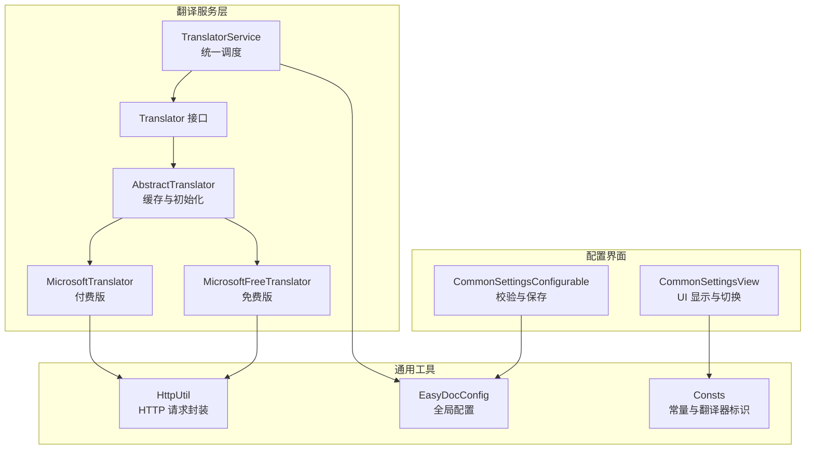
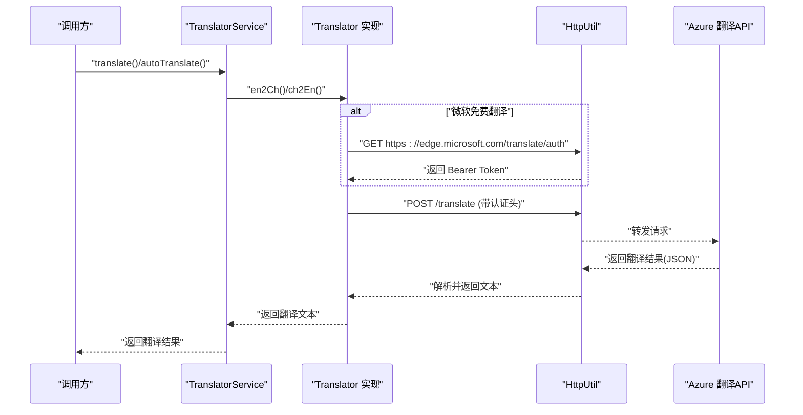
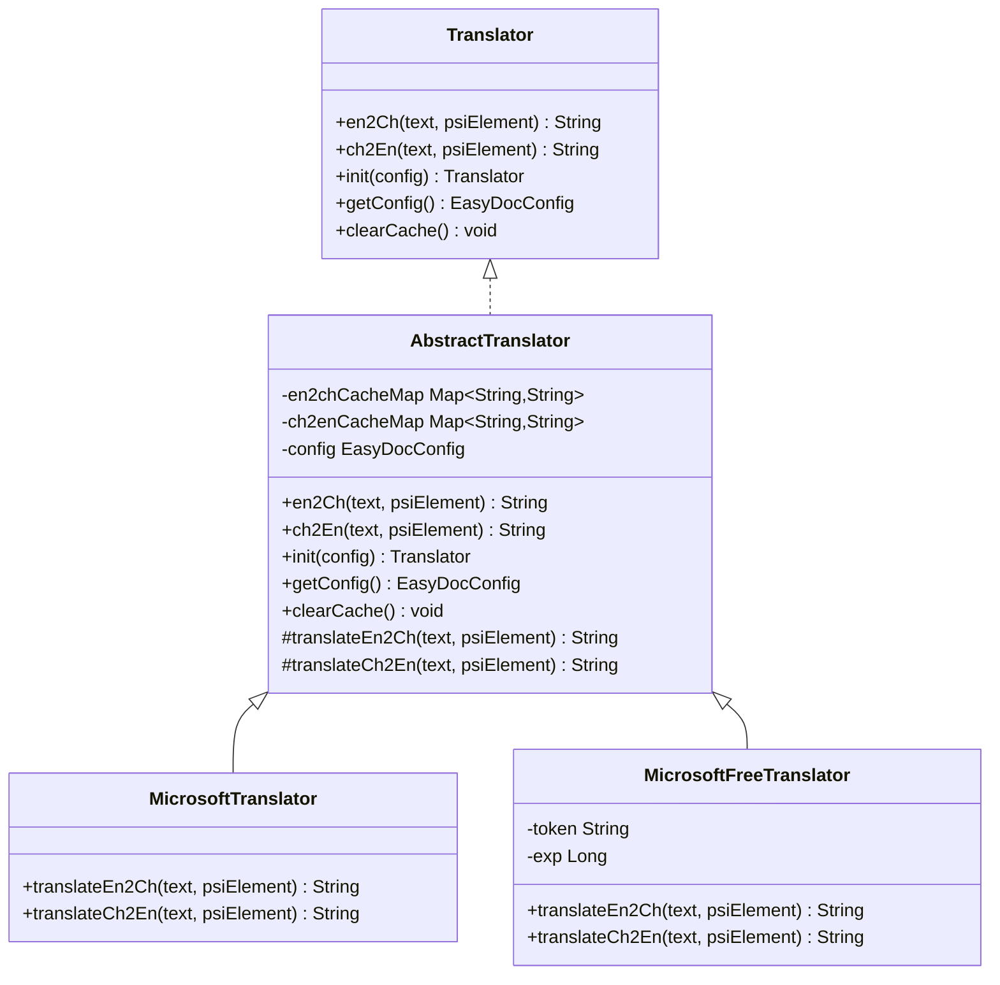
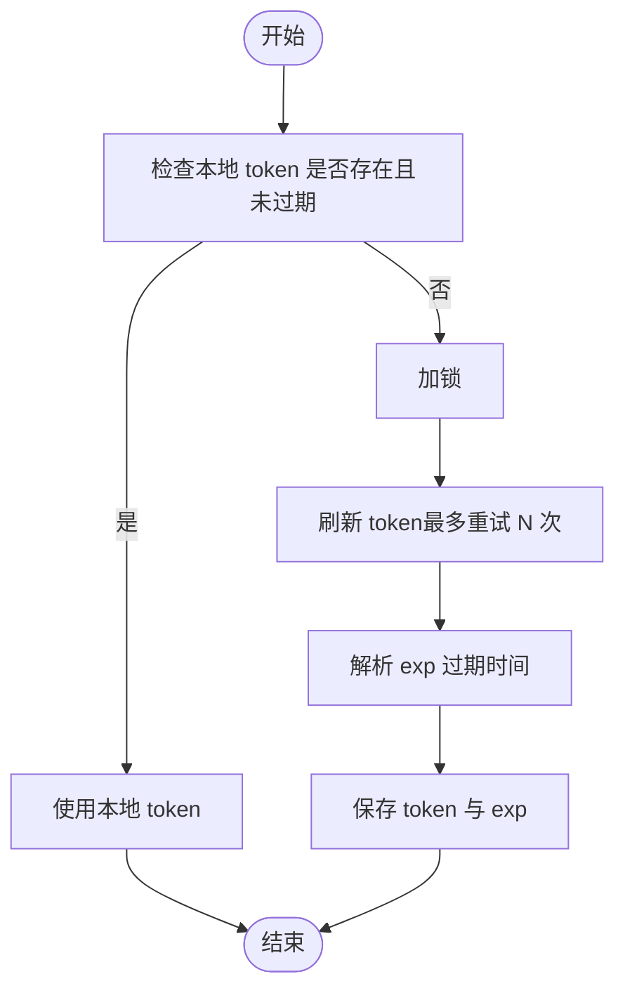
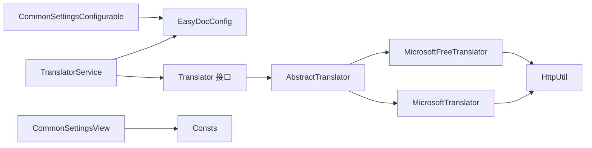

# 微软翻译器

<cite>
**本文引用的文件列表**
- [MicrosoftTranslator.java](file://src/main/java/com/star/easydoc/service/translator/impl/MicrosoftTranslator.java)
- [MicrosoftFreeTranslator.java](file://src/main/java/com/star/easydoc/service/translator/impl/MicrosoftFreeTranslator.java)
- [AbstractTranslator.java](file://src/main/java/com/star/easydoc/service/translator/impl/AbstractTranslator.java)
- [Translator.java](file://src/main/java/com/star/easydoc/service/translator/Translator.java)
- [TranslatorService.java](file://src/main/java/com/star/easydoc/service/translator/TranslatorService.java)
- [HttpUtil.java](file://src/main/java/com/star/easydoc/common/util/HttpUtil.java)
- [EasyDocConfig.java](file://src/main/java/com/star/easydoc/config/EasyDocConfig.java)
- [Consts.java](file://src/main/java/com/star/easydoc/common/Consts.java)
- [CommonSettingsView.java](file://src/main/java/com/star/easydoc/view/settings/CommonSettingsView.java)
- [CommonSettingsConfigurable.java](file://src/main/java/com/star/easydoc/view/settings/CommonSettingsConfigurable.java)
- [translate.txt](file://src/main/resources/prompts/translate.txt)
</cite>

## 目录
1. [简介](#简介)
2. [项目结构](#项目结构)
3. [核心组件](#核心组件)
4. [架构总览](#架构总览)
5. [详细组件分析](#详细组件分析)
6. [依赖关系分析](#依赖关系分析)
7. [性能与可靠性](#性能与可靠性)
8. [故障排查指南](#故障排查指南)
9. [结论](#结论)
10. [附录](#附录)

## 简介
本文件面向“微软翻译器”的技术实现，系统性梳理了 Azure 认知服务翻译 API 在本项目中的集成方式，涵盖认证机制（订阅密钥与区域）、调用流程、错误处理与重试策略、性能优化建议，并提供配置与使用示例。文档同时解释了“微软翻译”与“微软免费翻译”两种实现的差异及适用场景，帮助开发者快速上手并稳定集成。

## 项目结构
与“微软翻译器”直接相关的模块位于 service.translator 子包，采用“抽象基类 + 多实现”的设计，统一对外接口，便于扩展与切换不同翻译服务。

图表来源
- [TranslatorService.java:41-77](file://src/main/java/com/star/easydoc/service/translator/TranslatorService.java#L41-L77)
- [AbstractTranslator.java:14-92](file://src/main/java/com/star/easydoc/service/translator/impl/AbstractTranslator.java#L14-L92)
- [MicrosoftTranslator.java:22-62](file://src/main/java/com/star/easydoc/service/translator/impl/MicrosoftTranslator.java#L22-L62)
- [MicrosoftFreeTranslator.java:23-121](file://src/main/java/com/star/easydoc/service/translator/impl/MicrosoftFreeTranslator.java#L23-L121)
- [HttpUtil.java:39-246](file://src/main/java/com/star/easydoc/common/util/HttpUtil.java#L39-L246)
- [EasyDocConfig.java:22-680](file://src/main/java/com/star/easydoc/config/EasyDocConfig.java#L22-L680)
- [Consts.java:14-100](file://src/main/java/com/star/easydoc/common/Consts.java#L14-L100)
- [CommonSettingsView.java:320-472](file://src/main/java/com/star/easydoc/view/settings/CommonSettingsView.java#L320-L472)
- [CommonSettingsConfigurable.java:117-171](file://src/main/java/com/star/easydoc/view/settings/CommonSettingsConfigurable.java#L117-L171)

章节来源
- [TranslatorService.java:41-77](file://src/main/java/com/star/easydoc/service/translator/TranslatorService.java#L41-L77)
- [Consts.java:29-34](file://src/main/java/com/star/easydoc/common/Consts.java#L29-L34)

## 核心组件
- 抽象翻译器：提供缓存、初始化与抽象翻译方法，屏蔽具体实现细节。
- 微软翻译（付费版）：使用订阅密钥与可选区域头进行认证，调用官方翻译端点。
- 微软免费翻译（免费版）：通过边缘端点获取 Bearer Token，再调用官方翻译端点；内置令牌刷新与过期检查。
- 统一调度器：根据配置选择具体翻译器，负责整句/单词级翻译与缓存清理。
- HTTP 工具：统一封装 GET/POST、代理、超时等网络请求能力。
- 配置与 UI：集中管理各翻译器的密钥/区域/超时等参数，并在设置界面动态显示。

章节来源
- [AbstractTranslator.java:14-92](file://src/main/java/com/star/easydoc/service/translator/impl/AbstractTranslator.java#L14-L92)
- [MicrosoftTranslator.java:22-62](file://src/main/java/com/star/easydoc/service/translator/impl/MicrosoftTranslator.java#L22-L62)
- [MicrosoftFreeTranslator.java:23-121](file://src/main/java/com/star/easydoc/service/translator/impl/MicrosoftFreeTranslator.java#L23-L121)
- [TranslatorService.java:85-111](file://src/main/java/com/star/easydoc/service/translator/TranslatorService.java#L85-L111)
- [HttpUtil.java:39-246](file://src/main/java/com/star/easydoc/common/util/HttpUtil.java#L39-L246)
- [EasyDocConfig.java:130-135](file://src/main/java/com/star/easydoc/config/EasyDocConfig.java#L130-L135)

## 架构总览
下图展示从调用入口到 Azure 翻译 API 的完整链路，以及两种微软翻译实现的差异点。

图表来源
- [TranslatorService.java:85-111](file://src/main/java/com/star/easydoc/service/translator/TranslatorService.java#L85-L111)
- [MicrosoftFreeTranslator.java:54-90](file://src/main/java/com/star/easydoc/service/translator/impl/MicrosoftFreeTranslator.java#L54-L90)
- [MicrosoftTranslator.java:41-60](file://src/main/java/com/star/easydoc/service/translator/impl/MicrosoftTranslator.java#L41-L60)
- [HttpUtil.java:147-180](file://src/main/java/com/star/easydoc/common/util/HttpUtil.java#L147-L180)

## 详细组件分析

### 抽象翻译器与接口
- 提供 en2Ch/ch2En 缓存逻辑，避免重复请求。
- 统一 init/getConfig/clearCache 接口，便于子类复用。
- 子类需实现 translateEn2Ch/translateCh2En 两个抽象方法。

图表来源
- [Translator.java:13-54](file://src/main/java/com/star/easydoc/service/translator/Translator.java#L13-L54)
- [AbstractTranslator.java:14-92](file://src/main/java/com/star/easydoc/service/translator/impl/AbstractTranslator.java#L14-L92)
- [MicrosoftTranslator.java:22-62](file://src/main/java/com/star/easydoc/service/translator/impl/MicrosoftTranslator.java#L22-L62)
- [MicrosoftFreeTranslator.java:23-121](file://src/main/java/com/star/easydoc/service/translator/impl/MicrosoftFreeTranslator.java#L23-L121)

章节来源
- [AbstractTranslator.java:22-52](file://src/main/java/com/star/easydoc/service/translator/impl/AbstractTranslator.java#L22-L52)
- [Translator.java:13-54](file://src/main/java/com/star/easydoc/service/translator/Translator.java#L13-L54)

### 微软翻译（付费版）实现
- 认证头：
  - 必填：Ocp-Apim-Subscription-Key
  - 可选：Ocp-Apim-Subscription-Region（为空则为 global）
- 端点：
  - 英译中：/translate?api-version=3.0&textType=plain&from=en&to=zh-Hans
  - 中译英：/translate?api-version=3.0&textType=plain&from=zh-Hans&to=en
- 请求体：JSON 数组，包含 Text 字段。
- 错误处理：捕获异常并记录日志，返回空字符串。

章节来源
- [MicrosoftTranslator.java:26-29](file://src/main/java/com/star/easydoc/service/translator/impl/MicrosoftTranslator.java#L26-L29)
- [MicrosoftTranslator.java:41-60](file://src/main/java/com/star/easydoc/service/translator/impl/MicrosoftTranslator.java#L41-L60)
- [EasyDocConfig.java:130-135](file://src/main/java/com/star/easydoc/config/EasyDocConfig.java#L130-L135)

### 微软免费翻译（免费版）实现
- 认证流程：
  - 通过 https://edge.microsoft.com/translate/auth 获取 Bearer Token。
  - 解析 JWT 的 exp 字段作为过期时间戳，本地缓存。
  - 过期或不存在时加锁刷新，最多重试指定次数。
- 端点与请求体同付费版。
- 错误处理：失败抛出运行时异常，记录警告日志。

图表来源
- [MicrosoftFreeTranslator.java:79-90](file://src/main/java/com/star/easydoc/service/translator/impl/MicrosoftFreeTranslator.java#L79-L90)
- [MicrosoftFreeTranslator.java:54-72](file://src/main/java/com/star/easydoc/service/translator/impl/MicrosoftFreeTranslator.java#L54-L72)

章节来源
- [MicrosoftFreeTranslator.java:54-90](file://src/main/java/com/star/easydoc/service/translator/impl/MicrosoftFreeTranslator.java#L54-L90)
- [MicrosoftFreeTranslator.java:102-120](file://src/main/java/com/star/easydoc/service/translator/impl/MicrosoftFreeTranslator.java#L102-L120)

### 统一调度器与缓存策略
- 整句翻译优先：当没有自定义单词映射时，将拆分后的词拼接成整句调用翻译器，通常翻译质量更高。
- 单词级回退：若整句翻译结果为空，则逐词调用并拼接。
- 缓存：AbstractTranslator 对英文->中文与中文->英文分别维护并发安全的缓存表，减少重复请求。
- 清理：提供 clearCache 接口，用于在配置变更后刷新缓存。

章节来源
- [TranslatorService.java:85-111](file://src/main/java/com/star/easydoc/service/translator/TranslatorService.java#L85-L111)
- [AbstractTranslator.java:16-72](file://src/main/java/com/star/easydoc/service/translator/impl/AbstractTranslator.java#L16-L72)

### HTTP 工具与代理支持
- 支持 GET/POST、JSON 请求体、代理自动识别与配置。
- 超时控制：连接超时与套接字超时可按需调整。
- 代理：基于 IntelliJ CommonProxy 自动选择系统代理。

章节来源
- [HttpUtil.java:76-103](file://src/main/java/com/star/easydoc/common/util/HttpUtil.java#L76-L103)
- [HttpUtil.java:147-180](file://src/main/java/com/star/easydoc/common/util/HttpUtil.java#L147-L180)
- [HttpUtil.java:225-243](file://src/main/java/com/star/easydoc/common/util/HttpUtil.java#L225-L243)

### 配置与设置界面
- 配置项：
  - 微软密钥：microsoftKey
  - 微软区域：microsoftRegion（可选）
  - 超时：timeout（毫秒）
- 设置界面：
  - 当选择“微软翻译”时，显示“密钥”和“区域”输入框。
  - 校验：保存前校验密钥非空。
- 常量：Consts 定义了“微软翻译”“微软免费翻译”等标识，供 UI 与调度器使用。

章节来源
- [EasyDocConfig.java:130-135](file://src/main/java/com/star/easydoc/config/EasyDocConfig.java#L130-L135)
- [CommonSettingsView.java:330-358](file://src/main/java/com/star/easydoc/view/settings/CommonSettingsView.java#L330-L358)
- [CommonSettingsConfigurable.java:152-156](file://src/main/java/com/star/easydoc/view/settings/CommonSettingsConfigurable.java#L152-L156)
- [Consts.java:64-70](file://src/main/java/com/star/easydoc/common/Consts.java#L64-L70)

## 依赖关系分析
- 组件耦合：
  - TranslatorService 依赖 EasyDocConfig 与各 Translator 实现。
  - MicrosoftTranslator/MicrosoftFreeTranslator 依赖 HttpUtil 与 EasyDocConfig。
  - UI 层通过 Configurable 与 View 控制配置可见性与校验。
- 外部依赖：
  - Apache HttpClient（通过 HttpUtil 封装）。
  - FastJSON2（JSON 序列化/反序列化）。
  - Guava（集合与不可变对象）。
  - IntelliJ 平台 API（日志、项目上下文、代理）。

图表来源
- [TranslatorService.java:41-77](file://src/main/java/com/star/easydoc/service/translator/TranslatorService.java#L41-L77)
- [AbstractTranslator.java:14-92](file://src/main/java/com/star/easydoc/service/translator/impl/AbstractTranslator.java#L14-L92)
- [MicrosoftTranslator.java:22-62](file://src/main/java/com/star/easydoc/service/translator/impl/MicrosoftTranslator.java#L22-L62)
- [MicrosoftFreeTranslator.java:23-121](file://src/main/java/com/star/easydoc/service/translator/impl/MicrosoftFreeTranslator.java#L23-L121)
- [HttpUtil.java:39-246](file://src/main/java/com/star/easydoc/common/util/HttpUtil.java#L39-L246)
- [Consts.java:14-100](file://src/main/java/com/star/easydoc/common/Consts.java#L14-L100)
- [CommonSettingsView.java:320-472](file://src/main/java/com/star/easydoc/view/settings/CommonSettingsView.java#L320-L472)
- [CommonSettingsConfigurable.java:117-171](file://src/main/java/com/star/easydoc/view/settings/CommonSettingsConfigurable.java#L117-L171)

## 性能与可靠性
- 缓存策略
  - AbstractTranslator 使用并发安全 Map 缓存翻译结果，显著降低重复请求。
  - 建议在批量翻译场景中先调用 clearCache，确保新配置生效。
- 超时与代理
  - HttpUtil 默认连接/读取超时较短，适合 IDE 场景；可通过 EasyDocConfig.timeout 调整。
  - 自动代理支持，避免网络受限环境下的请求失败。
- 重试与容错
  - 微软免费翻译实现内置令牌刷新重试（默认最多 3 次），失败抛出运行时异常。
  - 建议在上层业务中对翻译调用增加幂等与重试策略，避免瞬时网络波动影响体验。
- 网络与并发
  - 建议在高并发场景下限制单实例并发请求速率，避免被 Azure 端限流。
  - 对于大文本，建议拆分批次调用，提升吞吐与稳定性。

章节来源
- [AbstractTranslator.java:16-72](file://src/main/java/com/star/easydoc/service/translator/impl/AbstractTranslator.java#L16-L72)
- [HttpUtil.java:41-42](file://src/main/java/com/star/easydoc/common/util/HttpUtil.java#L41-L42)
- [MicrosoftFreeTranslator.java:54-72](file://src/main/java/com/star/easydoc/service/translator/impl/MicrosoftFreeTranslator.java#L54-L72)

## 故障排查指南
- 常见错误与定位
  - “请检查你的密钥和网络”：多见于付费版认证失败或网络不通。
  - “请检查你的网络”：免费版获取 token 或翻译请求失败。
  - “仍重试 N 次后失败”：免费版令牌刷新多次失败，检查网络与 Azure 端点可达性。
- 建议排查步骤
  - 确认 EasyDocConfig 中的 microsoftKey 与 microsoftRegion 设置正确。
  - 检查网络代理与防火墙，确保可访问 Azure 翻译 API 与 edge.microsoft.com。
  - 适当增大 timeout，观察是否因超时导致失败。
  - 在 UI 中切换到“微软免费翻译”，验证是否为认证问题。
- 日志与告警
  - 付费版与免费版均记录错误日志，包含响应 JSON 片段，便于定位问题。

章节来源
- [MicrosoftTranslator.java:56-59](file://src/main/java/com/star/easydoc/service/translator/impl/MicrosoftTranslator.java#L56-L59)
- [MicrosoftFreeTranslator.java:62-68](file://src/main/java/com/star/easydoc/service/translator/impl/MicrosoftFreeTranslator.java#L62-L68)
- [MicrosoftFreeTranslator.java:115-118](file://src/main/java/com/star/easydoc/service/translator/impl/MicrosoftFreeTranslator.java#L115-L118)

## 结论
本项目对 Azure 认知服务翻译 API 的集成采用“统一接口 + 多实现 + 缓存 + 配置驱动”的架构，既满足付费版的强认证需求，也提供免费版的便捷接入路径。通过 HttpUtil 的网络封装与 UI 的可视化配置，开发者可以快速完成密钥与区域的设置，并在不同场景下选择合适的翻译实现。建议在生产环境中结合缓存、超时与重试策略，以获得更稳定的翻译体验。

## 附录

### 配置与使用指南
- 配置项
  - 微软密钥：在设置界面选择“微软翻译”后填写。
  - 微软区域：可选，为空则为 global。
  - 超时：单位毫秒，默认较短，可根据网络状况调整。
- 使用示例（概念性）
  - 文本翻译：调用 TranslatorService.translate 或 autoTranslate。
  - 中译英：调用 TranslatorService.translateCh2En。
  - 批量翻译：循环调用上述方法，注意控制并发与速率。
  - 清理缓存：在配置变更后调用 clearCache。

章节来源
- [CommonSettingsView.java:330-358](file://src/main/java/com/star/easydoc/view/settings/CommonSettingsView.java#L330-L358)
- [TranslatorService.java:85-111](file://src/main/java/com/star/easydoc/service/translator/TranslatorService.java#L85-L111)
- [TranslatorService.java:171-205](file://src/main/java/com/star/easydoc/service/translator/TranslatorService.java#L171-L205)
- [AbstractTranslator.java:68-72](file://src/main/java/com/star/easydoc/service/translator/impl/AbstractTranslator.java#L68-L72)

### 认证机制说明
- 付费版（MicrosoftTranslator）
  - 必填头：Ocp-Apim-Subscription-Key
  - 可选头：Ocp-Apim-Subscription-Region
- 免费版（MicrosoftFreeTranslator）
  - 通过 edge.microsoft.com 获取 Bearer Token，随后在请求头 Authorization 中携带。

章节来源
- [MicrosoftTranslator.java:48-52](file://src/main/java/com/star/easydoc/service/translator/impl/MicrosoftTranslator.java#L48-L52)
- [MicrosoftFreeTranslator.java:110](file://src/main/java/com/star/easydoc/service/translator/impl/MicrosoftFreeTranslator.java#L110)

### 语言与端点参考
- 端点参数
  - api-version=3.0
  - textType=plain
  - from/en 与 to/zh-Hans 的方向组合
- 语言支持
  - 本项目默认使用 en-zh-Hans 与 zh-Hans-en 的方向组合，实际可用语言取决于 Azure 翻译服务支持范围。

章节来源
- [MicrosoftTranslator.java:26-29](file://src/main/java/com/star/easydoc/service/translator/impl/MicrosoftTranslator.java#L26-L29)
- [MicrosoftFreeTranslator.java:44-49](file://src/main/java/com/star/easydoc/service/translator/impl/MicrosoftFreeTranslator.java#L44-L49)