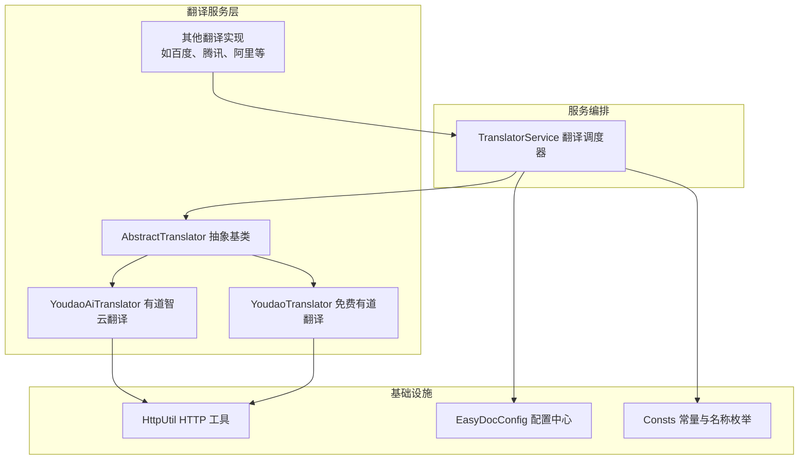
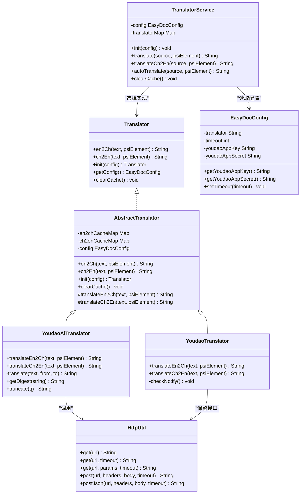
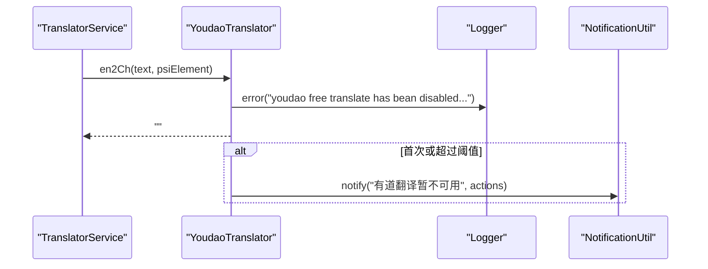
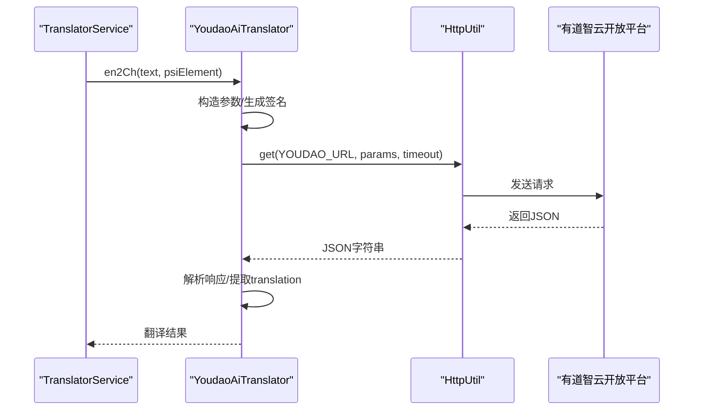
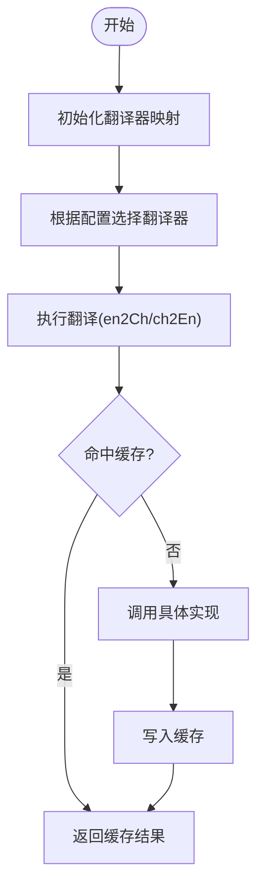
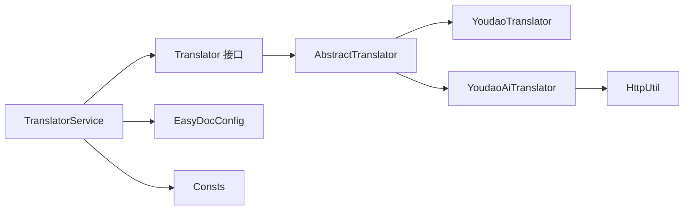

# 有道翻译器

<cite>
**本文引用的文件列表**
- [YoudaoTranslator.java](file://src/main/java/com/star/easydoc/service/translator/impl/YoudaoTranslator.java)
- [YoudaoAiTranslator.java](file://src/main/java/com/star/easydoc/service/translator/impl/YoudaoAiTranslator.java)
- [AbstractTranslator.java](file://src/main/java/com/star/easydoc/service/translator/impl/AbstractTranslator.java)
- [Translator.java](file://src/main/java/com/star/easydoc/service/translator/Translator.java)
- [TranslatorService.java](file://src/main/java/com/star/easydoc/service/translator/TranslatorService.java)
- [HttpUtil.java](file://src/main/java/com/star/easydoc/common/util/HttpUtil.java)
- [Consts.java](file://src/main/java/com/star/easydoc/common/Consts.java)
- [EasyDocConfig.java](file://src/main/java/com/star/easydoc/config/EasyDocConfig.java)
- [README.md](file://README.md)
</cite>

## 目录
1. [简介](#简介)
2. [项目结构与定位](#项目结构与定位)
3. [核心组件](#核心组件)
4. [架构总览](#架构总览)
5. [详细组件分析](#详细组件分析)
6. [依赖关系分析](#依赖关系分析)
7. [性能与可用性考量](#性能与可用性考量)
8. [故障排除指南](#故障排除指南)
9. [结论](#结论)
10. [附录：替代方案与迁移指引](#附录替代方案与迁移指引)

## 简介
本节面向“有道翻译器”的技术文档目标，聚焦于以下主题：
- 有道翻译服务的集成实现与现状：包括免费版本已停止服务的历史背景与当前状态
- 有道翻译器的配置方法、API 使用限制、错误处理机制
- 为什么有道免费翻译已被官方禁用，以及如何引导用户转向付费版本或其他翻译服务
- 提供有道翻译器的替代方案建议，包括其他翻译服务的配置和使用方法
- 故障排除指南与用户体验优化建议

## 项目结构与定位
该插件基于 IntelliJ 平台，提供多种翻译服务集成，其中“有道翻译”与“有道智云翻译”分别对应免费与付费两条路线。当前免费的“有道翻译”已被官方禁用，代码层面表现为直接返回空字符串并记录错误日志；付费的“有道智云翻译”仍可正常使用，但需配置 AppKey/AppSecret。

图表来源
- [AbstractTranslator.java:14-91](file://src/main/java/com/star/easydoc/service/translator/impl/AbstractTranslator.java#L14-L91)
- [YoudaoTranslator.java:22-42](file://src/main/java/com/star/easydoc/service/translator/impl/YoudaoTranslator.java#L22-L42)
- [YoudaoAiTranslator.java:24-62](file://src/main/java/com/star/easydoc/service/translator/impl/YoudaoAiTranslator.java#L24-L62)
- [TranslatorService.java:60-76](file://src/main/java/com/star/easydoc/service/translator/TranslatorService.java#L60-L76)
- [HttpUtil.java:39-103](file://src/main/java/com/star/easydoc/common/util/HttpUtil.java#L39-L103)
- [EasyDocConfig.java:113-119](file://src/main/java/com/star/easydoc/config/EasyDocConfig.java#L113-L119)
- [Consts.java:48-62](file://src/main/java/com/star/easydoc/common/Consts.java#L48-L62)

章节来源
- [README.md:1-50](file://README.md#L1-L50)
- [Consts.java:48-62](file://src/main/java/com/star/easydoc/common/Consts.java#L48-L62)
- [EasyDocConfig.java:82-119](file://src/main/java/com/star/easydoc/config/EasyDocConfig.java#L82-L119)
- [TranslatorService.java:60-76](file://src/main/java/com/star/easydoc/service/translator/TranslatorService.java#L60-L76)

## 核心组件
- 抽象翻译器：统一缓存、初始化、配置注入与抽象翻译方法定义
- 免费有道翻译器：已禁用，直接返回空字符串并记录错误日志，同时周期性推送替代方案通知
- 有道智云翻译器：付费接口，按签名算法调用开放平台 API
- 翻译服务编排器：根据配置选择具体翻译器并执行翻译
- HTTP 工具：封装 GET 请求、代理、编码与异常处理
- 配置中心：集中管理各翻译服务的密钥、超时、翻译器选择等
- 常量：统一翻译器名称与启用集合

章节来源
- [AbstractTranslator.java:14-91](file://src/main/java/com/star/easydoc/service/translator/impl/AbstractTranslator.java#L14-L91)
- [YoudaoTranslator.java:22-95](file://src/main/java/com/star/easydoc/service/translator/impl/YoudaoTranslator.java#L22-L95)
- [YoudaoAiTranslator.java:24-119](file://src/main/java/com/star/easydoc/service/translator/impl/YoudaoAiTranslator.java#L24-L119)
- [TranslatorService.java:41-237](file://src/main/java/com/star/easydoc/service/translator/TranslatorService.java#L41-L237)
- [HttpUtil.java:39-245](file://src/main/java/com/star/easydoc/common/util/HttpUtil.java#L39-L245)
- [EasyDocConfig.java:22-680](file://src/main/java/com/star/easydoc/config/EasyDocConfig.java#L22-L680)
- [Consts.java:14-100](file://src/main/java/com/star/easydoc/common/Consts.java#L14-L100)

## 架构总览
整体采用“抽象基类 + 多实现 + 服务编排 + 配置中心”的分层设计。翻译器通过统一接口对外暴露“英译中/中译英”，由服务编排器根据配置选择具体实现。HTTP 工具负责网络请求与代理，配置中心提供密钥与超时等参数。

图表来源
- [Translator.java:13-53](file://src/main/java/com/star/easydoc/service/translator/Translator.java#L13-L53)
- [AbstractTranslator.java:14-91](file://src/main/java/com/star/easydoc/service/translator/impl/AbstractTranslator.java#L14-L91)
- [YoudaoTranslator.java:22-95](file://src/main/java/com/star/easydoc/service/translator/impl/YoudaoTranslator.java#L22-L95)
- [YoudaoAiTranslator.java:24-119](file://src/main/java/com/star/easydoc/service/translator/impl/YoudaoAiTranslator.java#L24-L119)
- [TranslatorService.java:41-237](file://src/main/java/com/star/easydoc/service/translator/TranslatorService.java#L41-L237)
- [HttpUtil.java:39-245](file://src/main/java/com/star/easydoc/common/util/HttpUtil.java#L39-L245)
- [EasyDocConfig.java:22-119](file://src/main/java/com/star/easydoc/config/EasyDocConfig.java#L22-L119)

## 详细组件分析

### 免费有道翻译器（已禁用）
- 设计要点
  - 继承抽象翻译器，实现英译中/中译英方法
  - 直接返回空字符串，并记录错误日志，明确提示“免费接口已被官方禁用”
  - 通过同步方法控制通知频率，避免频繁打扰
  - 通知内容包含替代方案链接（百度、腾讯、阿里），便于用户迁移
- 错误处理与用户体验
  - 日志记录错误信息，便于排查
  - 通知弹窗提供一键跳转替代服务文档
- 适用场景
  - 作为占位实现，确保在配置为“有道翻译”时不会抛出异常
  - 通过通知引导用户升级到付费版本或选择其他翻译服务

图表来源
- [YoudaoTranslator.java:32-95](file://src/main/java/com/star/easydoc/service/translator/impl/YoudaoTranslator.java#L32-L95)
- [TranslatorService.java:157-163](file://src/main/java/com/star/easydoc/service/translator/TranslatorService.java#L157-L163)

章节来源
- [YoudaoTranslator.java:22-95](file://src/main/java/com/star/easydoc/service/translator/impl/YoudaoTranslator.java#L22-L95)
- [README.md:1-50](file://README.md#L1-L50)

### 有道智云翻译器（付费）
- 设计要点
  - 实现英译中/中译英，内部构造参数并调用开放平台 API
  - 使用 SHA-256 签名算法与随机盐值、时间戳组合生成签名
  - 通过 HTTP 工具发起 GET 请求，解析响应并提取翻译结果
  - 异常捕获后记录错误日志，返回空字符串
- API 使用限制与注意事项
  - 需要在配置中心设置 AppKey 与 AppSecret
  - 超时时间可配置，默认较短，可根据网络环境调整
  - 响应解析严格判空，避免空指针
- 错误处理
  - 网络异常与解析异常均记录日志
  - 返回空字符串，保证上层逻辑稳定

图表来源
- [YoudaoAiTranslator.java:39-62](file://src/main/java/com/star/easydoc/service/translator/impl/YoudaoAiTranslator.java#L39-L62)
- [HttpUtil.java:76-102](file://src/main/java/com/star/easydoc/common/util/HttpUtil.java#L76-L102)
- [EasyDocConfig.java:537-551](file://src/main/java/com/star/easydoc/config/EasyDocConfig.java#L537-L551)

章节来源
- [YoudaoAiTranslator.java:24-119](file://src/main/java/com/star/easydoc/service/translator/impl/YoudaoAiTranslator.java#L24-L119)
- [EasyDocConfig.java:113-119](file://src/main/java/com/star/easydoc/config/EasyDocConfig.java#L113-L119)

### 抽象翻译器与服务编排
- 抽象翻译器
  - 提供缓存（英译中/中译英两套）、初始化与配置注入
  - 子类只需实现“底层翻译方法”
- 翻译服务编排器
  - 在初始化阶段构建“名称 -> 翻译器实例”的映射
  - 根据配置选择翻译器，执行翻译并进行二次处理（如过滤停用词、大小写转换等）
  - 提供自动翻译入口与缓存清理能力

图表来源
- [AbstractTranslator.java:22-52](file://src/main/java/com/star/easydoc/service/translator/impl/AbstractTranslator.java#L22-L52)
- [TranslatorService.java:85-111](file://src/main/java/com/star/easydoc/service/translator/TranslatorService.java#L85-L111)

章节来源
- [AbstractTranslator.java:14-91](file://src/main/java/com/star/easydoc/service/translator/impl/AbstractTranslator.java#L14-L91)
- [TranslatorService.java:41-237](file://src/main/java/com/star/easydoc/service/translator/TranslatorService.java#L41-L237)

## 依赖关系分析
- 组件耦合
  - 翻译器实现依赖抽象基类与配置中心
  - 有道智云翻译器依赖 HTTP 工具与配置中心密钥
  - 翻译服务编排器聚合多种翻译器实现
- 外部依赖
  - HTTP 工具基于 Apache HttpClient
  - JSON 解析使用 FastJSON2
  - 通知与桌面交互使用 IntelliJ 平台 API
- 潜在循环依赖
  - 未发现循环依赖，模块边界清晰

图表来源
- [TranslatorService.java:60-76](file://src/main/java/com/star/easydoc/service/translator/TranslatorService.java#L60-L76)
- [AbstractTranslator.java:14-91](file://src/main/java/com/star/easydoc/service/translator/impl/AbstractTranslator.java#L14-L91)
- [YoudaoTranslator.java:22-42](file://src/main/java/com/star/easydoc/service/translator/impl/YoudaoTranslator.java#L22-L42)
- [YoudaoAiTranslator.java:24-62](file://src/main/java/com/star/easydoc/service/translator/impl/YoudaoAiTranslator.java#L24-L62)
- [HttpUtil.java:39-103](file://src/main/java/com/star/easydoc/common/util/HttpUtil.java#L39-L103)
- [Consts.java:48-62](file://src/main/java/com/star/easydoc/common/Consts.java#L48-L62)
- [EasyDocConfig.java:82-119](file://src/main/java/com/star/easydoc/config/EasyDocConfig.java#L82-L119)

章节来源
- [Consts.java:29-34](file://src/main/java/com/star/easydoc/common/Consts.java#L29-L34)
- [TranslatorService.java:60-76](file://src/main/java/com/star/easydoc/service/translator/TranslatorService.java#L60-L76)

## 性能与可用性考量
- 缓存策略
  - 抽象翻译器内置并发缓存，减少重复请求
- 超时与重试
  - HTTP 工具默认连接/读取超时较短，可在配置中心调整
  - 部分实现对特定错误码进行短暂休眠后重试
- 代理支持
  - HTTP 工具支持系统代理，提升网络稳定性
- 用户体验
  - 免费有道翻译禁用后，通过通知引导用户迁移到付费或其他翻译服务
  - 翻译服务编排器在整句与单词粒度间自动选择，兼顾准确性与效率

章节来源
- [AbstractTranslator.java:16-72](file://src/main/java/com/star/easydoc/service/translator/impl/AbstractTranslator.java#L16-L72)
- [HttpUtil.java:41-42](file://src/main/java/com/star/easydoc/common/util/HttpUtil.java#L41-L42)
- [YoudaoAiTranslator.java:54-61](file://src/main/java/com/star/easydoc/service/translator/impl/YoudaoAiTranslator.java#L54-L61)
- [YoudaoTranslator.java:47-95](file://src/main/java/com/star/easydoc/service/translator/impl/YoudaoTranslator.java#L47-L95)

## 故障排除指南
- 症状：点击翻译无结果或为空
  - 免费有道翻译已被禁用，会返回空字符串并记录错误日志
  - 建议：切换到“有道智云翻译”或其他翻译服务
- 症状：日志显示“请检查网络连接或密钥”
  - 检查配置中心中的 AppKey/AppSecret 是否正确
  - 检查网络连通性与代理设置
- 症状：频繁弹出“有道翻译暂不可用”通知
  - 通知有节流机制（每小时一次），若频繁出现，检查系统时间或日志
- 症状：翻译质量不佳
  - 使用“自定义单词映射”提升关键术语翻译准确性
  - 切换到更稳定的付费翻译服务（如百度、腾讯、阿里）

章节来源
- [YoudaoTranslator.java:32-42](file://src/main/java/com/star/easydoc/service/translator/impl/YoudaoTranslator.java#L32-L42)
- [YoudaoAiTranslator.java:54-61](file://src/main/java/com/star/easydoc/service/translator/impl/YoudaoAiTranslator.java#L54-L61)
- [README.md:71-85](file://README.md#L71-L85)

## 结论
- 免费有道翻译已停止服务，代码层面以“禁用占位”形式存在，并通过通知引导用户迁移
- 有道智云翻译仍可使用，但需正确配置密钥与超时参数
- 插件提供了完善的替代方案与迁移路径，建议优先使用付费翻译服务以获得更稳定的服务质量

## 附录：替代方案与迁移指引
- 迁移至“有道智云翻译”
  - 在配置中心填写 AppKey 与 AppSecret
  - 在翻译器选择中切换为“有道智云翻译”
- 其他推荐翻译服务
  - 百度翻译：在配置中心填写 AppId 与 Token
  - 腾讯翻译：在配置中心填写 SecretId 与 SecretKey
  - 阿里云翻译：在配置中心填写 AccessKeyId 与 AccessKeySecret
  - 微软翻译/谷歌翻译：按各自文档申请密钥并配置
- 自定义 HTTP 接口
  - 若已有内部翻译服务，可在“自定义 HTTP 接口”中配置 URL 与参数
- 用户体验优化建议
  - 合理设置超时时间，避免网络波动导致的失败
  - 使用“自定义单词映射”提升关键术语翻译质量
  - 在整句与单词粒度间平衡，提升翻译准确性

章节来源
- [README.md:41-47](file://README.md#L41-L47)
- [EasyDocConfig.java:89-136](file://src/main/java/com/star/easydoc/config/EasyDocConfig.java#L89-L136)
- [Consts.java:48-98](file://src/main/java/com/star/easydoc/common/Consts.java#L48-L98)