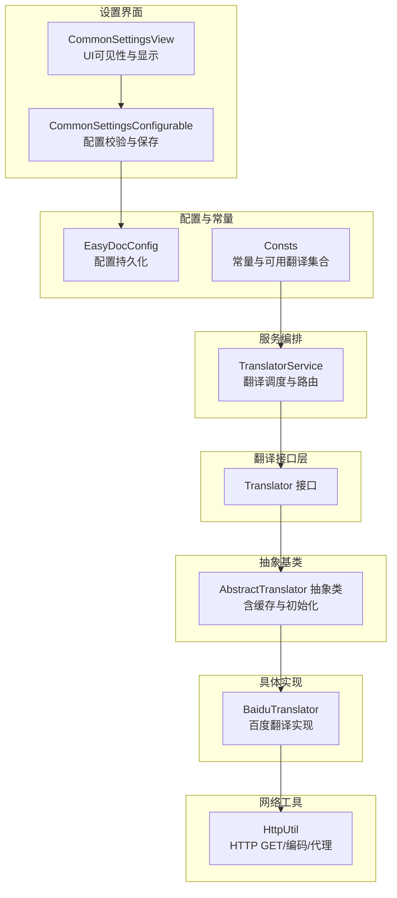
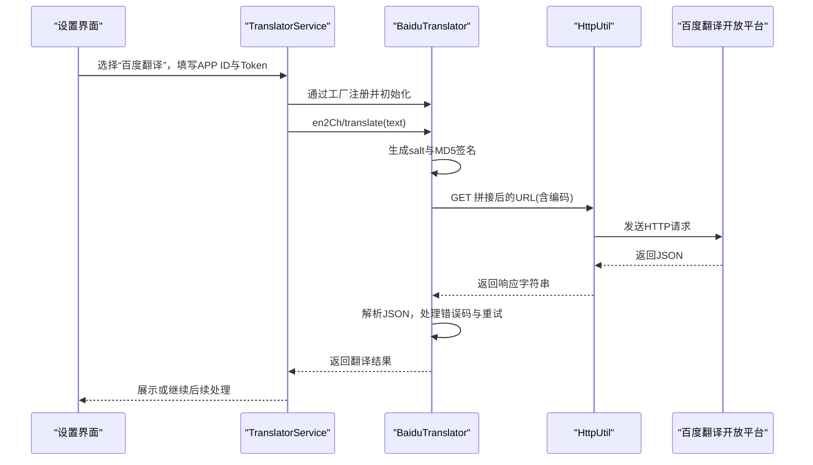
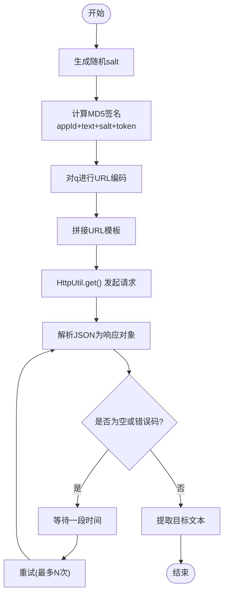
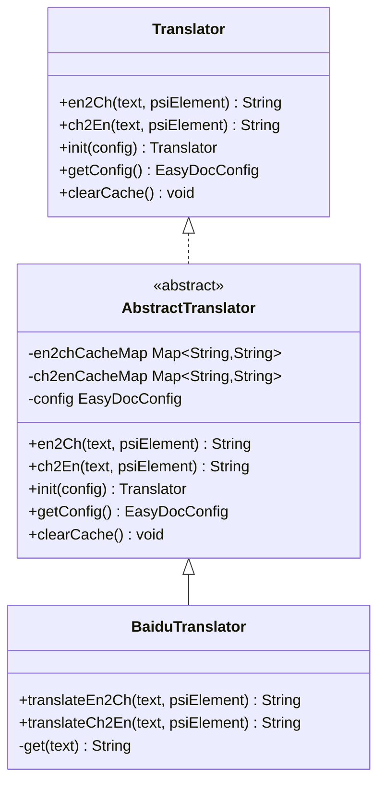
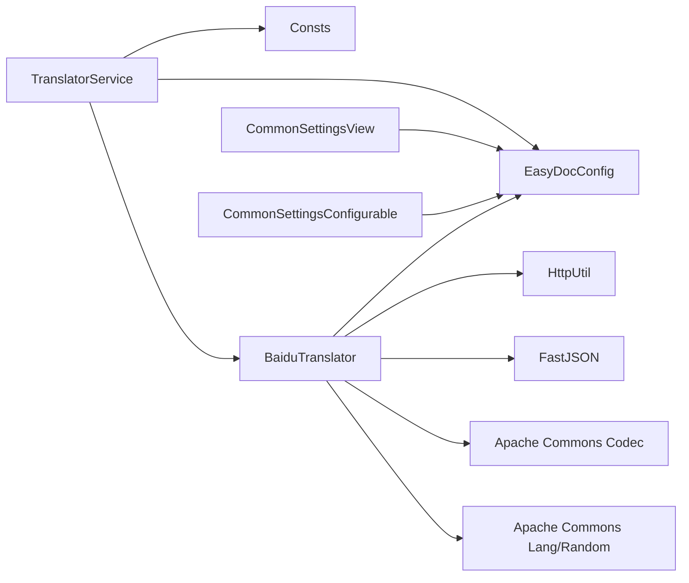

# 百度翻译器

<cite>
**本文引用的文件列表**
- [BaiduTranslator.java](file://src/main/java/com/star/easydoc/service/translator/impl/BaiduTranslator.java)
- [AbstractTranslator.java](file://src/main/java/com/star/easydoc/service/translator/impl/AbstractTranslator.java)
- [Translator.java](file://src/main/java/com/star/easydoc/service/translator/Translator.java)
- [TranslatorService.java](file://src/main/java/com/star/easydoc/service/translator/TranslatorService.java)
- [EasyDocConfig.java](file://src/main/java/com/star/easydoc/config/EasyDocConfig.java)
- [Consts.java](file://src/main/java/com/star/easydoc/common/Consts.java)
- [HttpUtil.java](file://src/main/java/com/star/easydoc/common/util/HttpUtil.java)
- [CommonSettingsView.java](file://src/main/java/com/star/easydoc/view/settings/CommonSettingsView.java)
- [CommonSettingsConfigurable.java](file://src/main/java/com/star/easydoc/view/settings/CommonSettingsConfigurable.java)
- [README.md](file://README.md)
</cite>

## 目录
1. [简介](#简介)
2. [项目结构](#项目结构)
3. [核心组件](#核心组件)
4. [架构总览](#架构总览)
5. [详细组件分析](#详细组件分析)
6. [依赖关系分析](#依赖关系分析)
7. [性能与可靠性](#性能与可靠性)
8. [故障排查指南](#故障排查指南)
9. [结论](#结论)
10. [附录](#附录)

## 简介
本文件面向“百度翻译器”的技术实现，基于仓库源码梳理其与百度翻译开放平台的对接方式，涵盖配置项、认证签名、请求参数、错误处理与重试、缓存策略、以及在插件中的使用流程与最佳实践。同时提供常见问题与性能优化建议，帮助开发者正确接入并稳定使用百度翻译服务。

## 项目结构
百度翻译器位于翻译模块的实现层，通过统一的翻译接口与服务编排层协同工作，并由配置与设置界面提供用户输入与校验。

图表来源
- [BaiduTranslator.java:1-138](file://src/main/java/com/star/easydoc/service/translator/impl/BaiduTranslator.java#L1-L138)
- [AbstractTranslator.java:1-92](file://src/main/java/com/star/easydoc/service/translator/impl/AbstractTranslator.java#L1-L92)
- [TranslatorService.java:1-238](file://src/main/java/com/star/easydoc/service/translator/TranslatorService.java#L1-L238)
- [EasyDocConfig.java:1-680](file://src/main/java/com/star/easydoc/config/EasyDocConfig.java#L1-L680)
- [Consts.java:1-100](file://src/main/java/com/star/easydoc/common/Consts.java#L1-L100)
- [HttpUtil.java:1-246](file://src/main/java/com/star/easydoc/common/util/HttpUtil.java#L1-L246)
- [CommonSettingsView.java:1-739](file://src/main/java/com/star/easydoc/view/settings/CommonSettingsView.java#L1-L739)
- [CommonSettingsConfigurable.java:1-196](file://src/main/java/com/star/easydoc/view/settings/CommonSettingsConfigurable.java#L1-L196)

章节来源
- [BaiduTranslator.java:1-138](file://src/main/java/com/star/easydoc/service/translator/impl/BaiduTranslator.java#L1-L138)
- [AbstractTranslator.java:1-92](file://src/main/java/com/star/easydoc/service/translator/impl/AbstractTranslator.java#L1-L92)
- [TranslatorService.java:1-238](file://src/main/java/com/star/easydoc/service/translator/TranslatorService.java#L1-L238)
- [EasyDocConfig.java:1-680](file://src/main/java/com/star/easydoc/config/EasyDocConfig.java#L1-L680)
- [Consts.java:1-100](file://src/main/java/com/star/easydoc/common/Consts.java#L1-L100)
- [HttpUtil.java:1-246](file://src/main/java/com/star/easydoc/common/util/HttpUtil.java#L1-L246)
- [CommonSettingsView.java:1-739](file://src/main/java/com/star/easydoc/view/settings/CommonSettingsView.java#L1-L739)
- [CommonSettingsConfigurable.java:1-196](file://src/main/java/com/star/easydoc/view/settings/CommonSettingsConfigurable.java#L1-L196)

## 核心组件
- 百度翻译实现：负责构造百度翻译请求、生成签名、调用HTTP接口、解析响应并处理错误码。
- 抽象翻译器：提供缓存、初始化与通用翻译入口。
- 翻译服务：根据配置选择具体翻译器，协调整句/分词翻译与自定义映射。
- 配置与常量：存储APP ID、Token、超时等配置；声明可用翻译集合。
- 设置界面：动态显示/隐藏对应翻译所需的输入项；保存并校验配置。
- HTTP工具：封装GET请求、编码、代理与超时控制。

章节来源
- [BaiduTranslator.java:15-62](file://src/main/java/com/star/easydoc/service/translator/impl/BaiduTranslator.java#L15-L62)
- [AbstractTranslator.java:14-72](file://src/main/java/com/star/easydoc/service/translator/impl/AbstractTranslator.java#L14-L72)
- [TranslatorService.java:41-238](file://src/main/java/com/star/easydoc/service/translator/TranslatorService.java#L41-L238)
- [EasyDocConfig.java:79-143](file://src/main/java/com/star/easydoc/config/EasyDocConfig.java#L79-L143)
- [Consts.java:29-46](file://src/main/java/com/star/easydoc/common/Consts.java#L29-L46)
- [CommonSettingsView.java:213-472](file://src/main/java/com/star/easydoc/view/settings/CommonSettingsView.java#L213-L472)
- [CommonSettingsConfigurable.java:95-189](file://src/main/java/com/star/easydoc/view/settings/CommonSettingsConfigurable.java#L95-L189)
- [HttpUtil.java:47-121](file://src/main/java/com/star/easydoc/common/util/HttpUtil.java#L47-L121)

## 架构总览
百度翻译器通过实现统一接口，被翻译服务统一调度；配置由设置界面收集并通过校验后写入配置对象；网络请求通过HTTP工具完成，支持代理与超时。

图表来源
- [TranslatorService.java:85-163](file://src/main/java/com/star/easydoc/service/translator/TranslatorService.java#L85-L163)
- [BaiduTranslator.java:38-62](file://src/main/java/com/star/easydoc/service/translator/impl/BaiduTranslator.java#L38-L62)
- [HttpUtil.java:76-103](file://src/main/java/com/star/easydoc/common/util/HttpUtil.java#L76-L103)

## 详细组件分析

### 百度翻译实现（BaiduTranslator）
- 请求URL与参数
  - URL模板包含 from、to、appid、salt、sign、q 等参数。
  - q 参数需进行URL编码。
  - from/to 默认为 auto，便于自动检测语言。
- 签名算法
  - 使用 MD5 对 “APP ID + 文本 + salt + Token” 进行摘要。
  - salt 每次请求随机生成，增强安全性。
- 错误处理与重试
  - 若响应为空或错误码为特定值，等待一段时间后重试，最多尝试若干次。
  - 捕获异常并记录日志，避免中断流程。
- 缓存策略
  - 继承自抽象类，分别维护英译中与中译英的并发缓存表，命中则直接返回。
- 超时控制
  - 使用配置中的超时值作为HTTP请求超时。

图表来源
- [BaiduTranslator.java:38-62](file://src/main/java/com/star/easydoc/service/translator/impl/BaiduTranslator.java#L38-L62)

章节来源
- [BaiduTranslator.java:24-25](file://src/main/java/com/star/easydoc/service/translator/impl/BaiduTranslator.java#L24-L25)
- [BaiduTranslator.java:42-47](file://src/main/java/com/star/easydoc/service/translator/impl/BaiduTranslator.java#L42-L47)
- [BaiduTranslator.java:48-55](file://src/main/java/com/star/easydoc/service/translator/impl/BaiduTranslator.java#L48-L55)
- [BaiduTranslator.java:64-113](file://src/main/java/com/star/easydoc/service/translator/impl/BaiduTranslator.java#L64-L113)
- [BaiduTranslator.java:115-136](file://src/main/java/com/star/easydoc/service/translator/impl/BaiduTranslator.java#L115-L136)

### 抽象翻译器（AbstractTranslator）
- 提供统一的 en2Ch/ch2En 入口，内部先查缓存，未命中再委托子类实现。
- 提供 init/getConfig/clearCache 等通用能力。
- 子类只需实现 translateEn2Ch/translateCh2En 两个方法。

图表来源
- [Translator.java:13-53](file://src/main/java/com/star/easydoc/service/translator/Translator.java#L13-L53)
- [AbstractTranslator.java:14-91](file://src/main/java/com/star/easydoc/service/translator/impl/AbstractTranslator.java#L14-L91)
- [BaiduTranslator.java:21-36](file://src/main/java/com/star/easydoc/service/translator/impl/BaiduTranslator.java#L21-L36)

章节来源
- [AbstractTranslator.java:14-72](file://src/main/java/com/star/easydoc/service/translator/impl/AbstractTranslator.java#L14-L72)

### 翻译服务（TranslatorService）
- 工厂式注册各翻译器，按配置选择当前翻译器。
- 提供整句翻译与分词翻译策略：若存在自定义单词映射，则逐词翻译；否则整句翻译。
- 提供中译英的后处理：过滤停用词、规范化大小写等。

章节来源
- [TranslatorService.java:60-77](file://src/main/java/com/star/easydoc/service/translator/TranslatorService.java#L60-L77)
- [TranslatorService.java:85-111](file://src/main/java/com/star/easydoc/service/translator/TranslatorService.java#L85-L111)
- [TranslatorService.java:157-163](file://src/main/java/com/star/easydoc/service/translator/TranslatorService.java#L157-L163)
- [TranslatorService.java:171-205](file://src/main/java/com/star/easydoc/service/translator/TranslatorService.java#L171-L205)

### 配置与常量（EasyDocConfig、Consts）
- 配置项
  - translator：当前翻译器标识
  - appId/token：百度翻译所需
  - timeout：HTTP超时
  - wordMap/projectWordMap：自定义单词映射
- 常量
  - BAIDU_TRANSLATOR：百度翻译标识
  - ENABLE_TRANSLATOR_SET：可用翻译集合

章节来源
- [EasyDocConfig.java:79-143](file://src/main/java/com/star/easydoc/config/EasyDocConfig.java#L79-L143)
- [Consts.java:29-46](file://src/main/java/com/star/easydoc/common/Consts.java#L29-L46)

### 设置界面（CommonSettingsView、CommonSettingsConfigurable）
- 动态显示/隐藏不同翻译器所需的输入项（如百度翻译显示APP ID与Token）。
- 校验逻辑：必填项校验、URL合法性与占位符校验、超时格式校验。
- 保存配置：将UI值写回配置对象。

章节来源
- [CommonSettingsView.java:213-472](file://src/main/java/com/star/easydoc/view/settings/CommonSettingsView.java#L213-L472)
- [CommonSettingsConfigurable.java:95-189](file://src/main/java/com/star/easydoc/view/settings/CommonSettingsConfigurable.java#L95-L189)

### HTTP工具（HttpUtil）
- GET请求：支持连接/读超时、代理、UTF-8编码。
- 编码：对查询参数进行URL编码。
- 代理：从IDE环境获取代理配置。

章节来源
- [HttpUtil.java:76-103](file://src/main/java/com/star/easydoc/common/util/HttpUtil.java#L76-L103)
- [HttpUtil.java:129-136](file://src/main/java/com/star/easydoc/common/util/HttpUtil.java#L129-L136)
- [HttpUtil.java:201-215](file://src/main/java/com/star/easydoc/common/util/HttpUtil.java#L201-L215)

## 依赖关系分析
- BaiduTranslator 依赖
  - EasyDocConfig：读取 appId、token、timeout
  - HttpUtil：发起HTTP请求
  - FastJSON：解析JSON
  - Apache Commons Codec：MD5签名
  - Apache Commons Lang/Random：字符串与随机数
- TranslatorService 依赖
  - Consts：可用翻译集合
  - EasyDocConfig：当前翻译器与超时
  - 各翻译器实现：工厂式注册
- 设置界面依赖
  - EasyDocConfig：持久化配置
  - Consts：可用翻译集合

图表来源
- [BaiduTranslator.java:6-13](file://src/main/java/com/star/easydoc/service/translator/impl/BaiduTranslator.java#L6-L13)
- [TranslatorService.java:21-33](file://src/main/java/com/star/easydoc/service/translator/TranslatorService.java#L21-L33)
- [CommonSettingsView.java:30-35](file://src/main/java/com/star/easydoc/view/settings/CommonSettingsView.java#L30-L35)
- [CommonSettingsConfigurable.java:12-17](file://src/main/java/com/star/easydoc/view/settings/CommonSettingsConfigurable.java#L12-L17)

## 性能与可靠性
- 缓存策略
  - 英译中与中译英分别维护独立缓存表，命中直接返回，减少重复请求。
- 重试与退避
  - 针对特定错误码进行短暂等待后重试，提升稳定性。
- 超时控制
  - 通过配置项设置HTTP超时，避免长时间阻塞。
- 代理支持
  - 自动读取IDE环境代理，适配企业网络。
- 分词与整句策略
  - 存在自定义映射时采用逐词翻译，保证术语一致性；否则整句翻译，提升语义质量。

章节来源
- [AbstractTranslator.java:16-72](file://src/main/java/com/star/easydoc/service/translator/impl/AbstractTranslator.java#L16-L72)
- [BaiduTranslator.java:42-55](file://src/main/java/com/star/easydoc/service/translator/impl/BaiduTranslator.java#L42-L55)
- [HttpUtil.java:86-94](file://src/main/java/com/star/easydoc/common/util/HttpUtil.java#L86-L94)
- [TranslatorService.java:92-111](file://src/main/java/com/star/easydoc/service/translator/TranslatorService.java#L92-L111)

## 故障排查指南
- 配置校验失败
  - 百度翻译：APP ID 与 Token 不能为空。
  - 腾讯/阿里云/有道/微软/谷歌/自定义URL：对应必填项与URL合法性校验。
  - 超时：必须为正整数。
- 网络与代理
  - 若IDE处于代理环境，确保代理配置正确；HTTP工具会自动读取IDE代理。
- 错误码处理
  - 当返回特定错误码时，实现内部会等待并重试；若仍失败，记录日志并返回空结果。
- 日志定位
  - 出错时会输出包含响应内容的日志，便于核对签名与网络状态。

章节来源
- [CommonSettingsConfigurable.java:120-189](file://src/main/java/com/star/easydoc/view/settings/CommonSettingsConfigurable.java#L120-L189)
- [BaiduTranslator.java:48-60](file://src/main/java/com/star/easydoc/service/translator/impl/BaiduTranslator.java#L48-L60)
- [HttpUtil.java:96-102](file://src/main/java/com/star/easydoc/common/util/HttpUtil.java#L96-L102)

## 结论
百度翻译器在本项目中实现了与百度翻译开放平台的对接，具备完善的配置校验、签名生成、请求与重试、缓存与代理支持。通过设置界面与服务编排层，用户可便捷地配置APP ID与Token，并在不同翻译策略间灵活切换。建议在生产环境中合理设置超时与重试策略，结合自定义映射提升术语一致性，并关注网络代理与错误码处理以提高稳定性。

## 附录

### 百度翻译开放平台接入要点
- APP ID 与 Token
  - 在设置界面中选择“百度翻译”，分别填写 APP ID 与 Token。
- 请求参数
  - from/to：默认 auto，可按需调整。
  - q：需进行URL编码。
  - salt：每次请求随机生成。
  - sign：MD5(appId + q + salt + token)。
- 错误码
  - 当出现特定错误码时，实现内部会进行等待与重试。
- 超时
  - 可在设置中调整HTTP超时时间。

章节来源
- [README.md:42-47](file://README.md#L42-L47)
- [CommonSettingsView.java:213-242](file://src/main/java/com/star/easydoc/view/settings/CommonSettingsView.java#L213-L242)
- [BaiduTranslator.java:24-25](file://src/main/java/com/star/easydoc/service/translator/impl/BaiduTranslator.java#L24-L25)
- [BaiduTranslator.java:42-47](file://src/main/java/com/star/easydoc/service/translator/impl/BaiduTranslator.java#L42-L47)
- [BaiduTranslator.java:48-55](file://src/main/java/com/star/easydoc/service/translator/impl/BaiduTranslator.java#L48-L55)
- [CommonSettingsConfigurable.java:120-127](file://src/main/java/com/star/easydoc/view/settings/CommonSettingsConfigurable.java#L120-L127)