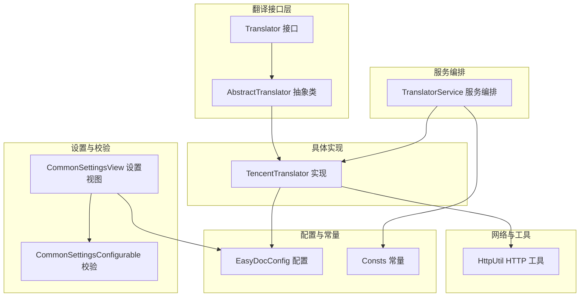
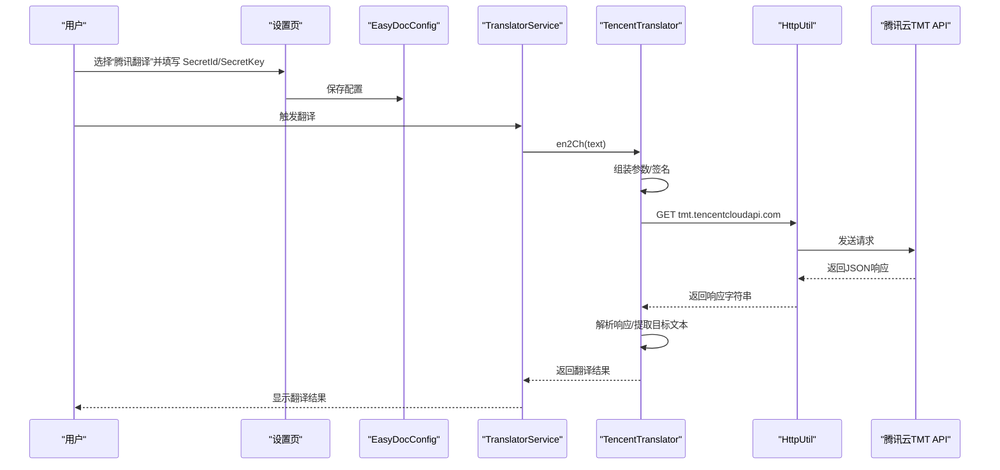
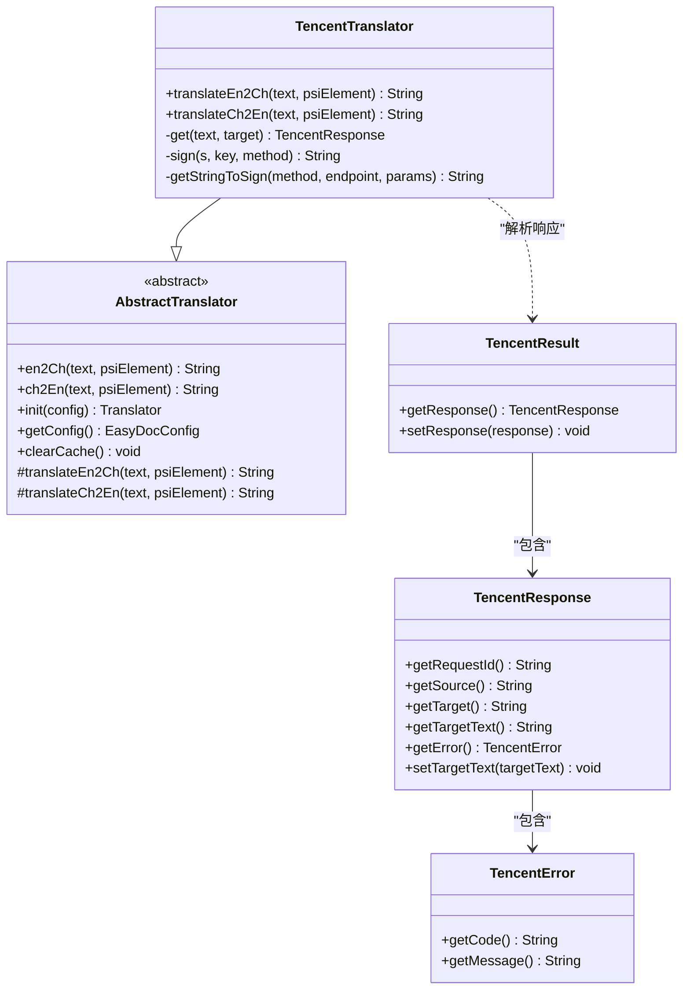
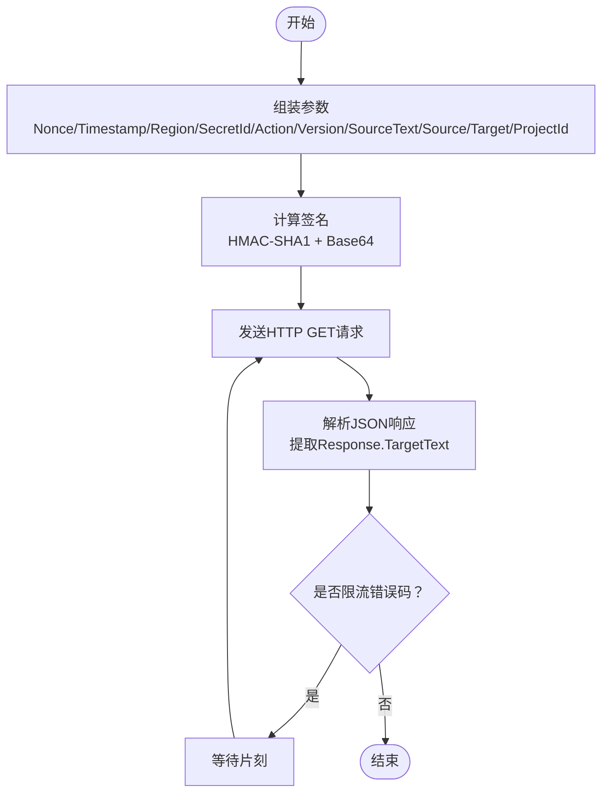
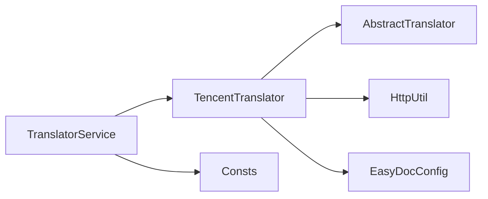

# 腾讯翻译器

<cite>
**本文引用的文件列表**
- [TencentTranslator.java](file://src/main/java/com/star/easydoc/service/translator/impl/TencentTranslator.java)
- [AbstractTranslator.java](file://src/main/java/com/star/easydoc/service/translator/impl/AbstractTranslator.java)
- [Translator.java](file://src/main/java/com/star/easydoc/service/translator/Translator.java)
- [TranslatorService.java](file://src/main/java/com/star/easydoc/service/translator/TranslatorService.java)
- [EasyDocConfig.java](file://src/main/java/com/star/easydoc/config/EasyDocConfig.java)
- [HttpUtil.java](file://src/main/java/com/star/easydoc/common/util/HttpUtil.java)
- [Consts.java](file://src/main/java/com/star/easydoc/common/Consts.java)
- [CommonSettingsView.java](file://src/main/java/com/star/easydoc/view/settings/CommonSettingsView.java)
- [CommonSettingsConfigurable.java](file://src/main/java/com/star/easydoc/view/settings/CommonSettingsConfigurable.java)
- [README.md](file://README.md)
</cite>

## 目录
1. [简介](#简介)
2. [项目结构](#项目结构)
3. [核心组件](#核心组件)
4. [架构总览](#架构总览)
5. [详细组件分析](#详细组件分析)
6. [依赖关系分析](#依赖关系分析)
7. [性能与可靠性](#性能与可靠性)
8. [使用指南](#使用指南)
9. [故障排除](#故障排除)
10. [结论](#结论)

## 简介
本文件面向“腾讯翻译器”的技术实现，基于仓库源码对腾讯云机器翻译服务的集成方式进行系统化梳理，涵盖认证配置（SecretId/SecretKey）、签名算法、请求流程、响应解析、错误处理与重试策略、以及在插件中的配置入口与校验逻辑。同时提供使用指南、常见问题排查与最佳实践建议，帮助开发者快速理解与正确使用该翻译能力。

## 项目结构
围绕“腾讯翻译器”，涉及的主要模块与文件如下：
- 翻译接口与抽象基类：定义统一的翻译契约与缓存机制
- 腾讯翻译实现：封装腾讯云 API 的参数组装、签名与调用
- 配置与常量：存储 SecretId/SecretKey 等配置项，并提供翻译方式枚举
- HTTP 工具：封装 GET 请求与代理支持
- 设置界面与校验：在 IDE 设置页显示/隐藏对应输入框，并进行必填校验
- 插件服务编排：在翻译服务中注册并调度各翻译器

图表来源
- [TencentTranslator.java:27-184](file://src/main/java/com/star/easydoc/service/translator/impl/TencentTranslator.java#L27-L184)
- [AbstractTranslator.java:14-91](file://src/main/java/com/star/easydoc/service/translator/impl/AbstractTranslator.java#L14-L91)
- [Translator.java:13-53](file://src/main/java/com/star/easydoc/service/translator/Translator.java#L13-L53)
- [TranslatorService.java:41-77](file://src/main/java/com/star/easydoc/service/translator/TranslatorService.java#L41-L77)
- [EasyDocConfig.java:79-143](file://src/main/java/com/star/easydoc/config/EasyDocConfig.java#L79-L143)
- [HttpUtil.java:39-245](file://src/main/java/com/star/easydoc/common/util/HttpUtil.java#L39-L245)
- [Consts.java:14-99](file://src/main/java/com/star/easydoc/common/Consts.java#L14-L99)
- [CommonSettingsView.java:229-372](file://src/main/java/com/star/easydoc/view/settings/CommonSettingsView.java#L229-L372)
- [CommonSettingsConfigurable.java:117-171](file://src/main/java/com/star/easydoc/view/settings/CommonSettingsConfigurable.java#L117-L171)

章节来源
- [TencentTranslator.java:27-184](file://src/main/java/com/star/easydoc/service/translator/impl/TencentTranslator.java#L27-L184)
- [AbstractTranslator.java:14-91](file://src/main/java/com/star/easydoc/service/translator/impl/AbstractTranslator.java#L14-L91)
- [Translator.java:13-53](file://src/main/java/com/star/easydoc/service/translator/Translator.java#L13-L53)
- [TranslatorService.java:41-77](file://src/main/java/com/star/easydoc/service/translator/TranslatorService.java#L41-L77)
- [EasyDocConfig.java:79-143](file://src/main/java/com/star/easydoc/config/EasyDocConfig.java#L79-L143)
- [HttpUtil.java:39-245](file://src/main/java/com/star/easydoc/common/util/HttpUtil.java#L39-L245)
- [Consts.java:14-99](file://src/main/java/com/star/easydoc/common/Consts.java#L14-L99)
- [CommonSettingsView.java:229-372](file://src/main/java/com/star/easydoc/view/settings/CommonSettingsView.java#L229-L372)
- [CommonSettingsConfigurable.java:117-171](file://src/main/java/com/star/easydoc/view/settings/CommonSettingsConfigurable.java#L117-L171)

## 核心组件
- 翻译接口与抽象基类
  - 接口定义统一的翻译方法、初始化与缓存清理能力
  - 抽象类提供双向缓存（英译中/中译英）与通用初始化逻辑
- 腾讯翻译实现
  - 组装腾讯云 TextTranslate 请求参数，计算签名，发起 HTTP GET 请求
  - 解析响应结构，提取目标文本；对特定错误码进行重试控制
- 配置与常量
  - 在配置类中保存 SecretId/SecretKey 等密钥信息
  - 常量集中管理翻译方式标识
- HTTP 工具
  - 提供 GET 请求封装、代理支持与编码处理
- 设置与校验
  - 设置页按翻译方式动态显示/隐藏对应输入框
  - 校验逻辑确保腾讯翻译所需的 SecretId/SecretKey 不为空

章节来源
- [Translator.java:13-53](file://src/main/java/com/star/easydoc/service/translator/Translator.java#L13-L53)
- [AbstractTranslator.java:14-91](file://src/main/java/com/star/easydoc/service/translator/impl/AbstractTranslator.java#L14-L91)
- [TencentTranslator.java:27-184](file://src/main/java/com/star/easydoc/service/translator/impl/TencentTranslator.java#L27-L184)
- [EasyDocConfig.java:79-143](file://src/main/java/com/star/easydoc/config/EasyDocConfig.java#L79-L143)
- [Consts.java:14-99](file://src/main/java/com/star/easydoc/common/Consts.java#L14-L99)
- [HttpUtil.java:39-245](file://src/main/java/com/star/easydoc/common/util/HttpUtil.java#L39-L245)
- [CommonSettingsView.java:229-372](file://src/main/java/com/star/easydoc/view/settings/CommonSettingsView.java#L229-L372)
- [CommonSettingsConfigurable.java:117-171](file://src/main/java/com/star/easydoc/view/settings/CommonSettingsConfigurable.java#L117-L171)

## 架构总览
腾讯翻译器在插件中的整体调用链如下：
- 用户在设置页选择“腾讯翻译”，并填写 SecretId/SecretKey
- 翻译服务根据配置选择对应翻译器实例
- 腾讯翻译实现组装参数、签名并调用腾讯云 API
- 解析响应后返回目标文本，供上层使用

图表来源
- [CommonSettingsView.java:229-372](file://src/main/java/com/star/easydoc/view/settings/CommonSettingsView.java#L229-L372)
- [CommonSettingsConfigurable.java:117-171](file://src/main/java/com/star/easydoc/view/settings/CommonSettingsConfigurable.java#L117-L171)
- [EasyDocConfig.java:79-143](file://src/main/java/com/star/easydoc/config/EasyDocConfig.java#L79-L143)
- [TranslatorService.java:157-163](file://src/main/java/com/star/easydoc/service/translator/TranslatorService.java#L157-L163)
- [TencentTranslator.java:42-76](file://src/main/java/com/star/easydoc/service/translator/impl/TencentTranslator.java#L42-L76)
- [HttpUtil.java:76-121](file://src/main/java/com/star/easydoc/common/util/HttpUtil.java#L76-L121)

## 详细组件分析

### 腾讯翻译实现（TencentTranslator）
- 功能职责
  - 英译中/中译英：通过统一入口调用内部 get 方法
  - 参数组装：Nonce、Timestamp、Region、SecretId、Action、Version、SourceText、Source、Target、ProjectId
  - 签名计算：基于 HMAC-SHA1 对“待签名字符串”进行签名，并以 Base64 编码输出
  - 请求发送：使用 HttpUtil 的 GET 方法，携带签名参数
  - 响应解析：解析外层 Response 对象，提取 TargetText；若出现限流错误码则进行短暂休眠后重试
- 错误处理与重试
  - 对特定错误码进行识别与重试控制，避免瞬时限流影响
  - 异常捕获并记录日志，便于定位配置或网络问题
- 数据结构
  - 内部类 TencentResult/Response/Error 用于 JSON 反序列化

图表来源
- [TencentTranslator.java:27-184](file://src/main/java/com/star/easydoc/service/translator/impl/TencentTranslator.java#L27-L184)
- [AbstractTranslator.java:14-91](file://src/main/java/com/star/easydoc/service/translator/impl/AbstractTranslator.java#L14-L91)

章节来源
- [TencentTranslator.java:27-184](file://src/main/java/com/star/easydoc/service/translator/impl/TencentTranslator.java#L27-L184)

### 签名与待签名字符串生成
- 待签名字符串规则
  - 方法 + 主机 + 路径 + 查询串（按参数名排序拼接）
- 签名算法
  - HMAC-SHA1，密钥为 SecretKey，原文为待签名字符串
  - 输出为 Base64 编码
- 参数要点
  - Region 固定为 ap-beijing
  - Action 固定为 TextTranslate
  - Version 固定为 2018-03-21
  - Source 自动识别
  - Target 由调用方向决定（中译英/英译中）

图表来源
- [TencentTranslator.java:42-76](file://src/main/java/com/star/easydoc/service/translator/impl/TencentTranslator.java#L42-L76)

章节来源
- [TencentTranslator.java:78-93](file://src/main/java/com/star/easydoc/service/translator/impl/TencentTranslator.java#L78-L93)

### 配置与认证（SecretId/SecretKey）
- 配置项
  - SecretId：在配置类中以私有字段保存
  - SecretKey：在配置类中以私有字段保存
- 设置页可见性
  - 当翻译方式为“腾讯翻译”时，显示 SecretId/SecretKey 输入框
- 校验逻辑
  - 保存配置时校验 SecretId/SecretKey 非空，否则抛出配置异常

章节来源
- [EasyDocConfig.java:79-143](file://src/main/java/com/star/easydoc/config/EasyDocConfig.java#L79-L143)
- [CommonSettingsView.java:243-271](file://src/main/java/com/star/easydoc/view/settings/CommonSettingsView.java#L243-L271)
- [CommonSettingsConfigurable.java:128-135](file://src/main/java/com/star/easydoc/view/settings/CommonSettingsConfigurable.java#L128-L135)

### HTTP 请求与代理支持
- GET 请求封装
  - 支持超时配置、参数编码、代理自动检测
- 代理
  - 通过 CommonProxy 选择系统代理，自动设置到 HTTP 客户端

章节来源
- [HttpUtil.java:76-121](file://src/main/java/com/star/easydoc/common/util/HttpUtil.java#L76-L121)
- [HttpUtil.java:201-215](file://src/main/java/com/star/easydoc/common/util/HttpUtil.java#L201-L215)

### 翻译服务编排
- 注册与选择
  - 在服务初始化时将“腾讯翻译”加入翻译器映射
  - 根据配置的翻译方式选择对应实现
- 翻译流程
  - 英译中：调用对应翻译器的 en2Ch
  - 中译英：调用对应翻译器的 ch2En，并进行后续处理

章节来源
- [TranslatorService.java:60-77](file://src/main/java/com/star/easydoc/service/translator/TranslatorService.java#L60-L77)
- [TranslatorService.java:157-163](file://src/main/java/com/star/easydoc/service/translator/TranslatorService.java#L157-L163)

## 依赖关系分析
- 组件耦合
  - TencentTranslator 依赖 AbstractTranslator（继承）、HttpUtil（网络）、EasyDocConfig（配置）
  - TranslatorService 依赖各翻译器实现与常量集合
- 外部依赖
  - Apache HttpClient（用于 HTTP 请求）
  - FastJSON2（用于 JSON 解析）
  - Commons Lang3（字符串与对象工具）
- 可能的循环依赖
  - 未发现直接循环依赖；各模块职责清晰，接口解耦良好

图表来源
- [TencentTranslator.java:13-19](file://src/main/java/com/star/easydoc/service/translator/impl/TencentTranslator.java#L13-L19)
- [AbstractTranslator.java:3-8](file://src/main/java/com/star/easydoc/service/translator/impl/AbstractTranslator.java#L3-L8)
- [HttpUtil.java:17-31](file://src/main/java/com/star/easydoc/common/util/HttpUtil.java#L17-L31)
- [EasyDocConfig.java:3-14](file://src/main/java/com/star/easydoc/config/EasyDocConfig.java#L3-L14)
- [TranslatorService.java:21-33](file://src/main/java/com/star/easydoc/service/translator/TranslatorService.java#L21-L33)
- [Consts.java:5-6](file://src/main/java/com/star/easydoc/common/Consts.java#L5-L6)

章节来源
- [TencentTranslator.java:13-19](file://src/main/java/com/star/easydoc/service/translator/impl/TencentTranslator.java#L13-L19)
- [AbstractTranslator.java:3-8](file://src/main/java/com/star/easydoc/service/translator/impl/AbstractTranslator.java#L3-L8)
- [HttpUtil.java:17-31](file://src/main/java/com/star/easydoc/common/util/HttpUtil.java#L17-L31)
- [EasyDocConfig.java:3-14](file://src/main/java/com/star/easydoc/config/EasyDocConfig.java#L3-L14)
- [TranslatorService.java:21-33](file://src/main/java/com/star/easydoc/service/translator/TranslatorService.java#L21-L33)
- [Consts.java:5-6](file://src/main/java/com/star/easydoc/common/Consts.java#L5-L6)

## 性能与可靠性
- 缓存机制
  - 抽象翻译器提供并发安全的英译中/中译英缓存，减少重复请求
- 重试策略
  - 对特定限流错误码进行短暂休眠后重试，提升稳定性
- 超时与代理
  - HTTP 工具支持连接与读取超时配置，并自动使用系统代理
- 并发与线程安全
  - 缓存使用并发容器，避免竞态条件

章节来源
- [AbstractTranslator.java:14-72](file://src/main/java/com/star/easydoc/service/translator/impl/AbstractTranslator.java#L14-L72)
- [TencentTranslator.java:46-71](file://src/main/java/com/star/easydoc/service/translator/impl/TencentTranslator.java#L46-L71)
- [HttpUtil.java:41-42](file://src/main/java/com/star/easydoc/common/util/HttpUtil.java#L41-L42)

## 使用指南

### 配置步骤
- 在设置页选择“腾讯翻译”
- 填写 SecretId 与 SecretKey（必填）
- 可调整超时时间（毫秒），默认较短以便快速反馈

章节来源
- [CommonSettingsView.java:243-271](file://src/main/java/com/star/easydoc/view/settings/CommonSettingsView.java#L243-L271)
- [CommonSettingsConfigurable.java:128-135](file://src/main/java/com/star/easydoc/view/settings/CommonSettingsConfigurable.java#L128-L135)
- [EasyDocConfig.java:77-87](file://src/main/java/com/star/easydoc/config/EasyDocConfig.java#L77-L87)

### API 请求格式（腾讯云 TMT）
- 方法：GET
- 地址：https://tmt.tencentcloudapi.com
- 查询参数（关键字段）
  - Nonce：随机正整数
  - Timestamp：Unix 秒级时间戳
  - Region：ap-beijing
  - SecretId：从配置读取
  - Action：TextTranslate
  - Version：2018-03-21
  - SourceText：待翻译文本
  - Source：auto（自动检测）
  - Target：zh 或 en（取决于方向）
  - ProjectId：0
  - Signature：HMAC-SHA1 签名（Base64 编码）

章节来源
- [TencentTranslator.java:47-61](file://src/main/java/com/star/easydoc/service/translator/impl/TencentTranslator.java#L47-L61)

### 响应处理
- 成功响应
  - JSON 包含 Response 字段，其中包含 TargetText（目标文本）
- 错误处理
  - 若 Response.Error 存在且错误码为 RequestLimitExceeded，则触发重试
  - 其他异常会被捕获并记录日志

章节来源
- [TencentTranslator.java:63-75](file://src/main/java/com/star/easydoc/service/translator/impl/TencentTranslator.java#L63-L75)

### 错误码说明
- RequestLimitExceeded：请求限流，实现中会进行短暂休眠后重试
- 其他错误：由腾讯云返回的具体错误码与消息，会在响应中体现

章节来源
- [TencentTranslator.java:65-69](file://src/main/java/com/star/easydoc/service/translator/impl/TencentTranslator.java#L65-L69)

### 使用场景
- 代码注释自动生成：在生成注释时触发翻译，提升多语言文档效率
- 选中文本翻译：选中非中文文本后快捷键触发，弹出翻译结果
- 中文命名辅助：选中中文后快捷键生成英文命名，便于国际化命名规范

章节来源
- [README.md:26-30](file://README.md#L26-L30)

## 故障排除
- 配置校验失败
  - 现象：保存设置时报“SecretId/SecretKey 不能为空”
  - 处理：在设置页正确填写 SecretId 与 SecretKey 后再保存
- 网络或签名错误
  - 现象：日志中出现“请检查 appkey 与网络”提示
  - 处理：确认 SecretId/SecretKey 正确、网络可达、代理配置合理
- 限流导致失败
  - 现象：频繁出现限流错误码
  - 处理：适当增加超时或降低请求频率；实现中已内置重试逻辑
- 缓存命中与更新
  - 现象：翻译结果未变化
  - 处理：调用缓存清理接口或重启插件以刷新缓存

章节来源
- [CommonSettingsConfigurable.java:128-135](file://src/main/java/com/star/easydoc/view/settings/CommonSettingsConfigurable.java#L128-L135)
- [TencentTranslator.java:72-74](file://src/main/java/com/star/easydoc/service/translator/impl/TencentTranslator.java#L72-L74)
- [AbstractTranslator.java:68-72](file://src/main/java/com/star/easydoc/service/translator/impl/AbstractTranslator.java#L68-L72)

## 结论
腾讯翻译器通过标准化的参数组装、签名与 HTTP 调用，实现了对腾讯云机器翻译服务的稳定接入。配合插件的设置校验、缓存与重试机制，能够在保证性能的同时提升翻译的可靠性。对于企业用户而言，建议在设置页正确配置密钥与超时参数，并结合代理环境进行网络优化，以获得更佳的使用体验。