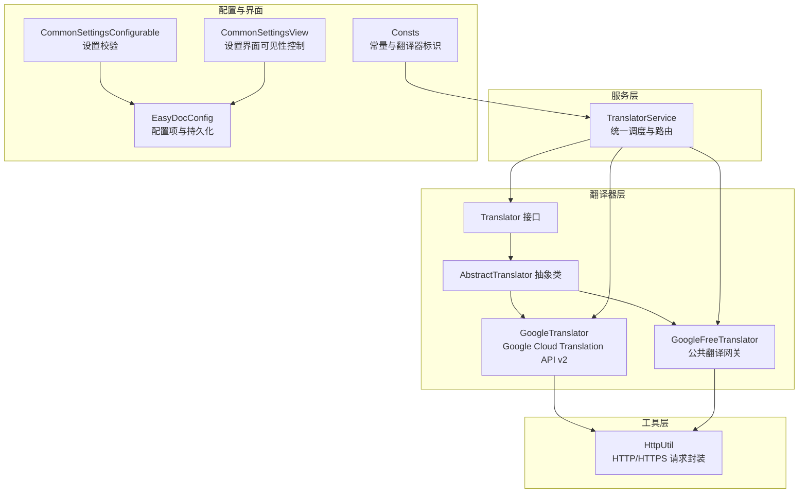
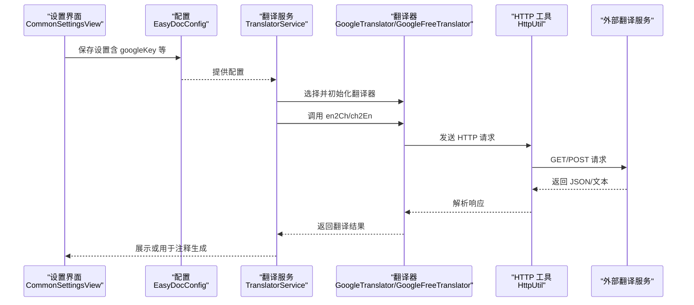
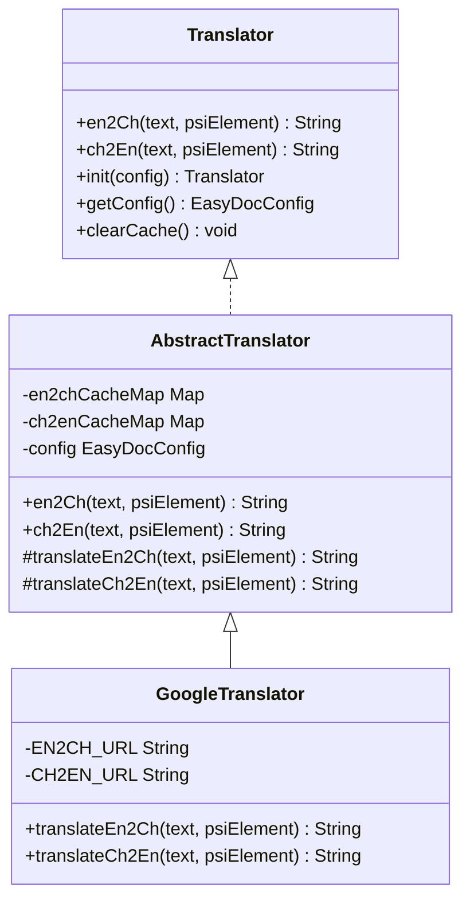
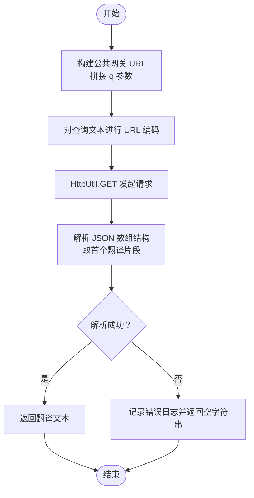
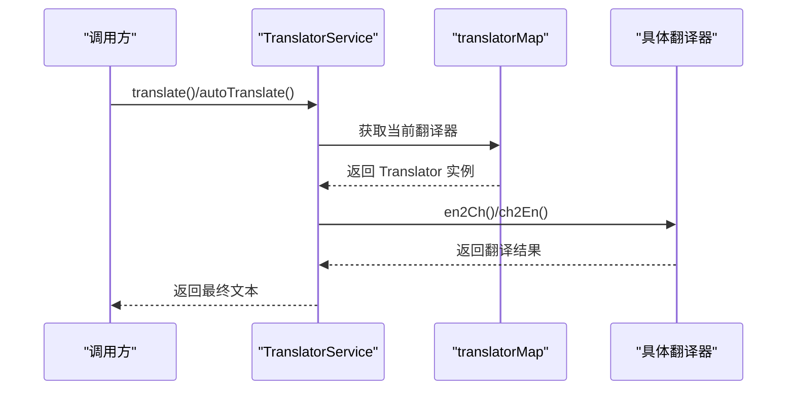
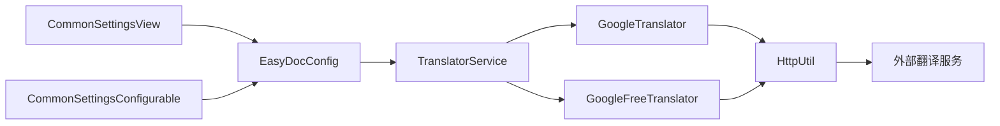

# 谷歌翻译器

<cite>
**本文引用的文件**   
- [GoogleTranslator.java](file://src/main/java/com/star/easydoc/service/translator/impl/GoogleTranslator.java)
- [GoogleFreeTranslator.java](file://src/main/java/com/star/easydoc/service/translator/impl/GoogleFreeTranslator.java)
- [AbstractTranslator.java](file://src/main/java/com/star/easydoc/service/translator/impl/AbstractTranslator.java)
- [Translator.java](file://src/main/java/com/star/easydoc/service/translator/Translator.java)
- [TranslatorService.java](file://src/main/java/com/star/easydoc/service/translator/TranslatorService.java)
- [HttpUtil.java](file://src/main/java/com/star/easydoc/common/util/HttpUtil.java)
- [EasyDocConfig.java](file://src/main/java/com/star/easydoc/config/EasyDocConfig.java)
- [Consts.java](file://src/main/java/com/star/easydoc/common/Consts.java)
- [CommonSettingsConfigurable.java](file://src/main/java/com/star/easydoc/view/settings/CommonSettingsConfigurable.java)
- [CommonSettingsView.java](file://src/main/java/com/star/easydoc/view/settings/CommonSettingsView.java)
- [plugin.xml](file://src/main/resources/META-INF/plugin.xml)
- [README.md](file://README.md)
</cite>

## 目录
1. [简介](#简介)
2. [项目结构](#项目结构)
3. [核心组件](#核心组件)
4. [架构总览](#架构总览)
5. [详细组件分析](#详细组件分析)
6. [依赖分析](#依赖分析)
7. [性能考量](#性能考量)
8. [故障排查指南](#故障排查指南)
9. [结论](#结论)
10. [附录](#附录)

## 简介
本节面向“谷歌翻译器”的技术文档，聚焦于 Google Cloud Translation API 的集成实现与使用方法。内容涵盖：
- 谷歌翻译服务的配置与使用（含服务账户密钥与项目 ID 的设置要点）
- 翻译服务的优势与局限（准确性、语言范围、API 限额与计费）
- 使用指南（API 调用格式、响应解析、错误处理、配额管理）
- 配置示例、最佳实践与常见问题解决方案

说明：仓库中同时提供了基于官方 Google Cloud Translation API 的付费实现与基于公共网关的免费实现两类“谷歌翻译器”。本文将分别说明两者的差异与适用场景。

## 项目结构
与“谷歌翻译器”相关的核心模块与文件如下：
- 翻译器接口与抽象基类：Translator、AbstractTranslator
- 谷歌翻译实现：
  - GoogleTranslator：基于 Google Cloud Translation API v2（需服务账户密钥）
  - GoogleFreeTranslator：基于公共翻译网关（无需密钥，但可能受速率限制）
- 翻译服务编排：TranslatorService
- HTTP 工具：HttpUtil
- 配置与常量：EasyDocConfig、Consts
- 设置界面与校验：CommonSettingsConfigurable、CommonSettingsView
- 插件声明：plugin.xml
- 项目说明与迁移提示：README.md

图表来源
- [Translator.java:13-53](file://src/main/java/com/star/easydoc/service/translator/Translator.java#L13-L53)
- [AbstractTranslator.java:14-92](file://src/main/java/com/star/easydoc/service/translator/impl/AbstractTranslator.java#L14-L92)
- [GoogleTranslator.java:19-52](file://src/main/java/com/star/easydoc/service/translator/impl/GoogleTranslator.java#L19-L52)
- [GoogleFreeTranslator.java:17-48](file://src/main/java/com/star/easydoc/service/translator/impl/GoogleFreeTranslator.java#L17-L48)
- [TranslatorService.java:41-238](file://src/main/java/com/star/easydoc/service/translator/TranslatorService.java#L41-L238)
- [HttpUtil.java:39-246](file://src/main/java/com/star/easydoc/common/util/HttpUtil.java#L39-L246)
- [EasyDocConfig.java:22-680](file://src/main/java/com/star/easydoc/config/EasyDocConfig.java#L22-L680)
- [Consts.java:14-100](file://src/main/java/com/star/easydoc/common/Consts.java#L14-L100)
- [CommonSettingsConfigurable.java:25-171](file://src/main/java/com/star/easydoc/view/settings/CommonSettingsConfigurable.java#L25-L171)
- [CommonSettingsView.java:42-739](file://src/main/java/com/star/easydoc/view/settings/CommonSettingsView.java#L42-L739)

章节来源
- [plugin.xml:27-53](file://src/main/resources/META-INF/plugin.xml#L27-L53)
- [README.md:41-47](file://README.md#L41-L47)

## 核心组件
- 翻译器接口与抽象基类
  - Translator：定义统一的英译中、中译英、初始化与缓存清理能力
  - AbstractTranslator：提供缓存、初始化与抽象翻译方法的职责分离
- 谷歌翻译实现
  - GoogleTranslator：调用官方 Google Cloud Translation API v2，需服务账户密钥
  - GoogleFreeTranslator：调用公共翻译网关，无需密钥，适合轻量使用
- 翻译服务编排
  - TranslatorService：按配置选择具体翻译器，负责整句/分词策略与缓存清理
- HTTP 工具
  - HttpUtil：封装 GET/POST、编码、代理、超时等通用逻辑
- 配置与常量
  - EasyDocConfig：包含 googleKey、timeout 等关键配置
  - Consts：包含 GOOGLE_TRANSLATOR、GOOGLE_FREE_TRANSLATOR 等标识
- 设置界面与校验
  - CommonSettingsConfigurable：在设置保存时校验 googleKey 等必填项
  - CommonSettingsView：根据所选翻译器动态显示/隐藏对应输入控件

章节来源
- [Translator.java:13-53](file://src/main/java/com/star/easydoc/service/translator/Translator.java#L13-L53)
- [AbstractTranslator.java:14-92](file://src/main/java/com/star/easydoc/service/translator/impl/AbstractTranslator.java#L14-L92)
- [GoogleTranslator.java:19-52](file://src/main/java/com/star/easydoc/service/translator/impl/GoogleTranslator.java#L19-L52)
- [GoogleFreeTranslator.java:17-48](file://src/main/java/com/star/easydoc/service/translator/impl/GoogleFreeTranslator.java#L17-L48)
- [TranslatorService.java:41-238](file://src/main/java/com/star/easydoc/service/translator/TranslatorService.java#L41-L238)
- [HttpUtil.java:39-246](file://src/main/java/com/star/easydoc/common/util/HttpUtil.java#L39-L246)
- [EasyDocConfig.java:22-680](file://src/main/java/com/star/easydoc/config/EasyDocConfig.java#L22-L680)
- [Consts.java:14-100](file://src/main/java/com/star/easydoc/common/Consts.java#L14-L100)
- [CommonSettingsConfigurable.java:25-171](file://src/main/java/com/star/easydoc/view/settings/CommonSettingsConfigurable.java#L25-L171)
- [CommonSettingsView.java:350-472](file://src/main/java/com/star/easydoc/view/settings/CommonSettingsView.java#L350-L472)

## 架构总览
谷歌翻译器在插件中的整体交互流程如下：

图表来源
- [CommonSettingsView.java:350-472](file://src/main/java/com/star/easydoc/view/settings/CommonSettingsView.java#L350-L472)
- [CommonSettingsConfigurable.java:117-161](file://src/main/java/com/star/easydoc/view/settings/CommonSettingsConfigurable.java#L117-L161)
- [EasyDocConfig.java:616-622](file://src/main/java/com/star/easydoc/config/EasyDocConfig.java#L616-L622)
- [TranslatorService.java:157-163](file://src/main/java/com/star/easydoc/service/translator/TranslatorService.java#L157-L163)
- [GoogleTranslator.java:37-49](file://src/main/java/com/star/easydoc/service/translator/impl/GoogleTranslator.java#L37-L49)
- [GoogleFreeTranslator.java:35-45](file://src/main/java/com/star/easydoc/service/translator/impl/GoogleFreeTranslator.java#L35-L45)
- [HttpUtil.java:76-102](file://src/main/java/com/star/easydoc/common/util/HttpUtil.java#L76-L102)

## 详细组件分析

### GoogleTranslator（官方 API v2）
- 功能定位
  - 使用 Google Cloud Translation API v2，需服务账户密钥
  - 支持英译中与中译英双向
- 关键点
  - URL 模板包含 q、source、target、key、format 等参数
  - 使用 HttpUtil 发起 GET 请求，并通过 JSON 解析提取翻译文本
  - 异常时记录日志并返回空字符串
- 配置入口
  - 在设置界面选择“谷歌翻译”，并在 googleKey 字段填写服务账户密钥

图表来源
- [Translator.java:13-53](file://src/main/java/com/star/easydoc/service/translator/Translator.java#L13-L53)
- [AbstractTranslator.java:14-92](file://src/main/java/com/star/easydoc/service/translator/impl/AbstractTranslator.java#L14-L92)
- [GoogleTranslator.java:19-52](file://src/main/java/com/star/easydoc/service/translator/impl/GoogleTranslator.java#L19-L52)

章节来源
- [GoogleTranslator.java:22-25](file://src/main/java/com/star/easydoc/service/translator/impl/GoogleTranslator.java#L22-L25)
- [GoogleTranslator.java:37-49](file://src/main/java/com/star/easydoc/service/translator/impl/GoogleTranslator.java#L37-L49)
- [CommonSettingsConfigurable.java:157-161](file://src/main/java/com/star/easydoc/view/settings/CommonSettingsConfigurable.java#L157-L161)
- [CommonSettingsView.java:370](file://src/main/java/com/star/easydoc/view/settings/CommonSettingsView.java#L370)

### GoogleFreeTranslator（公共网关）
- 功能定位
  - 使用公共翻译网关，无需密钥
  - 适合轻量测试或网络受限场景
- 关键点
  - URL 模板包含 client、dt、sl、tl、q 等参数
  - 响应解析结构与官方 API 不同，需按数组索引取值
  - 同样具备异常日志记录与空字符串兜底

图表来源
- [GoogleFreeTranslator.java:20-23](file://src/main/java/com/star/easydoc/service/translator/impl/GoogleFreeTranslator.java#L20-L23)
- [GoogleFreeTranslator.java:35-45](file://src/main/java/com/star/easydoc/service/translator/impl/GoogleFreeTranslator.java#L35-L45)
- [HttpUtil.java:129-136](file://src/main/java/com/star/easydoc/common/util/HttpUtil.java#L129-L136)

章节来源
- [GoogleFreeTranslator.java:20-23](file://src/main/java/com/star/easydoc/service/translator/impl/GoogleFreeTranslator.java#L20-L23)
- [GoogleFreeTranslator.java:35-45](file://src/main/java/com/star/easydoc/service/translator/impl/GoogleFreeTranslator.java#L35-L45)

### TranslatorService（编排与策略）
- 功能定位
  - 统一注册与选择翻译器
  - 整句翻译与分词翻译策略
  - 自定义单词映射优先级
- 关键点
  - 初始化时将各翻译器实例化并缓存
  - 自动翻译时根据配置选择当前翻译器
  - 中译英后进行停用词过滤与格式化

图表来源
- [TranslatorService.java:60-77](file://src/main/java/com/star/easydoc/service/translator/TranslatorService.java#L60-L77)
- [TranslatorService.java:157-163](file://src/main/java/com/star/easydoc/service/translator/TranslatorService.java#L157-L163)
- [TranslatorService.java:222-232](file://src/main/java/com/star/easydoc/service/translator/TranslatorService.java#L222-L232)

章节来源
- [TranslatorService.java:60-77](file://src/main/java/com/star/easydoc/service/translator/TranslatorService.java#L60-L77)
- [TranslatorService.java:157-163](file://src/main/java/com/star/easydoc/service/translator/TranslatorService.java#L157-L163)
- [TranslatorService.java:171-205](file://src/main/java/com/star/easydoc/service/translator/TranslatorService.java#L171-L205)

### 配置与设置（googleKey、timeout 等）
- 配置项
  - googleKey：谷歌翻译所需的服务账户密钥
  - timeout：HTTP 请求超时（毫秒）
- 设置界面
  - 选择“谷歌翻译”时，显示 googleKey 输入框
  - 保存时进行必填校验，缺失时报错
- 常量与标识
  - Consts.GOOGLE_TRANSLATOR、Consts.GOOGLE_FREE_TRANSLATOR

章节来源
- [EasyDocConfig.java:616-622](file://src/main/java/com/star/easydoc/config/EasyDocConfig.java#L616-L622)
- [CommonSettingsView.java:359-387](file://src/main/java/com/star/easydoc/view/settings/CommonSettingsView.java#L359-L387)
- [CommonSettingsConfigurable.java:157-161](file://src/main/java/com/star/easydoc/view/settings/CommonSettingsConfigurable.java#L157-L161)
- [Consts.java:72-78](file://src/main/java/com/star/easydoc/common/Consts.java#L72-L78)

## 依赖分析
- 组件耦合
  - GoogleTranslator/GoogleFreeTranslator 依赖 AbstractTranslator 提供缓存与初始化
  - TranslatorService 依赖 Translator 接口实现多态
  - HttpUtil 作为底层 HTTP 通道被翻译器复用
  - 设置界面通过 EasyDocConfig 读取/写入配置
- 外部依赖
  - Google Cloud Translation API v2（付费）
  - 公共翻译网关（免费，可能受速率限制）

图表来源
- [CommonSettingsView.java:42-739](file://src/main/java/com/star/easydoc/view/settings/CommonSettingsView.java#L42-L739)
- [CommonSettingsConfigurable.java:25-171](file://src/main/java/com/star/easydoc/view/settings/CommonSettingsConfigurable.java#L25-L171)
- [EasyDocConfig.java:22-680](file://src/main/java/com/star/easydoc/config/EasyDocConfig.java#L22-L680)
- [TranslatorService.java:41-238](file://src/main/java/com/star/easydoc/service/translator/TranslatorService.java#L41-L238)
- [GoogleTranslator.java:19-52](file://src/main/java/com/star/easydoc/service/translator/impl/GoogleTranslator.java#L19-L52)
- [GoogleFreeTranslator.java:17-48](file://src/main/java/com/star/easydoc/service/translator/impl/GoogleFreeTranslator.java#L17-L48)
- [HttpUtil.java:39-246](file://src/main/java/com/star/easydoc/common/util/HttpUtil.java#L39-L246)

章节来源
- [plugin.xml:27-53](file://src/main/resources/META-INF/plugin.xml#L27-L53)

## 性能考量
- 缓存机制
  - AbstractTranslator 对英译中与中译英分别维护并发安全的缓存表，减少重复请求
- 超时与代理
  - HttpUtil 支持连接与读取超时配置；自动识别系统代理
- 策略建议
  - 对长文本优先采用整句翻译以提升准确性
  - 对包含大量专有名词的文本，结合自定义单词映射提升质量
  - 在网络不稳定环境下适当增大 timeout 或切换至免费网关

章节来源
- [AbstractTranslator.java:16-72](file://src/main/java/com/star/easydoc/service/translator/impl/AbstractTranslator.java#L16-L72)
- [HttpUtil.java:41-42](file://src/main/java/com/star/easydoc/common/util/HttpUtil.java#L41-L42)
- [HttpUtil.java:84-90](file://src/main/java/com/star/easydoc/common/util/HttpUtil.java#L84-L90)
- [TranslatorService.java:107-111](file://src/main/java/com/star/easydoc/service/translator/TranslatorService.java#L107-L111)

## 故障排查指南
- 常见问题与定位
  - googleKey 为空：设置界面保存时报错，需在“谷歌翻译”模式下填写密钥
  - 网络异常：HttpUtil 捕获异常并记录日志，返回空字符串；检查代理与网络连通性
  - 免费网关解析失败：公共网关响应结构不同于官方 API，解析失败时会记录日志
- 建议操作
  - 在设置界面确认翻译器选择与密钥填写
  - 适当提高 timeout 并确保代理可用
  - 若频繁失败，切换至免费网关或官方 API（需密钥）

章节来源
- [CommonSettingsConfigurable.java:157-161](file://src/main/java/com/star/easydoc/view/settings/CommonSettingsConfigurable.java#L157-L161)
- [GoogleTranslator.java:45-48](file://src/main/java/com/star/easydoc/service/translator/impl/GoogleTranslator.java#L45-L48)
- [GoogleFreeTranslator.java:41-44](file://src/main/java/com/star/easydoc/service/translator/impl/GoogleFreeTranslator.java#L41-L44)
- [HttpUtil.java:96-101](file://src/main/java/com/star/easydoc/common/util/HttpUtil.java#L96-L101)

## 结论
- 官方 API（GoogleTranslator）具备更高的稳定性与准确性，适合生产环境与企业级使用，需配置服务账户密钥
- 免费网关（GoogleFreeTranslator）便于快速试用与轻量场景，但可能受速率与解析差异影响
- 通过 TranslatorService 的统一编排与缓存策略，可在不同翻译器间灵活切换，并兼顾性能与体验

## 附录

### A. 配置示例与最佳实践
- 配置示例
  - 选择“谷歌翻译”，在 googleKey 填写服务账户密钥
  - 根据网络情况调整 timeout
- 最佳实践
  - 优先使用整句翻译，再配合自定义单词映射
  - 在网络不稳定时优先考虑免费网关
  - 定期清理缓存以避免陈旧翻译

章节来源
- [CommonSettingsView.java:359-387](file://src/main/java/com/star/easydoc/view/settings/CommonSettingsView.java#L359-L387)
- [EasyDocConfig.java:664-670](file://src/main/java/com/star/easydoc/config/EasyDocConfig.java#L664-L670)
- [AbstractTranslator.java:69-72](file://src/main/java/com/star/easydoc/service/translator/impl/AbstractTranslator.java#L69-L72)

### B. 使用指南（API 调用格式、响应解析、错误处理、配额管理）
- API 调用格式
  - 官方 API：GET 请求，参数包含 q、source、target、key、format
  - 免费网关：GET 请求，参数包含 client、dt、sl、tl、q
- 响应解析
  - 官方 API：从 data.translations[0].translatedText 提取
  - 免费网关：从数组结构的第一个元素提取
- 错误处理
  - 捕获异常并记录日志，返回空字符串
- 配额管理
  - 官方 API 配额与计费由 Google Cloud 控制，需在控制台查看
  - 免费网关可能有限速与解析差异，建议结合业务量评估

章节来源
- [GoogleTranslator.java:22-25](file://src/main/java/com/star/easydoc/service/translator/impl/GoogleTranslator.java#L22-L25)
- [GoogleTranslator.java:42-44](file://src/main/java/com/star/easydoc/service/translator/impl/GoogleTranslator.java#L42-L44)
- [GoogleFreeTranslator.java:20-23](file://src/main/java/com/star/easydoc/service/translator/impl/GoogleFreeTranslator.java#L20-L23)
- [GoogleFreeTranslator.java:39-40](file://src/main/java/com/star/easydoc/service/translator/impl/GoogleFreeTranslator.java#L39-L40)
- [README.md:41-47](file://README.md#L41-L47)