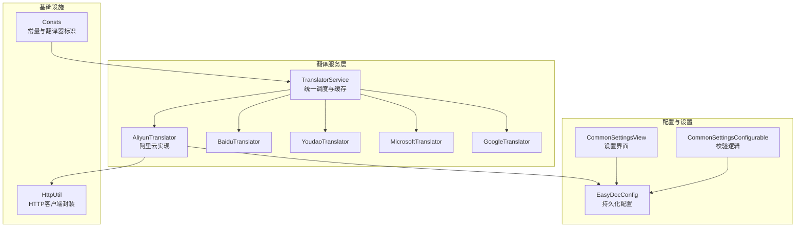
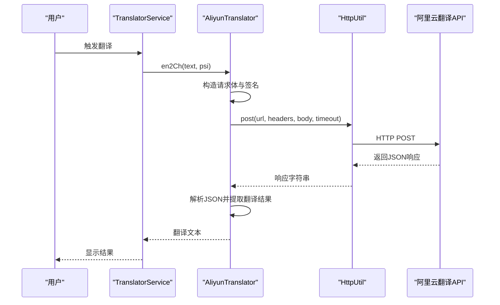
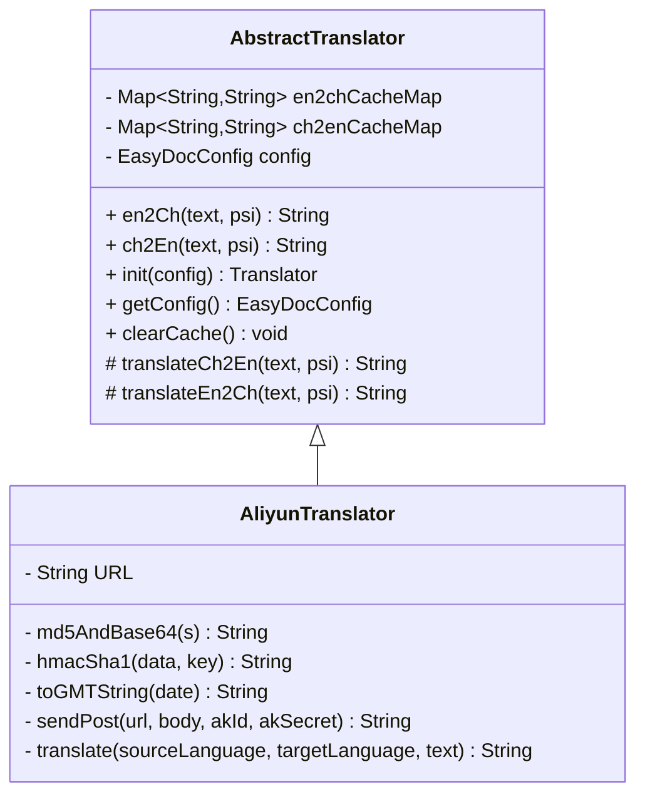
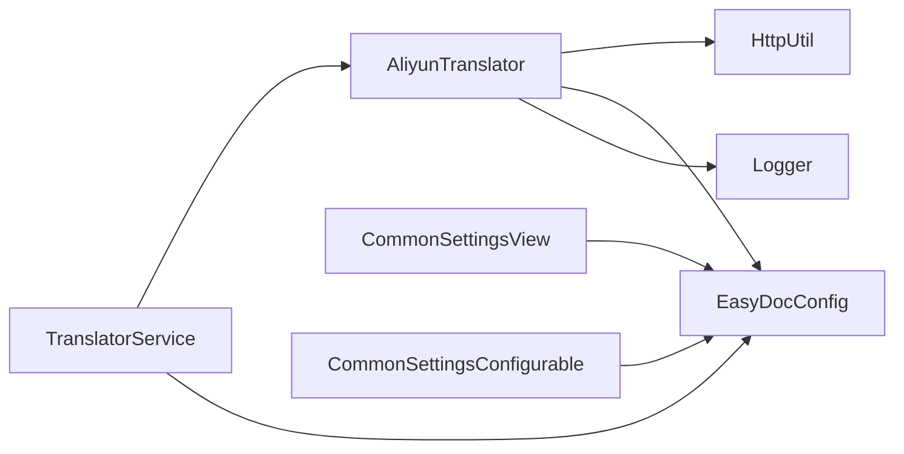

# 阿里云翻译器

<cite>
**本文引用的文件列表**
- [AliyunTranslator.java](file://src/main/java/com/star/easydoc/service/translator/impl/AliyunTranslator.java)
- [AbstractTranslator.java](file://src/main/java/com/star/easydoc/service/translator/impl/AbstractTranslator.java)
- [Translator.java](file://src/main/java/com/star/easydoc/service/translator/Translator.java)
- [TranslatorService.java](file://src/main/java/com/star/easydoc/service/translator/TranslatorService.java)
- [EasyDocConfig.java](file://src/main/java/com/star/easydoc/config/EasyDocConfig.java)
- [HttpUtil.java](file://src/main/java/com/star/easydoc/common/util/HttpUtil.java)
- [Consts.java](file://src/main/java/com/star/easydoc/common/Consts.java)
- [CommonSettingsView.java](file://src/main/java/com/star/easydoc/view/settings/CommonSettingsView.java)
- [CommonSettingsConfigurable.java](file://src/main/java/com/star/easydoc/view/settings/CommonSettingsConfigurable.java)
- [README.md](file://README.md)
</cite>

## 目录
1. [简介](#简介)
2. [项目结构](#项目结构)
3. [核心组件](#核心组件)
4. [架构总览](#架构总览)
5. [组件详解](#组件详解)
6. [依赖关系分析](#依赖关系分析)
7. [性能与可靠性](#性能与可靠性)
8. [故障排查指南](#故障排查指南)
9. [结论](#结论)
10. [附录](#附录)

## 简介
本文件面向“阿里云翻译器”的技术实现，基于仓库中的源码进行深入解析，涵盖以下主题：
- 阿里云机器翻译服务的集成方式与调用流程
- 阿里云翻译器的认证机制（AccessKey ID 与 AccessKey Secret）
- 阿里云翻译服务特点（多语种、专业领域、API 限额与计费）
- 配置示例与使用场景（批量翻译、实时翻译、离线翻译）
- 错误处理、重试机制与性能监控最佳实践

## 项目结构
该插件采用模块化设计，翻译器作为可插拔组件之一，通过统一的服务层进行调度与缓存管理。阿里云翻译器位于翻译实现子包中，配合通用配置、HTTP 工具与设置界面共同完成端到端翻译能力。

图表来源
- [TranslatorService.java:41-77](file://src/main/java/com/star/easydoc/service/translator/TranslatorService.java#L41-L77)
- [AliyunTranslator.java:35-39](file://src/main/java/com/star/easydoc/service/translator/impl/AliyunTranslator.java#L35-L39)
- [HttpUtil.java:39-246](file://src/main/java/com/star/easydoc/common/util/HttpUtil.java#L39-L246)
- [EasyDocConfig.java:22-680](file://src/main/java/com/star/easydoc/config/EasyDocConfig.java#L22-L680)
- [CommonSettingsView.java:272-300](file://src/main/java/com/star/easydoc/view/settings/CommonSettingsView.java#L272-L300)
- [CommonSettingsConfigurable.java:136-143](file://src/main/java/com/star/easydoc/view/settings/CommonSettingsConfigurable.java#L136-L143)
- [Consts.java:56-58](file://src/main/java/com/star/easydoc/common/Consts.java#L56-L58)

章节来源
- [TranslatorService.java:41-77](file://src/main/java/com/star/easydoc/service/translator/TranslatorService.java#L41-L77)
- [Consts.java:56-58](file://src/main/java/com/star/easydoc/common/Consts.java#L56-L58)

## 核心组件
- 阿里云翻译器实现：负责构建请求、签名、发送 HTTP 请求，并解析响应。
- 抽象翻译器基类：提供缓存、初始化与抽象翻译方法。
- 翻译服务：统一调度各翻译器，按配置选择具体实现。
- 配置与设置：持久化存储密钥与超时等参数；设置界面动态显示与校验。
- HTTP 工具：封装 Apache HttpClient，支持代理、超时与编码。

章节来源
- [AliyunTranslator.java:35-39](file://src/main/java/com/star/easydoc/service/translator/impl/AliyunTranslator.java#L35-L39)
- [AbstractTranslator.java:14-92](file://src/main/java/com/star/easydoc/service/translator/impl/AbstractTranslator.java#L14-L92)
- [TranslatorService.java:85-111](file://src/main/java/com/star/easydoc/service/translator/TranslatorService.java#L85-L111)
- [EasyDocConfig.java:105-111](file://src/main/java/com/star/easydoc/config/EasyDocConfig.java#L105-L111)
- [HttpUtil.java:147-180](file://src/main/java/com/star/easydoc/common/util/HttpUtil.java#L147-L180)

## 架构总览
阿里云翻译器通过以下链路工作：
- 用户在设置界面配置 AccessKey ID 与 AccessKey Secret
- 插件启动时将配置注入翻译器实例
- 翻译服务根据当前选择的翻译器，调用阿里云翻译器
- 阿里云翻译器构造请求头（含签名）、发送 POST 请求
- 解析响应并返回翻译结果

图表来源
- [TranslatorService.java:157-163](file://src/main/java/com/star/easydoc/service/translator/TranslatorService.java#L157-L163)
- [AliyunTranslator.java:59-73](file://src/main/java/com/star/easydoc/service/translator/impl/AliyunTranslator.java#L59-L73)
- [AliyunTranslator.java:117-153](file://src/main/java/com/star/easydoc/service/translator/impl/AliyunTranslator.java#L117-L153)
- [HttpUtil.java:147-180](file://src/main/java/com/star/easydoc/common/util/HttpUtil.java#L147-L180)

## 组件详解

### 阿里云翻译器实现
- 认证与签名
  - 使用 HMAC-SHA1 对待签名字符串进行签名
  - 构造 Authorization 头，包含 AK ID 与签名
  - 计算 Content-MD5 并放入请求头
- 请求与响应
  - 请求 URL 固定为阿里云机器翻译服务地址
  - 请求体为 JSON，包含源语言、目标语言与原文
  - 响应解析为 VO 对象，提取翻译结果
- 错误处理
  - 捕获异常并记录日志，返回空字符串以避免中断流程

图表来源
- [AbstractTranslator.java:14-92](file://src/main/java/com/star/easydoc/service/translator/impl/AbstractTranslator.java#L14-L92)
- [AliyunTranslator.java:35-39](file://src/main/java/com/star/easydoc/service/translator/impl/AliyunTranslator.java#L35-L39)
- [AliyunTranslator.java:78-95](file://src/main/java/com/star/easydoc/service/translator/impl/AliyunTranslator.java#L78-L95)
- [AliyunTranslator.java:117-153](file://src/main/java/com/star/easydoc/service/translator/impl/AliyunTranslator.java#L117-L153)

章节来源
- [AliyunTranslator.java:59-73](file://src/main/java/com/star/easydoc/service/translator/impl/AliyunTranslator.java#L59-L73)
- [AliyunTranslator.java:117-153](file://src/main/java/com/star/easydoc/service/translator/impl/AliyunTranslator.java#L117-L153)

### 配置与认证
- 配置项
  - AccessKey ID 与 AccessKey Secret 存储于 EasyDocConfig
  - 超时时间可配置，默认值在配置类中定义
- 设置界面
  - 当选择“阿里云翻译”时，显示 AccessKey ID 与 AccessKey Secret 输入框
- 校验逻辑
  - 保存设置时校验 AccessKey ID 与 AccessKey Secret 非空

章节来源
- [EasyDocConfig.java:105-111](file://src/main/java/com/star/easydoc/config/EasyDocConfig.java#L105-L111)
- [CommonSettingsView.java:272-300](file://src/main/java/com/star/easydoc/view/settings/CommonSettingsView.java#L272-L300)
- [CommonSettingsConfigurable.java:136-143](file://src/main/java/com/star/easydoc/view/settings/CommonSettingsConfigurable.java#L136-L143)

### 翻译服务与缓存
- 统一入口
  - TranslatorService 根据配置选择具体翻译器
  - 提供整句与单词级翻译策略
- 缓存机制
  - AbstractTranslator 内部维护双向缓存，减少重复请求
  - 支持清空缓存操作

章节来源
- [TranslatorService.java:85-111](file://src/main/java/com/star/easydoc/service/translator/TranslatorService.java#L85-L111)
- [AbstractTranslator.java:16-72](file://src/main/java/com/star/easydoc/service/translator/impl/AbstractTranslator.java#L16-L72)

### HTTP 工具与代理
- 功能
  - GET/POST 封装，支持超时、代理与 UTF-8 编码
  - 自动识别系统代理并应用
- 使用
  - 阿里云翻译器通过 HttpUtil.post 发送签名后的请求

章节来源
- [HttpUtil.java:147-180](file://src/main/java/com/star/easydoc/common/util/HttpUtil.java#L147-L180)
- [AliyunTranslator.java:152](file://src/main/java/com/star/easydoc/service/translator/impl/AliyunTranslator.java#L152)

## 依赖关系分析
- 组件耦合
  - AliyunTranslator 依赖 HttpUtil、EasyDocConfig 与日志框架
  - TranslatorService 依赖各翻译器实现与配置
- 外部依赖
  - Apache HttpClient（用于 HTTP 请求）
  - FastJSON2（用于 JSON 序列化/反序列化）
  - Commons Codec/Lang（用于签名与字符串处理）

图表来源
- [AliyunTranslator.java:23-27](file://src/main/java/com/star/easydoc/service/translator/impl/AliyunTranslator.java#L23-L27)
- [HttpUtil.java:39-246](file://src/main/java/com/star/easydoc/common/util/HttpUtil.java#L39-L246)
- [TranslatorService.java:41-77](file://src/main/java/com/star/easydoc/service/translator/TranslatorService.java#L41-L77)
- [CommonSettingsView.java:272-300](file://src/main/java/com/star/easydoc/view/settings/CommonSettingsView.java#L272-L300)
- [CommonSettingsConfigurable.java:136-143](file://src/main/java/com/star/easydoc/view/settings/CommonSettingsConfigurable.java#L136-L143)

## 性能与可靠性

### 性能特性
- 缓存策略
  - 内置双向缓存，显著降低重复请求次数
- 超时控制
  - 配置超时时间，避免阻塞
- 代理支持
  - 自动识别系统代理，提升网络稳定性

章节来源
- [AbstractTranslator.java:16-72](file://src/main/java/com/star/easydoc/service/translator/impl/AbstractTranslator.java#L16-L72)
- [EasyDocConfig.java:77](file://src/main/java/com/star/easydoc/config/EasyDocConfig.java#L77)
- [HttpUtil.java:158-161](file://src/main/java/com/star/easydoc/common/util/HttpUtil.java#L158-L161)

### 可靠性与错误处理
- 异常捕获
  - 翻译过程中捕获异常并记录日志，返回空字符串避免崩溃
- 响应解析
  - 严格解析 JSON，确保字段存在后再取值
- 设置校验
  - 保存设置时校验必填项，防止无效配置

章节来源
- [AliyunTranslator.java:69-72](file://src/main/java/com/star/easydoc/service/translator/impl/AliyunTranslator.java#L69-L72)
- [CommonSettingsConfigurable.java:136-143](file://src/main/java/com/star/easydoc/view/settings/CommonSettingsConfigurable.java#L136-L143)

### 重试机制与监控建议
- 重试机制
  - 当前实现未内置自动重试，可在调用侧增加指数退避重试
- 监控建议
  - 记录请求耗时、成功率与错误码
  - 对签名失败、网络超时、解析异常分别统计

[本节为通用实践建议，不直接分析具体文件，故无章节来源]

## 故障排查指南

### 常见问题定位
- 认证失败
  - 检查 AccessKey ID 与 AccessKey Secret 是否正确
  - 确认签名算法与请求头字段完整
- 网络问题
  - 检查代理设置与超时配置
  - 观察日志输出的异常信息
- 响应解析失败
  - 确认返回 JSON 结构与字段名称一致

章节来源
- [CommonSettingsConfigurable.java:136-143](file://src/main/java/com/star/easydoc/view/settings/CommonSettingsConfigurable.java#L136-L143)
- [AliyunTranslator.java:69-72](file://src/main/java/com/star/easydoc/service/translator/impl/AliyunTranslator.java#L69-L72)
- [HttpUtil.java:158-161](file://src/main/java/com/star/easydoc/common/util/HttpUtil.java#L158-L161)

### 日志与调试
- 日志位置
  - 使用 IDE 日志窗口查看翻译器错误日志
- 调试要点
  - 打印签名字符串与 Authorization 头
  - 输出请求与响应的原始内容

章节来源
- [AliyunTranslator.java:70](file://src/main/java/com/star/easydoc/service/translator/impl/AliyunTranslator.java#L70)

## 结论
阿里云翻译器在本项目中实现了标准的签名与请求流程，具备良好的可扩展性与可维护性。通过统一的配置与设置界面，用户可以便捷地接入阿里云翻译服务。建议在生产环境中补充重试与监控能力，并持续关注阿里云服务的 API 变更与配额限制。

[本节为总结性内容，不直接分析具体文件，故无章节来源]

## 附录

### 阿里云翻译服务特点与计费
- 多语种支持
  - 支持电商场景的中英互译
- 专业领域
  - 场景参数默认为通用，可根据业务调整
- API 限额与计费
  - 具体配额与计费以阿里云官方为准
  - 插件层面不涉及配额查询与计费逻辑

章节来源
- [AliyunTranslator.java:39](file://src/main/java/com/star/easydoc/service/translator/impl/AliyunTranslator.java#L39)
- [AliyunTranslator.java:173](file://src/main/java/com/star/easydoc/service/translator/impl/AliyunTranslator.java#L173)
- [README.md:44](file://README.md#L44)

### 配置示例与使用场景
- 配置步骤
  - 在设置界面选择“阿里云翻译”
  - 填写 AccessKey ID 与 AccessKey Secret
  - 保存后即可使用
- 使用场景
  - 实时翻译：在编辑器中选中文本，触发翻译
  - 批量翻译：通过批量生成注释功能间接使用
  - 离线翻译：当前实现为在线调用，不支持离线

章节来源
- [CommonSettingsView.java:272-300](file://src/main/java/com/star/easydoc/view/settings/CommonSettingsView.java#L272-L300)
- [CommonSettingsConfigurable.java:136-143](file://src/main/java/com/star/easydoc/view/settings/CommonSettingsConfigurable.java#L136-L143)
- [TranslatorService.java:85-111](file://src/main/java/com/star/easydoc/service/translator/TranslatorService.java#L85-L111)