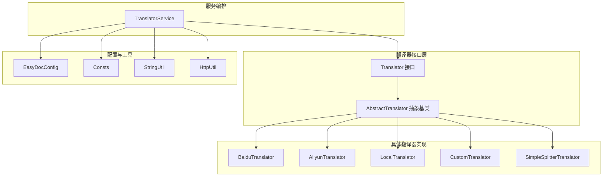
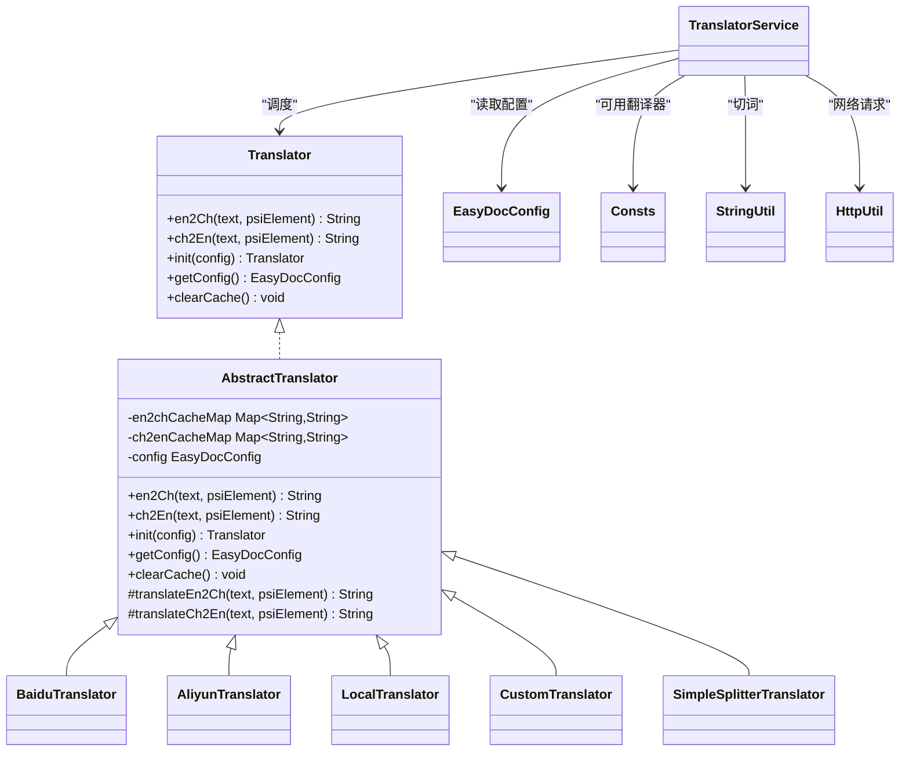
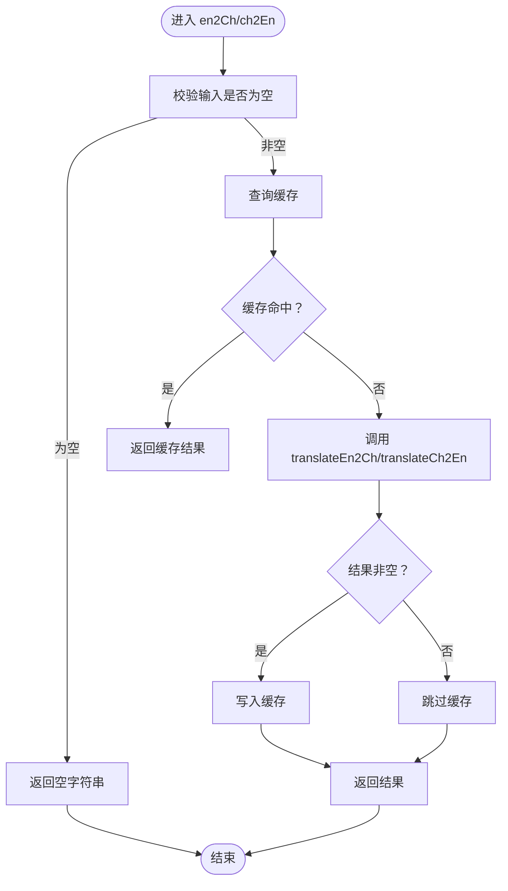
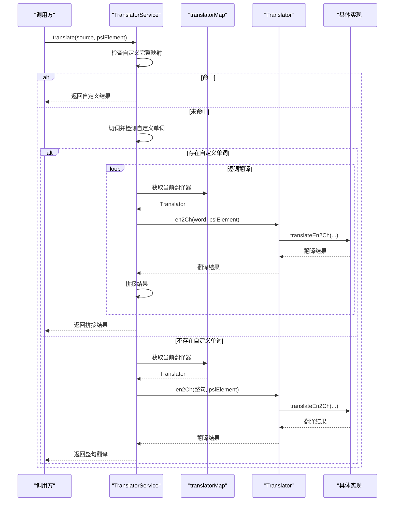
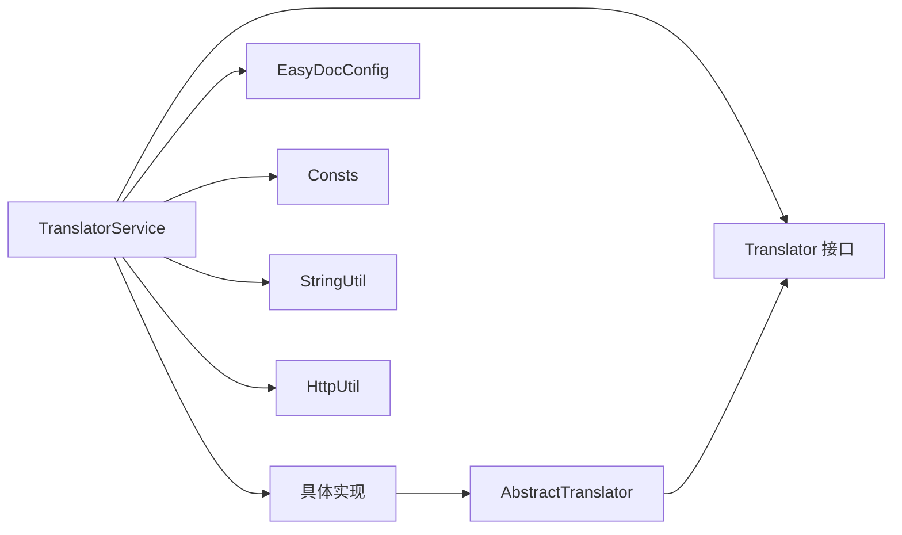

# 翻译器接口设计

<cite>
**本文引用的文件**
- [Translator.java](file://src/main/java/com/star/easydoc/service/translator/Translator.java)
- [AbstractTranslator.java](file://src/main/java/com/star/easydoc/service/translator/impl/AbstractTranslator.java)
- [TranslatorService.java](file://src/main/java/com/star/easydoc/service/translator/TranslatorService.java)
- [AliyunTranslator.java](file://src/main/java/com/star/easydoc/service/translator/impl/AliyunTranslator.java)
- [BaiduTranslator.java](file://src/main/java/com/star/easydoc/service/translator/impl/BaiduTranslator.java)
- [LocalTranslator.java](file://src/main/java/com/star/easydoc/service/translator/impl/LocalTranslator.java)
- [CustomTranslator.java](file://src/main/java/com/star/easydoc/service/translator/impl/CustomTranslator.java)
- [SimpleSplitterTranslator.java](file://src/main/java/com/star/easydoc/service/translator/impl/SimpleSplitterTranslator.java)
- [EasyDocConfig.java](file://src/main/java/com/star/easydoc/config/EasyDocConfig.java)
- [Consts.java](file://src/main/java/com/star/easydoc/common/Consts.java)
- [StringUtil.java](file://src/main/java/com/star/easydoc/common/util/StringUtil.java)
- [HttpUtil.java](file://src/main/java/com/star/easydoc/common/util/HttpUtil.java)
- [README.md](file://README.md)
- [自定义接口说明.md](file://doc/自定义接口说明.md)
</cite>

## 目录
1. [简介](#简介)
2. [项目结构](#项目结构)
3. [核心组件](#核心组件)
4. [架构总览](#架构总览)
5. [详细组件分析](#详细组件分析)
6. [依赖分析](#依赖分析)
7. [性能考虑](#性能考虑)
8. [故障排查指南](#故障排查指南)
9. [结论](#结论)
10. [附录](#附录)

## 简介
本技术文档围绕翻译器接口设计展开，系统性阐述 Translator 接口的设计理念与核心方法定义，详解 AbstractTranslator 抽象基类提供的通用能力（缓存、错误处理、配置管理），并说明 TranslatorService 的调度与扩展机制。文档还给出扩展新翻译器与修改现有翻译器的最佳实践，帮助开发者正确、高效地使用与维护翻译器接口。

## 项目结构
翻译器相关代码位于 service.translator 包及其子包 impl 下，配合配置类 EasyDocConfig、常量 Consts、工具类 StringUtil 和 HttpUtil，形成“接口定义—抽象实现—具体实现—服务编排—配置驱动”的清晰分层。

图表来源
- [Translator.java:13-53](file://src/main/java/com/star/easydoc/service/translator/Translator.java#L13-L53)
- [AbstractTranslator.java:14-91](file://src/main/java/com/star/easydoc/service/translator/impl/AbstractTranslator.java#L14-L91)
- [TranslatorService.java:41-237](file://src/main/java/com/star/easydoc/service/translator/TranslatorService.java#L41-L237)
- [BaiduTranslator.java:21-137](file://src/main/java/com/star/easydoc/service/translator/impl/BaiduTranslator.java#L21-L137)
- [AliyunTranslator.java:35-282](file://src/main/java/com/star/easydoc/service/translator/impl/AliyunTranslator.java#L35-L282)
- [LocalTranslator.java:25-70](file://src/main/java/com/star/easydoc/service/translator/impl/LocalTranslator.java#L25-L70)
- [CustomTranslator.java:20-60](file://src/main/java/com/star/easydoc/service/translator/impl/CustomTranslator.java#L20-L60)
- [SimpleSplitterTranslator.java:13-25](file://src/main/java/com/star/easydoc/service/translator/impl/SimpleSplitterTranslator.java#L13-L25)
- [EasyDocConfig.java:22-679](file://src/main/java/com/star/easydoc/config/EasyDocConfig.java#L22-L679)
- [Consts.java:14-99](file://src/main/java/com/star/easydoc/common/Consts.java#L14-L99)
- [StringUtil.java:13-71](file://src/main/java/com/star/easydoc/common/util/StringUtil.java#L13-L71)
- [HttpUtil.java:39-245](file://src/main/java/com/star/easydoc/common/util/HttpUtil.java#L39-L245)

章节来源
- [Translator.java:13-53](file://src/main/java/com/star/easydoc/service/translator/Translator.java#L13-L53)
- [AbstractTranslator.java:14-91](file://src/main/java/com/star/easydoc/service/translator/impl/AbstractTranslator.java#L14-L91)
- [TranslatorService.java:41-237](file://src/main/java/com/star/easydoc/service/translator/TranslatorService.java#L41-L237)

## 核心组件
- Translator 接口：定义统一的翻译契约，包含 en2Ch（英译中）、ch2En（中译英）、init（初始化配置）、getConfig（获取配置）、clearCache（清除缓存）等方法。
- AbstractTranslator 抽象基类：提供并发安全的缓存机制（分别维护 en2chCacheMap 与 ch2enCacheMap）、统一的初始化与配置注入、以及受保护的抽象翻译方法 translateEn2Ch 与 translateCh2En，供具体实现类聚焦业务细节。
- TranslatorService：负责翻译器实例的集中初始化与管理（ImmutableMap 存储），根据配置选择具体翻译器，执行翻译流程，并提供缓存清理能力。
- 具体翻译器：如 Baidu、Aliyun、Local、Custom、SimpleSplitter 等，均继承 AbstractTranslator 并实现具体的翻译逻辑；部分实现通过 HttpUtil 发起网络请求，部分实现基于本地资源或简单规则。
- 配置与常量：EasyDocConfig 提供翻译器所需密钥、超时、自定义词典等配置；Consts 定义可用翻译器名称常量与停用词集合；StringUtil 提供英文单词切分；HttpUtil 提供 HTTP GET/POST 能力与代理支持。

章节来源
- [Translator.java:13-53](file://src/main/java/com/star/easydoc/service/translator/Translator.java#L13-L53)
- [AbstractTranslator.java:14-91](file://src/main/java/com/star/easydoc/service/translator/impl/AbstractTranslator.java#L14-L91)
- [TranslatorService.java:41-237](file://src/main/java/com/star/easydoc/service/translator/TranslatorService.java#L41-L237)
- [EasyDocConfig.java:22-679](file://src/main/java/com/star/easydoc/config/EasyDocConfig.java#L22-L679)
- [Consts.java:14-99](file://src/main/java/com/star/easydoc/common/Consts.java#L14-L99)
- [StringUtil.java:13-71](file://src/main/java/com/star/easydoc/common/util/StringUtil.java#L13-L71)
- [HttpUtil.java:39-245](file://src/main/java/com/star/easydoc/common/util/HttpUtil.java#L39-L245)

## 架构总览
翻译器接口采用“接口 + 抽象基类 + 多实现 + 服务编排 + 配置驱动”的架构，确保：
- 接口契约清晰，方法职责单一；
- 抽象基类复用通用能力（缓存、配置、生命周期）；
- 具体实现关注差异化细节（网络签名、本地词典、简单规则）；
- 服务层统一调度与缓存清理，降低调用方复杂度；
- 配置与常量解耦于实现，便于扩展与替换。

图表来源
- [Translator.java:13-53](file://src/main/java/com/star/easydoc/service/translator/Translator.java#L13-L53)
- [AbstractTranslator.java:14-91](file://src/main/java/com/star/easydoc/service/translator/impl/AbstractTranslator.java#L14-L91)
- [TranslatorService.java:41-237](file://src/main/java/com/star/easydoc/service/translator/TranslatorService.java#L41-L237)
- [BaiduTranslator.java:21-137](file://src/main/java/com/star/easydoc/service/translator/impl/BaiduTranslator.java#L21-L137)
- [AliyunTranslator.java:35-282](file://src/main/java/com/star/easydoc/service/translator/impl/AliyunTranslator.java#L35-L282)
- [LocalTranslator.java:25-70](file://src/main/java/com/star/easydoc/service/translator/impl/LocalTranslator.java#L25-L70)
- [CustomTranslator.java:20-60](file://src/main/java/com/star/easydoc/service/translator/impl/CustomTranslator.java#L20-L60)
- [SimpleSplitterTranslator.java:13-25](file://src/main/java/com/star/easydoc/service/translator/impl/SimpleSplitterTranslator.java#L13-L25)
- [EasyDocConfig.java:22-679](file://src/main/java/com/star/easydoc/config/EasyDocConfig.java#L22-L679)
- [Consts.java:14-99](file://src/main/java/com/star/easydoc/common/Consts.java#L14-L99)
- [StringUtil.java:13-71](file://src/main/java/com/star/easydoc/common/util/StringUtil.java#L13-L71)
- [HttpUtil.java:39-245](file://src/main/java/com/star/easydoc/common/util/HttpUtil.java#L39-L245)

## 详细组件分析

### 接口设计：Translator
- 设计理念
  - 明确职责：提供 en2Ch/ch2En 两个方向的翻译能力，统一的初始化与配置注入，以及缓存清理入口。
  - 解耦调用方：屏蔽具体实现差异，调用方只需面向接口编程。
- 方法规范
  - en2Ch：输入英文文本与 PSI 元素，返回中文翻译结果；空输入返回空字符串。
  - ch2En：输入中文文本与 PSI 元素，返回英文翻译结果；空输入返回空字符串。
  - init/getConfig：注入配置并暴露配置对象，便于实现类读取密钥、超时等参数。
  - clearCache：清空实现持有的缓存，由服务层统一触发。

章节来源
- [Translator.java:13-53](file://src/main/java/com/star/easydoc/service/translator/Translator.java#L13-L53)

### 抽象基类：AbstractTranslator
- 缓存机制
  - en2chCacheMap 与 ch2enCacheMap 分别缓存英文到中文、中文到英文的翻译结果，使用并发安全的 ConcurrentHashMap。
  - 若缓存命中，直接返回；未命中则调用受保护的 translateEn2Ch/translateCh2En，并在结果非空时写入缓存。
- 生命周期与配置
  - init 方法注入 EasyDocConfig，getConfig 返回配置对象，供具体实现读取密钥、超时等。
  - clearCache 清空两个缓存表。
- 抽象方法
  - translateEn2Ch/translateCh2En 由具体实现类覆盖，聚焦网络请求或本地映射等细节。

图表来源
- [AbstractTranslator.java:22-72](file://src/main/java/com/star/easydoc/service/translator/impl/AbstractTranslator.java#L22-L72)

章节来源
- [AbstractTranslator.java:14-91](file://src/main/java/com/star/easydoc/service/translator/impl/AbstractTranslator.java#L14-L91)

### 服务编排：TranslatorService
- 初始化与注册
  - 使用不可变映射存储各翻译器实例，键为 Consts 中的翻译器名称常量，值为对应实现的 init(config) 实例。
  - 通过双重检查锁定保证线程安全与幂等初始化。
- 翻译策略
  - translate：优先匹配自定义完整映射；若存在自定义单词，逐词翻译并拼接；否则整句翻译以提升准确性。
  - translateCh2En：调用具体翻译器的 ch2En，再对结果进行切词、过滤停用词、大小写规范化等处理。
  - autoTranslate：按配置选择翻译器，执行英文到中文的自动翻译。
  - translateWithClass：在优先级为“仅翻译”时直接翻译，否则尝试读取类注释作为源文本。
- 缓存管理
  - clearCache：遍历所有翻译器实例，逐一清理缓存。

图表来源
- [TranslatorService.java:85-111](file://src/main/java/com/star/easydoc/service/translator/TranslatorService.java#L85-L111)
- [TranslatorService.java:222-232](file://src/main/java/com/star/easydoc/service/translator/TranslatorService.java#L222-L232)
- [Consts.java:29-34](file://src/main/java/com/star/easydoc/common/Consts.java#L29-L34)

章节来源
- [TranslatorService.java:41-237](file://src/main/java/com/star/easydoc/service/translator/TranslatorService.java#L41-L237)
- [Consts.java:14-99](file://src/main/java/com/star/easydoc/common/Consts.java#L14-L99)

### 具体翻译器实现

#### 百度翻译：BaiduTranslator
- 特点：基于 HTTP GET 请求，使用 MD5 签名与随机盐值；对特定错误码进行重试；解析 JSON 响应。
- 错误处理：捕获异常并记录日志；当 error_code 为特定值时短暂休眠后重试。
- 适用场景：需要稳定、免费额度的在线翻译。

章节来源
- [BaiduTranslator.java:21-137](file://src/main/java/com/star/easydoc/service/translator/impl/BaiduTranslator.java#L21-L137)
- [HttpUtil.java:53-121](file://src/main/java/com/star/easydoc/common/util/HttpUtil.java#L53-L121)

#### 阿里云翻译：AliyunTranslator
- 特点：使用 HMAC-SHA1 签名与 x-acs-* 请求头，构造 Authorization；通过 HttpUtil 发送 POST 请求。
- 安全性：包含 MD5+BASE64、HMAC-SHA1、GMT 时间等签名步骤。
- 适用场景：企业级、高可靠场景。

章节来源
- [AliyunTranslator.java:35-282](file://src/main/java/com/star/easydoc/service/translator/impl/AliyunTranslator.java#L35-L282)
- [HttpUtil.java:147-192](file://src/main/java/com/star/easydoc/common/util/HttpUtil.java#L147-L192)

#### 本地词典：LocalTranslator
- 特点：懒加载本地 words.json，构建英↔中双向映射；并发控制避免重复初始化。
- 适用场景：离线环境、内网或对隐私敏感的场景。

章节来源
- [LocalTranslator.java:25-70](file://src/main/java/com/star/easydoc/service/translator/impl/LocalTranslator.java#L25-L70)

#### 自定义 HTTP 接口：CustomTranslator
- 特点：根据 PSI 元素类型（类/方法/字段/默认）动态拼接请求；支持占位符 {query}/{from}/{to}/{type}。
- 适用场景：企业内网自建翻译服务，满足合规与私有化需求。

章节来源
- [CustomTranslator.java:20-60](file://src/main/java/com/star/easydoc/service/translator/impl/CustomTranslator.java#L20-L60)
- [自定义接口说明.md:1-38](file://doc/自定义接口说明.md#L1-L38)

#### 简单词分割：SimpleSplitterTranslator
- 特点：基于 StringUtil.split 对英文进行切分，再用空格连接，适合快速预处理或测试。
- 适用场景：调试、演示或作为占位实现。

章节来源
- [SimpleSplitterTranslator.java:13-25](file://src/main/java/com/star/easydoc/service/translator/impl/SimpleSplitterTranslator.java#L13-L25)
- [StringUtil.java:40-45](file://src/main/java/com/star/easydoc/common/util/StringUtil.java#L40-L45)

### 配置与常量
- EasyDocConfig
  - 提供翻译器密钥（如 appId/token、secretKey/secretId/accessKeyId/accessKeySecret、youdaoAppKey/youdaoAppSecret、googleKey、microsoftKey/region、chatGlmApiKey、customUrl）与超时、自定义词典、模板配置等。
  - 提供 getWordMapWithProject 合并全局与项目级词典的能力。
- Consts
  - 定义可用翻译器名称常量（如 BAIDU_TRANSLATOR、ALIYUN_TRANSLATOR、CUSTOM_URL 等）与停用词集合。
- StringUtil
  - 提供英文单词切分算法，用于翻译前的分词处理。
- HttpUtil
  - 提供 GET/POST、编码、代理支持等通用 HTTP 能力。

章节来源
- [EasyDocConfig.java:22-679](file://src/main/java/com/star/easydoc/config/EasyDocConfig.java#L22-L679)
- [Consts.java:14-99](file://src/main/java/com/star/easydoc/common/Consts.java#L14-L99)
- [StringUtil.java:13-71](file://src/main/java/com/star/easydoc/common/util/StringUtil.java#L13-L71)
- [HttpUtil.java:39-245](file://src/main/java/com/star/easydoc/common/util/HttpUtil.java#L39-L245)

## 依赖分析
- 组件耦合
  - TranslatorService 依赖 Translator 接口与具体实现，通过 Consts 的名称常量进行选择；依赖 EasyDocConfig 获取密钥与超时；依赖 StringUtil 进行切词；依赖 HttpUtil 进行网络请求。
  - 具体翻译器依赖 AbstractTranslator 的缓存与配置注入，部分实现依赖 HttpUtil 与第三方 SDK（如阿里云）。
- 扩展点
  - 新增翻译器：实现 Translator 或继承 AbstractTranslator，注册到 TranslatorService 的映射中，更新 Consts 常量与 EasyDocConfig 配置项。
  - 修改现有翻译器：保持接口不变，调整 AbstractTranslator 的缓存策略或具体实现的网络签名逻辑。

图表来源
- [TranslatorService.java:60-76](file://src/main/java/com/star/easydoc/service/translator/TranslatorService.java#L60-L76)
- [Consts.java:29-34](file://src/main/java/com/star/easydoc/common/Consts.java#L29-L34)
- [AbstractTranslator.java:14-91](file://src/main/java/com/star/easydoc/service/translator/impl/AbstractTranslator.java#L14-L91)

章节来源
- [TranslatorService.java:60-76](file://src/main/java/com/star/easydoc/service/translator/TranslatorService.java#L60-L76)
- [Consts.java:29-34](file://src/main/java/com/star/easydoc/common/Consts.java#L29-L34)

## 性能考虑
- 缓存策略
  - AbstractTranslator 已内置并发安全缓存，建议在高频调用场景下充分利用缓存；必要时通过 TranslatorService.clearCache 清理缓存以刷新数据。
- 网络请求
  - 合理设置 EasyDocConfig.timeout，避免阻塞；对易失败的接口（如百度翻译）可适当增加重试与退避策略。
- 切词与预处理
  - 使用 StringUtil.split 对英文进行切分，有助于减少长句翻译的负担；但需注意切分质量对翻译准确性的影响。
- 本地词典
  - LocalTranslator 的懒加载与双向映射可显著降低网络依赖，适合离线或内网场景。

## 故障排查指南
- 常见问题定位
  - 网络请求失败：检查 HttpUtil 的代理设置与超时配置；查看具体翻译器的日志输出。
  - 签名错误：确认密钥与签名算法（如阿里云 HMAC-SHA1、百度 MD5）是否正确；核对请求头与时间戳。
  - 自定义接口异常：依据自定义接口说明校验请求参数与返回格式；关注 code 非 0 的情况。
- 日志与告警
  - 具体翻译器实现均使用 Logger 输出错误信息，便于定位问题；建议在生产环境开启日志收集。
- 缓存问题
  - 若翻译结果陈旧，可通过 TranslatorService.clearCache 清理缓存；或在开发阶段临时禁用缓存验证逻辑。

章节来源
- [BaiduTranslator.java:56-62](file://src/main/java/com/star/easydoc/service/translator/impl/BaiduTranslator.java#L56-L62)
- [AliyunTranslator.java:69-72](file://src/main/java/com/star/easydoc/service/translator/impl/AliyunTranslator.java#L69-L72)
- [CustomTranslator.java:46-58](file://src/main/java/com/star/easydoc/service/translator/impl/CustomTranslator.java#L46-L58)
- [自定义接口说明.md:23-32](file://doc/自定义接口说明.md#L23-L32)

## 结论
该翻译器接口设计以清晰的契约、可复用的抽象与灵活的服务编排为核心，既满足多厂商、多场景的翻译需求，又通过缓存与配置管理提升了性能与可维护性。开发者可按需扩展新翻译器或优化现有实现，同时遵循统一的接口规范与最佳实践，确保系统的稳定性与一致性。

## 附录
- 使用建议
  - 在 EasyDocConfig 中配置所需翻译器的密钥与超时；在 Consts 中确认翻译器名称常量；在 TranslatorService 中完成注册与初始化。
  - 对于频繁调用的场景，优先使用 AbstractTranslator 的缓存；对于自定义词典，建议在 EasyDocConfig 中维护全局与项目级映射。
- 扩展新翻译器步骤
  - 实现 Translator 或继承 AbstractTranslator，完成 translateEn2Ch/translateCh2En 的具体逻辑。
  - 在 Consts 中新增名称常量；在 TranslatorService 的映射中注册；在 EasyDocConfig 中补充配置项。
  - 编写单元测试与集成测试，覆盖网络请求、错误处理与缓存行为。

章节来源
- [README.md:1-266](file://README.md#L1-L266)
- [自定义接口说明.md:1-38](file://doc/自定义接口说明.md#L1-L38)