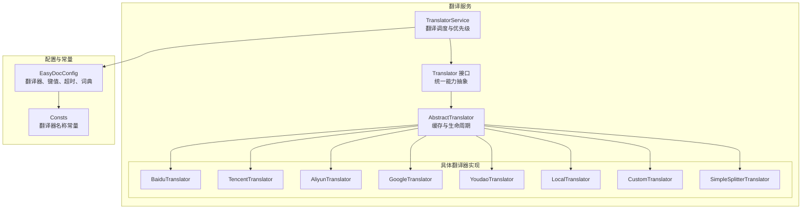
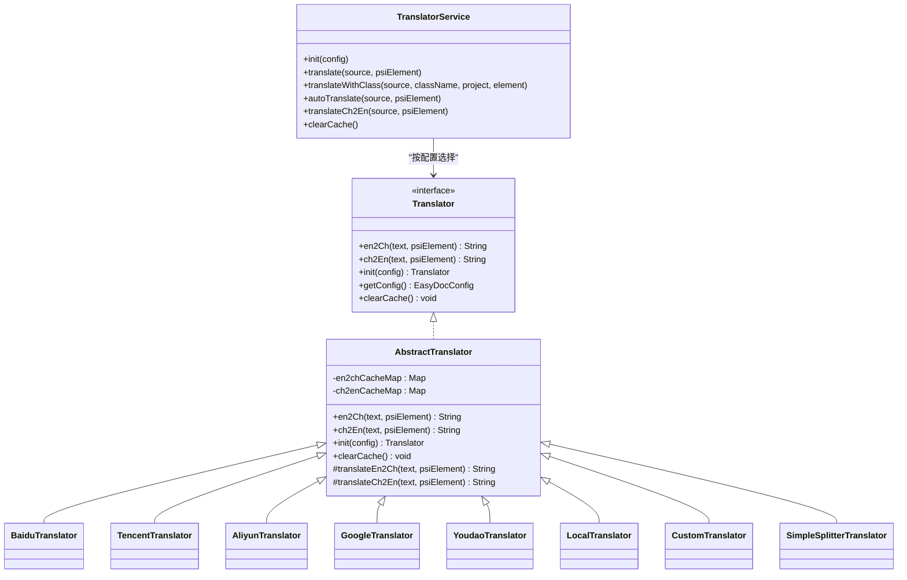
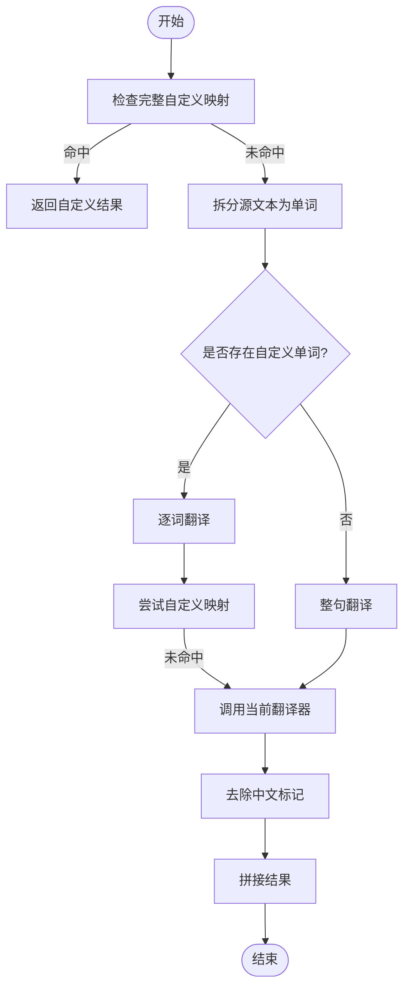
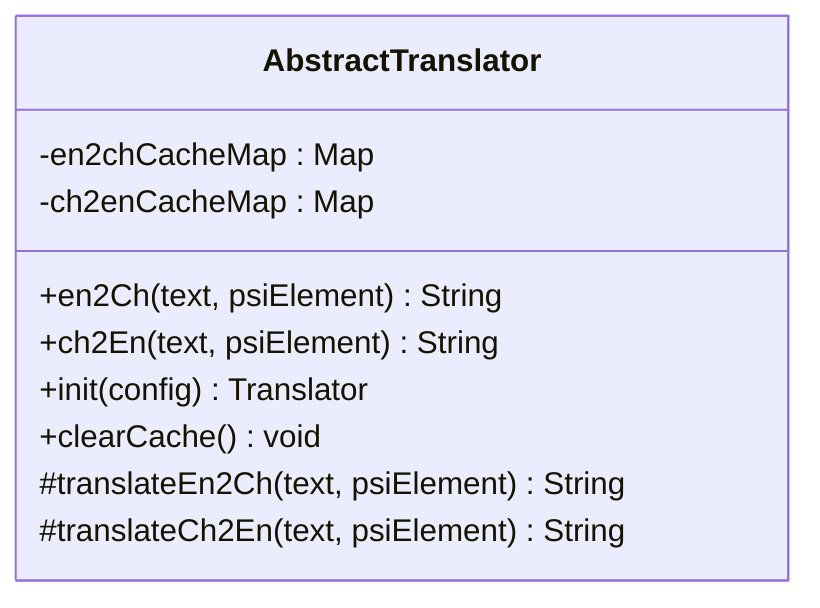
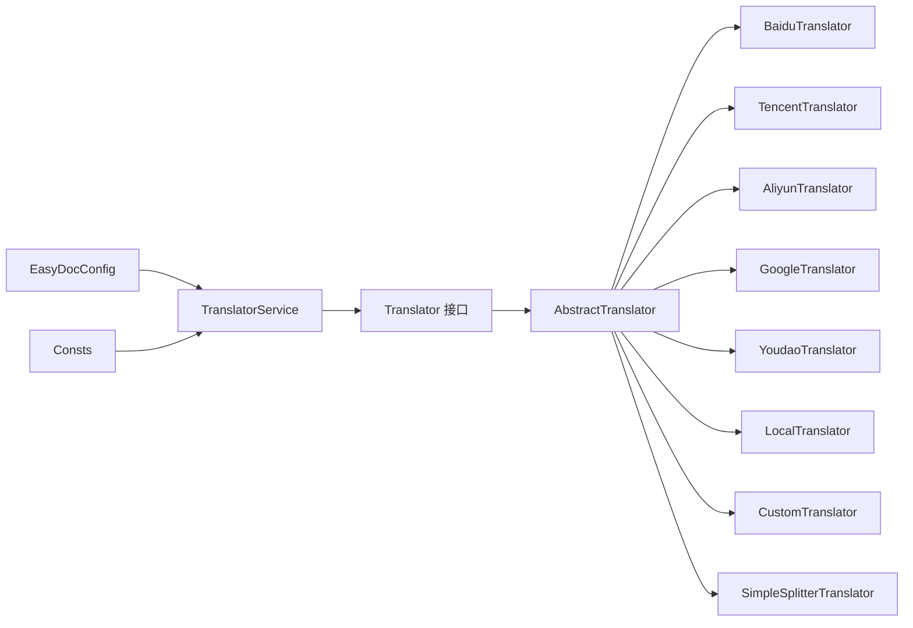

# 翻译服务核心功能

<cite>
**本文引用的文件**
- [TranslatorService.java](file://src/main/java/com/star/easydoc/service/translator/TranslatorService.java)
- [Translator.java](file://src/main/java/com/star/easydoc/service/translator/Translator.java)
- [AbstractTranslator.java](file://src/main/java/com/star/easydoc/service/translator/impl/AbstractTranslator.java)
- [AliyunTranslator.java](file://src/main/java/com/star/easydoc/service/translator/impl/AliyunTranslator.java)
- [BaiduTranslator.java](file://src/main/java/com/star/easydoc/service/translator/impl/BaiduTranslator.java)
- [CustomTranslator.java](file://src/main/java/com/star/easydoc/service/translator/impl/CustomTranslator.java)
- [LocalTranslator.java](file://src/main/java/com/star/easydoc/service/translator/impl/LocalTranslator.java)
- [GoogleTranslator.java](file://src/main/java/com/star/easydoc/service/translator/impl/GoogleTranslator.java)
- [TencentTranslator.java](file://src/main/java/com/star/easydoc/service/translator/impl/TencentTranslator.java)
- [YoudaoTranslator.java](file://src/main/java/com/star/easydoc/service/translator/impl/YoudaoTranslator.java)
- [SimpleSplitterTranslator.java](file://src/main/java/com/star/easydoc/service/translator/impl/SimpleSplitterTranslator.java)
- [Consts.java](file://src/main/java/com/star/easydoc/common/Consts.java)
- [EasyDocConfig.java](file://src/main/java/com/star/easydoc/config/EasyDocConfig.java)
- [GptService.java](file://src/main/java/com/star/easydoc/service/gpt/GptService.java)
- [GptSupplier.java](file://src/main/java/com/star/easydoc/service/gpt/GptSupplier.java)
</cite>

## 目录
1. [简介](#简介)
2. [项目结构](#项目结构)
3. [核心组件](#核心组件)
4. [架构总览](#架构总览)
5. [详细组件分析](#详细组件分析)
6. [依赖分析](#依赖分析)
7. [性能考虑](#性能考虑)
8. [故障排查指南](#故障排查指南)
9. [结论](#结论)
10. [附录](#附录)

## 简介
本文档围绕翻译服务核心功能进行系统化技术说明，重点覆盖以下方面：
- TranslatorService 的整体架构与核心方法：翻译调度、缓存管理、自定义词典处理、翻译优先级策略。
- 翻译器注册与初始化流程：如何按配置选择最优翻译方案，线程安全保证。
- 使用示例与最佳实践：批量翻译、缓存策略、错误处理与性能优化。

## 项目结构
翻译服务位于模块 com.star.easydoc.service.translator 下，采用“接口 + 抽象基类 + 多实现”的分层设计，并通过常量与配置类统一管理可用翻译器与运行参数。

图表来源
- [TranslatorService.java:1-238](file://src/main/java/com/star/easydoc/service/translator/TranslatorService.java#L1-L238)
- [Translator.java:1-54](file://src/main/java/com/star/easydoc/service/translator/Translator.java#L1-L54)
- [AbstractTranslator.java:1-92](file://src/main/java/com/star/easydoc/service/translator/impl/AbstractTranslator.java#L1-L92)
- [Consts.java:1-100](file://src/main/java/com/star/easydoc/common/Consts.java#L1-L100)
- [EasyDocConfig.java:1-680](file://src/main/java/com/star/easydoc/config/EasyDocConfig.java#L1-L680)

章节来源
- [TranslatorService.java:1-238](file://src/main/java/com/star/easydoc/service/translator/TranslatorService.java#L1-L238)
- [Consts.java:1-100](file://src/main/java/com/star/easydoc/common/Consts.java#L1-L100)
- [EasyDocConfig.java:1-680](file://src/main/java/com/star/easydoc/config/EasyDocConfig.java#L1-L680)

## 核心组件
- TranslatorService：对外暴露翻译入口，负责：
  - 初始化翻译器注册表（线程安全）
  - 翻译优先级策略（类注释优先、仅翻译）
  - 自定义词典匹配与回退策略
  - 缓存清理
- Translator 接口与 AbstractTranslator 抽象类：统一翻译能力与缓存机制
- 具体翻译器实现：覆盖主流云翻译与本地/自定义场景
- 配置与常量：统一管理翻译器名称、可用集合、键值与超时等

章节来源
- [TranslatorService.java:41-238](file://src/main/java/com/star/easydoc/service/translator/TranslatorService.java#L41-L238)
- [Translator.java:13-54](file://src/main/java/com/star/easydoc/service/translator/Translator.java#L13-L54)
- [AbstractTranslator.java:14-92](file://src/main/java/com/star/easydoc/service/translator/impl/AbstractTranslator.java#L14-L92)
- [Consts.java:14-100](file://src/main/java/com/star/easydoc/common/Consts.java#L14-L100)
- [EasyDocConfig.java:22-680](file://src/main/java/com/star/easydoc/config/EasyDocConfig.java#L22-L680)

## 架构总览
翻译服务采用“集中调度 + 多实现适配”的架构：
- TranslatorService 维护翻译器映射表，依据配置选择当前翻译器
- AbstractTranslator 提供统一缓存与生命周期管理
- 各翻译器实现关注不同外部服务的鉴权、签名与调用细节
- 配置类提供键值、超时、词典与优先级等运行参数

图表来源
- [TranslatorService.java:41-238](file://src/main/java/com/star/easydoc/service/translator/TranslatorService.java#L41-L238)
- [Translator.java:13-54](file://src/main/java/com/star/easydoc/service/translator/Translator.java#L13-L54)
- [AbstractTranslator.java:14-92](file://src/main/java/com/star/easydoc/service/translator/impl/AbstractTranslator.java#L14-L92)
- [BaiduTranslator.java:21-138](file://src/main/java/com/star/easydoc/service/translator/impl/BaiduTranslator.java#L21-L138)
- [TencentTranslator.java:27-184](file://src/main/java/com/star/easydoc/service/translator/impl/TencentTranslator.java#L27-L184)
- [AliyunTranslator.java:35-283](file://src/main/java/com/star/easydoc/service/translator/impl/AliyunTranslator.java#L35-L283)
- [GoogleTranslator.java:19-52](file://src/main/java/com/star/easydoc/service/translator/impl/GoogleTranslator.java#L19-L52)
- [YoudaoTranslator.java:22-161](file://src/main/java/com/star/easydoc/service/translator/impl/YoudaoTranslator.java#L22-L161)
- [LocalTranslator.java:25-71](file://src/main/java/com/star/easydoc/service/translator/impl/LocalTranslator.java#L25-L71)
- [CustomTranslator.java:20-61](file://src/main/java/com/star/easydoc/service/translator/impl/CustomTranslator.java#L20-L61)
- [SimpleSplitterTranslator.java:13-26](file://src/main/java/com/star/easydoc/service/translator/impl/SimpleSplitterTranslator.java#L13-L26)

## 详细组件分析

### TranslatorService：翻译调度与优先级策略
- 初始化流程
  - 使用双重检查锁定与不可变映射构建翻译器注册表
  - 将所有可用翻译器实例化并注入配置
- 翻译主流程
  - 自定义词典优先：若存在完整映射或单词映射命中，直接返回；否则进入回退流程
  - 整句 vs 单词：无自定义单词时整句翻译以提升准确性；有自定义单词时逐词翻译并拼接
  - 回退策略：若当前翻译器返回空，移除中文标记后再次尝试
- 类注释优先策略
  - 当配置为“类注释优先”时，优先从目标类的文档注释中提取已有内容
- 自动翻译与中译英
  - 自动翻译：直接调用当前配置翻译器
  - 中译英：过滤停用词、规范化大小写，生成驼峰式标识符

图表来源
- [TranslatorService.java:85-111](file://src/main/java/com/star/easydoc/service/translator/TranslatorService.java#L85-L111)
- [TranslatorService.java:213-232](file://src/main/java/com/star/easydoc/service/translator/TranslatorService.java#L213-L232)

章节来源
- [TranslatorService.java:52-77](file://src/main/java/com/star/easydoc/service/translator/TranslatorService.java#L52-L77)
- [TranslatorService.java:85-148](file://src/main/java/com/star/easydoc/service/translator/TranslatorService.java#L85-L148)
- [TranslatorService.java:157-205](file://src/main/java/com/star/easydoc/service/translator/TranslatorService.java#L157-L205)
- [Consts.java:29-38](file://src/main/java/com/star/easydoc/common/Consts.java#L29-L38)
- [EasyDocConfig.java:632-638](file://src/main/java/com/star/easydoc/config/EasyDocConfig.java#L632-L638)

### AbstractTranslator：缓存与生命周期
- 缓存机制
  - 英译中与中译英分别维护独立并发缓存表
  - 命中则直接返回；未命中再委托具体实现执行翻译并写入缓存
- 生命周期
  - init 注入配置；clearCache 清空两类缓存
- 具体实现需实现 translateEn2Ch 与 translateCh2En 两个抽象方法

图表来源
- [AbstractTranslator.java:14-92](file://src/main/java/com/star/easydoc/service/translator/impl/AbstractTranslator.java#L14-L92)

章节来源
- [AbstractTranslator.java:16-72](file://src/main/java/com/star/easydoc/service/translator/impl/AbstractTranslator.java#L16-L72)

### 具体翻译器实现要点
- 百度翻译
  - 使用 AppId、Token 与随机盐值生成签名
  - 对特定错误码进行重试控制
- 腾讯翻译
  - 规范化参数并生成签名字符串，支持限流重试
- 阿里云翻译
  - 构造 Authorization 头部，包含 MD5 与 HMAC-SHA1 签名
- 谷歌翻译
  - 直接调用官方翻译接口，解析响应中的翻译文本
- 有道翻译
  - 免费接口已停止，提供通知引导更换私有账号
- 本地词典与自定义 HTTP 接口
  - 本地词典按需加载 JSON 并建立双向映射
  - 自定义接口根据 PSI 元素类型动态选择模板参数
- 仅单词分割
  - 快速将输入按空白分割，用于简单场景

章节来源
- [BaiduTranslator.java:21-138](file://src/main/java/com/star/easydoc/service/translator/impl/BaiduTranslator.java#L21-L138)
- [TencentTranslator.java:27-184](file://src/main/java/com/star/easydoc/service/translator/impl/TencentTranslator.java#L27-L184)
- [AliyunTranslator.java:35-283](file://src/main/java/com/star/easydoc/service/translator/impl/AliyunTranslator.java#L35-L283)
- [GoogleTranslator.java:19-52](file://src/main/java/com/star/easydoc/service/translator/impl/GoogleTranslator.java#L19-L52)
- [YoudaoTranslator.java:22-161](file://src/main/java/com/star/easydoc/service/translator/impl/YoudaoTranslator.java#L22-L161)
- [LocalTranslator.java:25-71](file://src/main/java/com/star/easydoc/service/translator/impl/LocalTranslator.java#L25-L71)
- [CustomTranslator.java:20-61](file://src/main/java/com/star/easydoc/service/translator/impl/CustomTranslator.java#L20-L61)
- [SimpleSplitterTranslator.java:13-26](file://src/main/java/com/star/easydoc/service/translator/impl/SimpleSplitterTranslator.java#L13-L26)

### 配置与常量
- 常量
  - 定义所有可用翻译器名称与集合，便于统一校验与展示
- 配置
  - 翻译器名称、超时、各平台密钥、自定义 URL、单词映射（含项目级）
  - 优先级策略（类注释优先/仅翻译）

章节来源
- [Consts.java:14-100](file://src/main/java/com/star/easydoc/common/Consts.java#L14-L100)
- [EasyDocConfig.java:22-680](file://src/main/java/com/star/easydoc/config/EasyDocConfig.java#L22-L680)

## 依赖分析
- 组件耦合
  - TranslatorService 依赖 EasyDocConfig 与 Consts，通过配置选择翻译器
  - 具体翻译器实现依赖 AbstractTranslator，共享缓存与生命周期
- 外部依赖
  - HTTP 工具类用于网络请求
  - 日志记录用于错误追踪
- 潜在循环依赖
  - 未发现循环依赖；各翻译器彼此独立

图表来源
- [TranslatorService.java:41-238](file://src/main/java/com/star/easydoc/service/translator/TranslatorService.java#L41-L238)
- [Consts.java:14-100](file://src/main/java/com/star/easydoc/common/Consts.java#L14-L100)
- [EasyDocConfig.java:22-680](file://src/main/java/com/star/easydoc/config/EasyDocConfig.java#L22-L680)

章节来源
- [TranslatorService.java:41-238](file://src/main/java/com/star/easydoc/service/translator/TranslatorService.java#L41-L238)
- [AbstractTranslator.java:14-92](file://src/main/java/com/star/easydoc/service/translator/impl/AbstractTranslator.java#L14-L92)

## 性能考虑
- 缓存策略
  - 英译中与中译英分别缓存，避免重复网络请求
  - 支持手动清理缓存，适用于词典更新或异常恢复
- 翻译粒度
  - 无自定义单词时整句翻译，减少 API 调用次数
  - 存在自定义单词时逐词翻译，兼顾准确性与一致性
- 错误与重试
  - 针对特定错误码进行短暂休眠与重试，提升稳定性
- 超时与资源
  - 统一超时配置，避免阻塞；网络请求应结合业务场景调整超时阈值

章节来源
- [AbstractTranslator.java:16-72](file://src/main/java/com/star/easydoc/service/translator/impl/AbstractTranslator.java#L16-L72)
- [BaiduTranslator.java:42-62](file://src/main/java/com/star/easydoc/service/translator/impl/BaiduTranslator.java#L42-L62)
- [TencentTranslator.java:46-76](file://src/main/java/com/star/easydoc/service/translator/impl/TencentTranslator.java#L46-L76)
- [EasyDocConfig.java:664-670](file://src/main/java/com/star/easydoc/config/EasyDocConfig.java#L664-L670)

## 故障排查指南
- 常见问题定位
  - 网络/密钥错误：查看日志输出，确认密钥与网络连通性
  - 有道免费接口不可用：按提示更换私有账号或切换其他翻译器
  - 腾讯/阿里云限流：实现中内置重试逻辑，必要时延长超时或降低频率
- 建议操作
  - 切换到稳定翻译器（如百度、腾讯、阿里云）
  - 清理缓存后重试
  - 校验配置项（AppId/Token、密钥、区域、自定义 URL）

章节来源
- [BaiduTranslator.java:56-62](file://src/main/java/com/star/easydoc/service/translator/impl/BaiduTranslator.java#L56-L62)
- [TencentTranslator.java:65-76](file://src/main/java/com/star/easydoc/service/translator/impl/TencentTranslator.java#L65-L76)
- [AliyunTranslator.java:69-73](file://src/main/java/com/star/easydoc/service/translator/impl/AliyunTranslator.java#L69-L73)
- [YoudaoTranslator.java:34-42](file://src/main/java/com/star/easydoc/service/translator/impl/YoudaoTranslator.java#L34-L42)

## 结论
翻译服务通过清晰的接口抽象、统一的缓存与生命周期管理，以及灵活的配置与优先级策略，实现了多平台、多场景的翻译能力集成。其初始化流程确保线程安全与可扩展性，推荐在生产环境中结合缓存策略、错误重试与合理的超时配置，以获得稳定高效的翻译体验。

## 附录
- 使用示例（路径参考）
  - 初始化翻译服务：[TranslatorService.java:52-77](file://src/main/java/com/star/easydoc/service/translator/TranslatorService.java#L52-L77)
  - 整句翻译：[TranslatorService.java:107-111](file://src/main/java/com/star/easydoc/service/translator/TranslatorService.java#L107-L111)
  - 逐词翻译与自定义词典：[TranslatorService.java:92-111](file://src/main/java/com/star/easydoc/service/translator/TranslatorService.java#L92-L111)
  - 类注释优先策略：[TranslatorService.java:119-148](file://src/main/java/com/star/easydoc/service/translator/TranslatorService.java#L119-L148)
  - 自动翻译：[TranslatorService.java:157-163](file://src/main/java/com/star/easydoc/service/translator/TranslatorService.java#L157-L163)
  - 中译英处理：[TranslatorService.java:171-205](file://src/main/java/com/star/easydoc/service/translator/TranslatorService.java#L171-L205)
  - 清理缓存：[TranslatorService.java:234-236](file://src/main/java/com/star/easydoc/service/translator/TranslatorService.java#L234-L236)
- 配置项参考
  - 翻译器名称与集合：[Consts.java:29-38](file://src/main/java/com/star/easydoc/common/Consts.java#L29-L38)
  - 翻译器键值与超时：[EasyDocConfig.java:82-136](file://src/main/java/com/star/easydoc/config/EasyDocConfig.java#L82-L136)
  - 词典与项目级映射：[EasyDocConfig.java:426-450](file://src/main/java/com/star/easydoc/config/EasyDocConfig.java#L426-L450)
  - 优先级策略：[EasyDocConfig.java:632-638](file://src/main/java/com/star/easydoc/config/EasyDocConfig.java#L632-L638)