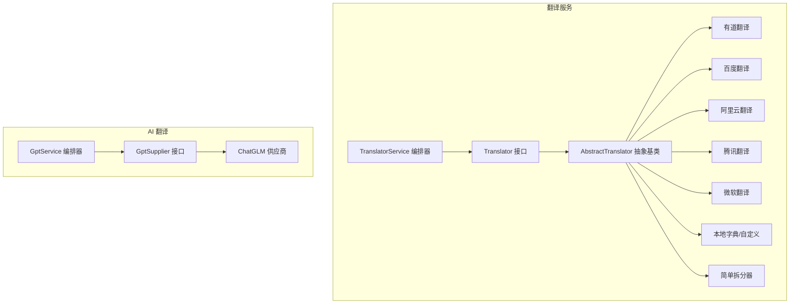
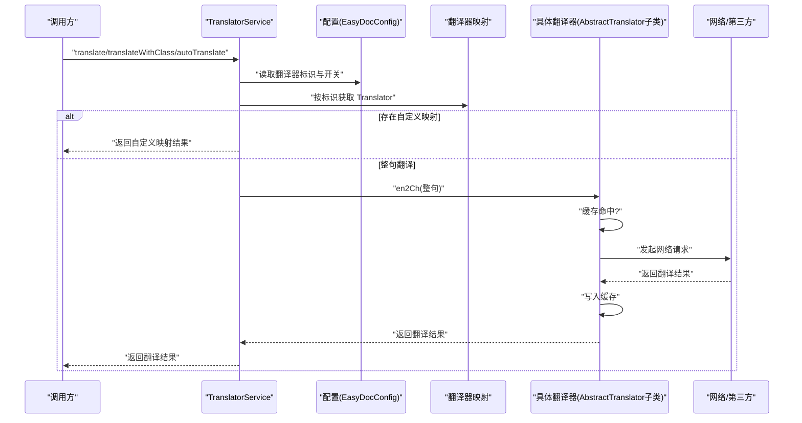
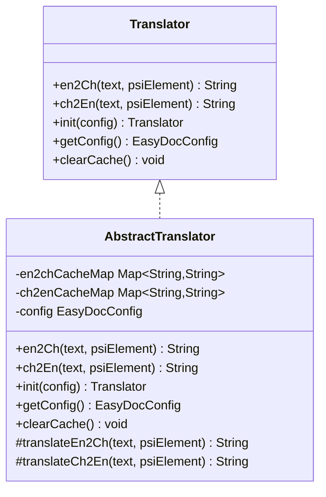
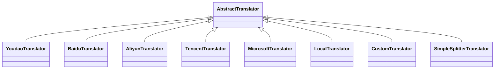
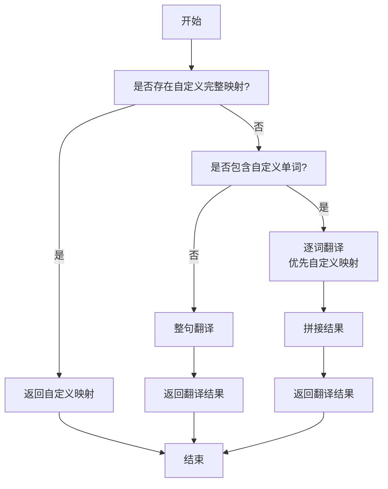
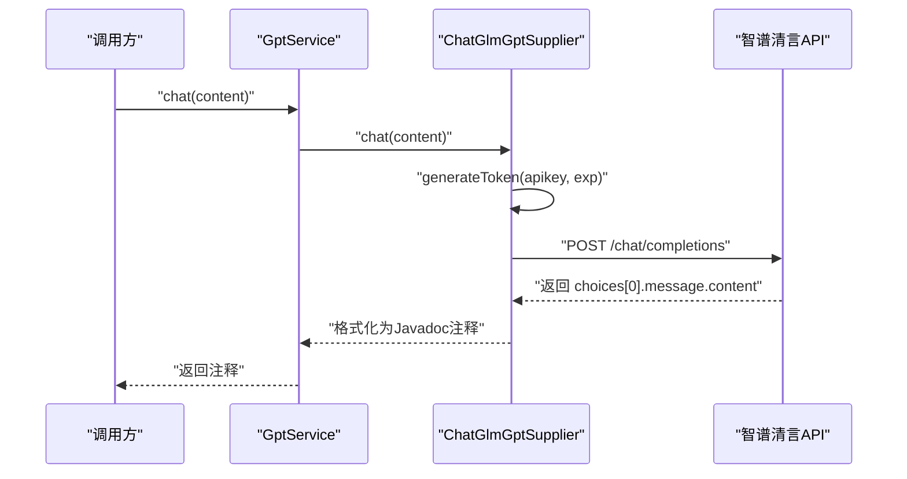
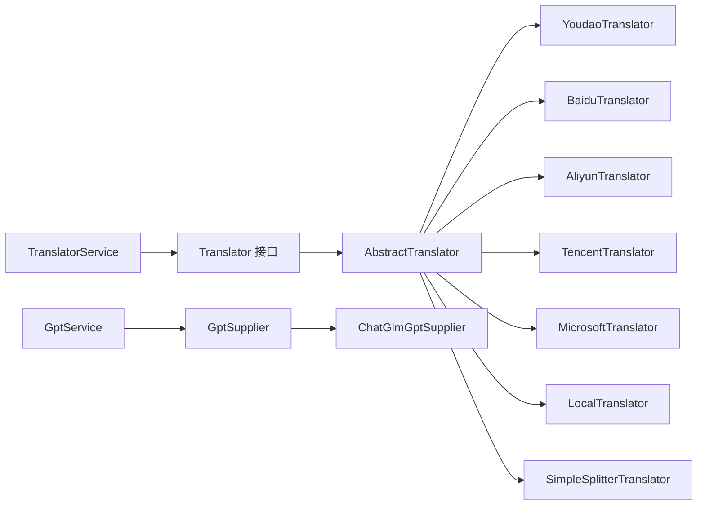

# 翻译服务系统

<cite>
**本文引用的文件**
- [src/main/java/com/star/easydoc/service/translator/Translator.java](file://src/main/java/com/star/easydoc/service/translator/Translator.java)
- [src/main/java/com/star/easydoc/service/translator/TranslatorService.java](file://src/main/java/com/star/easydoc/service/translator/TranslatorService.java)
- [src/main/java/com/star/easydoc/service/translator/impl/AbstractTranslator.java](file://src/main/java/com/star/easydoc/service/translator/impl/AbstractTranslator.java)
- [src/main/java/com/star/easydoc/service/translator/impl/YoudaoTranslator.java](file://src/main/java/com/star/easydoc/service/translator/impl/YoudaoTranslator.java)
- [src/main/java/com/star/easydoc/service/translator/impl/BaiduTranslator.java](file://src/main/java/com/star/easydoc/service/translator/impl/BaiduTranslator.java)
- [src/main/java/com/star/easydoc/service/translator/impl/AliyunTranslator.java](file://src/main/java/com/star/easydoc/service/translator/impl/AliyunTranslator.java)
- [src/main/java/com/star/easydoc/service/translator/impl/TencentTranslator.java](file://src/main/java/com/star/easydoc/service/translator/impl/TencentTranslator.java)
- [src/main/java/com/star/easydoc/service/translator/impl/MicrosoftTranslator.java](file://src/main/java/com/star/easydoc/service/translator/impl/MicrosoftTranslator.java)
- [src/main/java/com/star/easydoc/service/gpt/GptSupplier.java](file://src/main/java/com/star/easydoc/service/gpt/GptSupplier.java)
- [src/main/java/com/star/easydoc/service/gpt/GptService.java](file://src/main/java/com/star/easydoc/service/gpt/GptService.java)
- [src/main/java/com/star/easydoc/service/gpt/impl/ChatGlmGptSupplier.java](file://src/main/java/com/star/easydoc/service/gpt/impl/ChatGlmGptSupplier.java)
- [src/main/resources/prompts/chatglm/class.prompt](file://src/main/resources/prompts/chatglm/class.prompt)
- [src/main/resources/prompts/chatglm/method.prompt](file://src/main/resources/prompts/chatglm/method.prompt)
- [src/main/resources/prompts/chatglm/field.prompt](file://src/main/resources/prompts/chatglm/field.prompt)
- [src/main/resources/prompts/translate.txt](file://src/main/resources/prompts/translate.txt)
</cite>

## 目录
1. [简介](#简介)
2. [项目结构](#项目结构)
3. [核心组件](#核心组件)
4. [架构总览](#架构总览)
5. [详细组件分析](#详细组件分析)
6. [依赖分析](#依赖分析)
7. [性能考虑](#性能考虑)
8. [故障排查指南](#故障排查指南)
9. [结论](#结论)
10. [附录](#附录)

## 简介
本文件面向 Easy Javadoc 插件的翻译服务系统，系统性梳理翻译服务的整体架构与实现要点，涵盖 Translator 接口设计、多翻译器实现策略、翻译缓存机制、AI 翻译（ChatGLM）集成方案、配置管理、错误处理与性能优化，并提供使用示例与最佳实践，帮助用户充分发挥插件的国际化能力。

## 项目结构
翻译服务位于模块路径 com.star.easydoc.service.translator 与 com.star.easydoc.service.gpt 下，采用“接口 + 抽象基类 + 多实现 + 服务编排”的分层设计：
- 接口层：定义统一的翻译能力与生命周期
- 抽象层：封装缓存、初始化、配置注入等通用逻辑
- 实现层：对接各第三方翻译服务或本地/自定义能力
- 服务层：编排选择器、优先级策略、自动翻译与中英互译

图表来源
- [src/main/java/com/star/easydoc/service/translator/Translator.java:13-53](file://src/main/java/com/star/easydoc/service/translator/Translator.java#L13-L53)
- [src/main/java/com/star/easydoc/service/translator/impl/AbstractTranslator.java:14-91](file://src/main/java/com/star/easydoc/service/translator/impl/AbstractTranslator.java#L14-L91)
- [src/main/java/com/star/easydoc/service/translator/TranslatorService.java:41-237](file://src/main/java/com/star/easydoc/service/translator/TranslatorService.java#L41-L237)
- [src/main/java/com/star/easydoc/service/gpt/GptSupplier.java:9-34](file://src/main/java/com/star/easydoc/service/gpt/GptSupplier.java#L9-L34)
- [src/main/java/com/star/easydoc/service/gpt/GptService.java:16-56](file://src/main/java/com/star/easydoc/service/gpt/GptService.java#L16-L56)

章节来源
- [src/main/java/com/star/easydoc/service/translator/Translator.java:1-54](file://src/main/java/com/star/easydoc/service/translator/Translator.java#L1-L54)
- [src/main/java/com/star/easydoc/service/translator/TranslatorService.java:1-238](file://src/main/java/com/star/easydoc/service/translator/TranslatorService.java#L1-L238)
- [src/main/java/com/star/easydoc/service/translator/impl/AbstractTranslator.java:1-92](file://src/main/java/com/star/easydoc/service/translator/impl/AbstractTranslator.java#L1-L92)
- [src/main/java/com/star/easydoc/service/gpt/GptSupplier.java:1-35](file://src/main/java/com/star/easydoc/service/gpt/GptSupplier.java#L1-L35)
- [src/main/java/com/star/easydoc/service/gpt/GptService.java:1-57](file://src/main/java/com/star/easydoc/service/gpt/GptService.java#L1-L57)

## 核心组件
- Translator 接口：定义 en2Ch、ch2En、init、getConfig、clearCache 等能力，统一翻译抽象。
- AbstractTranslator 抽象基类：内置并发安全的英译中/中译英两级缓存，负责缓存命中、调用具体实现、清理缓存。
- TranslatorService：集中注册与编排所有翻译器，提供整句/单词粒度翻译、自动翻译、中英互译、优先级策略（基于配置）。
- GptSupplier/GptService：AI 翻译抽象与编排，当前实现 ChatGLM 供应商，支持令牌签发与请求转发。
- ChatGLM 供应商：基于智谱清言 API 的聊天补全，生成符合 Javadoc 规范的注释文本。

章节来源
- [src/main/java/com/star/easydoc/service/translator/Translator.java:13-53](file://src/main/java/com/star/easydoc/service/translator/Translator.java#L13-L53)
- [src/main/java/com/star/easydoc/service/translator/impl/AbstractTranslator.java:14-91](file://src/main/java/com/star/easydoc/service/translator/impl/AbstractTranslator.java#L14-L91)
- [src/main/java/com/star/easydoc/service/translator/TranslatorService.java:41-237](file://src/main/java/com/star/easydoc/service/translator/TranslatorService.java#L41-L237)
- [src/main/java/com/star/easydoc/service/gpt/GptSupplier.java:9-34](file://src/main/java/com/star/easydoc/service/gpt/GptSupplier.java#L9-L34)
- [src/main/java/com/star/easydoc/service/gpt/GptService.java:16-56](file://src/main/java/com/star/easydoc/service/gpt/GptService.java#L16-L56)
- [src/main/java/com/star/easydoc/service/gpt/impl/ChatGlmGptSupplier.java:23-134](file://src/main/java/com/star/easydoc/service/gpt/impl/ChatGlmGptSupplier.java#L23-L134)

## 架构总览
翻译服务采用“编排器 + 多实现 + 缓存 + 配置驱动”的架构。编排器根据配置选择具体翻译器，先尝试自定义映射，再按单词粒度或整句粒度调用第三方翻译；同时内置缓存提升重复翻译性能。AI 翻译通过 GptService 统一调度，当前对接 ChatGLM。

图表来源
- [src/main/java/com/star/easydoc/service/translator/TranslatorService.java:85-111](file://src/main/java/com/star/easydoc/service/translator/TranslatorService.java#L85-L111)
- [src/main/java/com/star/easydoc/service/translator/impl/AbstractTranslator.java:22-52](file://src/main/java/com/star/easydoc/service/translator/impl/AbstractTranslator.java#L22-L52)

## 详细组件分析

### 接口与抽象基类
- Translator 接口：定义双向翻译与生命周期方法，确保实现的一致性与可扩展性。
- AbstractTranslator：封装缓存（英译中/中译英）、初始化与清理，屏蔽实现细节，降低重复代码。

图表来源
- [src/main/java/com/star/easydoc/service/translator/Translator.java:13-53](file://src/main/java/com/star/easydoc/service/translator/Translator.java#L13-L53)
- [src/main/java/com/star/easydoc/service/translator/impl/AbstractTranslator.java:14-91](file://src/main/java/com/star/easydoc/service/translator/impl/AbstractTranslator.java#L14-L91)

章节来源
- [src/main/java/com/star/easydoc/service/translator/Translator.java:1-54](file://src/main/java/com/star/easydoc/service/translator/Translator.java#L1-L54)
- [src/main/java/com/star/easydoc/service/translator/impl/AbstractTranslator.java:1-92](file://src/main/java/com/star/easydoc/service/translator/impl/AbstractTranslator.java#L1-L92)

### 多翻译器实现策略
- 有道翻译：官方免费接口已停用，保留接口占位并进行一次性通知提示，引导用户使用付费服务。
- 百度翻译：基于 Vip 接口签名与重试机制，处理限流与错误码。
- 阿里云翻译：构造签名头（HMAC-SHA1），封装请求体与响应解析。
- 腾讯翻译：构造签名字符串与签名值，处理限流错误码重试。
- 微软翻译：基于认知服务的 REST API，支持区域键与订阅键。
- 本地字典/自定义：优先级最高，支持整句与单词粒度映射。
- 简单拆分器：按空格拆分单词，逐词翻译后拼接。

图表来源
- [src/main/java/com/star/easydoc/service/translator/impl/YoudaoTranslator.java:22-161](file://src/main/java/com/star/easydoc/service/translator/impl/YoudaoTranslator.java#L22-L161)
- [src/main/java/com/star/easydoc/service/translator/impl/BaiduTranslator.java:21-138](file://src/main/java/com/star/easydoc/service/translator/impl/BaiduTranslator.java#L21-L138)
- [src/main/java/com/star/easydoc/service/translator/impl/AliyunTranslator.java:35-283](file://src/main/java/com/star/easydoc/service/translator/impl/AliyunTranslator.java#L35-L283)
- [src/main/java/com/star/easydoc/service/translator/impl/TencentTranslator.java:27-184](file://src/main/java/com/star/easydoc/service/translator/impl/TencentTranslator.java#L27-L184)
- [src/main/java/com/star/easydoc/service/translator/impl/MicrosoftTranslator.java:22-62](file://src/main/java/com/star/easydoc/service/translator/impl/MicrosoftTranslator.java#L22-L62)

章节来源
- [src/main/java/com/star/easydoc/service/translator/impl/YoudaoTranslator.java:1-161](file://src/main/java/com/star/easydoc/service/translator/impl/YoudaoTranslator.java#L1-L161)
- [src/main/java/com/star/easydoc/service/translator/impl/BaiduTranslator.java:1-138](file://src/main/java/com/star/easydoc/service/translator/impl/BaiduTranslator.java#L1-L138)
- [src/main/java/com/star/easydoc/service/translator/impl/AliyunTranslator.java:1-283](file://src/main/java/com/star/easydoc/service/translator/impl/AliyunTranslator.java#L1-L283)
- [src/main/java/com/star/easydoc/service/translator/impl/TencentTranslator.java:1-184](file://src/main/java/com/star/easydoc/service/translator/impl/TencentTranslator.java#L1-L184)
- [src/main/java/com/star/easydoc/service/translator/impl/MicrosoftTranslator.java:1-62](file://src/main/java/com/star/easydoc/service/translator/impl/MicrosoftTranslator.java#L1-L62)

### 编排器与翻译流程
- 自定义映射优先：若存在完整映射或单词映射，则优先返回映射结果。
- 单词粒度 vs 整句粒度：当存在自定义单词时，逐词翻译并拼接；否则整句翻译以提升准确性。
- 自动翻译：根据配置选择翻译器，执行英译中。
- 中译英：调用对应翻译器后，过滤停用词并格式化为驼峰风格标识符。

图表来源
- [src/main/java/com/star/easydoc/service/translator/TranslatorService.java:85-111](file://src/main/java/com/star/easydoc/service/translator/TranslatorService.java#L85-L111)

章节来源
- [src/main/java/com/star/easydoc/service/translator/TranslatorService.java:1-238](file://src/main/java/com/star/easydoc/service/translator/TranslatorService.java#L1-L238)

### AI 翻译（ChatGLM）集成
- GptSupplier/GptService：定义 AI 问答能力与编排入口，当前仅支持 ChatGLM。
- ChatGLM 供应商：生成 JWT 令牌，构造请求体，调用智谱清言 API，解析返回内容并包裹为 Javadoc 注释。
- 提示词模板：针对类、方法、字段分别提供提示词，保证输出符合 Javadoc 规范。

图表来源
- [src/main/java/com/star/easydoc/service/gpt/GptService.java:48-54](file://src/main/java/com/star/easydoc/service/gpt/GptService.java#L48-L54)
- [src/main/java/com/star/easydoc/service/gpt/impl/ChatGlmGptSupplier.java:31-51](file://src/main/java/com/star/easydoc/service/gpt/impl/ChatGlmGptSupplier.java#L31-L51)

章节来源
- [src/main/java/com/star/easydoc/service/gpt/GptSupplier.java:1-35](file://src/main/java/com/star/easydoc/service/gpt/GptSupplier.java#L1-L35)
- [src/main/java/com/star/easydoc/service/gpt/GptService.java:1-57](file://src/main/java/com/star/easydoc/service/gpt/GptService.java#L1-L57)
- [src/main/java/com/star/easydoc/service/gpt/impl/ChatGlmGptSupplier.java:1-135](file://src/main/java/com/star/easydoc/service/gpt/impl/ChatGlmGptSupplier.java#L1-L135)
- [src/main/resources/prompts/chatglm/class.prompt:1-30](file://src/main/resources/prompts/chatglm/class.prompt#L1-L30)
- [src/main/resources/prompts/chatglm/method.prompt:1-31](file://src/main/resources/prompts/chatglm/method.prompt#L1-L31)
- [src/main/resources/prompts/chatglm/field.prompt:1-20](file://src/main/resources/prompts/chatglm/field.prompt#L1-L20)
- [src/main/resources/prompts/translate.txt:1-2](file://src/main/resources/prompts/translate.txt#L1-L2)

## 依赖分析
- 组件耦合：编排器与具体翻译器通过接口解耦；抽象基类复用缓存与初始化逻辑。
- 外部依赖：HTTP 工具、JSON 解析库、Apache Commons、Guava 等。
- 配置依赖：EasyDocConfig 提供密钥、超时、区域、开关等参数，影响行为与可用性。

图表来源
- [src/main/java/com/star/easydoc/service/translator/TranslatorService.java:60-74](file://src/main/java/com/star/easydoc/service/translator/TranslatorService.java#L60-L74)
- [src/main/java/com/star/easydoc/service/gpt/GptService.java:35-38](file://src/main/java/com/star/easydoc/service/gpt/GptService.java#L35-L38)

章节来源
- [src/main/java/com/star/easydoc/service/translator/TranslatorService.java:1-238](file://src/main/java/com/star/easydoc/service/translator/TranslatorService.java#L1-L238)
- [src/main/java/com/star/easydoc/service/gpt/GptService.java:1-57](file://src/main/java/com/star/easydoc/service/gpt/GptService.java#L1-L57)

## 性能考虑
- 缓存策略：AbstractTranslator 内置英译中/中译英两级缓存，避免重复网络请求，显著降低延迟与成本。
- 重试与限流：百度、腾讯翻译实现指数退避与错误码重试，提高稳定性。
- 粒度选择：整句翻译通常更准确，单词粒度适合存在大量自定义映射的场景。
- 超时控制：各实现均使用配置中的超时参数，避免阻塞。
- 并发安全：缓存使用并发容器，保障多线程环境下的正确性。

章节来源
- [src/main/java/com/star/easydoc/service/translator/impl/AbstractTranslator.java:16-72](file://src/main/java/com/star/easydoc/service/translator/impl/AbstractTranslator.java#L16-L72)
- [src/main/java/com/star/easydoc/service/translator/impl/BaiduTranslator.java:42-62](file://src/main/java/com/star/easydoc/service/translator/impl/BaiduTranslator.java#L42-L62)
- [src/main/java/com/star/easydoc/service/translator/impl/TencentTranslator.java:46-76](file://src/main/java/com/star/easydoc/service/translator/impl/TencentTranslator.java#L46-L76)

## 故障排查指南
- 有道免费接口不可用：接口已被官方停用，系统会触发一次性通知，建议切换到付费版本或其它翻译器。
- 百度/腾讯限流：出现特定错误码时会自动休眠并重试，检查密钥、配额与网络连通性。
- 阿里云鉴权失败：确认 AK、SK、区域与签名算法，检查请求头与时间戳。
- 微软区域/订阅键错误：确认订阅密钥与区域设置，确保网络可达。
- ChatGLM 令牌生成失败：检查 API Key 格式与签名算法，确认时间戳与过期时间。
- 自定义映射无效：确认单词大小写与键集合，必要时转小写匹配。

章节来源
- [src/main/java/com/star/easydoc/service/translator/impl/YoudaoTranslator.java:34-95](file://src/main/java/com/star/easydoc/service/translator/impl/YoudaoTranslator.java#L34-L95)
- [src/main/java/com/star/easydoc/service/translator/impl/BaiduTranslator.java:48-60](file://src/main/java/com/star/easydoc/service/translator/impl/BaiduTranslator.java#L48-L60)
- [src/main/java/com/star/easydoc/service/translator/impl/AliyunTranslator.java:117-153](file://src/main/java/com/star/easydoc/service/translator/impl/AliyunTranslator.java#L117-L153)
- [src/main/java/com/star/easydoc/service/translator/impl/TencentTranslator.java:59-76](file://src/main/java/com/star/easydoc/service/translator/impl/TencentTranslator.java#L59-L76)
- [src/main/java/com/star/easydoc/service/translator/impl/MicrosoftTranslator.java:41-60](file://src/main/java/com/star/easydoc/service/translator/impl/MicrosoftTranslator.java#L41-L60)
- [src/main/java/com/star/easydoc/service/gpt/impl/ChatGlmGptSupplier.java:53-76](file://src/main/java/com/star/easydoc/service/gpt/impl/ChatGlmGptSupplier.java#L53-L76)

## 结论
翻译服务系统通过清晰的接口与抽象层、完善的缓存与重试机制、灵活的编排策略以及可扩展的 AI 集成，为 Easy Javadoc 插件提供了稳定高效的国际化能力。建议在生产环境中优先使用付费翻译服务，结合自定义映射与缓存策略，获得更佳的准确性与时效性。

## 附录
- 使用示例与最佳实践
  - 在设置中选择目标翻译器与开关策略，优先配置付费服务以获得稳定体验。
  - 启用自定义映射以覆盖专有名词与术语，减少整句翻译误差。
  - 对于高频重复词汇，利用内置缓存减少网络请求。
  - 使用 AI 翻译生成符合 Javadoc 规范的注释时，建议配合提示词模板，明确作者与日期等上下文信息。
  - 定期清理缓存以释放内存，或在大规模批量生成时手动触发清理。