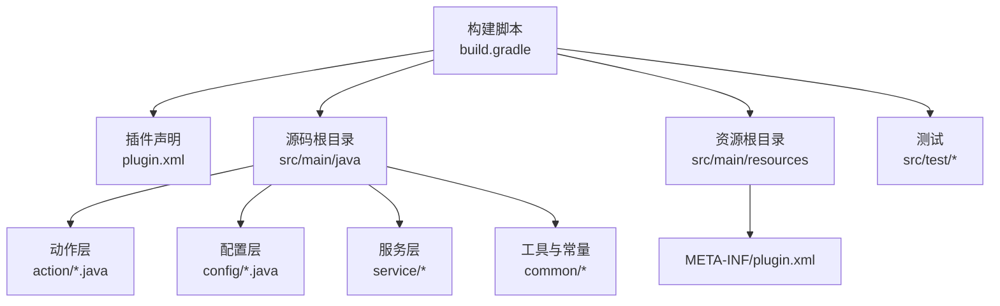
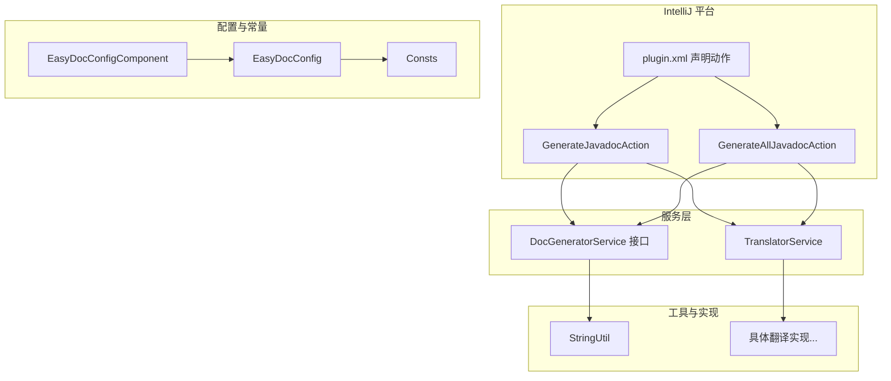
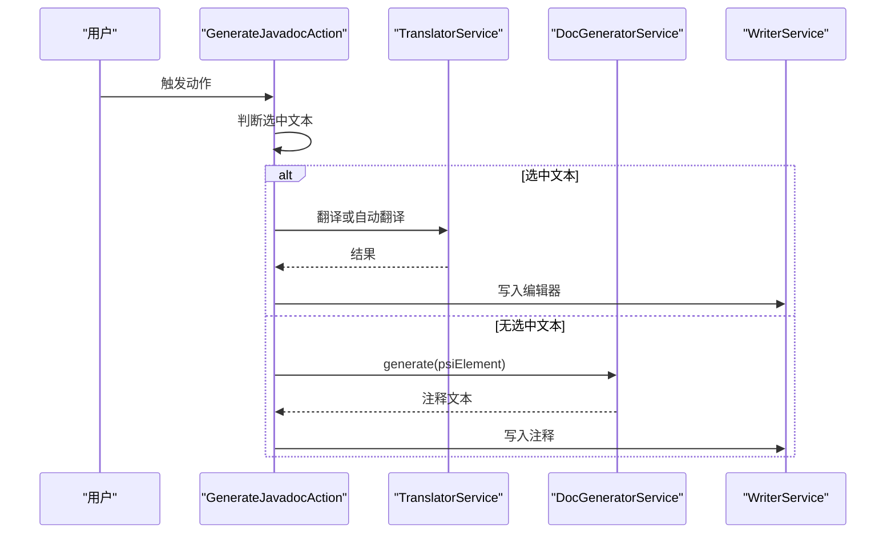
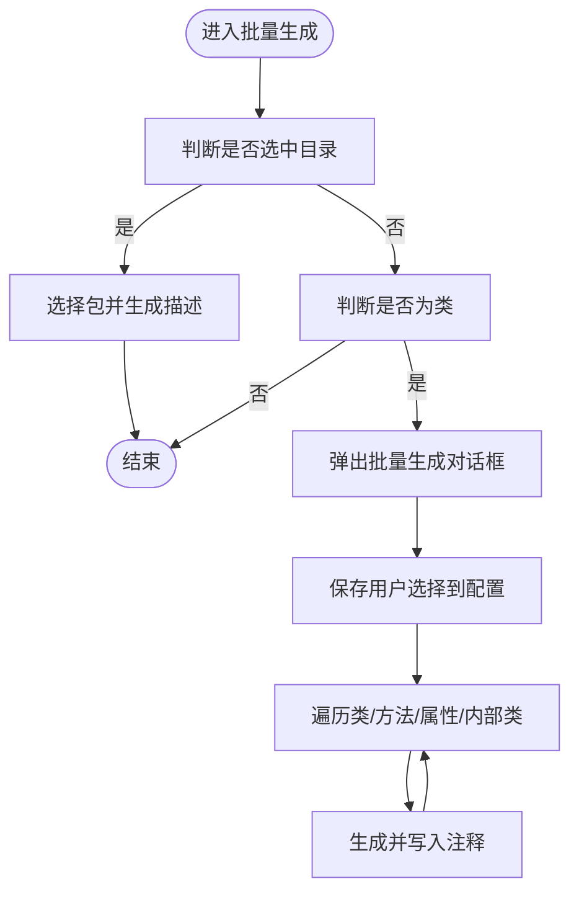
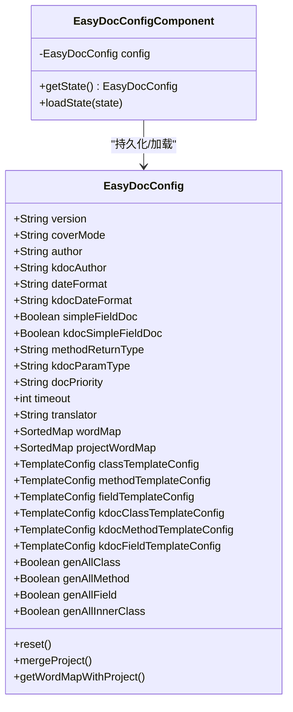
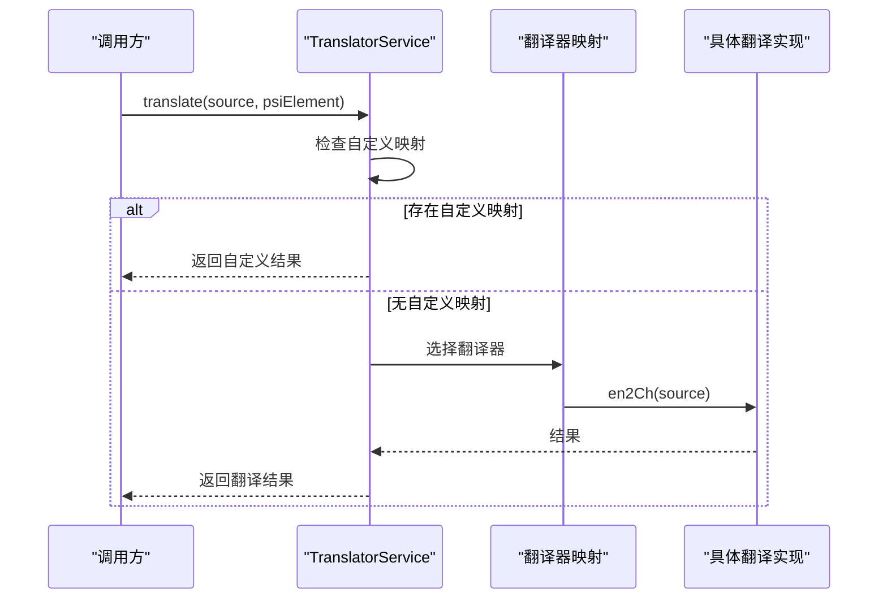
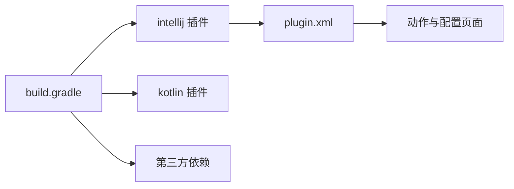

# 贡献指南

<cite>
**本文引用的文件**   
- [README.md](file://README.md)
- [build.gradle](file://build.gradle)
- [settings.gradle](file://settings.gradle)
- [gradle/wrapper/gradle-wrapper.properties](file://gradle/wrapper/gradle-wrapper.properties)
- [src/main/resources/META-INF/plugin.xml](file://src/main/resources/META-INF/plugin.xml)
- [src/main/java/com/star/easydoc/config/EasyDocConfig.java](file://src/main/java/com/star/easydoc/config/EasyDocConfig.java)
- [src/main/java/com/star/easydoc/config/EasyDocConfigComponent.java](file://src/main/java/com/star/easydoc/config/EasyDocConfigComponent.java)
- [src/main/java/com/star/easydoc/action/GenerateJavadocAction.java](file://src/main/java/com/star/easydoc/action/GenerateJavadocAction.java)
- [src/main/java/com/star/easydoc/action/GenerateAllJavadocAction.java](file://src/main/java/com/star/easydoc/action/GenerateAllJavadocAction.java)
- [src/main/java/com/star/easydoc/service/translator/TranslatorService.java](file://src/main/java/com/star/easydoc/service/translator/TranslatorService.java)
- [src/main/java/com/star/easydoc/service/DocGeneratorService.java](file://src/main/java/com/star/easydoc/service/DocGeneratorService.java)
- [src/main/java/com/star/easydoc/common/Consts.java](file://src/main/java/com/star/easydoc/common/Consts.java)
- [src/main/java/com/star/easydoc/common/util/StringUtil.java](file://src/main/java/com/star/easydoc/common/util/StringUtil.java)
- [src/test/java/com/star/easydoc/MainTest.java](file://src/test/java/com/star/easydoc/MainTest.java)
</cite>

## 目录
1. [简介](#简介)
2. [项目结构](#项目结构)
3. [核心组件](#核心组件)
4. [架构总览](#架构总览)
5. [详细组件分析](#详细组件分析)
6. [依赖关系分析](#依赖关系分析)
7. [性能与质量考量](#性能与质量考量)
8. [故障排查指南](#故障排查指南)
9. [贡献流程与规范](#贡献流程与规范)
10. [版本发布与更新计划](#版本发布与更新计划)
11. [社区与联系方式](#社区与联系方式)
12. [结论](#结论)

## 简介
本指南面向希望参与 Easy Javadoc 插件开发与改进的贡献者，涵盖开发环境搭建、代码贡献流程、问题反馈与功能建议提交、Pull Request 流程与代码审查标准、版本发布节奏与更新计划、社区交流渠道以及 Bug 报告模板与最佳实践。目标是帮助你快速上手、高效协作，并确保贡献的质量与一致性。

## 项目结构
该项目为 IntelliJ IDEA 插件工程，采用 Gradle 构建，包含 Java 与 Kotlin 源码、资源文件（含插件声明）、测试用例与文档。核心模块与职责概览：
- 构建与运行配置：Gradle 插件、JDK 版本、仓库与打包任务
- 插件入口与动作：通过 plugin.xml 声明动作与依赖
- 配置持久化：EasyDocConfig 与 EasyDocConfigComponent
- 功能实现：生成注释动作、翻译服务、文档生成服务接口与实现
- 工具与常量：字符串工具、常量定义
- 测试：基础测试入口

图表来源
- [build.gradle:1-78](file://build.gradle#L1-L78)
- [settings.gradle:1-3](file://settings.gradle#L1-L3)
- [src/main/resources/META-INF/plugin.xml:1-82](file://src/main/resources/META-INF/plugin.xml#L1-L82)

章节来源
- [build.gradle:1-78](file://build.gradle#L1-L78)
- [settings.gradle:1-3](file://settings.gradle#L1-L3)
- [src/main/resources/META-INF/plugin.xml:1-82](file://src/main/resources/META-INF/plugin.xml#L1-L82)

## 核心组件
- 动作 Action
  - 生成单个注释：GenerateJavadocAction
  - 批量生成注释：GenerateAllJavadocAction
- 配置 Config
  - EasyDocConfig：集中管理模板、变量、翻译、覆盖策略等
  - EasyDocConfigComponent：持久化组件，负责初始化与加载
- 服务 Service
  - DocGeneratorService：文档生成接口
  - TranslatorService：统一翻译入口，聚合多种翻译实现
- 工具与常量
  - Consts：常量与可用翻译集合
  - StringUtil：字符串处理工具

章节来源
- [src/main/java/com/star/easydoc/action/GenerateJavadocAction.java:1-175](file://src/main/java/com/star/easydoc/action/GenerateJavadocAction.java#L1-L175)
- [src/main/java/com/star/easydoc/action/GenerateAllJavadocAction.java:1-218](file://src/main/java/com/star/easydoc/action/GenerateAllJavadocAction.java#L1-L218)
- [src/main/java/com/star/easydoc/config/EasyDocConfig.java:1-680](file://src/main/java/com/star/easydoc/config/EasyDocConfig.java#L1-L680)
- [src/main/java/com/star/easydoc/config/EasyDocConfigComponent.java:1-69](file://src/main/java/com/star/easydoc/config/EasyDocConfigComponent.java#L1-L69)
- [src/main/java/com/star/easydoc/service/DocGeneratorService.java:1-21](file://src/main/java/com/star/easydoc/service/DocGeneratorService.java#L1-L21)
- [src/main/java/com/star/easydoc/service/translator/TranslatorService.java:1-238](file://src/main/java/com/star/easydoc/service/translator/TranslatorService.java#L1-L238)
- [src/main/java/com/star/easydoc/common/Consts.java:1-100](file://src/main/java/com/star/easydoc/common/Consts.java#L1-L100)
- [src/main/java/com/star/easydoc/common/util/StringUtil.java:1-72](file://src/main/java/com/star/easydoc/common/util/StringUtil.java#L1-L72)

## 架构总览
插件通过 IntelliJ 平台的动作系统触发，根据当前 PSI 元素类型（Java/Kotlin）调用对应的生成服务；翻译服务根据配置选择具体实现；最终由写入服务将注释写回源码。

图表来源
- [src/main/resources/META-INF/plugin.xml:1-82](file://src/main/resources/META-INF/plugin.xml#L1-L82)
- [src/main/java/com/star/easydoc/action/GenerateJavadocAction.java:1-175](file://src/main/java/com/star/easydoc/action/GenerateJavadocAction.java#L1-L175)
- [src/main/java/com/star/easydoc/action/GenerateAllJavadocAction.java:1-218](file://src/main/java/com/star/easydoc/action/GenerateAllJavadocAction.java#L1-L218)
- [src/main/java/com/star/easydoc/config/EasyDocConfig.java:1-680](file://src/main/java/com/star/easydoc/config/EasyDocConfig.java#L1-L680)
- [src/main/java/com/star/easydoc/config/EasyDocConfigComponent.java:1-69](file://src/main/java/com/star/easydoc/config/EasyDocConfigComponent.java#L1-L69)
- [src/main/java/com/star/easydoc/service/translator/TranslatorService.java:1-238](file://src/main/java/com/star/easydoc/service/translator/TranslatorService.java#L1-L238)
- [src/main/java/com/star/easydoc/common/Consts.java:1-100](file://src/main/java/com/star/easydoc/common/Consts.java#L1-L100)
- [src/main/java/com/star/easydoc/common/util/StringUtil.java:1-72](file://src/main/java/com/star/easydoc/common/util/StringUtil.java#L1-L72)

## 详细组件分析

### 动作：GenerateJavadocAction
- 职责：响应快捷键，区分“选中文本翻译”与“生成注释”，支持 Java 与 Kotlin
- 关键流程：
  - 选中文本时，按语言判定并调用翻译或弹出翻译结果
  - 否则根据 PSI 文件类型调用对应生成服务，再写回注释

图表来源
- [src/main/java/com/star/easydoc/action/GenerateJavadocAction.java:71-175](file://src/main/java/com/star/easydoc/action/GenerateJavadocAction.java#L71-L175)
- [src/main/java/com/star/easydoc/service/translator/TranslatorService.java:157-163](file://src/main/java/com/star/easydoc/service/translator/TranslatorService.java#L157-L163)
- [src/main/java/com/star/easydoc/service/DocGeneratorService.java:11-21](file://src/main/java/com/star/easydoc/service/DocGeneratorService.java#L11-L21)

章节来源
- [src/main/java/com/star/easydoc/action/GenerateJavadocAction.java:1-175](file://src/main/java/com/star/easydoc/action/GenerateJavadocAction.java#L1-L175)

### 动作：GenerateAllJavadocAction
- 职责：批量生成注释，支持选择生成范围（类/方法/属性/内部类），并处理 package-info 场景
- 关键流程：
  - 弹出选择面板，记录用户选择
  - 遍历目标元素，逐个生成并写入

图表来源
- [src/main/java/com/star/easydoc/action/GenerateAllJavadocAction.java:59-218](file://src/main/java/com/star/easydoc/action/GenerateAllJavadocAction.java#L59-L218)

章节来源
- [src/main/java/com/star/easydoc/action/GenerateAllJavadocAction.java:1-218](file://src/main/java/com/star/easydoc/action/GenerateAllJavadocAction.java#L1-L218)

### 配置：EasyDocConfig 与 EasyDocConfigComponent
- EasyDocConfig：集中存储作者、日期格式、模板配置、覆盖模式、翻译配置、单词映射、超时等
- EasyDocConfigComponent：实现 PersistentStateComponent，负责默认初始化与状态加载

图表来源
- [src/main/java/com/star/easydoc/config/EasyDocConfig.java:22-680](file://src/main/java/com/star/easydoc/config/EasyDocConfig.java#L22-L680)
- [src/main/java/com/star/easydoc/config/EasyDocConfigComponent.java:20-69](file://src/main/java/com/star/easydoc/config/EasyDocConfigComponent.java#L20-L69)

章节来源
- [src/main/java/com/star/easydoc/config/EasyDocConfig.java:1-680](file://src/main/java/com/star/easydoc/config/EasyDocConfig.java#L1-L680)
- [src/main/java/com/star/easydoc/config/EasyDocConfigComponent.java:1-69](file://src/main/java/com/star/easydoc/config/EasyDocConfigComponent.java#L1-L69)

### 翻译服务：TranslatorService
- 职责：根据配置选择具体翻译实现，支持整句与单词粒度翻译，支持自定义映射优先
- 关键流程：
  - 初始化翻译器映射
  - translate/translateWithClass/autoTranslate/translateCh2En 等

图表来源
- [src/main/java/com/star/easydoc/service/translator/TranslatorService.java:85-111](file://src/main/java/com/star/easydoc/service/translator/TranslatorService.java#L85-L111)
- [src/main/java/com/star/easydoc/service/translator/TranslatorService.java:157-163](file://src/main/java/com/star/easydoc/service/translator/TranslatorService.java#L157-L163)

章节来源
- [src/main/java/com/star/easydoc/service/translator/TranslatorService.java:1-238](file://src/main/java/com/star/easydoc/service/translator/TranslatorService.java#L1-L238)

### 工具与常量：Consts 与 StringUtil
- Consts：定义可用翻译类型、AI 翻译集合、默认日期格式、停止词等
- StringUtil：提供单词分割、统计结尾字符数量等工具方法

章节来源
- [src/main/java/com/star/easydoc/common/Consts.java:1-100](file://src/main/java/com/star/easydoc/common/Consts.java#L1-L100)
- [src/main/java/com/star/easydoc/common/util/StringUtil.java:1-72](file://src/main/java/com/star/easydoc/common/util/StringUtil.java#L1-L72)

## 依赖关系分析
- 构建与运行
  - Gradle 插件：intellij、kotlin、maven-publish
  - JDK：17
  - 插件平台版本：2023.1
  - 依赖：fastjson2、java-jwt
- 插件声明
  - 在 plugin.xml 中注册应用服务、配置页面、动作与快捷键

图表来源
- [build.gradle:1-78](file://build.gradle#L1-L78)
- [src/main/resources/META-INF/plugin.xml:1-82](file://src/main/resources/META-INF/plugin.xml#L1-L82)

章节来源
- [build.gradle:1-78](file://build.gradle#L1-L78)
- [src/main/resources/META-INF/plugin.xml:1-82](file://src/main/resources/META-INF/plugin.xml#L1-L82)

## 性能与质量考量
- 翻译性能
  - 整句翻译通常优于单词粒度，但需权衡自定义映射命中率
  - 可配置超时与缓存清理接口（见配置与服务）
- 写入性能
  - 批量生成时建议按元素逐一处理，避免阻塞 UI
- 代码质量
  - 统一使用 UTF-8 编码
  - 保持配置与服务的单一职责，便于扩展与测试

[本节为通用建议，无需特定文件引用]

## 故障排查指南
- 快捷键无效
  - 确认光标位于类/方法/属性上，而非选中文本或鼠标点击
  - 检查 IDE 快捷键冲突
- 单行注释不生效
  - 修改 IDE 格式化设置，避免将单行注释转为多行
- Javadoc 标签顺序被重排
  - 关闭 IDE 的 Javadoc 格式化以保留自定义顺序
- 翻译额度与配置
  - 各翻译平台均有免费额度，需自行申请密钥
- 版本与兼容性
  - 最低支持 IDEA 版本与插件版本可在构建脚本与插件声明中确认

章节来源
- [README.md:71-85](file://README.md#L71-L85)
- [build.gradle:51-56](file://build.gradle#L51-L56)
- [src/main/resources/META-INF/plugin.xml:25-25](file://src/main/resources/META-INF/plugin.xml#L25-L25)

## 贡献流程与规范

### 开发环境搭建
- 环境要求
  - JDK 17
  - IntelliJ IDEA 2023.1 或以上
  - Gradle 8.14
- 步骤
  - 克隆仓库并导入为 Gradle 项目
  - 同步 Gradle Wrapper 与依赖
  - 运行插件（开发模式）

章节来源
- [build.gradle:15-19](file://build.gradle#L15-L19)
- [build.gradle:51-56](file://build.gradle#L51-L56)
- [gradle/wrapper/gradle-wrapper.properties:1-7](file://gradle/wrapper/gradle-wrapper.properties#L1-L7)

### 代码贡献流程
- 分支策略
  - 建议从主分支创建特性分支进行开发
- 提交规范
  - 提交信息清晰描述变更目的与影响
  - 遵循现有代码风格（见下一节）
- 测试
  - 新增功能应配套单元测试
  - 在本地验证插件运行与注释生成效果

章节来源
- [src/test/java/com/star/easydoc/MainTest.java:1-18](file://src/test/java/com/star/easydoc/MainTest.java#L1-L18)

### 代码规范
- 编码与语言
  - 统一使用 UTF-8
  - Java 与 Kotlin 混合项目，保持一致的命名与缩进
- 设计原则
  - 单一职责、高内聚低耦合
  - 配置与逻辑分离（配置集中在 EasyDocConfig）
  - 服务接口抽象（DocGeneratorService）
- 常量与配置
  - 常量集中于 Consts
  - 配置项通过 EasyDocConfigComponent 持久化

章节来源
- [build.gradle:25-26](file://build.gradle#L25-L26)
- [src/main/java/com/star/easydoc/common/Consts.java:1-100](file://src/main/java/com/star/easydoc/common/Consts.java#L1-L100)
- [src/main/java/com/star/easydoc/config/EasyDocConfig.java:1-680](file://src/main/java/com/star/easydoc/config/EasyDocConfig.java#L1-L680)

### Pull Request 流程
- 准备工作
  - 在特性分支完成开发与测试
  - 更新相关文档与变更说明
- 提交 PR
  - 清晰描述变更内容、动机与风险
  - 关联相关 Issue
- 代码审查
  - 关注点：设计合理性、性能影响、兼容性、测试覆盖
  - 遵循团队约定的审查意见

[本节为通用流程说明，无需特定文件引用]

### 问题反馈与功能建议
- 提交 Issue 前
  - 搜索历史 Issue，避免重复
  - 明确复现步骤、期望行为与实际行为
- Issue 模板建议
  - 环境信息：IDEA 版本、插件版本、操作系统
  - 复现步骤：最小可复现工程或步骤
  - 日志与截图：有助于定位问题
- 功能建议
  - 说明背景、收益与可能的影响
  - 如可提供草图或伪实现更佳

[本节为通用流程说明，无需特定文件引用]

### 贡献者认可
- 贡献者列表与致谢在 README 中维护
- 欢迎在贡献中署名并标注贡献内容

章节来源
- [README.md:252-256](file://README.md#L252-L256)

## 版本发布与更新计划
- 发布节奏
  - 基于功能与修复的累积进行版本发布
- 版本号与兼容性
  - 版本号在构建脚本中维护
  - 最低支持 IDEA 版本在构建脚本与插件声明中明确
- 更新日志
  - 变更记录在 README 中维护，包含功能、修复与兼容性说明

章节来源
- [build.gradle:12-13](file://build.gradle#L12-L13)
- [build.gradle:51-56](file://build.gradle#L51-L56)
- [src/main/resources/META-INF/plugin.xml:25-25](file://src/main/resources/META-INF/plugin.xml#L25-L25)
- [README.md:86-250](file://README.md#L86-L250)

## 社区与联系方式
- 交流群
  - 一群：733688083（已满）
  - 二群：897895558
- 视频教程与使用说明
  - README 中提供视频教程链接与使用说明
- 问题反馈
  - 通过 GitHub Issues 提交 Bug 与建议

章节来源
- [README.md:1-5](file://README.md#L1-L5)
- [README.md:21-24](file://README.md#L21-L24)

## 结论
本指南提供了从环境搭建到贡献流程、从架构理解到问题反馈的完整路径。建议贡献者在提交前充分阅读相关模块源码与配置，确保变更与既有设计一致，并提供充分的测试与文档说明。期待你的贡献让 Easy Javadoc 更好用、更稳定、更易扩展。