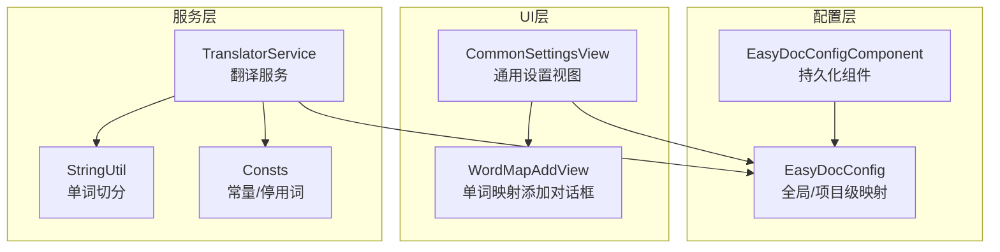
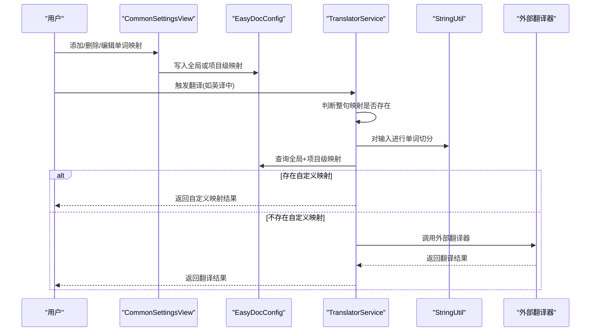
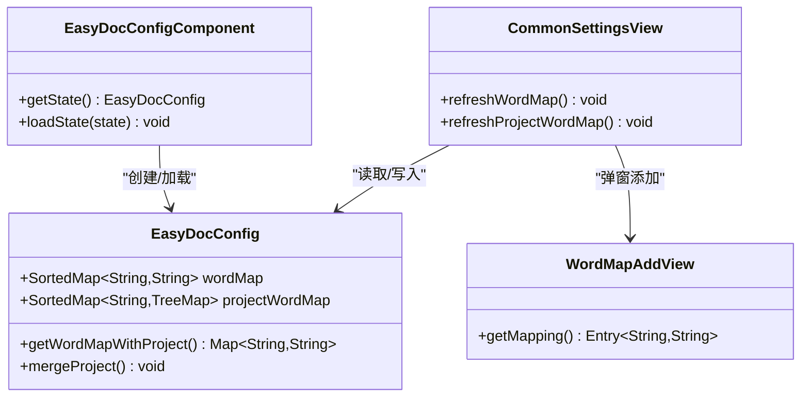
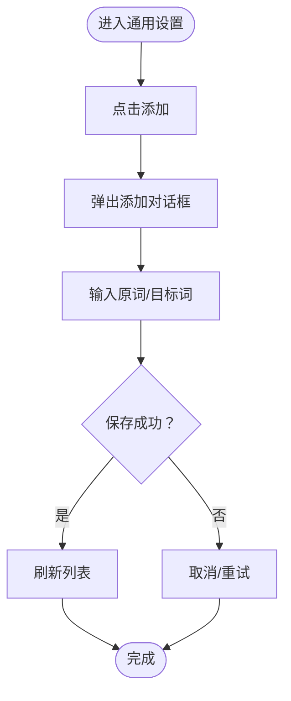
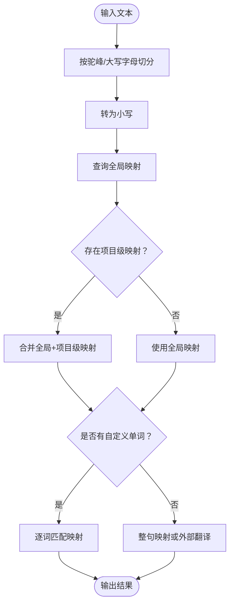
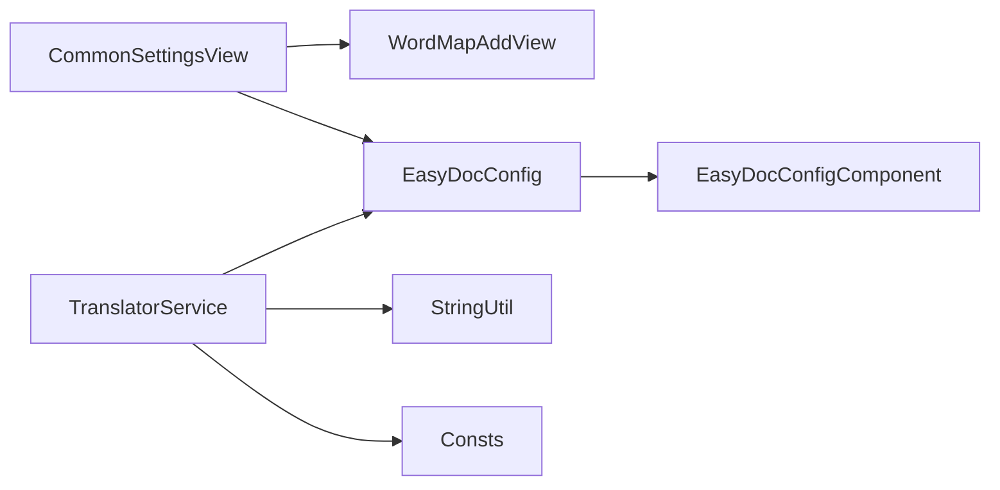

# 单词映射配置

<cite>
**本文引用的文件**
- [EasyDocConfig.java](file://src/main/java/com/star/easydoc/config/EasyDocConfig.java)
- [EasyDocConfigComponent.java](file://src/main/java/com/star/easydoc/config/EasyDocConfigComponent.java)
- [CommonSettingsView.java](file://src/main/java/com/star/easydoc/view/settings/CommonSettingsView.java)
- [WordMapAddView.java](file://src/main/java/com/star/easydoc/view/inner/WordMapAddView.java)
- [TranslatorService.java](file://src/main/java/com/star/easydoc/service/translator/TranslatorService.java)
- [StringUtil.java](file://src/main/java/com/star/easydoc/common/util/StringUtil.java)
- [Consts.java](file://src/main/java/com/star/easydoc/common/Consts.java)
- [README.md](file://README.md)
</cite>

## 目录
1. [简介](#简介)
2. [项目结构](#项目结构)
3. [核心组件](#核心组件)
4. [架构总览](#架构总览)
5. [详细组件分析](#详细组件分析)
6. [依赖分析](#依赖分析)
7. [性能考虑](#性能考虑)
8. [故障排查指南](#故障排查指南)
9. [结论](#结论)
10. [附录](#附录)

## 简介
本指南围绕 Easy Javadoc 插件的“单词映射”功能，系统讲解如何配置与使用全局单词映射与项目级单词映射，涵盖添加、编辑、删除操作流程；解释映射规则与优先级；阐述单词映射在文档生成与翻译中的作用；并提供常用示例与最佳实践及维护更新策略。

## 项目结构
单词映射功能涉及以下关键模块：
- 配置层：持久化配置与组件加载
- UI 层：通用设置界面中的单词映射管理
- 服务层：翻译服务对单词映射的使用
- 工具层：字符串切分与常量定义

图表来源
- [EasyDocConfig.java:138-144](file://src/main/java/com/star/easydoc/config/EasyDocConfig.java#L138-L144)
- [EasyDocConfigComponent.java:19-69](file://src/main/java/com/star/easydoc/config/EasyDocConfigComponent.java#L19-L69)
- [CommonSettingsView.java:491-541](file://src/main/java/com/star/easydoc/view/settings/CommonSettingsView.java#L491-L541)
- [WordMapAddView.java:16-51](file://src/main/java/com/star/easydoc/view/inner/WordMapAddView.java#L16-L51)
- [TranslatorService.java:85-111](file://src/main/java/com/star/easydoc/service/translator/TranslatorService.java#L85-L111)
- [StringUtil.java:40-45](file://src/main/java/com/star/easydoc/common/util/StringUtil.java#L40-L45)
- [Consts.java:24-25](file://src/main/java/com/star/easydoc/common/Consts.java#L24-L25)

章节来源
- [EasyDocConfig.java:138-144](file://src/main/java/com/star/easydoc/config/EasyDocConfig.java#L138-L144)
- [CommonSettingsView.java:491-541](file://src/main/java/com/star/easydoc/view/settings/CommonSettingsView.java#L491-L541)

## 核心组件
- 全局单词映射：存储于配置对象的全局映射表，适用于所有项目。
- 项目级单词映射：按项目维度存储的映射表，仅在对应项目内生效。
- 翻译服务：在翻译过程中优先使用单词映射，再调用外部翻译器。
- UI 管理：通过通用设置界面提供添加、删除、查看单词映射的操作入口。

章节来源
- [EasyDocConfig.java:138-144](file://src/main/java/com/star/easydoc/config/EasyDocConfig.java#L138-L144)
- [EasyDocConfig.java:433-450](file://src/main/java/com/star/easydoc/config/EasyDocConfig.java#L433-L450)
- [CommonSettingsView.java:491-541](file://src/main/java/com/star/easydoc/view/settings/CommonSettingsView.java#L491-L541)
- [TranslatorService.java:85-111](file://src/main/java/com/star/easydoc/service/translator/TranslatorService.java#L85-L111)

## 架构总览
单词映射在翻译流程中的作用链路如下：

图表来源
- [CommonSettingsView.java:491-541](file://src/main/java/com/star/easydoc/view/settings/CommonSettingsView.java#L491-L541)
- [TranslatorService.java:85-111](file://src/main/java/com/star/easydoc/service/translator/TranslatorService.java#L85-L111)
- [TranslatorService.java:213-220](file://src/main/java/com/star/easydoc/service/translator/TranslatorService.java#L213-L220)
- [StringUtil.java:40-45](file://src/main/java/com/star/easydoc/common/util/StringUtil.java#L40-L45)
- [EasyDocConfig.java:433-450](file://src/main/java/com/star/easydoc/config/EasyDocConfig.java#L433-L450)

## 详细组件分析

### 全局单词映射与项目级单词映射
- 数据结构
  - 全局映射：使用有序映射存储，键为源词（小写），值为目标词。
  - 项目级映射：以项目名为键，映射表为值的嵌套映射。
- 合并策略
  - 获取合并后的映射时，先加入全局映射，再叠加当前项目的项目级映射，后者优先覆盖同键值。
- 初始化与持久化
  - 配置组件负责初始化默认值与持久化加载。
  - 项目级映射在项目打开时自动补齐缺失的项目键。

图表来源
- [EasyDocConfig.java:138-144](file://src/main/java/com/star/easydoc/config/EasyDocConfig.java#L138-L144)
- [EasyDocConfig.java:433-450](file://src/main/java/com/star/easydoc/config/EasyDocConfig.java#L433-L450)
- [EasyDocConfigComponent.java:19-69](file://src/main/java/com/star/easydoc/config/EasyDocConfigComponent.java#L19-L69)
- [CommonSettingsView.java:491-541](file://src/main/java/com/star/easydoc/view/settings/CommonSettingsView.java#L491-L541)
- [WordMapAddView.java:48-50](file://src/main/java/com/star/easydoc/view/inner/WordMapAddView.java#L48-L50)

章节来源
- [EasyDocConfig.java:138-144](file://src/main/java/com/star/easydoc/config/EasyDocConfig.java#L138-L144)
- [EasyDocConfig.java:433-450](file://src/main/java/com/star/easydoc/config/EasyDocConfig.java#L433-L450)
- [EasyDocConfigComponent.java:19-69](file://src/main/java/com/star/easydoc/config/EasyDocConfigComponent.java#L19-L69)
- [CommonSettingsView.java:491-541](file://src/main/java/com/star/easydoc/view/settings/CommonSettingsView.java#L491-L541)
- [WordMapAddView.java:48-50](file://src/main/java/com/star/easydoc/view/inner/WordMapAddView.java#L48-L50)

### 添加、编辑、删除操作流程
- 添加
  - 在通用设置界面点击“添加”，弹出单词映射添加对话框。
  - 输入原词与目标词，保存后刷新列表。
- 编辑
  - 通过删除旧项并添加新项的方式实现“编辑”。
- 删除
  - 在列表中选择条目，点击“删除”。

图表来源
- [CommonSettingsView.java:491-508](file://src/main/java/com/star/easydoc/view/settings/CommonSettingsView.java#L491-L508)
- [WordMapAddView.java:36-46](file://src/main/java/com/star/easydoc/view/inner/WordMapAddView.java#L36-L46)

章节来源
- [CommonSettingsView.java:491-508](file://src/main/java/com/star/easydoc/view/settings/CommonSettingsView.java#L491-L508)
- [WordMapAddView.java:36-46](file://src/main/java/com/star/easydoc/view/inner/WordMapAddView.java#L36-L46)

### 映射规则与优先级
- 规则
  - 键一律转为小写存储与匹配。
  - 支持整句映射与单词粒度映射。
- 优先级
  - 整句映射优先于单词粒度映射。
  - 项目级映射优先于全局映射（同键时后者覆盖前者）。
- 切词策略
  - 使用正则将驼峰式命名拆分为单词，并统一转为小写。

图表来源
- [TranslatorService.java:85-111](file://src/main/java/com/star/easydoc/service/translator/TranslatorService.java#L85-L111)
- [TranslatorService.java:213-220](file://src/main/java/com/star/easydoc/service/translator/TranslatorService.java#L213-L220)
- [StringUtil.java:40-45](file://src/main/java/com/star/easydoc/common/util/StringUtil.java#L40-L45)
- [EasyDocConfig.java:433-450](file://src/main/java/com/star/easydoc/config/EasyDocConfig.java#L433-L450)

章节来源
- [TranslatorService.java:85-111](file://src/main/java/com/star/easydoc/service/translator/TranslatorService.java#L85-L111)
- [TranslatorService.java:213-220](file://src/main/java/com/star/easydoc/service/translator/TranslatorService.java#L213-L220)
- [StringUtil.java:40-45](file://src/main/java/com/star/easydoc/common/util/StringUtil.java#L40-L45)
- [EasyDocConfig.java:433-450](file://src/main/java/com/star/easydoc/config/EasyDocConfig.java#L433-L450)

### 在文档生成中的作用
- 术语统一：通过映射确保同一术语在不同上下文中保持一致。
- 专业词汇翻译：对特定领域术语提供稳定翻译，避免机器翻译偏差。
- 与现有注释融合：在“智能合并”模式下，保留已有注释并仅补充缺失标签。

章节来源
- [README.md:39-39](file://README.md#L39-L39)
- [AbstractDocGenerator.java:29-71](file://src/main/java/com/star/easydoc/javadoc/service/generator/impl/AbstractDocGenerator.java#L29-L71)

## 依赖分析
- 配置依赖
  - EasyDocConfig 提供全局与项目级映射的存储与合并逻辑。
  - EasyDocConfigComponent 负责配置的初始化与持久化。
- UI 依赖
  - CommonSettingsView 负责单词映射的增删改查与界面刷新。
  - WordMapAddView 提供输入校验与映射条目构建。
- 服务依赖
  - TranslatorService 在翻译时优先使用映射，再调用外部翻译器。
  - StringUtil 提供单词切分能力。
  - Consts 提供停用词等常量。

图表来源
- [CommonSettingsView.java:491-541](file://src/main/java/com/star/easydoc/view/settings/CommonSettingsView.java#L491-L541)
- [WordMapAddView.java:16-51](file://src/main/java/com/star/easydoc/view/inner/WordMapAddView.java#L16-L51)
- [EasyDocConfig.java:138-144](file://src/main/java/com/star/easydoc/config/EasyDocConfig.java#L138-L144)
- [EasyDocConfigComponent.java:19-69](file://src/main/java/com/star/easydoc/config/EasyDocConfigComponent.java#L19-L69)
- [TranslatorService.java:85-111](file://src/main/java/com/star/easydoc/service/translator/TranslatorService.java#L85-L111)
- [StringUtil.java:40-45](file://src/main/java/com/star/easydoc/common/util/StringUtil.java#L40-L45)
- [Consts.java:24-25](file://src/main/java/com/star/easydoc/common/Consts.java#L24-L25)

章节来源
- [CommonSettingsView.java:491-541](file://src/main/java/com/star/easydoc/view/settings/CommonSettingsView.java#L491-L541)
- [EasyDocConfig.java:138-144](file://src/main/java/com/star/easydoc/config/EasyDocConfig.java#L138-L144)
- [TranslatorService.java:85-111](file://src/main/java/com/star/easydoc/service/translator/TranslatorService.java#L85-L111)

## 性能考虑
- 映射查找
  - 使用有序映射与小写键，查找复杂度为 O(log n)。
- 切词与匹配
  - 切词与匹配为线性扫描，建议控制映射规模以减少匹配开销。
- 外部翻译
  - 仅在无映射时才调用外部翻译器，减少网络请求次数。

## 故障排查指南
- 添加失败
  - 检查输入是否为空；确认对话框校验提示。
- 未生效
  - 确认是否选择了正确的项目；项目级映射仅在对应项目内生效。
  - 检查是否启用了“仅翻译”模式，该模式会跳过注释读取。
- 优先级问题
  - 项目级映射会覆盖全局映射；若未覆盖，请检查键是否大小写一致（键统一小写）。

章节来源
- [WordMapAddView.java:36-46](file://src/main/java/com/star/easydoc/view/inner/WordMapAddView.java#L36-L46)
- [CommonSettingsView.java:522-540](file://src/main/java/com/star/easydoc/view/settings/CommonSettingsView.java#L522-L540)
- [TranslatorService.java:119-148](file://src/main/java/com/star/easydoc/service/translator/TranslatorService.java#L119-L148)

## 结论
单词映射是 Easy Javadoc 插件提升翻译质量与术语一致性的重要手段。通过合理配置全局与项目级映射，并遵循键的小写规则与优先级策略，可在文档生成与翻译场景中获得稳定、可控的结果。建议团队建立映射维护规范，定期更新与审核映射表，确保跨项目的一致性。

## 附录

### 常用单词映射示例与最佳实践
- 示例
  - 技术术语：如“repository”映射为“仓库”、“controller”映射为“控制器”。
  - 业务词汇：如“userId”映射为“用户标识”、“orderStatus”映射为“订单状态”。
- 最佳实践
  - 统一键风格：全部使用小写，避免大小写差异导致的匹配失败。
  - 项目隔离：将项目特有的术语放入项目级映射，避免污染全局。
  - 逐步完善：从高频术语开始，逐步扩展映射范围。
  - 定期评审：结合实际生成结果与团队反馈，持续优化映射表。

章节来源
- [README.md:39-39](file://README.md#L39-L39)
- [EasyDocConfig.java:433-450](file://src/main/java/com/star/easydoc/config/EasyDocConfig.java#L433-L450)

### 维护与更新策略
- 新增
  - 在通用设置界面添加映射；对于项目特有术语，使用项目级映射。
- 编辑
  - 通过删除旧映射并新增新映射的方式实现编辑。
- 删除
  - 在列表中选择条目并删除；注意项目级映射仅影响当前项目。
- 导入导出
  - 可通过插件提供的导入导出功能迁移映射配置，便于团队共享与备份。

章节来源
- [CommonSettingsView.java:491-541](file://src/main/java/com/star/easydoc/view/settings/CommonSettingsView.java#L491-L541)
- [README.md:18-18](file://README.md#L18-L18)