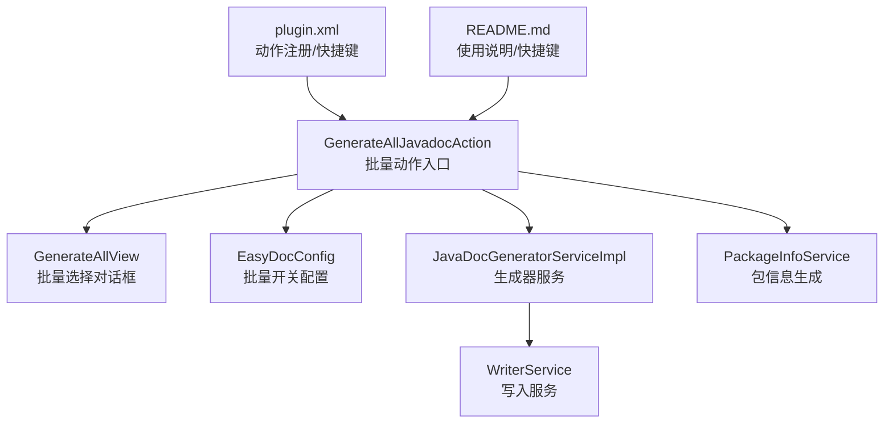
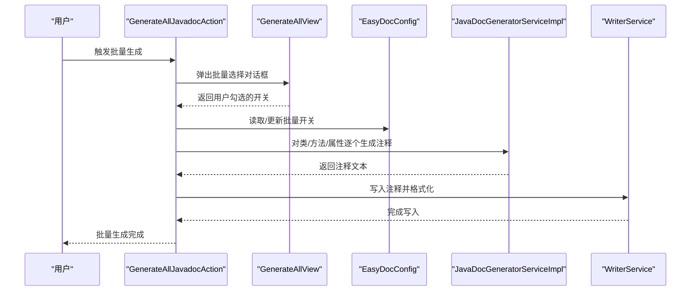
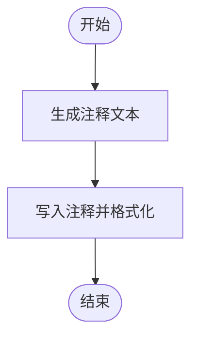
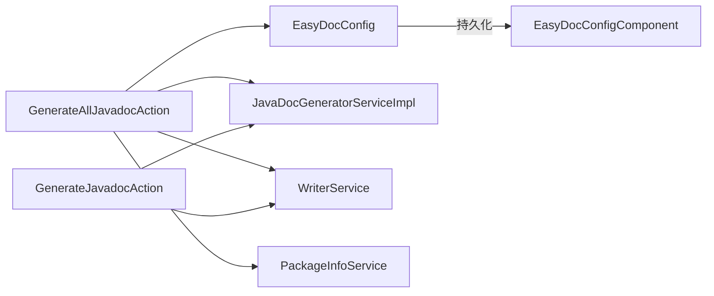

# 批量生成配置

<cite>
**本文引用的文件**
- [GenerateAllJavadocAction.java](file://src/main/java/com/star/easydoc/action/GenerateAllJavadocAction.java)
- [GenerateJavadocAction.java](file://src/main/java/com/star/easydoc/action/GenerateJavadocAction.java)
- [EasyDocConfig.java](file://src/main/java/com/star/easydoc/config/EasyDocConfig.java)
- [EasyDocConfigComponent.java](file://src/main/java/com/star/easydoc/config/EasyDocConfigComponent.java)
- [GenerateAllView.java](file://src/main/java/com/star/easydoc/view/inner/GenerateAllView.java)
- [JavadocSettingsView.java](file://src/main/java/com/star/easydoc/view/settings/javadoc/JavadocSettingsView.java)
- [ClassSettingsView.java](file://src/main/java/com/star/easydoc/view/settings/javadoc/template/ClassSettingsView.java)
- [MethodSettingsView.java](file://src/main/java/com/star/easydoc/view/settings/javadoc/template/MethodSettingsView.java)
- [FieldSettingsView.java](file://src/main/java/com/star/easydoc/view/settings/javadoc/template/FieldSettingsView.java)
- [JavaDocGeneratorServiceImpl.java](file://src/main/java/com/star/easydoc/javadoc/service/JavaDocGeneratorServiceImpl.java)
- [WriterService.java](file://src/main/java/com/star/easydoc/service/WriterService.java)
- [PackageInfoService.java](file://src/main/java/com/star/easydoc/service/PackageInfoService.java)
- [plugin.xml](file://src/main/resources/META-INF/plugin.xml)
- [README.md](file://README.md)
</cite>

## 目录
1. [简介](#简介)
2. [项目结构](#项目结构)
3. [核心组件](#核心组件)
4. [架构总览](#架构总览)
5. [详细组件分析](#详细组件分析)
6. [依赖分析](#依赖分析)
7. [性能考量](#性能考量)
8. [故障排查指南](#故障排查指南)
9. [结论](#结论)
10. [附录](#附录)

## 简介
本指南聚焦于 Easy Javadoc 插件的“批量生成”能力，系统性讲解批量文档生成的配置项、递归行为、与单个元素生成的区别与适用场景，并提供最佳实践与常见问题解决方案。读者将了解如何通过配置项控制批量生成的范围与行为，以及在大型项目中如何安全高效地使用该功能。

## 项目结构
与批量生成直接相关的核心模块与文件：
- 动作入口与流程控制：GenerateAllJavadocAction、GenerateJavadocAction
- 配置与持久化：EasyDocConfig、EasyDocConfigComponent
- 用户交互视图：GenerateAllView、JavadocSettingsView、ClassSettingsView、MethodSettingsView、FieldSettingsView
- 生成与写入：JavaDocGeneratorServiceImpl、WriterService
- 包信息生成：PackageInfoService
- 插件注册与快捷键：plugin.xml
- 使用说明与快捷键：README.md

图表来源
- [GenerateAllJavadocAction.java:1-218](file://src/main/java/com/star/easydoc/action/GenerateAllJavadocAction.java#L1-L218)
- [GenerateAllView.java:1-52](file://src/main/java/com/star/easydoc/view/inner/GenerateAllView.java#L1-L52)
- [EasyDocConfig.java:161-168](file://src/main/java/com/star/easydoc/config/EasyDocConfig.java#L161-L168)
- [JavaDocGeneratorServiceImpl.java:1-50](file://src/main/java/com/star/easydoc/javadoc/service/JavaDocGeneratorServiceImpl.java#L1-L50)
- [WriterService.java:1-139](file://src/main/java/com/star/easydoc/service/WriterService.java#L1-L139)
- [PackageInfoService.java:1-54](file://src/main/java/com/star/easydoc/service/PackageInfoService.java#L1-L54)
- [plugin.xml:55-78](file://src/main/resources/META-INF/plugin.xml#L55-L78)
- [README.md:26-30](file://README.md#L26-L30)

章节来源
- [plugin.xml:55-78](file://src/main/resources/META-INF/plugin.xml#L55-L78)
- [README.md:26-30](file://README.md#L26-L30)

## 核心组件
- 批量动作入口：GenerateAllJavadocAction 提供批量生成入口，负责弹出批量选择对话框、读取配置、递归遍历并调用生成器与写入服务。
- 批量选择视图：GenerateAllView 提供类注释、方法注释、属性注释、内部类递归四个开关。
- 配置持久化：EasyDocConfig 提供批量开关字段（genAllClass、genAllMethod、genAllField、genAllInnerClass），EasyDocConfigComponent 负责初始化与加载。
- 生成与写入：JavaDocGeneratorServiceImpl 根据 PSI 元素类型分发到具体生成器；WriterService 负责写入与格式化。
- 包信息生成：PackageInfoService 支持批量生成 package-info.java 文件及其注释。
- 设置视图：JavadocSettingsView、ClassSettingsView、MethodSettingsView、FieldSettingsView 提供通用与模板级别的配置入口。

章节来源
- [GenerateAllJavadocAction.java:47-136](file://src/main/java/com/star/easydoc/action/GenerateAllJavadocAction.java#L47-L136)
- [GenerateAllView.java:13-51](file://src/main/java/com/star/easydoc/view/inner/GenerateAllView.java#L13-L51)
- [EasyDocConfig.java:161-168](file://src/main/java/com/star/easydoc/config/EasyDocConfig.java#L161-L168)
- [EasyDocConfigComponent.java:20-68](file://src/main/java/com/star/easydoc/config/EasyDocConfigComponent.java#L20-L68)
- [JavaDocGeneratorServiceImpl.java:25-49](file://src/main/java/com/star/easydoc/javadoc/service/JavaDocGeneratorServiceImpl.java#L25-L49)
- [WriterService.java:25-75](file://src/main/java/com/star/easydoc/service/WriterService.java#L25-L75)
- [PackageInfoService.java:22-54](file://src/main/java/com/star/easydoc/service/PackageInfoService.java#L22-L54)

## 架构总览
批量生成从动作入口开始，经过用户选择、配置读取、递归遍历、生成与写入，最终完成批量文档生成。

图表来源
- [GenerateAllJavadocAction.java:115-136](file://src/main/java/com/star/easydoc/action/GenerateAllJavadocAction.java#L115-L136)
- [GenerateAllJavadocAction.java:155-170](file://src/main/java/com/star/easydoc/action/GenerateAllJavadocAction.java#L155-L170)
- [JavaDocGeneratorServiceImpl.java:35-48](file://src/main/java/com/star/easydoc/javadoc/service/JavaDocGeneratorServiceImpl.java#L35-L48)
- [WriterService.java:36-75](file://src/main/java/com/star/easydoc/service/WriterService.java#L36-L75)

## 详细组件分析

### 批量生成配置项详解
- 类注释开关：控制是否为当前类生成类注释。
- 方法注释开关：控制是否为类内所有方法生成方法注释。
- 属性注释开关：控制是否为类内所有字段生成属性注释。
- 内部类递归开关：控制是否递归生成内部类的注释。

这些开关来自用户在批量选择对话框中的勾选，并持久化到 EasyDocConfig 中，以便下次使用时保留上次的选择。

章节来源
- [GenerateAllJavadocAction.java:115-136](file://src/main/java/com/star/easydoc/action/GenerateAllJavadocAction.java#L115-L136)
- [GenerateAllJavadocAction.java:161-169](file://src/main/java/com/star/easydoc/action/GenerateAllJavadocAction.java#L161-L169)
- [GenerateAllView.java:13-51](file://src/main/java/com/star/easydoc/view/inner/GenerateAllView.java#L13-L51)
- [EasyDocConfig.java:161-168](file://src/main/java/com/star/easydoc/config/EasyDocConfig.java#L161-L168)

### 递归行为与包信息生成
- 内部类递归：当内部类递归开关开启时，会递归遍历并生成内部类的类、方法、属性注释。
- 包信息生成：当批量操作针对目录时，会弹出包选择器，允许用户选择多个包并生成对应的 package-info.java 文件及注释。

章节来源
- [GenerateAllJavadocAction.java:161-169](file://src/main/java/com/star/easydoc/action/GenerateAllJavadocAction.java#L161-L169)
- [GenerateAllJavadocAction.java:82-109](file://src/main/java/com/star/easydoc/action/GenerateAllJavadocAction.java#L82-L109)
- [PackageInfoService.java:33-54](file://src/main/java/com/star/easydoc/service/PackageInfoService.java#L33-L54)

### 与单个元素生成的区别与适用场景
- 单个元素生成：面向光标所在元素（类/方法/属性）即时生成注释，适合局部补全与快速编辑。
- 批量生成：面向选定类或目录，按开关批量生成，适合首次补全、重构后统一补全、团队规范落地等场景。
- 注意：批量生成目前不支持 Kotlin 的批量生成，仅支持 Java。

章节来源
- [GenerateJavadocAction.java:124-154](file://src/main/java/com/star/easydoc/action/GenerateJavadocAction.java#L124-L154)
- [GenerateAllJavadocAction.java:141-143](file://src/main/java/com/star/easydoc/action/GenerateAllJavadocAction.java#L141-L143)
- [README.md:28](file://README.md#L28)

### 模板与变量配置对批量生成的影响
- 类模板、方法模板、属性模板分别独立配置，批量生成时会根据所选元素类型使用对应模板。
- 模板支持内置变量与自定义变量，批量生成时将按模板变量替换生成注释文本。
- 通用设置页提供作者、日期格式、返回值类型模式、注释优先级、覆盖模式等影响批量生成行为的全局配置。

章节来源
- [ClassSettingsView.java:24-180](file://src/main/java/com/star/easydoc/view/settings/javadoc/template/ClassSettingsView.java#L24-L180)
- [MethodSettingsView.java:24-179](file://src/main/java/com/star/easydoc/view/settings/javadoc/template/MethodSettingsView.java#L24-L179)
- [FieldSettingsView.java:24-176](file://src/main/java/com/star/easydoc/view/settings/javadoc/template/FieldSettingsView.java#L24-L176)
- [JavadocSettingsView.java:14-218](file://src/main/java/com/star/easydoc/view/settings/javadoc/JavadocSettingsView.java#L14-L218)
- [EasyDocConfig.java:146-159](file://src/main/java/com/star/easydoc/config/EasyDocConfig.java#L146-L159)

### 生成与写入流程
- 生成阶段：根据 PSI 元素类型分发到对应生成器，生成注释文本。
- 写入阶段：通过写入服务在 PSI 元素前插入或替换文档注释，并进行格式化与空行处理。

图表来源
- [JavaDocGeneratorServiceImpl.java:35-48](file://src/main/java/com/star/easydoc/javadoc/service/JavaDocGeneratorServiceImpl.java#L35-L48)
- [WriterService.java:36-75](file://src/main/java/com/star/easydoc/service/WriterService.java#L36-L75)

## 依赖分析
- 动作层依赖配置层与服务层；配置层负责持久化；服务层负责生成与写入；模板与设置视图提供配置入口。
- 批量生成与单个生成共享同一套生成器与写入服务，差异在于调用范围与递归策略。

图表来源
- [GenerateAllJavadocAction.java:47-57](file://src/main/java/com/star/easydoc/action/GenerateAllJavadocAction.java#L47-L57)
- [GenerateJavadocAction.java:48-52](file://src/main/java/com/star/easydoc/action/GenerateJavadocAction.java#L48-L52)
- [EasyDocConfig.java:22-680](file://src/main/java/com/star/easydoc/config/EasyDocConfig.java#L22-L680)
- [EasyDocConfigComponent.java:20-68](file://src/main/java/com/star/easydoc/config/EasyDocConfigComponent.java#L20-L68)
- [JavaDocGeneratorServiceImpl.java:25-49](file://src/main/java/com/star/easydoc/javadoc/service/JavaDocGeneratorServiceImpl.java#L25-L49)
- [WriterService.java:25-75](file://src/main/java/com/star/easydoc/service/WriterService.java#L25-L75)
- [PackageInfoService.java:22-54](file://src/main/java/com/star/easydoc/service/PackageInfoService.java#L22-L54)

## 性能考量
- 递归深度与对象数量：内部类递归会显著增加生成对象数量，建议在大型类或深层嵌套类中谨慎启用。
- 生成器与写入：批量生成涉及多次 PSI 写入与格式化，建议在空闲时段或小范围批量执行，避免 IDE 卡顿。
- 模板复杂度：复杂的模板与大量自定义变量可能增加生成耗时，建议在保证质量的前提下保持模板简洁。
- 翻译与网络：若启用了翻译功能，网络请求会带来额外开销，建议合理设置超时与缓存策略。

## 故障排查指南
- 快捷键无效：确认光标位于类名、方法名或属性名上，且未被选中；检查 IDE 快捷键冲突。
- 注释未写入：检查覆盖模式与已有注释的关系；确认写入服务未抛出异常。
- 包信息未生成：确认选择了正确的包并正确填写描述；检查文件创建权限。
- 模板变量未替换：检查模板配置与自定义变量设置；确保变量名与模板占位符一致。
- 内部类未递归：确认内部类递归开关已勾选；检查类层级是否过深导致性能问题。

章节来源
- [README.md:71-84](file://README.md#L71-L84)
- [WriterService.java:25-75](file://src/main/java/com/star/easydoc/service/WriterService.java#L25-L75)
- [PackageInfoService.java:33-54](file://src/main/java/com/star/easydoc/service/PackageInfoService.java#L33-L54)

## 结论
批量生成配置提供了灵活的开关与递归策略，配合模板与变量系统，能够高效地为大型项目统一生成高质量的文档注释。建议在使用前明确生成范围与递归策略，结合模板与变量配置提升生成质量，并在必要时分批执行以平衡性能与效率。

## 附录
- 快捷键与使用说明：参考 README 中的使用与快捷键部分。
- 动作注册与扩展点：参考 plugin.xml 中的动作与配置项注册。

章节来源
- [README.md:26-30](file://README.md#L26-L30)
- [plugin.xml:55-78](file://src/main/resources/META-INF/plugin.xml#L55-L78)