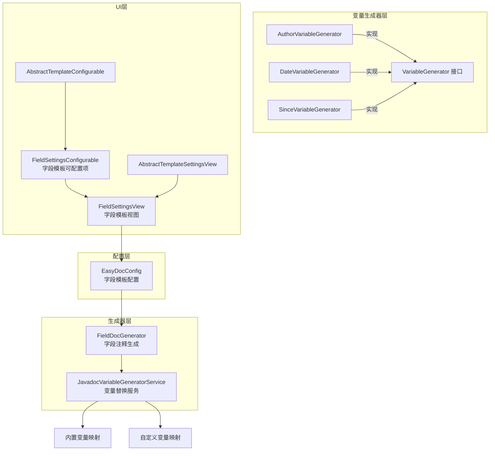
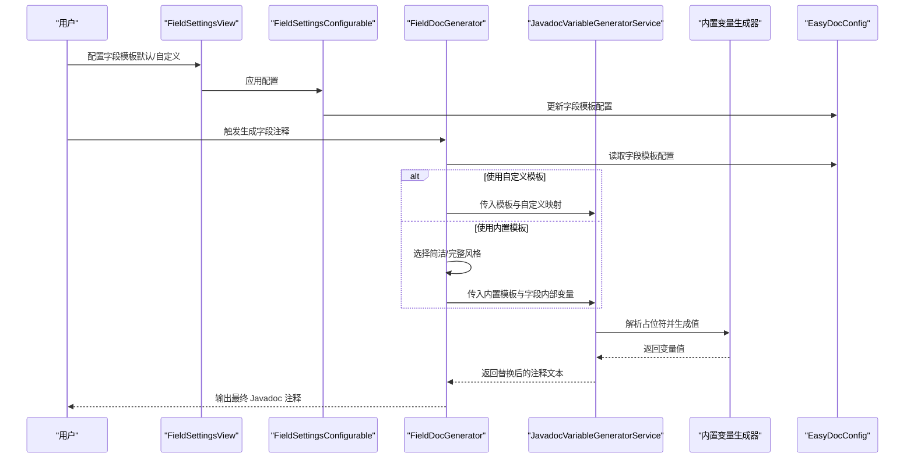
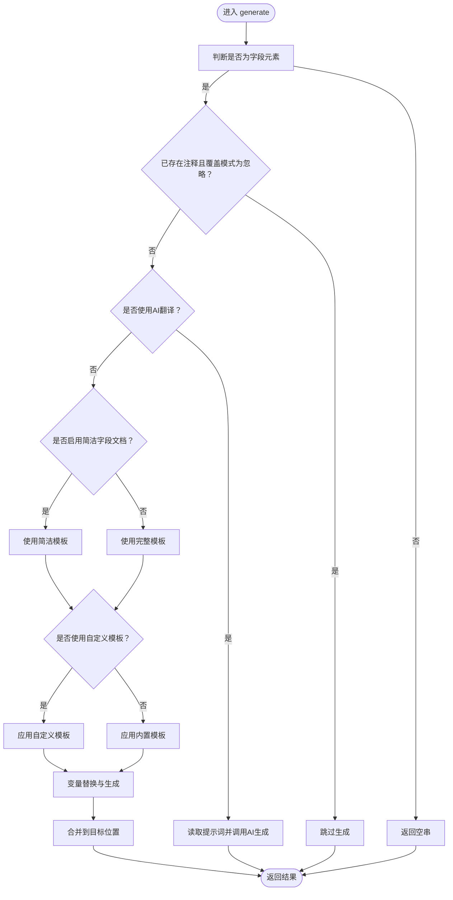
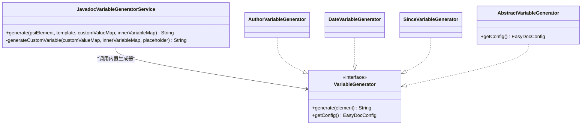
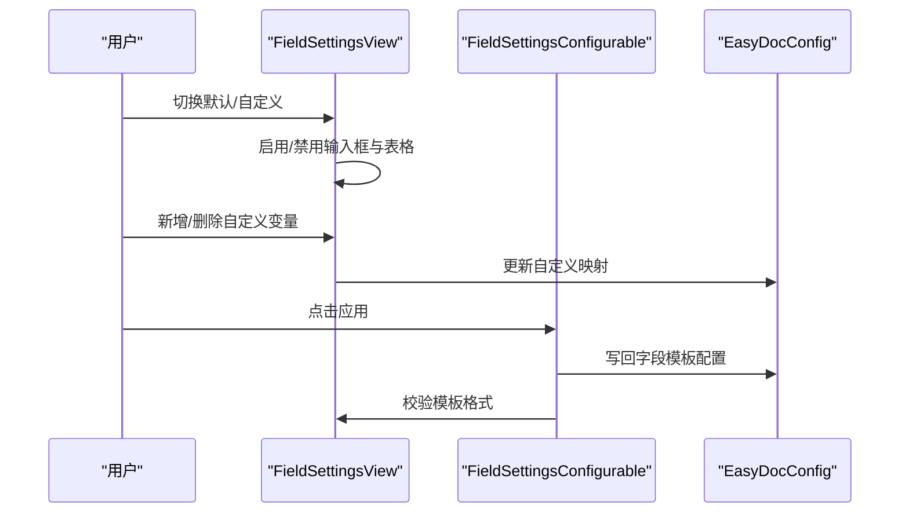
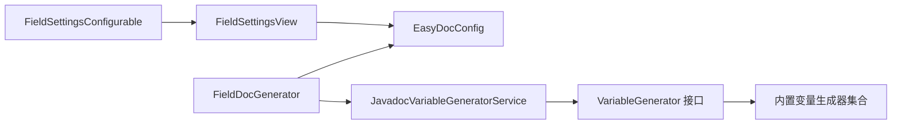

# 字段模板配置

<cite>
**本文引用的文件**
- [FieldDocGenerator.java](file://src/main/java/com/star/easydoc/javadoc/service/generator/impl/FieldDocGenerator.java)
- [FieldSettingsView.java](file://src/main/java/com/star/easydoc/view/settings/javadoc/template/FieldSettingsView.java)
- [FieldSettingsConfigurable.java](file://src/main/java/com/star/easydoc/view/settings/javadoc/template/FieldSettingsConfigurable.java)
- [EasyDocConfig.java](file://src/main/java/com/star/easydoc/config/EasyDocConfig.java)
- [JavadocVariableGeneratorService.java](file://src/main/java/com/star/easydoc/javadoc/service/variable/JavadocVariableGeneratorService.java)
- [AuthorVariableGenerator.java](file://src/main/java/com/star/easydoc/javadoc/service/variable/impl/AuthorVariableGenerator.java)
- [DateVariableGenerator.java](file://src/main/java/com/star/easydoc/javadoc/service/variable/impl/DateVariableGenerator.java)
- [SinceVariableGenerator.java](file://src/main/java/com/star/easydoc/javadoc/service/variable/impl/SinceVariableGenerator.java)
- [AbstractVariableGenerator.java](file://src/main/java/com/star/easydoc/javadoc/service/variable/impl/AbstractVariableGenerator.java)
- [VariableGenerator.java](file://src/main/java/com/star/easydoc/javadoc/service/variable/VariableGenerator.java)
- [AbstractTemplateSettingsView.java](file://src/main/java/com/star/easydoc/view/settings/javadoc/template/AbstractTemplateSettingsView.java)
- [AbstractTemplateConfigurable.java](file://src/main/java/com/star/easydoc/view/settings/javadoc/template/AbstractTemplateConfigurable.java)
- [Consts.java](file://src/main/java/com/star/easydoc/common/Consts.java)
- [field.prompt](file://src/main/resources/prompts/chatglm/field.prompt)
</cite>

## 目录
1. [简介](#简介)
2. [项目结构](#项目结构)
3. [核心组件](#核心组件)
4. [架构总览](#架构总览)
5. [详细组件分析](#详细组件分析)
6. [依赖分析](#依赖分析)
7. [性能考虑](#性能考虑)
8. [故障排查指南](#故障排查指南)
9. [结论](#结论)
10. [附录](#附录)

## 简介
本文件系统性阐述“字段模板配置”的设计与使用，涵盖字段级别的 Javadoc 模板语法、注释风格选择（简洁/完整）、简洁字段文档模式、特殊配置项（如简洁字段文档模式、字段描述生成规则）、可用变量（作者、日期、since 等），以及在成员变量、静态变量、常量等场景下的应用建议与最佳实践。

## 项目结构
围绕字段模板配置的关键模块分布如下：
- 生成器层：负责根据配置与变量生成最终 Javadoc 注释文本，并进行合并处理
- 配置层：提供字段模板的启用/禁用、模板内容、自定义变量映射等配置
- 变量生成层：解析模板中的占位符，按内置或自定义规则生成对应值
- UI 层：提供字段模板配置界面，支持默认/自定义切换、内置变量展示、自定义变量增删改

图表来源
- [FieldDocGenerator.java:28-111](file://src/main/java/com/star/easydoc/javadoc/service/generator/impl/FieldDocGenerator.java#L28-L111)
- [JavadocVariableGeneratorService.java:35-128](file://src/main/java/com/star/easydoc/javadoc/service/variable/JavadocVariableGeneratorService.java#L35-L128)
- [EasyDocConfig.java:148-159](file://src/main/java/com/star/easydoc/config/EasyDocConfig.java#L148-L159)
- [FieldSettingsView.java:24-176](file://src/main/java/com/star/easydoc/view/settings/javadoc/template/FieldSettingsView.java#L24-L176)
- [FieldSettingsConfigurable.java:20-77](file://src/main/java/com/star/easydoc/view/settings/javadoc/template/FieldSettingsConfigurable.java#L20-L77)
- [AbstractTemplateSettingsView.java:14-37](file://src/main/java/com/star/easydoc/view/settings/javadoc/template/AbstractTemplateSettingsView.java#L14-L37)
- [AbstractTemplateConfigurable.java:13-23](file://src/main/java/com/star/easydoc/view/settings/javadoc/template/AbstractTemplateConfigurable.java#L13-L23)

章节来源
- [FieldDocGenerator.java:28-111](file://src/main/java/com/star/easydoc/javadoc/service/generator/impl/FieldDocGenerator.java#L28-L111)
- [EasyDocConfig.java:148-159](file://src/main/java/com/star/easydoc/config/EasyDocConfig.java#L148-L159)
- [FieldSettingsView.java:24-176](file://src/main/java/com/star/easydoc/view/settings/javadoc/template/FieldSettingsView.java#L24-L176)
- [FieldSettingsConfigurable.java:20-77](file://src/main/java/com/star/easydoc/view/settings/javadoc/template/FieldSettingsConfigurable.java#L20-L77)
- [AbstractTemplateSettingsView.java:14-37](file://src/main/java/com/star/easydoc/view/settings/javadoc/template/AbstractTemplateSettingsView.java#L14-L37)
- [AbstractTemplateConfigurable.java:13-23](file://src/main/java/com/star/easydoc/view/settings/javadoc/template/AbstractTemplateConfigurable.java#L13-L23)

## 核心组件
- 字段注释生成器：根据配置决定使用简洁或完整注释风格，并支持自定义模板；内置字段内部变量（作者、字段名、字段类型、分支、项目名）
- 模板变量生成服务：统一解析模板中的占位符，优先匹配内置变量生成器，否则回退到自定义变量映射；支持字符串与 Groovy 脚本两种自定义变量类型
- 字段模板 UI：提供默认/自定义模板切换、内置变量说明表、自定义变量增删改操作
- 配置模型：封装字段模板配置（是否默认、模板内容、自定义映射），并提供重置与持久化能力

章节来源
- [FieldDocGenerator.java:35-104](file://src/main/java/com/star/easydoc/javadoc/service/generator/impl/FieldDocGenerator.java#L35-L104)
- [JavadocVariableGeneratorService.java:35-128](file://src/main/java/com/star/easydoc/javadoc/service/variable/JavadocVariableGeneratorService.java#L35-L128)
- [FieldSettingsView.java:24-176](file://src/main/java/com/star/easydoc/view/settings/javadoc/template/FieldSettingsView.java#L24-L176)
- [EasyDocConfig.java:211-254](file://src/main/java/com/star/easydoc/config/EasyDocConfig.java#L211-L254)

## 架构总览
字段模板从 UI 配置到生成的端到端流程如下：

图表来源
- [FieldSettingsView.java:96-125](file://src/main/java/com/star/easydoc/view/settings/javadoc/template/FieldSettingsView.java#L96-L125)
- [FieldSettingsConfigurable.java:35-76](file://src/main/java/com/star/easydoc/view/settings/javadoc/template/FieldSettingsConfigurable.java#L35-L76)
- [FieldDocGenerator.java:42-71](file://src/main/java/com/star/easydoc/javadoc/service/generator/impl/FieldDocGenerator.java#L42-L71)
- [JavadocVariableGeneratorService.java:60-92](file://src/main/java/com/star/easydoc/javadoc/service/variable/JavadocVariableGeneratorService.java#L60-L92)

## 详细组件分析

### 字段注释生成器（FieldDocGenerator）
- 功能要点
  - 判断覆盖模式与已有注释，避免重复生成
  - 支持 AI 生成（基于提示词）
  - 选择注释风格：简洁模板或完整模板
  - 支持自定义模板覆盖默认模板
  - 注入字段内部变量（作者、字段名、字段类型、分支、项目名）
  - 合并生成结果到目标位置
- 关键行为
  - 简洁模板与完整模板的二选一逻辑
  - 自定义模板优先级高于内置模板
  - 字段内部变量通过 getFieldInnerVariable 注入

图表来源
- [FieldDocGenerator.java:42-111](file://src/main/java/com/star/easydoc/javadoc/service/generator/impl/FieldDocGenerator.java#L42-L111)

章节来源
- [FieldDocGenerator.java:28-111](file://src/main/java/com/star/easydoc/javadoc/service/generator/impl/FieldDocGenerator.java#L28-L111)

### 模板变量生成服务（JavadocVariableGeneratorService）
- 功能要点
  - 统一解析模板中的占位符（形如 $VAR$）
  - 内置变量映射：author、date、doc、params、return、see、since、throws、version
  - 自定义变量映射：支持字符串直接替换与 Groovy 脚本动态计算
  - 将字段内部变量注入到 Groovy 上下文中，便于脚本访问
- 复杂度与性能
  - 占位符匹配采用正则，整体复杂度近似 O(n)（n 为模板长度）
  - 自定义 Groovy 计算存在执行开销，建议控制脚本复杂度

图表来源
- [JavadocVariableGeneratorService.java:35-128](file://src/main/java/com/star/easydoc/javadoc/service/variable/JavadocVariableGeneratorService.java#L35-L128)
- [VariableGenerator.java:12-28](file://src/main/java/com/star/easydoc/javadoc/service/variable/VariableGenerator.java#L12-L28)
- [AuthorVariableGenerator.java:10-17](file://src/main/java/com/star/easydoc/javadoc/service/variable/impl/AuthorVariableGenerator.java#L10-L17)
- [DateVariableGenerator.java:15-28](file://src/main/java/com/star/easydoc/javadoc/service/variable/impl/DateVariableGenerator.java#L15-L28)
- [SinceVariableGenerator.java:11-18](file://src/main/java/com/star/easydoc/javadoc/service/variable/impl/SinceVariableGenerator.java#L11-L18)
- [AbstractVariableGenerator.java:14-21](file://src/main/java/com/star/easydoc/javadoc/service/variable/impl/AbstractVariableGenerator.java#L14-L21)

章节来源
- [JavadocVariableGeneratorService.java:35-128](file://src/main/java/com/star/easydoc/javadoc/service/variable/JavadocVariableGeneratorService.java#L35-L128)
- [VariableGenerator.java:12-28](file://src/main/java/com/star/easydoc/javadoc/service/variable/VariableGenerator.java#L12-L28)
- [AbstractVariableGenerator.java:14-21](file://src/main/java/com/star/easydoc/javadoc/service/variable/impl/AbstractVariableGenerator.java#L14-L21)

### 字段模板 UI（FieldSettingsView / FieldSettingsConfigurable）
- 功能要点
  - 提供“默认模板”与“自定义模板”单选切换
  - 内置变量表格展示（如 $DOC$、$SEE$）
  - 自定义变量表格支持新增、删除，类型为“固定值”或“Groovy脚本”
  - 应用时校验：自定义模板不能为空，且必须以 “/**” 开头、以 “*/” 结尾
- 用户交互
  - 切换默认/自定义会启用/禁用输入框与表格
  - 新增自定义变量后立即生效于配置

图表来源
- [FieldSettingsView.java:44-94](file://src/main/java/com/star/easydoc/view/settings/javadoc/template/FieldSettingsView.java#L44-L94)
- [FieldSettingsConfigurable.java:35-76](file://src/main/java/com/star/easydoc/view/settings/javadoc/template/FieldSettingsConfigurable.java#L35-L76)

章节来源
- [FieldSettingsView.java:24-176](file://src/main/java/com/star/easydoc/view/settings/javadoc/template/FieldSettingsView.java#L24-L176)
- [FieldSettingsConfigurable.java:20-77](file://src/main/java/com/star/easydoc/view/settings/javadoc/template/FieldSettingsConfigurable.java#L20-L77)

### 配置模型（EasyDocConfig）
- 字段模板配置对象
  - isDefault：是否使用默认模板
  - template：自定义模板内容
  - customMap：自定义变量映射（键为占位符，值含类型与值）
- 全局字段模板开关
  - simpleFieldDoc：是否启用“简洁字段文档模式”

章节来源
- [EasyDocConfig.java:148-159](file://src/main/java/com/star/easydoc/config/EasyDocConfig.java#L148-L159)
- [EasyDocConfig.java:211-254](file://src/main/java/com/star/easydoc/config/EasyDocConfig.java#L211-L254)
- [EasyDocConfig.java:64-66](file://src/main/java/com/star/easydoc/config/EasyDocConfig.java#L64-L66)

### 内置变量与生成器
- 内置变量列表（由服务注册）
  - author：来自配置作者
  - date：当前日期，格式来自配置日期格式
  - since：版本标识，默认示例值
  - doc、params、return、see、throws、version：用于方法/类等上下文，字段模板中也可保留占位符
- 字段内部变量（由生成器注入）
  - author、fieldName、fieldType、branch、projectName

章节来源
- [JavadocVariableGeneratorService.java:42-52](file://src/main/java/com/star/easydoc/javadoc/service/variable/JavadocVariableGeneratorService.java#L42-L52)
- [FieldDocGenerator.java:96-104](file://src/main/java/com/star/easydoc/javadoc/service/generator/impl/FieldDocGenerator.java#L96-L104)
- [AuthorVariableGenerator.java:12-15](file://src/main/java/com/star/easydoc/javadoc/service/variable/impl/AuthorVariableGenerator.java#L12-L15)
- [DateVariableGenerator.java:18-26](file://src/main/java/com/star/easydoc/javadoc/service/variable/impl/DateVariableGenerator.java#L18-L26)
- [SinceVariableGenerator.java:13-16](file://src/main/java/com/star/easydoc/javadoc/service/variable/impl/SinceVariableGenerator.java#L13-L16)

## 依赖分析
- 组件耦合
  - FieldDocGenerator 依赖 EasyDocConfig 与 JavadocVariableGeneratorService
  - JavadocVariableGeneratorService 依赖各内置 VariableGenerator 实现
  - UI 层通过 FieldSettingsConfigurable 与 FieldSettingsView 与配置层交互
- 外部依赖
  - GroovyShell 用于执行自定义 Groovy 脚本
  - 正则表达式用于占位符匹配

图表来源
- [FieldDocGenerator.java:30-34](file://src/main/java/com/star/easydoc/javadoc/service/generator/impl/FieldDocGenerator.java#L30-L34)
- [JavadocVariableGeneratorService.java:42-52](file://src/main/java/com/star/easydoc/javadoc/service/variable/JavadocVariableGeneratorService.java#L42-L52)
- [FieldSettingsConfigurable.java:20-22](file://src/main/java/com/star/easydoc/view/settings/javadoc/template/FieldSettingsConfigurable.java#L20-L22)
- [FieldSettingsView.java:24-30](file://src/main/java/com/star/easydoc/view/settings/javadoc/template/FieldSettingsView.java#L24-L30)

章节来源
- [FieldDocGenerator.java:30-34](file://src/main/java/com/star/easydoc/javadoc/service/generator/impl/FieldDocGenerator.java#L30-L34)
- [JavadocVariableGeneratorService.java:42-52](file://src/main/java/com/star/easydoc/javadoc/service/variable/JavadocVariableGeneratorService.java#L42-L52)
- [FieldSettingsConfigurable.java:20-22](file://src/main/java/com/star/easydoc/view/settings/javadoc/template/FieldSettingsConfigurable.java#L20-L22)
- [FieldSettingsView.java:24-30](file://src/main/java/com/star/easydoc/view/settings/javadoc/template/FieldSettingsView.java#L24-L30)

## 性能考虑
- 模板解析：正则匹配占位符，复杂度近似线性；建议控制模板长度与嵌套层级
- 自定义 Groovy：每次替换均可能执行脚本，应避免复杂计算与外部 I/O
- 字段内部变量：仅在生成阶段注入，成本较低
- AI 生成：仅在启用 AI 翻译时触发，注意网络与超时配置

## 故障排查指南
- 自定义模板未生效
  - 确认已切换到“自定义模板”，且模板非空
  - 确认模板以 “/**” 开头、以 “*/” 结尾
- 占位符未被替换
  - 检查占位符是否为合法形式（形如 $VAR$）
  - 若为自定义变量，确认键名大小写与配置一致
- Groovy 脚本报错
  - 检查脚本语法与返回值类型
  - 查看日志输出的错误信息定位问题
- 注释未生成
  - 检查覆盖模式与已有注释的关系
  - 确认字段元素类型与生成器匹配

章节来源
- [FieldSettingsConfigurable.java:55-63](file://src/main/java/com/star/easydoc/view/settings/javadoc/template/FieldSettingsConfigurable.java#L55-L63)
- [JavadocVariableGeneratorService.java:102-125](file://src/main/java/com/star/easydoc/javadoc/service/variable/JavadocVariableGeneratorService.java#L102-L125)
- [FieldDocGenerator.java:49-51](file://src/main/java/com/star/easydoc/javadoc/service/generator/impl/FieldDocGenerator.java#L49-L51)

## 结论
字段模板配置通过“默认/自定义模板 + 内置/自定义变量”的组合，提供了灵活而强大的注释生成能力。合理利用简洁/完整注释风格、内置变量与自定义 Groovy 脚本，可在不同场景（成员变量、静态变量、常量）下快速产出高质量的 Javadoc 注释。

## 附录

### 字段模板语法与注释风格
- 占位符语法：形如 $VAR$ 的变量占位符
- 注释风格
  - 简洁模式：单行注释模板
  - 完整模式：多行注释模板
- 自定义模板：优先级高于内置模板

章节来源
- [FieldDocGenerator.java:35-41](file://src/main/java/com/star/easydoc/javadoc/service/generator/impl/FieldDocGenerator.java#L35-L41)
- [FieldDocGenerator.java:58-70](file://src/main/java/com/star/easydoc/javadoc/service/generator/impl/FieldDocGenerator.java#L58-L70)

### 字段模板特殊配置项
- 简洁字段文档模式：由全局配置控制，影响默认注释风格选择
- 字段描述生成规则：若未启用 AI，字段描述由变量生成服务与模板拼接生成；若启用 AI，则由提示词驱动生成

章节来源
- [EasyDocConfig.java:64-66](file://src/main/java/com/star/easydoc/config/EasyDocConfig.java#L64-L66)
- [FieldDocGenerator.java:54-56](file://src/main/java/com/star/easydoc/javadoc/service/generator/impl/FieldDocGenerator.java#L54-L56)
- [field.prompt:1-20](file://src/main/resources/prompts/chatglm/field.prompt#L1-L20)

### 字段模板可用变量
- 内置变量（由服务注册）
  - author、date、doc、params、return、see、since、throws、version
- 字段内部变量（由生成器注入）
  - author、fieldName、fieldType、branch、projectName
- 自定义变量
  - 类型：固定值 或 Groovy 脚本
  - 可在 Groovy 脚本中访问字段内部变量作为上下文

章节来源
- [JavadocVariableGeneratorService.java:42-52](file://src/main/java/com/star/easydoc/javadoc/service/variable/JavadocVariableGeneratorService.java#L42-L52)
- [FieldDocGenerator.java:96-104](file://src/main/java/com/star/easydoc/javadoc/service/generator/impl/FieldDocGenerator.java#L96-L104)
- [AbstractVariableGenerator.java:16-19](file://src/main/java/com/star/easydoc/javadoc/service/variable/impl/AbstractVariableGenerator.java#L16-L19)

### 字段模板应用场景与最佳实践
- 成员变量模板
  - 建议使用简洁模式，突出字段用途与类型
  - 可结合 $DOC$ 与 $SEE$ 占位符生成简明描述
- 静态变量模板
  - 可在自定义变量中使用 Groovy 脚本生成动态描述
  - 注意脚本性能与可维护性
- 常量模板
  - 建议固定值自定义变量，保持稳定一致性
- 最佳实践
  - 优先使用内置变量，减少自定义变量数量
  - 自定义模板需以 “/**” 开头、以 “*/” 结尾
  - Groovy 脚本应尽量短小精悍，避免复杂逻辑
  - 合理设置日期格式与作者信息，确保团队一致性

章节来源
- [FieldSettingsView.java:38-42](file://src/main/java/com/star/easydoc/view/settings/javadoc/template/FieldSettingsView.java#L38-L42)
- [FieldSettingsConfigurable.java:55-63](file://src/main/java/com/star/easydoc/view/settings/javadoc/template/FieldSettingsConfigurable.java#L55-L63)
- [JavadocVariableGeneratorService.java:114-121](file://src/main/java/com/star/easydoc/javadoc/service/variable/JavadocVariableGeneratorService.java#L114-L121)