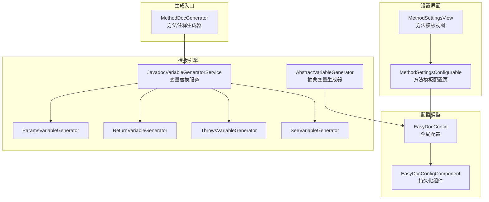
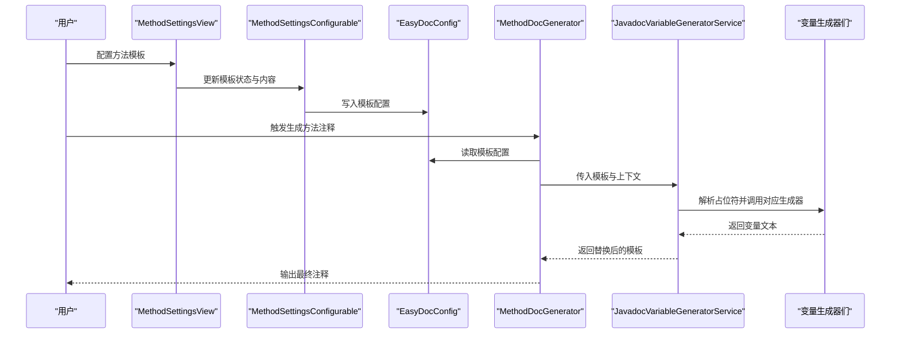
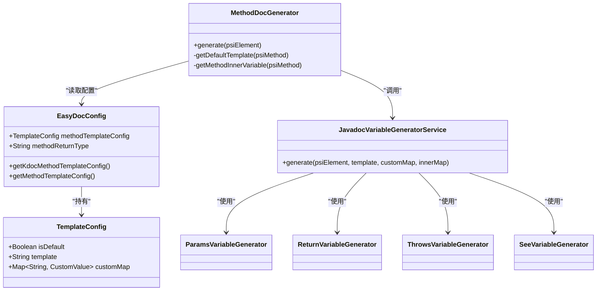

# 方法模板配置

<cite>
**本文档引用的文件**
- [MethodSettingsView.java](file://src/main/java/com/star/easydoc/view/settings/javadoc/template/MethodSettingsView.java)
- [MethodSettingsConfigurable.java](file://src/main/java/com/star/easydoc/view/settings/javadoc/template/MethodSettingsConfigurable.java)
- [EasyDocConfig.java](file://src/main/java/com/star/easydoc/config/EasyDocConfig.java)
- [EasyDocConfigComponent.java](file://src/main/java/com/star/easydoc/config/EasyDocConfigComponent.java)
- [MethodDocGenerator.java](file://src/main/java/com/star/easydoc/javadoc/service/generator/impl/MethodDocGenerator.java)
- [JavadocVariableGeneratorService.java](file://src/main/java/com/star/easydoc/javadoc/service/variable/JavadocVariableGeneratorService.java)
- [ParamsVariableGenerator.java](file://src/main/java/com/star/easydoc/javadoc/service/variable/impl/ParamsVariableGenerator.java)
- [ReturnVariableGenerator.java](file://src/main/java/com/star/easydoc/javadoc/service/variable/impl/ReturnVariableGenerator.java)
- [ThrowsVariableGenerator.java](file://src/main/java/com/star/easydoc/javadoc/service/variable/impl/ThrowsVariableGenerator.java)
- [SeeVariableGenerator.java](file://src/main/java/com/star/easydoc/javadoc/service/variable/impl/SeeVariableGenerator.java)
- [AbstractVariableGenerator.java](file://src/main/java/com/star/easydoc/javadoc/service/variable/impl/AbstractVariableGenerator.java)
- [Consts.java](file://src/main/java/com/star/easydoc/common/Consts.java)
</cite>

## 目录
1. [简介](#简介)
2. [项目结构](#项目结构)
3. [核心组件](#核心组件)
4. [架构总览](#架构总览)
5. [详细组件分析](#详细组件分析)
6. [依赖关系分析](#依赖关系分析)
7. [性能考量](#性能考量)
8. [故障排查指南](#故障排查指南)
9. [结论](#结论)
10. [附录](#附录)

## 简介
本文件面向“方法模板配置”的使用者与维护者，系统性阐述方法级别的 Javadoc 模板配置，涵盖：
- 方法模板语法与内置变量
- 参数、返回值、异常、参见（see）等变量的处理机制
- 配置项：返回值类型模式、参数描述方式、异常描述格式等
- 实际配置示例：构造函数、普通方法、静态方法等场景
- 模板优化技巧与常见问题解决

## 项目结构
围绕方法模板配置的相关模块主要分布在以下位置：
- 设置界面与可插拔模板：MethodSettingsView、MethodSettingsConfigurable
- 配置持久化：EasyDocConfig、EasyDocConfigComponent
- 模板解析与变量替换：JavadocVariableGeneratorService
- 变量生成器：Params/Return/Throws/See 等
- 方法注释生成入口：MethodDocGenerator
- 常量与基础类型集合：Consts

图表来源
- [MethodSettingsView.java:1-179](file://src/main/java/com/star/easydoc/view/settings/javadoc/template/MethodSettingsView.java#L1-L179)
- [MethodSettingsConfigurable.java:1-77](file://src/main/java/com/star/easydoc/view/settings/javadoc/template/MethodSettingsConfigurable.java#L1-L77)
- [EasyDocConfig.java:1-680](file://src/main/java/com/star/easydoc/config/EasyDocConfig.java#L1-L680)
- [EasyDocConfigComponent.java:1-69](file://src/main/java/com/star/easydoc/config/EasyDocConfigComponent.java#L1-L69)
- [JavadocVariableGeneratorService.java:1-128](file://src/main/java/com/star/easydoc/javadoc/service/variable/JavadocVariableGeneratorService.java#L1-L128)
- [AbstractVariableGenerator.java:1-21](file://src/main/java/com/star/easydoc/javadoc/service/variable/impl/AbstractVariableGenerator.java#L1-L21)
- [ParamsVariableGenerator.java:1-116](file://src/main/java/com/star/easydoc/javadoc/service/variable/impl/ParamsVariableGenerator.java#L1-L116)
- [ReturnVariableGenerator.java:1-46](file://src/main/java/com/star/easydoc/javadoc/service/variable/impl/ReturnVariableGenerator.java#L1-L46)
- [ThrowsVariableGenerator.java:1-37](file://src/main/java/com/star/easydoc/javadoc/service/variable/impl/ThrowsVariableGenerator.java#L1-L37)
- [SeeVariableGenerator.java:1-65](file://src/main/java/com/star/easydoc/javadoc/service/variable/impl/SeeVariableGenerator.java#L1-L65)
- [MethodDocGenerator.java:1-138](file://src/main/java/com/star/easydoc/javadoc/service/generator/impl/MethodDocGenerator.java#L1-L138)

章节来源
- [MethodSettingsView.java:1-179](file://src/main/java/com/star/easydoc/view/settings/javadoc/template/MethodSettingsView.java#L1-L179)
- [MethodSettingsConfigurable.java:1-77](file://src/main/java/com/star/easydoc/view/settings/javadoc/template/MethodSettingsConfigurable.java#L1-L77)
- [EasyDocConfig.java:1-680](file://src/main/java/com/star/easydoc/config/EasyDocConfig.java#L1-L680)
- [EasyDocConfigComponent.java:1-69](file://src/main/java/com/star/easydoc/config/EasyDocConfigComponent.java#L1-L69)
- [MethodDocGenerator.java:1-138](file://src/main/java/com/star/easydoc/javadoc/service/generator/impl/MethodDocGenerator.java#L1-L138)
- [JavadocVariableGeneratorService.java:1-128](file://src/main/java/com/star/easydoc/javadoc/service/variable/JavadocVariableGeneratorService.java#L1-L128)
- [ParamsVariableGenerator.java:1-116](file://src/main/java/com/star/easydoc/javadoc/service/variable/impl/ParamsVariableGenerator.java#L1-L116)
- [ReturnVariableGenerator.java:1-46](file://src/main/java/com/star/easydoc/javadoc/service/variable/impl/ReturnVariableGenerator.java#L1-L46)
- [ThrowsVariableGenerator.java:1-37](file://src/main/java/com/star/easydoc/javadoc/service/variable/impl/ThrowsVariableGenerator.java#L1-L37)
- [SeeVariableGenerator.java:1-65](file://src/main/java/com/star/easydoc/javadoc/service/variable/impl/SeeVariableGenerator.java#L1-L65)
- [AbstractVariableGenerator.java:1-21](file://src/main/java/com/star/easydoc/javadoc/service/variable/impl/AbstractVariableGenerator.java#L1-L21)
- [Consts.java:1-100](file://src/main/java/com/star/easydoc/common/Consts.java#L1-L100)

## 核心组件
- 方法模板设置视图与配置页：负责用户交互、模板开关、模板内容校验、自定义变量增删改查。
- 配置持久化：提供模板配置对象、默认值初始化、返回值类型模式、参数描述方式等。
- 模板变量替换服务：统一解析模板中的占位符，按内置变量或自定义变量进行替换。
- 变量生成器：针对参数、返回值、异常、参见等生成具体文本。
- 方法注释生成器：根据当前方法上下文选择默认模板或自定义模板，并执行变量替换与注释合并。

章节来源
- [MethodSettingsView.java:36-97](file://src/main/java/com/star/easydoc/view/settings/javadoc/template/MethodSettingsView.java#L36-L97)
- [MethodSettingsConfigurable.java:35-76](file://src/main/java/com/star/easydoc/view/settings/javadoc/template/MethodSettingsConfigurable.java#L35-L76)
- [EasyDocConfig.java:211-254](file://src/main/java/com/star/easydoc/config/EasyDocConfig.java#L211-L254)
- [EasyDocConfig.java:553-574](file://src/main/java/com/star/easydoc/config/EasyDocConfig.java#L553-L574)
- [JavadocVariableGeneratorService.java:35-92](file://src/main/java/com/star/easydoc/javadoc/service/variable/JavadocVariableGeneratorService.java#L35-L92)
- [MethodDocGenerator.java:38-91](file://src/main/java/com/star/easydoc/javadoc/service/generator/impl/MethodDocGenerator.java#L38-L91)

## 架构总览
下图展示从设置到生成的端到端流程：

图表来源
- [MethodSettingsView.java:99-128](file://src/main/java/com/star/easydoc/view/settings/javadoc/template/MethodSettingsView.java#L99-L128)
- [MethodSettingsConfigurable.java:35-76](file://src/main/java/com/star/easydoc/view/settings/javadoc/template/MethodSettingsConfigurable.java#L35-L76)
- [EasyDocConfig.java:467-476](file://src/main/java/com/star/easydoc/config/EasyDocConfig.java#L467-L476)
- [MethodDocGenerator.java:38-63](file://src/main/java/com/star/easydoc/javadoc/service/generator/impl/MethodDocGenerator.java#L38-L63)
- [JavadocVariableGeneratorService.java:60-92](file://src/main/java/com/star/easydoc/javadoc/service/variable/JavadocVariableGeneratorService.java#L60-L92)

## 详细组件分析

### 方法模板语法与内置变量
- 占位符语法：以美元符号包裹的标识符，如 $DOC$、$PARAMS$、$RETURN$、$THROWS$、$SEE$。
- 内置变量映射：服务端将占位符映射到对应的变量生成器，如 params → 参数列表、return → 返回值、throws → 异常列表、see → 参见引用等。
- 内置变量表格：视图层提供内置变量清单，便于用户了解可用占位符及其含义。

章节来源
- [JavadocVariableGeneratorService.java:37-52](file://src/main/java/com/star/easydoc/javadoc/service/variable/JavadocVariableGeneratorService.java#L37-L52)
- [MethodSettingsView.java:36-45](file://src/main/java/com/star/easydoc/view/settings/javadoc/template/MethodSettingsView.java#L36-L45)

### 参数处理（$PARAMS$）
- 行为：遍历方法参数，若已有 @param 注释且非空，优先保留；否则通过翻译服务生成描述。
- 覆盖策略：当覆盖模式为“强制覆盖”时，即使已有注释也重新翻译。
- 输出格式：每行一个 @param，首行不含星号前缀，后续行以“* @param”对齐。

章节来源
- [ParamsVariableGenerator.java:30-83](file://src/main/java/com/star/easydoc/javadoc/service/variable/impl/ParamsVariableGenerator.java#L30-L83)
- [Consts.java:22-23](file://src/main/java/com/star/easydoc/common/Consts.java#L22-L23)

### 返回值处理（$RETURN$）
- 基础类型：直接输出基础类型名称作为返回值描述。
- void：不输出返回值标签。
- 复合类型：根据返回值类型模式决定输出形式：
  - code：使用代码样式标记
  - link：使用链接样式标记
  - doc：通过翻译服务生成描述
- 默认回退：若未匹配到上述模式，则采用链接样式标记。

章节来源
- [ReturnVariableGenerator.java:19-45](file://src/main/java/com/star/easydoc/javadoc/service/variable/impl/ReturnVariableGenerator.java#L19-L45)
- [EasyDocConfig.java:553-574](file://src/main/java/com/star/easydoc/config/EasyDocConfig.java#L553-L574)

### 异常处理（$THROWS$）
- 行为：遍历方法声明抛出的异常类型，逐个生成 @throws 行，并通过翻译服务生成描述。
- 输出格式：每行一个 @throws，异常类型与描述之间留空格分隔。

章节来源
- [ThrowsVariableGenerator.java:22-36](file://src/main/java/com/star/easydoc/javadoc/service/variable/impl/ThrowsVariableGenerator.java#L22-L36)

### 参见处理（$SEE$）
- 类：输出其父类与接口的参见引用。
- 方法：输出每个参数类型与返回值类型的参见引用。
- 字段：输出字段类型的参见引用（基础类型不输出）。

章节来源
- [SeeVariableGenerator.java:25-64](file://src/main/java/com/star/easydoc/javadoc/service/variable/impl/SeeVariableGenerator.java#L25-L64)

### 变量系统与自定义变量
- 内置变量：由服务端注册，键名不区分大小写。
- 自定义变量：支持两种类型：
  - 固定值：直接替换
  - Groovy 脚本：在绑定内部变量后执行，返回字符串
- 绑定变量：内部变量包含作者、方法名、返回值类型、泛型参数名数组、参数名数组、分支、项目名等。

章节来源
- [JavadocVariableGeneratorService.java:102-125](file://src/main/java/com/star/easydoc/javadoc/service/variable/JavadocVariableGeneratorService.java#L102-L125)
- [MethodDocGenerator.java:116-131](file://src/main/java/com/star/easydoc/javadoc/service/generator/impl/MethodDocGenerator.java#L116-L131)
- [AbstractVariableGenerator.java:14-19](file://src/main/java/com/star/easydoc/javadoc/service/variable/impl/AbstractVariableGenerator.java#L14-L19)

### 模板配置选项
- 返回值类型模式：
  - code：代码样式
  - link：链接样式
  - doc：文档描述
- 参数描述方式：
  - 若已存在 @param 注释且非空，优先保留
  - 否则根据覆盖模式决定是否翻译
- 异常描述格式：
  - 每个异常一行，格式为 @throws 异常类型 异常描述
- 模板开关与校验：
  - 自定义模板必须以 “/**” 开头、以 “*/” 结尾
  - 空模板在启用自定义模板时会触发错误提示

章节来源
- [EasyDocConfig.java:24-29](file://src/main/java/com/star/easydoc/config/EasyDocConfig.java#L24-L29)
- [EasyDocConfig.java:553-574](file://src/main/java/com/star/easydoc/config/EasyDocConfig.java#L553-L574)
- [ParamsVariableGenerator.java:65-72](file://src/main/java/com/star/easydoc/javadoc/service/variable/impl/ParamsVariableGenerator.java#L65-L72)
- [MethodSettingsConfigurable.java:55-63](file://src/main/java/com/star/easydoc/view/settings/javadoc/template/MethodSettingsConfigurable.java#L55-L63)

### 默认模板与自定义模板
- 默认模板：根据方法是否存在参数、返回值、异常动态拼装，自动插入 $PARAMS$、$RETURN$、$THROWS$。
- 自定义模板：用户可完全自定义模板内容，但需满足格式要求。

章节来源
- [MethodDocGenerator.java:71-91](file://src/main/java/com/star/easydoc/javadoc/service/generator/impl/MethodDocGenerator.java#L71-L91)
- [MethodSettingsConfigurable.java:55-63](file://src/main/java/com/star/easydoc/view/settings/javadoc/template/MethodSettingsConfigurable.java#L55-L63)

### 实际配置示例（说明性）
- 构造函数模板：建议包含 $DOC$、$PARAMS$、$THROWS$，并根据需要加入 $SEE$
- 普通方法模板：建议包含 $DOC$、$PARAMS$、$RETURN$、$THROWS$、$SEE$
- 静态方法模板：与普通方法类似，注意返回值类型模式的选择
- 自定义变量：例如使用 Groovy 脚本根据分支或项目名动态生成内容

说明：本节为配置指导，不直接引用具体代码片段。

### 模板优化技巧
- 合理使用覆盖模式：已有注释较多时可选择“智能合并”，避免覆盖已有高质量注释
- 返回值类型模式：复杂类型建议使用链接样式，增强可读性
- 参数与异常描述：尽量保持简洁一致，必要时通过翻译服务统一风格
- 自定义变量：优先使用固定值，Groovy 脚本仅在确有必要时使用，注意性能与可维护性

说明：本节为通用实践建议，不直接引用具体代码片段。

## 依赖关系分析

图表来源
- [EasyDocConfig.java:467-476](file://src/main/java/com/star/easydoc/config/EasyDocConfig.java#L467-L476)
- [MethodDocGenerator.java:38-63](file://src/main/java/com/star/easydoc/javadoc/service/generator/impl/MethodDocGenerator.java#L38-L63)
- [JavadocVariableGeneratorService.java:42-52](file://src/main/java/com/star/easydoc/javadoc/service/variable/JavadocVariableGeneratorService.java#L42-L52)

## 性能考量
- 变量替换：正则匹配与字符串替换为轻量操作，通常不影响性能
- 翻译服务：参数与异常描述均可能触发外部翻译请求，建议在批量生成时关注网络与配额
- Groovy 脚本：仅在自定义变量中启用，执行开销取决于脚本复杂度
- 建议：对频繁使用的模板与变量进行缓存或复用，减少重复计算

说明：本节提供一般性建议，不直接引用具体代码片段。

## 故障排查指南
- 自定义模板为空：启用自定义模板时，模板内容不能为空
- 模板格式不正确：必须以 “/**” 开头、以 “*/” 结尾
- 已有注释被覆盖：检查覆盖模式与参数描述策略
- 返回值类型显示异常：确认返回值类型模式配置是否符合预期
- 自定义变量执行失败：检查 Groovy 语法与返回值类型

章节来源
- [MethodSettingsConfigurable.java:55-63](file://src/main/java/com/star/easydoc/view/settings/javadoc/template/MethodSettingsConfigurable.java#L55-L63)
- [JavadocVariableGeneratorService.java:114-121](file://src/main/java/com/star/easydoc/javadoc/service/variable/JavadocVariableGeneratorService.java#L114-L121)

## 结论
方法模板配置通过“设置界面 + 配置持久化 + 模板引擎 + 变量生成器”的协作，实现了灵活而强大的 Javadoc 生成能力。合理利用内置变量与自定义变量，结合覆盖模式与返回值类型模式，可在保证一致性的同时提升开发效率。

## 附录

### 方法模板变量一览
- $DOC$：注释信息
- $PARAMS$：遍历传入参数并添加注释
- $RETURN$：返回值类型
- $THROWS$：异常类型并注释
- $SEE$：引用传入参数类型和返回值类型

章节来源
- [MethodSettingsView.java:36-45](file://src/main/java/com/star/easydoc/view/settings/javadoc/template/MethodSettingsView.java#L36-L45)