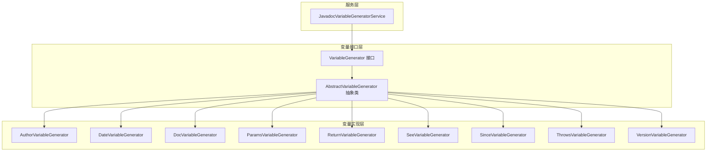
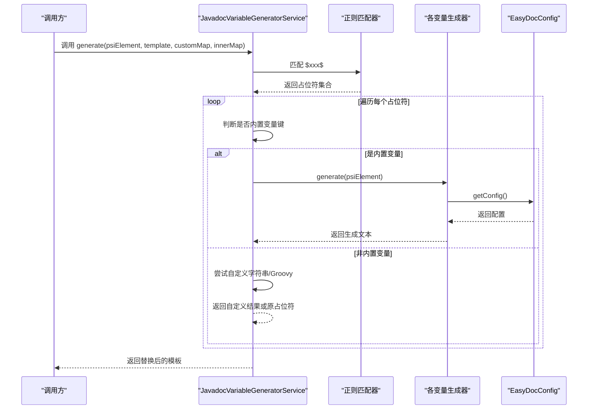
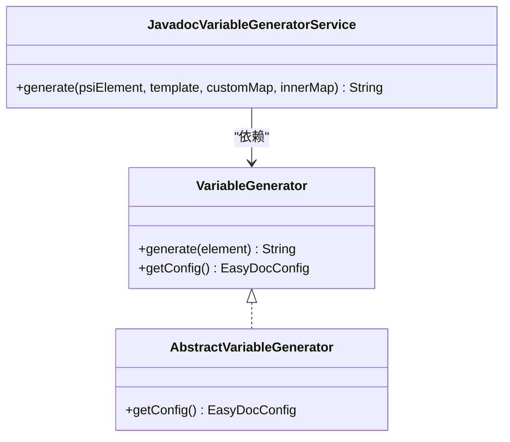
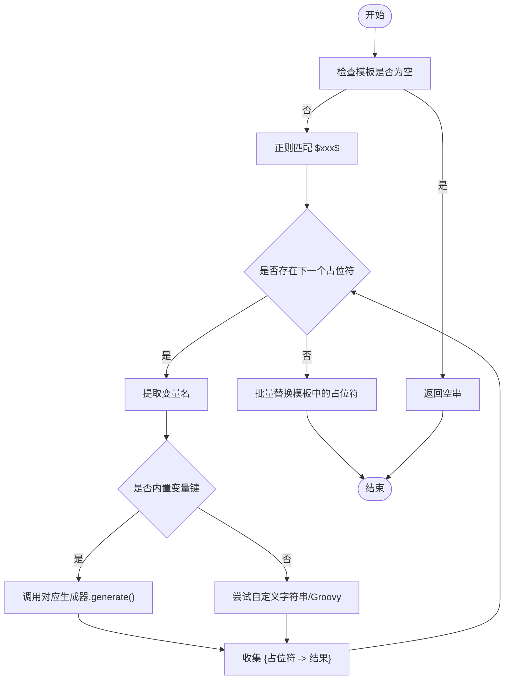
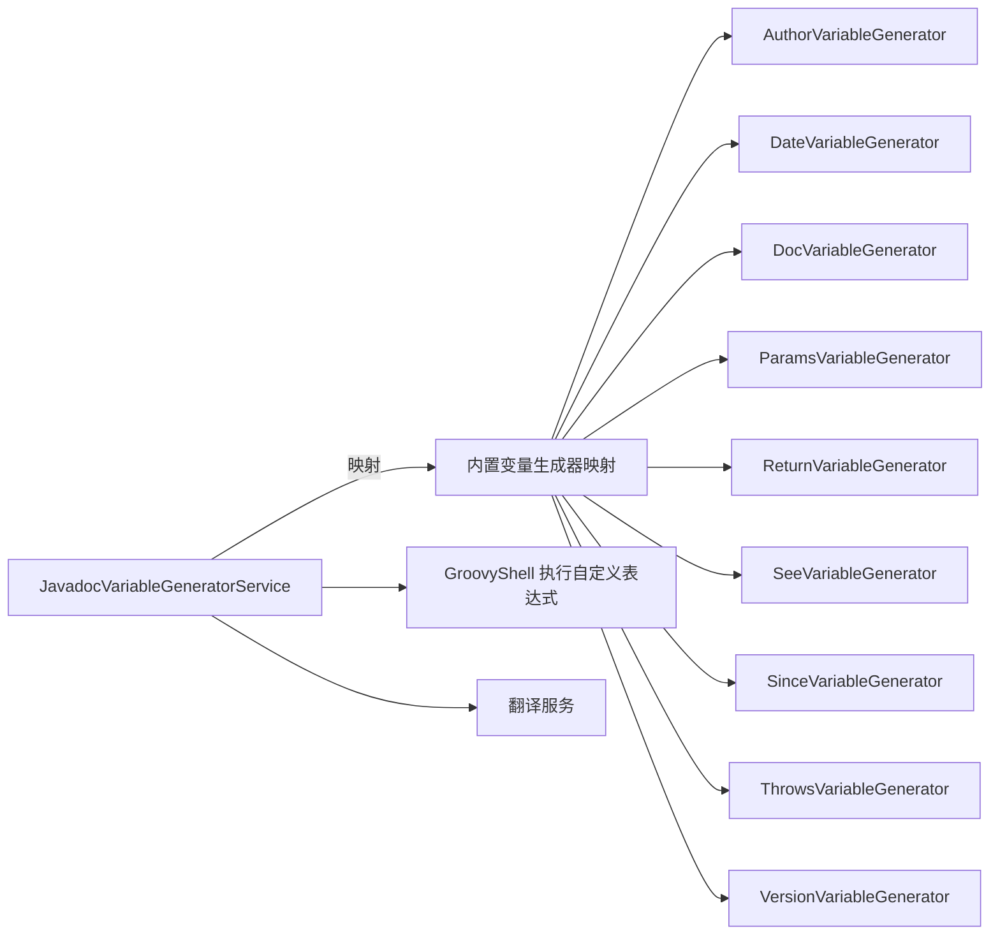

# 模板变量系统

<cite>
**本文引用的文件**
- [JavadocVariableGeneratorService.java](file://src/main/java/com/star/easydoc/javadoc/service/variable/JavadocVariableGeneratorService.java)
- [VariableGenerator.java](file://src/main/java/com/star/easydoc/javadoc/service/variable/VariableGenerator.java)
- [AbstractVariableGenerator.java](file://src/main/java/com/star/easydoc/javadoc/service/variable/impl/AbstractVariableGenerator.java)
- [AuthorVariableGenerator.java](file://src/main/java/com/star/easydoc/javadoc/service/variable/impl/AuthorVariableGenerator.java)
- [DateVariableGenerator.java](file://src/main/java/com/star/easydoc/javadoc/service/variable/impl/DateVariableGenerator.java)
- [DocVariableGenerator.java](file://src/main/java/com/star/easydoc/javadoc/service/variable/impl/DocVariableGenerator.java)
- [ParamsVariableGenerator.java](file://src/main/java/com/star/easydoc/javadoc/service/variable/impl/ParamsVariableGenerator.java)
- [ReturnVariableGenerator.java](file://src/main/java/com/star/easydoc/javadoc/service/variable/impl/ReturnVariableGenerator.java)
- [SeeVariableGenerator.java](file://src/main/java/com/star/easydoc/javadoc/service/variable/impl/SeeVariableGenerator.java)
- [SinceVariableGenerator.java](file://src/main/java/com/star/easydoc/javadoc/service/variable/impl/SinceVariableGenerator.java)
- [ThrowsVariableGenerator.java](file://src/main/java/com/star/easydoc/javadoc/service/variable/impl/ThrowsVariableGenerator.java)
- [VersionVariableGenerator.java](file://src/main/java/com/star/easydoc/javadoc/service/variable/impl/VersionVariableGenerator.java)
</cite>

## 目录
1. [简介](#简介)
2. [项目结构](#项目结构)
3. [核心组件](#核心组件)
4. [架构总览](#架构总览)
5. [详细组件分析](#详细组件分析)
6. [依赖分析](#依赖分析)
7. [性能考虑](#性能考虑)
8. [故障排查指南](#故障排查指南)
9. [结论](#结论)
10. [附录](#附录)

## 简介
本文件系统性梳理 Easy Javadoc 的模板变量系统，涵盖所有内置变量（如作者、日期、参数、返回值、异常、版本、since、see 等）的语义、语法格式、使用场景与生成规则；解释变量生成器的服务层工作流（解析、上下文获取、值生成、自定义扩展）；并提供最佳实践与常见问题排查建议。

## 项目结构
模板变量系统位于 javadoc/service/variable 目录下，采用“接口 + 抽象基类 + 多实现”的分层设计：
- 接口层：定义统一的生成契约
- 抽象层：封装通用配置读取逻辑
- 实现层：按变量类型实现具体生成策略
- 服务层：负责模板解析、占位符匹配、变量替换与自定义 Groovy 扩展

图表来源
- [JavadocVariableGeneratorService.java:35-127](file://src/main/java/com/star/easydoc/javadoc/service/variable/JavadocVariableGeneratorService.java#L35-L127)
- [VariableGenerator.java:12-27](file://src/main/java/com/star/easydoc/javadoc/service/variable/VariableGenerator.java#L12-L27)
- [AbstractVariableGenerator.java:14-20](file://src/main/java/com/star/easydoc/javadoc/service/variable/impl/AbstractVariableGenerator.java#L14-L20)

章节来源
- [JavadocVariableGeneratorService.java:35-127](file://src/main/java/com/star/easydoc/javadoc/service/variable/JavadocVariableGeneratorService.java#L35-L127)
- [VariableGenerator.java:12-27](file://src/main/java/com/star/easydoc/javadoc/service/variable/VariableGenerator.java#L12-L27)
- [AbstractVariableGenerator.java:14-20](file://src/main/java/com/star/easydoc/javadoc/service/variable/impl/AbstractVariableGenerator.java#L14-L20)

## 核心组件
- 变量生成器接口：定义 generate(element) 与 getConfig() 两个关键方法，约束实现类的职责边界
- 抽象生成器：集中提供配置读取能力（从 EasyDocConfigComponent 获取当前配置）
- 具体生成器：针对不同变量类型实现生成逻辑（作者、日期、参数、返回值、异常、版本、since、see、文档摘要）
- 服务层：负责模板字符串中占位符识别与替换，支持自定义字符串与 Groovy 表达式两种自定义变量

章节来源
- [VariableGenerator.java:12-27](file://src/main/java/com/star/easydoc/javadoc/service/variable/VariableGenerator.java#L12-L27)
- [AbstractVariableGenerator.java:14-20](file://src/main/java/com/star/easydoc/javadoc/service/variable/impl/AbstractVariableGenerator.java#L14-L20)
- [JavadocVariableGeneratorService.java:35-127](file://src/main/java/com/star/easydoc/javadoc/service/variable/JavadocVariableGeneratorService.java#L35-L127)

## 架构总览
模板变量生成流程如下：
- 输入：当前 PSI 元素（类/方法/字段等）、模板字符串、自定义值映射、内部变量映射
- 解析：正则匹配模板中的占位符（形如 $var$）
- 分发：若为内置变量键，则委派对应生成器；否则进入自定义处理
- 替换：批量替换模板中的占位符为生成结果

图表来源
- [JavadocVariableGeneratorService.java:60-125](file://src/main/java/com/star/easydoc/javadoc/service/variable/JavadocVariableGeneratorService.java#L60-L125)

章节来源
- [JavadocVariableGeneratorService.java:35-127](file://src/main/java/com/star/easydoc/javadoc/service/variable/JavadocVariableGeneratorService.java#L35-L127)

## 详细组件分析

### 变量生成器接口与抽象基类
- 接口职责：统一生成入口与配置访问
- 抽象基类：通过 ServiceManager 获取配置组件状态，供子类复用

图表来源
- [VariableGenerator.java:12-27](file://src/main/java/com/star/easydoc/javadoc/service/variable/VariableGenerator.java#L12-L27)
- [AbstractVariableGenerator.java:14-20](file://src/main/java/com/star/easydoc/javadoc/service/variable/impl/AbstractVariableGenerator.java#L14-L20)
- [JavadocVariableGeneratorService.java:35-127](file://src/main/java/com/star/easydoc/javadoc/service/variable/JavadocVariableGeneratorService.java#L35-L127)

章节来源
- [VariableGenerator.java:12-27](file://src/main/java/com/star/easydoc/javadoc/service/variable/VariableGenerator.java#L12-L27)
- [AbstractVariableGenerator.java:14-20](file://src/main/java/com/star/easydoc/javadoc/service/variable/impl/AbstractVariableGenerator.java#L14-L20)

### 内置变量一览与生成规则

- 作者变量 @author
  - 语法：$author$
  - 规则：读取配置中的作者信息
  - 使用场景：类/方法/字段的作者信息注入
  - 生成器：AuthorVariableGenerator

- 日期变量 @date
  - 语法：$date$
  - 规则：根据配置的日期格式化模板输出当前时间；格式异常时回退到默认格式
  - 使用场景：生成时间戳或版本日期
  - 生成器：DateVariableGenerator

- 文档摘要变量 @doc
  - 语法：$doc$
  - 规则：优先使用现有 Javadoc 摘要；若无或处于强制覆盖模式，则进行翻译
  - 使用场景：快速生成描述性文本
  - 生成器：DocVariableGenerator

- 参数变量 @params
  - 语法：$params$
  - 规则：遍历方法参数列表，结合现有 @param 注释与覆盖策略，对缺失或可覆盖的参数进行翻译并生成多行 @param
  - 使用场景：自动补全方法参数说明
  - 生成器：ParamsVariableGenerator

- 返回值变量 @return
  - 语法：$return$
  - 规则：根据返回类型决定输出格式：
    - 基础类型：直接输出 @return 类型
    - void：不输出
    - 复杂类型：依据配置选择代码样式、链接样式、文档样式或默认链接样式
  - 使用场景：自动补全返回值说明
  - 生成器：ReturnVariableGenerator

- 异常变量 @throws/@exception
  - 语法：$throws$
  - 规则：提取方法 throws 列表，逐个翻译并生成多行 @throws
  - 使用场景：自动补全异常说明
  - 生成器：ThrowsVariableGenerator

- 版本变量 @version
  - 语法：$version$
  - 规则：固定返回版本号
  - 使用场景：版本标识
  - 生成器：VersionVariableGenerator

- since 变量 @since
  - 语法：$since$
  - 规则：固定返回版本号
  - 使用场景：标注引入版本
  - 生成器：SinceVariableGenerator

- see 变量 @see/@link
  - 语法：$see$
  - 规则：按元素类型生成不同内容：
    - 类：父类与接口（排除 Object）
    - 方法：参数类型与返回类型的链接
    - 字段：非基础类型的类型链接
  - 使用场景：交叉引用与导航
  - 生成器：SeeVariableGenerator

章节来源
- [AuthorVariableGenerator.java:10-17](file://src/main/java/com/star/easydoc/javadoc/service/variable/impl/AuthorVariableGenerator.java#L10-L17)
- [DateVariableGenerator.java:15-28](file://src/main/java/com/star/easydoc/javadoc/service/variable/impl/DateVariableGenerator.java#L15-L28)
- [DocVariableGenerator.java:23-47](file://src/main/java/com/star/easydoc/javadoc/service/variable/impl/DocVariableGenerator.java#L23-L47)
- [ParamsVariableGenerator.java:27-116](file://src/main/java/com/star/easydoc/javadoc/service/variable/impl/ParamsVariableGenerator.java#L27-L116)
- [ReturnVariableGenerator.java:16-46](file://src/main/java/com/star/easydoc/javadoc/service/variable/impl/ReturnVariableGenerator.java#L16-L46)
- [ThrowsVariableGenerator.java:19-37](file://src/main/java/com/star/easydoc/javadoc/service/variable/impl/ThrowsVariableGenerator.java#L19-L37)
- [VersionVariableGenerator.java:11-19](file://src/main/java/com/star/easydoc/javadoc/service/variable/impl/VersionVariableGenerator.java#L11-L19)
- [SinceVariableGenerator.java:11-18](file://src/main/java/com/star/easydoc/javadoc/service/variable/impl/SinceVariableGenerator.java#L11-L18)
- [SeeVariableGenerator.java:23-65](file://src/main/java/com/star/easydoc/javadoc/service/variable/impl/SeeVariableGenerator.java#L23-L65)

### 变量解析与替换流程
- 占位符匹配：使用正则匹配 $变量名$ 形式
- 冲突处理：空键名直接返回空串；非内置变量尝试自定义字符串或 Groovy
- 批量替换：收集所有占位符与其结果，一次性替换模板

图表来源
- [JavadocVariableGeneratorService.java:60-92](file://src/main/java/com/star/easydoc/javadoc/service/variable/JavadocVariableGeneratorService.java#L60-L92)

章节来源
- [JavadocVariableGeneratorService.java:35-127](file://src/main/java/com/star/easydoc/javadoc/service/variable/JavadocVariableGeneratorService.java#L35-L127)

### 自定义变量生成器扩展指南
- 自定义字符串变量：在自定义值映射中以占位符名为键，类型为字符串，值为最终文本
- 自定义 Groovy 变量：在自定义值映射中以占位符名为键，类型为 Groovy，值为表达式；执行时会将内部变量映射注入到绑定对象中
- 注意事项：
  - Groovy 表达式需保证有返回值且可转为字符串
  - 表达式执行异常会被记录日志并回退到原始表达式文本
  - 若找不到自定义值，占位符将保持原样

章节来源
- [JavadocVariableGeneratorService.java:94-125](file://src/main/java/com/star/easydoc/javadoc/service/variable/JavadocVariableGeneratorService.java#L94-L125)

## 依赖分析
- 服务层依赖：持有内置变量生成器映射，按变量名分发
- 生成器依赖：均继承抽象基类，间接依赖 EasyDocConfig 组件
- 外部依赖：Groovy Shell 用于执行自定义表达式；翻译服务用于参数、返回值、异常的本地化描述生成

图表来源
- [JavadocVariableGeneratorService.java:42-52](file://src/main/java/com/star/easydoc/javadoc/service/variable/JavadocVariableGeneratorService.java#L42-L52)
- [ParamsVariableGenerator.java:28](file://src/main/java/com/star/easydoc/javadoc/service/variable/impl/ParamsVariableGenerator.java#L28)
- [ReturnVariableGenerator.java:17](file://src/main/java/com/star/easydoc/javadoc/service/variable/impl/ReturnVariableGenerator.java#L17)
- [ThrowsVariableGenerator.java:20](file://src/main/java/com/star/easydoc/javadoc/service/variable/impl/ThrowsVariableGenerator.java#L20)

章节来源
- [JavadocVariableGeneratorService.java:35-127](file://src/main/java/com/star/easydoc/javadoc/service/variable/JavadocVariableGeneratorService.java#L35-L127)

## 性能考虑
- 正则匹配与批量替换：模板越大、占位符越多，开销越高；建议控制模板复杂度
- 翻译服务调用：参数、返回值、异常的翻译可能带来网络延迟；可结合缓存策略优化
- Groovy 表达式：每次执行都有编译与求值成本；建议简化表达式逻辑
- 配置读取：通过单例组件获取配置，避免重复初始化

## 故障排查指南
- 占位符未生效
  - 检查占位符格式是否为 $变量名$，变量名是否正确
  - 确认变量名大小写是否与注册映射一致
- 自定义 Groovy 执行失败
  - 查看日志中关于表达式执行错误的信息
  - 检查表达式语法与返回值类型
- 日期格式异常
  - 检查配置中的日期格式模板是否合法
  - 系统会在异常时回退到默认格式
- 翻译结果不符合预期
  - 确认覆盖模式与目标语言设置
  - 检查翻译服务可用性与网络环境

章节来源
- [JavadocVariableGeneratorService.java:115-121](file://src/main/java/com/star/easydoc/javadoc/service/variable/JavadocVariableGeneratorService.java#L115-L121)
- [DateVariableGenerator.java:22-26](file://src/main/java/com/star/easydoc/javadoc/service/variable/impl/DateVariableGenerator.java#L22-L26)

## 结论
模板变量系统通过清晰的接口与抽象层、灵活的内置生成器与强大的自定义扩展能力，实现了对 Javadoc/KDoc 模板的高效填充。遵循本文的最佳实践与排错建议，可在保证一致性的同时提升生成效率与质量。

## 附录

### 变量清单与使用建议
- $author$：适用于所有元素，建议统一配置作者信息
- $date$：适用于版本日期或时间戳，注意格式合法性
- $doc$：优先复用已有注释，避免重复翻译
- $params$：配合覆盖模式使用，确保参数说明完整
- $return$：根据项目风格选择代码样式、链接样式或文档样式
- $throws$：自动提取异常类型并翻译，减少手写负担
- $version$/$since$：固定版本号，便于维护版本一致性
- $see$：按元素类型生成引用，增强文档可发现性