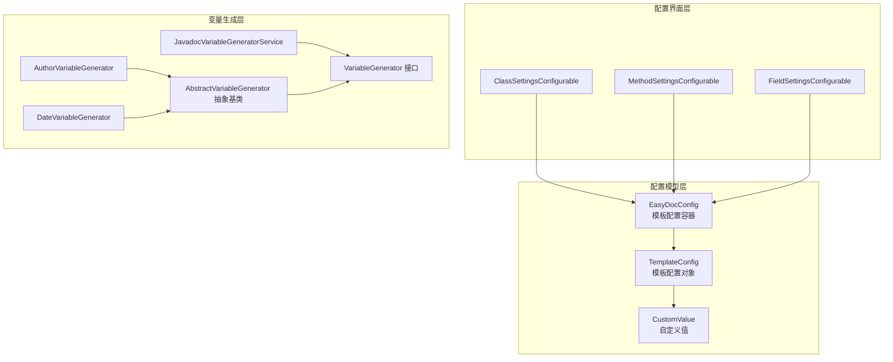
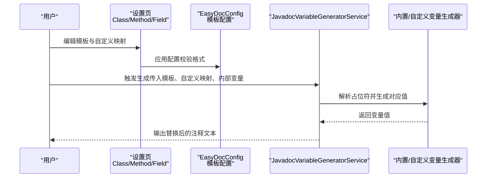
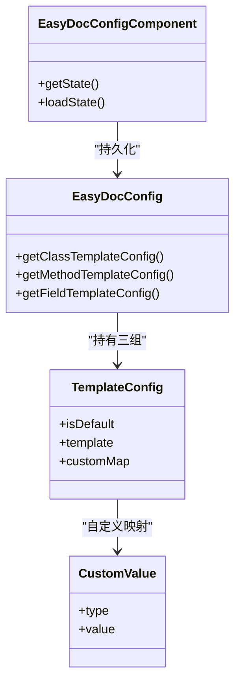
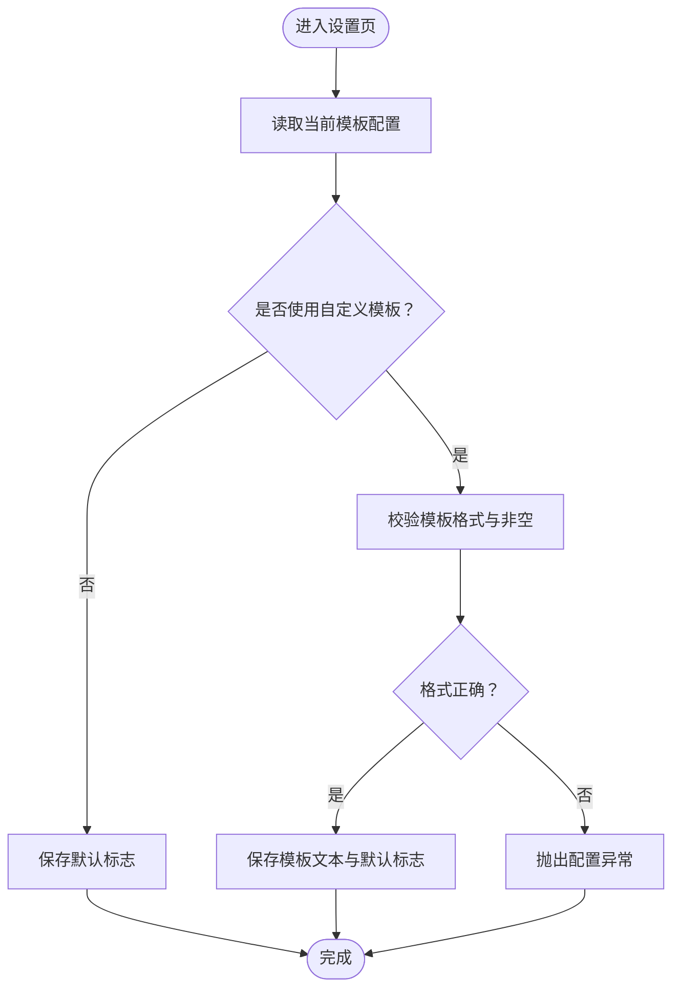
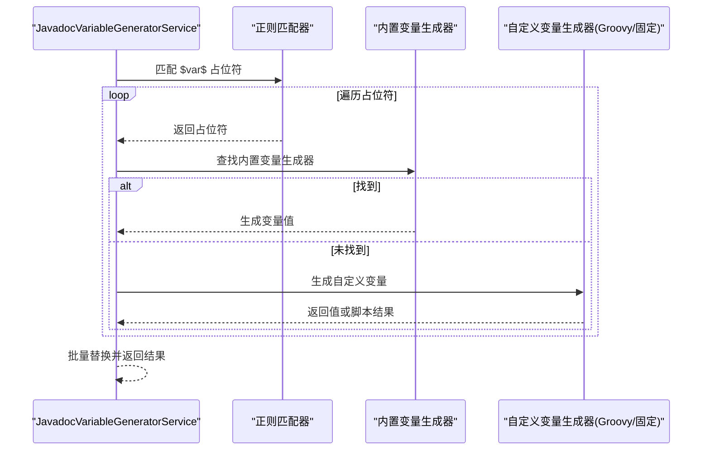
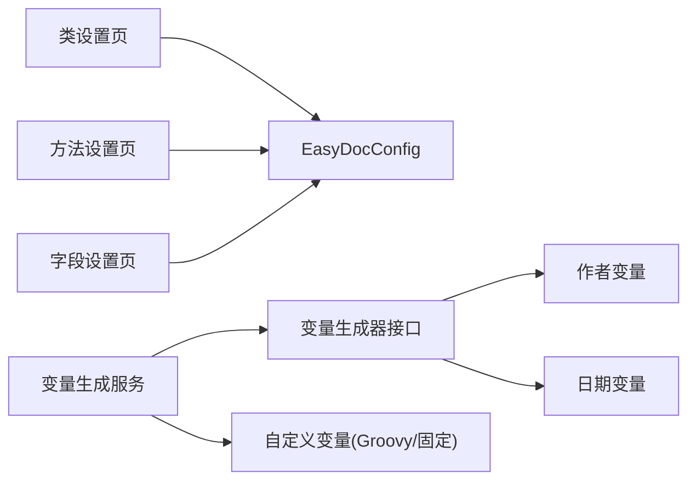

# 模板配置

<cite>
**本文引用的文件**
- [EasyDocConfig.java](file://src/main/java/com/star/easydoc/config/EasyDocConfig.java)
- [EasyDocConfigComponent.java](file://src/main/java/com/star/easydoc/config/EasyDocConfigComponent.java)
- [ClassSettingsConfigurable.java](file://src/main/java/com/star/easydoc/view/settings/javadoc/template/ClassSettingsConfigurable.java)
- [MethodSettingsConfigurable.java](file://src/main/java/com/star/easydoc/view/settings/javadoc/template/MethodSettingsConfigurable.java)
- [FieldSettingsConfigurable.java](file://src/main/java/com/star/easydoc/view/settings/javadoc/template/FieldSettingsConfigurable.java)
- [JavadocVariableGeneratorService.java](file://src/main/java/com/star/easydoc/javadoc/service/variable/JavadocVariableGeneratorService.java)
- [VariableGenerator.java](file://src/main/java/com/star/easydoc/javadoc/service/variable/VariableGenerator.java)
- [AbstractVariableGenerator.java](file://src/main/java/com/star/easydoc/javadoc/service/variable/impl/AbstractVariableGenerator.java)
- [AuthorVariableGenerator.java](file://src/main/java/com/star/easydoc/javadoc/service/variable/impl/AuthorVariableGenerator.java)
- [DateVariableGenerator.java](file://src/main/java/com/star/easydoc/javadoc/service/variable/impl/DateVariableGenerator.java)
</cite>

## 目录
1. [简介](#简介)
2. [项目结构](#项目结构)
3. [核心组件](#核心组件)
4. [架构总览](#架构总览)
5. [详细组件分析](#详细组件分析)
6. [依赖分析](#依赖分析)
7. [性能考虑](#性能考虑)
8. [故障排查指南](#故障排查指南)
9. [结论](#结论)
10. [附录](#附录)

## 简介
本指南面向 Easy Javadoc 插件的“模板配置”功能，系统讲解类模板、方法模板、字段模板的独立配置方法；解释模板语法与变量替换机制（含内置变量与自定义变量）；说明模板配置界面的使用流程（模板编辑器、变量生成器、自定义映射），并提供模板变量清单与最佳实践及常见问题解决方案。

## 项目结构
模板配置相关代码主要分布在以下模块：
- 配置模型层：持久化配置与模板配置对象
- 配置界面层：类/方法/字段模板设置页
- 变量生成层：内置变量生成器与自定义变量执行引擎

图表来源
- [EasyDocConfig.java:146-254](file://src/main/java/com/star/easydoc/config/EasyDocConfig.java#L146-L254)
- [ClassSettingsConfigurable.java:20-77](file://src/main/java/com/star/easydoc/view/settings/javadoc/template/ClassSettingsConfigurable.java#L20-L77)
- [MethodSettingsConfigurable.java:20-77](file://src/main/java/com/star/easydoc/view/settings/javadoc/template/MethodSettingsConfigurable.java#L20-L77)
- [FieldSettingsConfigurable.java:20-77](file://src/main/java/com/star/easydoc/view/settings/javadoc/template/FieldSettingsConfigurable.java#L20-L77)
- [JavadocVariableGeneratorService.java:35-127](file://src/main/java/com/star/easydoc/javadoc/service/variable/JavadocVariableGeneratorService.java#L35-L127)
- [VariableGenerator.java:12-27](file://src/main/java/com/star/easydoc/javadoc/service/variable/VariableGenerator.java#L12-L27)
- [AbstractVariableGenerator.java:14-20](file://src/main/java/com/star/easydoc/javadoc/service/variable/impl/AbstractVariableGenerator.java#L14-L20)

章节来源
- [EasyDocConfig.java:146-254](file://src/main/java/com/star/easydoc/config/EasyDocConfig.java#L146-L254)
- [EasyDocConfigComponent.java:19-68](file://src/main/java/com/star/easydoc/config/EasyDocConfigComponent.java#L19-L68)
- [ClassSettingsConfigurable.java:20-77](file://src/main/java/com/star/easydoc/view/settings/javadoc/template/ClassSettingsConfigurable.java#L20-L77)
- [MethodSettingsConfigurable.java:20-77](file://src/main/java/com/star/easydoc/view/settings/javadoc/template/MethodSettingsConfigurable.java#L20-L77)
- [FieldSettingsConfigurable.java:20-77](file://src/main/java/com/star/easydoc/view/settings/javadoc/template/FieldSettingsConfigurable.java#L20-L77)
- [JavadocVariableGeneratorService.java:35-127](file://src/main/java/com/star/easydoc/javadoc/service/variable/JavadocVariableGeneratorService.java#L35-L127)
- [VariableGenerator.java:12-27](file://src/main/java/com/star/easydoc/javadoc/service/variable/VariableGenerator.java#L12-L27)
- [AbstractVariableGenerator.java:14-20](file://src/main/java/com/star/easydoc/javadoc/service/variable/impl/AbstractVariableGenerator.java#L14-L20)
- [AuthorVariableGenerator.java:10-17](file://src/main/java/com/star/easydoc/javadoc/service/variable/impl/AuthorVariableGenerator.java#L10-L17)
- [DateVariableGenerator.java:15-28](file://src/main/java/com/star/easydoc/javadoc/service/variable/impl/DateVariableGenerator.java#L15-L28)

## 核心组件
- 持久化配置与模板容器
  - EasyDocConfig 提供插件全局配置，其中包含三组模板配置：类模板、方法模板、字段模板，以及对应的 KDoc 模板配置。
  - 每组模板配置由 TemplateConfig 表示，包含“是否默认”、“模板文本”、“自定义映射”三个字段。
  - 自定义映射项 CustomValue 含“类型（固定值/Groovy脚本）”和“值”。

- 配置界面与应用逻辑
  - 类/方法/字段设置页分别继承统一的模板配置可调用器，负责读取/校验/应用用户输入。
  - 应用时会进行格式校验（非默认模板必须以多行注释包裹），并在必要时抛出配置异常。

- 变量生成与替换
  - JavadocVariableGeneratorService 负责解析模板中的占位符（形如 $var$），按顺序匹配内置变量或自定义变量，并执行替换。
  - 内置变量通过实现 VariableGenerator 的具体类生成；自定义变量支持固定字符串与 Groovy 脚本两种类型，Groovy 脚本可访问内部变量上下文。

章节来源
- [EasyDocConfig.java:146-254](file://src/main/java/com/star/easydoc/config/EasyDocConfig.java#L146-L254)
- [EasyDocConfig.java:256-325](file://src/main/java/com/star/easydoc/config/EasyDocConfig.java#L256-L325)
- [ClassSettingsConfigurable.java:36-75](file://src/main/java/com/star/easydoc/view/settings/javadoc/template/ClassSettingsConfigurable.java#L36-L75)
- [MethodSettingsConfigurable.java:36-75](file://src/main/java/com/star/easydoc/view/settings/javadoc/template/MethodSettingsConfigurable.java#L36-L75)
- [FieldSettingsConfigurable.java:36-75](file://src/main/java/com/star/easydoc/view/settings/javadoc/template/FieldSettingsConfigurable.java#L36-L75)
- [JavadocVariableGeneratorService.java:37-92](file://src/main/java/com/star/easydoc/javadoc/service/variable/JavadocVariableGeneratorService.java#L37-L92)
- [JavadocVariableGeneratorService.java:102-125](file://src/main/java/com/star/easydoc/javadoc/service/variable/JavadocVariableGeneratorService.java#L102-L125)

## 架构总览
模板配置从“界面设置”到“持久化存储”，再到“变量解析与替换”的端到端流程如下：

图表来源
- [ClassSettingsConfigurable.java:48-75](file://src/main/java/com/star/easydoc/view/settings/javadoc/template/ClassSettingsConfigurable.java#L48-L75)
- [MethodSettingsConfigurable.java:48-75](file://src/main/java/com/star/easydoc/view/settings/javadoc/template/MethodSettingsConfigurable.java#L48-L75)
- [FieldSettingsConfigurable.java:48-75](file://src/main/java/com/star/easydoc/view/settings/javadoc/template/FieldSettingsConfigurable.java#L48-L75)
- [JavadocVariableGeneratorService.java:60-92](file://src/main/java/com/star/easydoc/javadoc/service/variable/JavadocVariableGeneratorService.java#L60-L92)

## 详细组件分析

### 模板配置模型与持久化
- 模板配置容器
  - 类模板、方法模板、字段模板分别对应独立的 TemplateConfig 实例，便于独立控制。
  - 每个 TemplateConfig 包含：
    - isDefault：是否使用默认模板
    - template：模板文本
    - customMap：自定义映射表（键为占位符名，值为 CustomValue）

- 自定义值类型
  - STRING：直接替换为固定字符串
  - GROOVY：执行 Groovy 脚本，返回字符串结果；脚本可访问内部变量上下文，异常会被记录但不会中断替换。

- 配置持久化
  - EasyDocConfigComponent 使用持久化注解，将配置序列化到 XML 文件，首次启动时初始化默认值（含模板配置）。

图表来源
- [EasyDocConfig.java:146-254](file://src/main/java/com/star/easydoc/config/EasyDocConfig.java#L146-L254)
- [EasyDocConfig.java:256-325](file://src/main/java/com/star/easydoc/config/EasyDocConfig.java#L256-L325)
- [EasyDocConfigComponent.java:19-68](file://src/main/java/com/star/easydoc/config/EasyDocConfigComponent.java#L19-L68)

章节来源
- [EasyDocConfig.java:146-254](file://src/main/java/com/star/easydoc/config/EasyDocConfig.java#L146-L254)
- [EasyDocConfig.java:256-325](file://src/main/java/com/star/easydoc/config/EasyDocConfig.java#L256-L325)
- [EasyDocConfigComponent.java:19-68](file://src/main/java/com/star/easydoc/config/EasyDocConfigComponent.java#L19-L68)

### 模板配置界面与应用流程
- 设置页职责
  - 读取当前模板配置，回显到界面
  - 用户切换“是否默认”后，若选择自定义模板，需填写模板文本并满足注释格式要求
  - 应用时写回 EasyDocConfig，并在必要时抛出配置异常

- 校验规则
  - 非默认模板必须以多行注释包裹（以“/**”开头、以“*/”结尾）
  - 模板文本为空时提示错误

图表来源
- [ClassSettingsConfigurable.java:36-75](file://src/main/java/com/star/easydoc/view/settings/javadoc/template/ClassSettingsConfigurable.java#L36-L75)
- [MethodSettingsConfigurable.java:36-75](file://src/main/java/com/star/easydoc/view/settings/javadoc/template/MethodSettingsConfigurable.java#L36-L75)
- [FieldSettingsConfigurable.java:36-75](file://src/main/java/com/star/easydoc/view/settings/javadoc/template/FieldSettingsConfigurable.java#L36-L75)

章节来源
- [ClassSettingsConfigurable.java:36-75](file://src/main/java/com/star/easydoc/view/settings/javadoc/template/ClassSettingsConfigurable.java#L36-L75)
- [MethodSettingsConfigurable.java:36-75](file://src/main/java/com/star/easydoc/view/settings/javadoc/template/MethodSettingsConfigurable.java#L36-L75)
- [FieldSettingsConfigurable.java:36-75](file://src/main/java/com/star/easydoc/view/settings/javadoc/template/FieldSettingsConfigurable.java#L36-L75)

### 变量生成与替换机制
- 占位符语法
  - 模板中使用形如 $var$ 的占位符
  - 支持内置变量与自定义变量两种来源

- 内置变量
  - author：作者信息（来自配置）
  - date：当前日期（格式来自配置）
  - params、return、throws、see、since、version、doc：分别对应参数、返回值、异常、参考、起始版本、版本、文档描述等

- 自定义变量
  - STRING：直接替换为固定字符串
  - GROOVY：执行脚本，返回字符串；可访问内部变量上下文；异常会被记录但不影响替换

- 替换流程
  - 解析模板，收集所有占位符
  - 对每个占位符，优先匹配内置变量生成器，否则走自定义变量生成
  - 执行字符串批量替换，输出最终注释文本

图表来源
- [JavadocVariableGeneratorService.java:37-92](file://src/main/java/com/star/easydoc/javadoc/service/variable/JavadocVariableGeneratorService.java#L37-L92)
- [JavadocVariableGeneratorService.java:102-125](file://src/main/java/com/star/easydoc/javadoc/service/variable/JavadocVariableGeneratorService.java#L102-L125)
- [VariableGenerator.java:12-27](file://src/main/java/com/star/easydoc/javadoc/service/variable/VariableGenerator.java#L12-L27)
- [AbstractVariableGenerator.java:14-20](file://src/main/java/com/star/easydoc/javadoc/service/variable/impl/AbstractVariableGenerator.java#L14-L20)
- [AuthorVariableGenerator.java:10-17](file://src/main/java/com/star/easydoc/javadoc/service/variable/impl/AuthorVariableGenerator.java#L10-L17)
- [DateVariableGenerator.java:15-28](file://src/main/java/com/star/easydoc/javadoc/service/variable/impl/DateVariableGenerator.java#L15-L28)

章节来源
- [JavadocVariableGeneratorService.java:37-92](file://src/main/java/com/star/easydoc/javadoc/service/variable/JavadocVariableGeneratorService.java#L37-L92)
- [JavadocVariableGeneratorService.java:102-125](file://src/main/java/com/star/easydoc/javadoc/service/variable/JavadocVariableGeneratorService.java#L102-L125)
- [VariableGenerator.java:12-27](file://src/main/java/com/star/easydoc/javadoc/service/variable/VariableGenerator.java#L12-L27)
- [AbstractVariableGenerator.java:14-20](file://src/main/java/com/star/easydoc/javadoc/service/variable/impl/AbstractVariableGenerator.java#L14-L20)
- [AuthorVariableGenerator.java:10-17](file://src/main/java/com/star/easydoc/javadoc/service/variable/impl/AuthorVariableGenerator.java#L10-L17)
- [DateVariableGenerator.java:15-28](file://src/main/java/com/star/easydoc/javadoc/service/variable/impl/DateVariableGenerator.java#L15-L28)

## 依赖分析
- 组件耦合
  - 设置页与 EasyDocConfig 强耦合，用于读取/写入模板配置
  - 变量生成服务与内置变量生成器弱耦合，通过映射注册
  - 自定义变量通过类型区分处理，扩展性强

- 外部依赖
  - 正则表达式用于占位符识别
  - GroovyShell 用于执行自定义脚本
  - IntelliJ 平台组件用于读取项目上下文与持久化

图表来源
- [ClassSettingsConfigurable.java:20-77](file://src/main/java/com/star/easydoc/view/settings/javadoc/template/ClassSettingsConfigurable.java#L20-L77)
- [MethodSettingsConfigurable.java:20-77](file://src/main/java/com/star/easydoc/view/settings/javadoc/template/MethodSettingsConfigurable.java#L20-L77)
- [FieldSettingsConfigurable.java:20-77](file://src/main/java/com/star/easydoc/view/settings/javadoc/template/FieldSettingsConfigurable.java#L20-L77)
- [JavadocVariableGeneratorService.java:42-52](file://src/main/java/com/star/easydoc/javadoc/service/variable/JavadocVariableGeneratorService.java#L42-L52)
- [AuthorVariableGenerator.java:10-17](file://src/main/java/com/star/easydoc/javadoc/service/variable/impl/AuthorVariableGenerator.java#L10-L17)
- [DateVariableGenerator.java:15-28](file://src/main/java/com/star/easydoc/javadoc/service/variable/impl/DateVariableGenerator.java#L15-L28)

章节来源
- [ClassSettingsConfigurable.java:20-77](file://src/main/java/com/star/easydoc/view/settings/javadoc/template/ClassSettingsConfigurable.java#L20-L77)
- [MethodSettingsConfigurable.java:20-77](file://src/main/java/com/star/easydoc/view/settings/javadoc/template/MethodSettingsConfigurable.java#L20-L77)
- [FieldSettingsConfigurable.java:20-77](file://src/main/java/com/star/easydoc/view/settings/javadoc/template/FieldSettingsConfigurable.java#L20-L77)
- [JavadocVariableGeneratorService.java:42-52](file://src/main/java/com/star/easydoc/javadoc/service/variable/JavadocVariableGeneratorService.java#L42-L52)

## 性能考虑
- 占位符匹配与替换
  - 使用正则一次性扫描并收集占位符，随后进行批量替换，时间复杂度近似 O(n)（n 为模板长度）
- 内置变量生成
  - 多数内置变量生成开销极低（常数时间），日期格式化受配置影响
- 自定义变量（Groovy）
  - 脚本执行可能带来额外开销，建议保持脚本简洁；异常会被捕获并记录，不影响整体流程

[本节为通用性能讨论，无需特定文件来源]

## 故障排查指南
- 模板格式错误
  - 现象：应用设置时报错，提示模板格式不正确
  - 原因：非默认模板未以多行注释包裹
  - 处理：确保模板以“/**”开头、以“*/”结尾，且不为空

- Groovy 脚本执行失败
  - 现象：自定义变量未按预期生成，日志出现 Groovy 执行错误
  - 原因：脚本语法错误或未返回字符串
  - 处理：检查脚本语法与返回值；可在本地验证脚本逻辑

- 日期格式异常
  - 现象：$date$ 变量未按期望显示
  - 原因：日期格式配置不合法
  - 处理：修正日期格式配置为合法模式

章节来源
- [ClassSettingsConfigurable.java:55-63](file://src/main/java/com/star/easydoc/view/settings/javadoc/template/ClassSettingsConfigurable.java#L55-L63)
- [MethodSettingsConfigurable.java:55-63](file://src/main/java/com/star/easydoc/view/settings/javadoc/template/MethodSettingsConfigurable.java#L55-L63)
- [FieldSettingsConfigurable.java:55-63](file://src/main/java/com/star/easydoc/view/settings/javadoc/template/FieldSettingsConfigurable.java#L55-L63)
- [JavadocVariableGeneratorService.java:115-121](file://src/main/java/com/star/easydoc/javadoc/service/variable/JavadocVariableGeneratorService.java#L115-L121)
- [DateVariableGenerator.java:20-26](file://src/main/java/com/star/easydoc/javadoc/service/variable/impl/DateVariableGenerator.java#L20-L26)

## 结论
Easy Javadoc 的模板系统通过“独立模板配置 + 统一变量生成服务”实现了灵活而强大的注释生成能力。用户可通过设置页独立管理类/方法/字段模板，利用内置与自定义变量组合生成高质量注释；同时，严格的格式校验与健壮的错误处理保障了使用的稳定性。

[本节为总结性内容，无需特定文件来源]

## 附录

### 模板变量清单与说明
- 内置变量
  - $author$：作者信息（来自配置）
  - $date$：当前日期（格式来自配置）
  - $params$：方法参数列表（根据参数生成）
  - $return$：方法返回值描述（根据返回类型生成）
  - $throws$：方法抛出的异常列表（根据异常声明生成）
  - $see$：参考链接（可扩展）
  - $since$：版本起始信息（可扩展）
  - $version$：版本号（可扩展）
  - $doc$：元素文档描述（可扩展）

- 自定义变量
  - 类型：固定值（STRING）、Groovy 脚本（GROOVY）
  - 用途：覆盖内置变量行为或注入动态内容
  - 上下文：Groovy 脚本可访问内部变量映射（由调用方提供）

章节来源
- [JavadocVariableGeneratorService.java:42-52](file://src/main/java/com/star/easydoc/javadoc/service/variable/JavadocVariableGeneratorService.java#L42-L52)
- [JavadocVariableGeneratorService.java:102-125](file://src/main/java/com/star/easydoc/javadoc/service/variable/JavadocVariableGeneratorService.java#L102-L125)
- [VariableGenerator.java:12-27](file://src/main/java/com/star/easydoc/javadoc/service/variable/VariableGenerator.java#L12-L27)
- [AbstractVariableGenerator.java:14-20](file://src/main/java/com/star/easydoc/javadoc/service/variable/impl/AbstractVariableGenerator.java#L14-L20)
- [AuthorVariableGenerator.java:10-17](file://src/main/java/com/star/easydoc/javadoc/service/variable/impl/AuthorVariableGenerator.java#L10-L17)
- [DateVariableGenerator.java:15-28](file://src/main/java/com/star/easydoc/javadoc/service/variable/impl/DateVariableGenerator.java#L15-L28)

### 最佳实践
- 模板设计
  - 明确分隔：使用清晰的标签与换行，提升可读性
  - 语义化占位符：优先使用内置变量，减少自定义变量数量
  - 脚本最小化：Groovy 脚本尽量短小、可测试
- 配置管理
  - 分环境/项目维护：结合项目级单词映射与自定义变量，实现差异化输出
  - 定期校验：对自定义模板与脚本进行回归验证
- 错误预防
  - 应用前预检：确保模板格式正确、日期格式合法
  - 日志关注：留意 Groovy 执行错误与日期格式异常

[本节为通用最佳实践，无需特定文件来源]