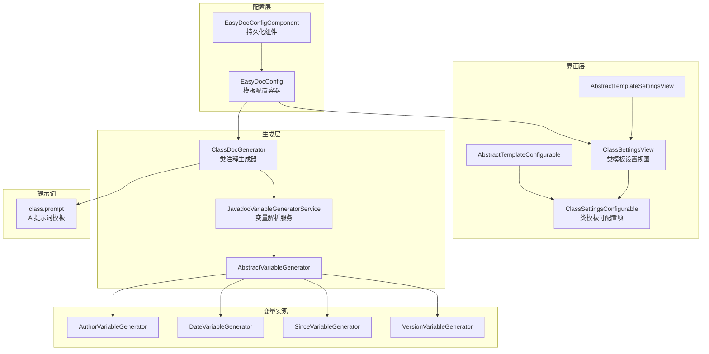
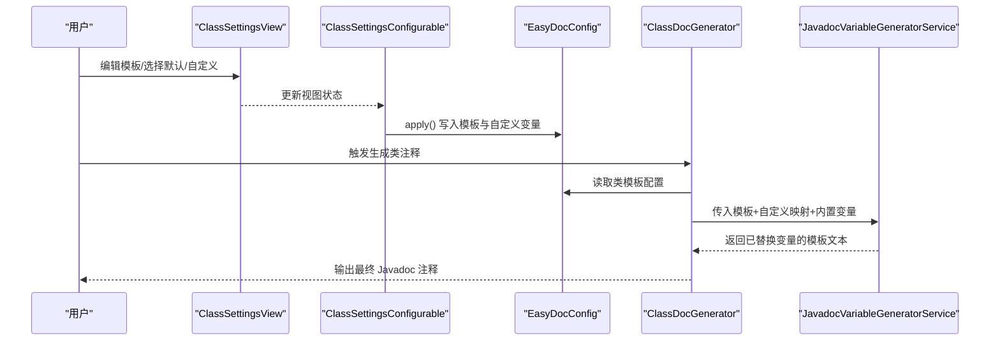
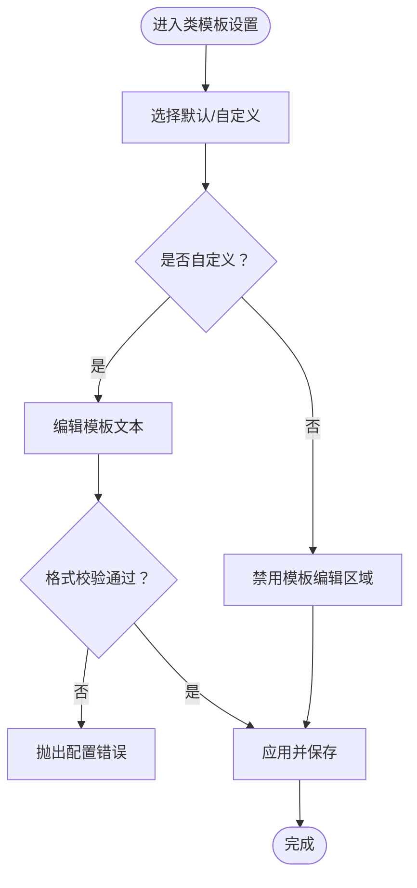
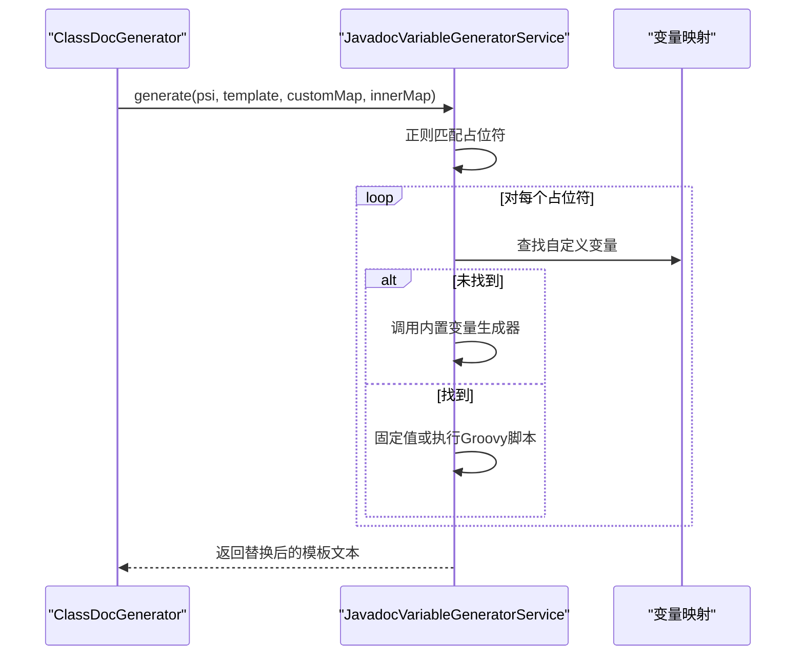
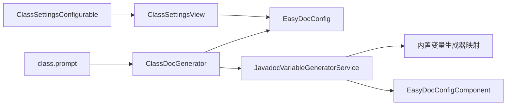

# 类模板配置

<cite>
**本文引用的文件**
- [src/main/java/com/star/easydoc/view/settings/javadoc/template/ClassSettingsView.java](file://src/main/java/com/star/easydoc/view/settings/javadoc/template/ClassSettingsView.java)
- [src/main/java/com/star/easydoc/view/settings/javadoc/template/ClassSettingsConfigurable.java](file://src/main/java/com/star/easydoc/view/settings/javadoc/template/ClassSettingsConfigurable.java)
- [src/main/java/com/star/easydoc/view/settings/javadoc/template/AbstractTemplateSettingsView.java](file://src/main/java/com/star/easydoc/view/settings/javadoc/template/AbstractTemplateSettingsView.java)
- [src/main/java/com/star/easydoc/view/settings/javadoc/template/AbstractTemplateConfigurable.java](file://src/main/java/com/star/easydoc/view/settings/javadoc/template/AbstractTemplateConfigurable.java)
- [src/main/java/com/star/easydoc/config/EasyDocConfig.java](file://src/main/java/com/star/easydoc/config/EasyDocConfig.java)
- [src/main/java/com/star/easydoc/config/EasyDocConfigComponent.java](file://src/main/java/com/star/easydoc/config/EasyDocConfigComponent.java)
- [src/main/java/com/star/easydoc/javadoc/service/generator/impl/ClassDocGenerator.java](file://src/main/java/com/star/easydoc/javadoc/service/generator/impl/ClassDocGenerator.java)
- [src/main/java/com/star/easydoc/javadoc/service/variable/JavadocVariableGeneratorService.java](file://src/main/java/com/star/easydoc/javadoc/service/variable/JavadocVariableGeneratorService.java)
- [src/main/java/com/star/easydoc/javadoc/service/variable/impl/AuthorVariableGenerator.java](file://src/main/java/com/star/easydoc/javadoc/service/variable/impl/AuthorVariableGenerator.java)
- [src/main/java/com/star/easydoc/javadoc/service/variable/impl/DateVariableGenerator.java](file://src/main/java/com/star/easydoc/javadoc/service/variable/impl/DateVariableGenerator.java)
- [src/main/java/com/star/easydoc/javadoc/service/variable/impl/SinceVariableGenerator.java](file://src/main/java/com/star/easydoc/javadoc/service/variable/impl/SinceVariableGenerator.java)
- [src/main/java/com/star/easydoc/javadoc/service/variable/impl/VersionVariableGenerator.java](file://src/main/java/com/star/easydoc/javadoc/service/variable/impl/VersionVariableGenerator.java)
- [src/main/java/com/star/easydoc/javadoc/service/variable/impl/AbstractVariableGenerator.java](file://src/main/java/com/star/easydoc/javadoc/service/variable/impl/AbstractVariableGenerator.java)
- [src/main/resources/prompts/chatglm/class.prompt](file://src/main/resources/prompts/chatglm/class.prompt)
- [src/main/java/com/star/easydoc/common/Consts.java](file://src/main/java/com/star/easydoc/common/Consts.java)
</cite>

## 目录
1. [简介](#简介)
2. [项目结构](#项目结构)
3. [核心组件](#核心组件)
4. [架构总览](#架构总览)
5. [详细组件分析](#详细组件分析)
6. [依赖分析](#依赖分析)
7. [性能考虑](#性能考虑)
8. [故障排查指南](#故障排查指南)
9. [结论](#结论)
10. [附录](#附录)

## 简介
本章节面向“类模板配置”的使用与实现，系统性阐述类级别的 Javadoc 模板语法、变量替换规则、默认模板结构，以及在 IDE 设置界面中的编辑流程与校验逻辑。同时给出最佳实践、常见配置场景与可参考的实现路径。

## 项目结构
围绕类模板配置的相关模块主要分布在以下位置：
- 配置模型与持久化：config 包下的配置类与组件
- 类模板设置界面：view.settings.javadoc.template 下的视图与可配置项
- 模板变量解析与生成：javadoc.service.variable.* 与 generator.impl.ClassDocGenerator
- 提示词模板（AI 场景）：resources/prompts/chatglm/class.prompt

图表来源
- [src/main/java/com/star/easydoc/config/EasyDocConfig.java:146-159](file://src/main/java/com/star/easydoc/config/EasyDocConfig.java#L146-L159)
- [src/main/java/com/star/easydoc/config/EasyDocConfigComponent.java:19-56](file://src/main/java/com/star/easydoc/config/EasyDocConfigComponent.java#L19-L56)
- [src/main/java/com/star/easydoc/view/settings/javadoc/template/ClassSettingsView.java:24-179](file://src/main/java/com/star/easydoc/view/settings/javadoc/template/ClassSettingsView.java#L24-L179)
- [src/main/java/com/star/easydoc/view/settings/javadoc/template/ClassSettingsConfigurable.java:20-77](file://src/main/java/com/star/easydoc/view/settings/javadoc/template/ClassSettingsConfigurable.java#L20-L77)
- [src/main/java/com/star/easydoc/javadoc/service/generator/impl/ClassDocGenerator.java:29-115](file://src/main/java/com/star/easydoc/javadoc/service/generator/impl/ClassDocGenerator.java#L29-L115)
- [src/main/java/com/star/easydoc/javadoc/service/variable/JavadocVariableGeneratorService.java:35-127](file://src/main/java/com/star/easydoc/javadoc/service/variable/JavadocVariableGeneratorService.java#L35-L127)

章节来源
- [src/main/java/com/star/easydoc/config/EasyDocConfig.java:146-159](file://src/main/java/com/star/easydoc/config/EasyDocConfig.java#L146-L159)
- [src/main/java/com/star/easydoc/config/EasyDocConfigComponent.java:19-56](file://src/main/java/com/star/easydoc/config/EasyDocConfigComponent.java#L19-L56)
- [src/main/java/com/star/easydoc/view/settings/javadoc/template/ClassSettingsView.java:24-179](file://src/main/java/com/star/easydoc/view/settings/javadoc/template/ClassSettingsView.java#L24-L179)
- [src/main/java/com/star/easydoc/view/settings/javadoc/template/ClassSettingsConfigurable.java:20-77](file://src/main/java/com/star/easydoc/view/settings/javadoc/template/ClassSettingsConfigurable.java#L20-L77)
- [src/main/java/com/star/easydoc/javadoc/service/generator/impl/ClassDocGenerator.java:29-115](file://src/main/java/com/star/easydoc/javadoc/service/generator/impl/ClassDocGenerator.java#L29-L115)
- [src/main/java/com/star/easydoc/javadoc/service/variable/JavadocVariableGeneratorService.java:35-127](file://src/main/java/com/star/easydoc/javadoc/service/variable/JavadocVariableGeneratorService.java#L35-L127)

## 核心组件
- 配置模型与持久化
  - EasyDocConfig.TemplateConfig：封装“是否默认模板”“模板文本”“自定义变量映射”
  - EasyDocConfig：聚合各类模板配置（类/方法/属性），并提供默认值与项目级合并
  - EasyDocConfigComponent：负责初始化与持久化加载
- 类模板设置界面
  - ClassSettingsView：提供默认/自定义单选、模板文本区、内置变量表、自定义变量表与增删操作
  - ClassSettingsConfigurable：实现 isModified/apply/reset，负责校验与写回配置
- 模板变量解析与生成
  - JavadocVariableGeneratorService：扫描模板占位符、匹配内置变量或自定义变量（含 Groovy 脚本）
  - ClassDocGenerator：选择默认或自定义模板，调用变量解析服务，并与现有注释进行合并策略处理

章节来源
- [src/main/java/com/star/easydoc/config/EasyDocConfig.java:211-254](file://src/main/java/com/star/easydoc/config/EasyDocConfig.java#L211-L254)
- [src/main/java/com/star/easydoc/config/EasyDocConfigComponent.java:19-56](file://src/main/java/com/star/easydoc/config/EasyDocConfigComponent.java#L19-L56)
- [src/main/java/com/star/easydoc/view/settings/javadoc/template/ClassSettingsView.java:24-179](file://src/main/java/com/star/easydoc/view/settings/javadoc/template/ClassSettingsView.java#L24-L179)
- [src/main/java/com/star/easydoc/view/settings/javadoc/template/ClassSettingsConfigurable.java:20-77](file://src/main/java/com/star/easydoc/view/settings/javadoc/template/ClassSettingsConfigurable.java#L20-L77)
- [src/main/java/com/star/easydoc/javadoc/service/variable/JavadocVariableGeneratorService.java:35-127](file://src/main/java/com/star/easydoc/javadoc/service/variable/JavadocVariableGeneratorService.java#L35-L127)
- [src/main/java/com/star/easydoc/javadoc/service/generator/impl/ClassDocGenerator.java:29-115](file://src/main/java/com/star/easydoc/javadoc/service/generator/impl/ClassDocGenerator.java#L29-L115)

## 架构总览
类模板从“用户配置”到“注释生成”的关键流程如下：

图表来源
- [src/main/java/com/star/easydoc/view/settings/javadoc/template/ClassSettingsView.java:100-129](file://src/main/java/com/star/easydoc/view/settings/javadoc/template/ClassSettingsView.java#L100-L129)
- [src/main/java/com/star/easydoc/view/settings/javadoc/template/ClassSettingsConfigurable.java:47-64](file://src/main/java/com/star/easydoc/view/settings/javadoc/template/ClassSettingsConfigurable.java#L47-L64)
- [src/main/java/com/star/easydoc/javadoc/service/generator/impl/ClassDocGenerator.java:44-68](file://src/main/java/com/star/easydoc/javadoc/service/generator/impl/ClassDocGenerator.java#L44-L68)
- [src/main/java/com/star/easydoc/javadoc/service/variable/JavadocVariableGeneratorService.java:60-92](file://src/main/java/com/star/easydoc/javadoc/service/variable/JavadocVariableGeneratorService.java#L60-L92)

## 详细组件分析

### 类模板语法与变量替换
- 占位符语法
  - 采用形如 “$变量名$” 的占位符，解析器通过正则匹配所有占位符
- 变量类型
  - 内置变量：由对应变量生成器处理（如作者、日期、since、version 等）
  - 自定义变量：支持“固定值”和“Groovy脚本”两种类型；Groovy 脚本可访问内置变量映射
- 默认模板
  - 当未启用自定义模板时，使用内置默认模板（包含注释信息、作者、日期等）

章节来源
- [src/main/java/com/star/easydoc/javadoc/service/variable/JavadocVariableGeneratorService.java:37-92](file://src/main/java/com/star/easydoc/javadoc/service/variable/JavadocVariableGeneratorService.java#L37-L92)
- [src/main/java/com/star/easydoc/javadoc/service/generator/impl/ClassDocGenerator.java:36-42](file://src/main/java/com/star/easydoc/javadoc/service/generator/impl/ClassDocGenerator.java#L36-L42)

### 类模板可用变量
- 内置变量（大小写不敏感）
  - 作者：来自通用配置作者字段
  - 日期：基于通用配置日期格式渲染
  - since：默认版本号
  - version：默认版本号
  - doc：类注释内容（由具体实现生成）
  - params/return/throws/see：方法注释相关变量（类模板通常不直接使用）
- 内置变量映射（界面展示）
  - 在类模板设置界面中，内置变量与其含义以表格形式展示，便于用户理解

章节来源
- [src/main/java/com/star/easydoc/view/settings/javadoc/template/ClassSettingsView.java:38-46](file://src/main/java/com/star/easydoc/view/settings/javadoc/template/ClassSettingsView.java#L38-L46)
- [src/main/java/com/star/easydoc/javadoc/service/variable/JavadocVariableGeneratorService.java:42-52](file://src/main/java/com/star/easydoc/javadoc/service/variable/JavadocVariableGeneratorService.java#L42-L52)
- [src/main/java/com/star/easydoc/javadoc/service/variable/impl/AuthorVariableGenerator.java:10-17](file://src/main/java/com/star/easydoc/javadoc/service/variable/impl/AuthorVariableGenerator.java#L10-L17)
- [src/main/java/com/star/easydoc/javadoc/service/variable/impl/DateVariableGenerator.java:15-28](file://src/main/java/com/star/easydoc/javadoc/service/variable/impl/DateVariableGenerator.java#L15-L28)
- [src/main/java/com/star/easydoc/javadoc/service/variable/impl/SinceVariableGenerator.java:11-18](file://src/main/java/com/star/easydoc/javadoc/service/variable/impl/SinceVariableGenerator.java#L11-L18)
- [src/main/java/com/star/easydoc/javadoc/service/variable/impl/VersionVariableGenerator.java:11-19](file://src/main/java/com/star/easydoc/javadoc/service/variable/impl/VersionVariableGenerator.java#L11-L19)

### 类模板编辑界面使用方法
- 界面组成
  - 单选框：默认模板 / 自定义模板
  - 模板文本区：存放自定义模板文本
  - 内置变量表：展示可用内置变量及其含义
  - 自定义变量表：展示已添加的自定义变量，支持新增与删除
- 操作流程
  - 切换到“自定义模板”，输入模板文本（需以 “/**” 开头、以 “*/” 结尾）
  - 通过工具栏按钮添加自定义变量（固定值或 Groovy 脚本）
  - 应用后保存配置，后续生成类注释时生效
- 校验规则
  - 使用自定义模板时，模板不能为空且必须以 “/**” 开头、以 “*/” 结尾，否则抛出配置错误

图表来源
- [src/main/java/com/star/easydoc/view/settings/javadoc/template/ClassSettingsView.java:100-129](file://src/main/java/com/star/easydoc/view/settings/javadoc/template/ClassSettingsView.java#L100-L129)
- [src/main/java/com/star/easydoc/view/settings/javadoc/template/ClassSettingsConfigurable.java:47-64](file://src/main/java/com/star/easydoc/view/settings/javadoc/template/ClassSettingsConfigurable.java#L47-L64)

章节来源
- [src/main/java/com/star/easydoc/view/settings/javadoc/template/ClassSettingsView.java:24-179](file://src/main/java/com/star/easydoc/view/settings/javadoc/template/ClassSettingsView.java#L24-L179)
- [src/main/java/com/star/easydoc/view/settings/javadoc/template/ClassSettingsConfigurable.java:20-77](file://src/main/java/com/star/easydoc/view/settings/javadoc/template/ClassSettingsConfigurable.java#L20-L77)

### 变量生成与替换流程
- 解析步骤
  - 扫描模板中的所有占位符
  - 若为内置变量名，交由对应生成器生成值
  - 否则尝试匹配自定义变量映射；若为固定值直接返回，若为 Groovy 脚本则执行并返回结果
  - 最终进行批量替换，输出完整注释文本
- Groovy 脚本能力
  - 可访问内置变量映射（如作者、类名、分支、项目名等），便于动态生成复杂内容

图表来源
- [src/main/java/com/star/easydoc/javadoc/service/generator/impl/ClassDocGenerator.java:60-68](file://src/main/java/com/star/easydoc/javadoc/service/generator/impl/ClassDocGenerator.java#L60-L68)
- [src/main/java/com/star/easydoc/javadoc/service/variable/JavadocVariableGeneratorService.java:60-92](file://src/main/java/com/star/easydoc/javadoc/service/variable/JavadocVariableGeneratorService.java#L60-L92)
- [src/main/java/com/star/easydoc/javadoc/service/variable/impl/AbstractVariableGenerator.java:14-20](file://src/main/java/com/star/easydoc/javadoc/service/variable/impl/AbstractVariableGenerator.java#L14-L20)

章节来源
- [src/main/java/com/star/easydoc/javadoc/service/variable/JavadocVariableGeneratorService.java:35-127](file://src/main/java/com/star/easydoc/javadoc/service/variable/JavadocVariableGeneratorService.java#L35-L127)
- [src/main/java/com/star/easydoc/javadoc/service/generator/impl/ClassDocGenerator.java:95-109](file://src/main/java/com/star/easydoc/javadoc/service/generator/impl/ClassDocGenerator.java#L95-L109)

### 类模板配置最佳实践
- 模板结构设计
  - 保持清晰的层级与缩进，确保生成的注释可读性强
  - 使用必要的空行分隔段落，提升可维护性
- 变量使用技巧
  - 优先使用内置变量（作者、日期、since、version）统一风格
  - 复杂逻辑使用自定义变量并选择“Groovy脚本”，结合内置变量映射实现动态内容
- 国际化支持
  - 日期格式可通过通用配置调整；若需要多语言注释，建议在模板中保留占位符，由业务侧在生成后统一处理
- 安全与健壮性
  - 自定义 Groovy 脚本需保证语法正确与返回字符串类型，避免异常导致替换失败
  - 建议在模板中预留占位符以便后续替换，而非硬编码

[本节为通用指导，无需列出具体文件来源]

### 常见配置场景与实现路径
- 使用默认模板
  - 在设置界面选择“默认模板”，无需额外编辑
  - 实现路径：[src/main/java/com/star/easydoc/javadoc/service/generator/impl/ClassDocGenerator.java:60-64](file://src/main/java/com/star/easydoc/javadoc/service/generator/impl/ClassDocGenerator.java#L60-L64)
- 自定义模板（基础版）
  - 在设置界面选择“自定义模板”，输入以 “/**” 开头、以 “*/” 结尾的模板文本
  - 实现路径：[src/main/java/com/star/easydoc/view/settings/javadoc/template/ClassSettingsConfigurable.java:55-63](file://src/main/java/com/star/easydoc/view/settings/javadoc/template/ClassSettingsConfigurable.java#L55-L63)
- 自定义模板（高级版，含变量）
  - 在“自定义变量表”中添加变量，选择“固定值”或“Groovy脚本”
  - 实现路径：[src/main/java/com/star/easydoc/view/settings/javadoc/template/ClassSettingsView.java:80-96](file://src/main/java/com/star/easydoc/view/settings/javadoc/template/ClassSettingsView.java#L80-L96)
- AI 辅助生成（可选）
  - 当翻译器为 AI 类型时，会读取提示词模板并调用大模型生成注释
  - 实现路径：[src/main/resources/prompts/chatglm/class.prompt:1-30](file://src/main/resources/prompts/chatglm/class.prompt#L1-L30)，[src/main/java/com/star/easydoc/javadoc/service/generator/impl/ClassDocGenerator.java:76-93](file://src/main/java/com/star/easydoc/javadoc/service/generator/impl/ClassDocGenerator.java#L76-L93)

章节来源
- [src/main/java/com/star/easydoc/view/settings/javadoc/template/ClassSettingsView.java:80-96](file://src/main/java/com/star/easydoc/view/settings/javadoc/template/ClassSettingsView.java#L80-L96)
- [src/main/java/com/star/easydoc/view/settings/javadoc/template/ClassSettingsConfigurable.java:55-63](file://src/main/java/com/star/easydoc/view/settings/javadoc/template/ClassSettingsConfigurable.java#L55-L63)
- [src/main/java/com/star/easydoc/javadoc/service/generator/impl/ClassDocGenerator.java:76-93](file://src/main/java/com/star/easydoc/javadoc/service/generator/impl/ClassDocGenerator.java#L76-L93)
- [src/main/resources/prompts/chatglm/class.prompt:1-30](file://src/main/resources/prompts/chatglm/class.prompt#L1-L30)

## 依赖分析
- 组件耦合
  - ClassDocGenerator 依赖 EasyDocConfig 与 JavadocVariableGeneratorService
  - JavadocVariableGeneratorService 依赖各内置变量生成器与配置组件
  - ClassSettingsView/ClassSettingsConfigurable 依赖 EasyDocConfig 与通用常量
- 外部依赖
  - GroovyShell 用于执行自定义脚本
  - 正则表达式用于占位符匹配
  - 文件资源读取用于 AI 提示词模板

图表来源
- [src/main/java/com/star/easydoc/javadoc/service/generator/impl/ClassDocGenerator.java:31-34](file://src/main/java/com/star/easydoc/javadoc/service/generator/impl/ClassDocGenerator.java#L31-L34)
- [src/main/java/com/star/easydoc/javadoc/service/variable/JavadocVariableGeneratorService.java:42-52](file://src/main/java/com/star/easydoc/javadoc/service/variable/JavadocVariableGeneratorService.java#L42-L52)
- [src/main/java/com/star/easydoc/view/settings/javadoc/template/ClassSettingsView.java:100-129](file://src/main/java/com/star/easydoc/view/settings/javadoc/template/ClassSettingsView.java#L100-L129)
- [src/main/java/com/star/easydoc/view/settings/javadoc/template/ClassSettingsConfigurable.java:20-77](file://src/main/java/com/star/easydoc/view/settings/javadoc/template/ClassSettingsConfigurable.java#L20-L77)
- [src/main/resources/prompts/chatglm/class.prompt:1-30](file://src/main/resources/prompts/chatglm/class.prompt#L1-L30)

章节来源
- [src/main/java/com/star/easydoc/javadoc/service/generator/impl/ClassDocGenerator.java:31-34](file://src/main/java/com/star/easydoc/javadoc/service/generator/impl/ClassDocGenerator.java#L31-L34)
- [src/main/java/com/star/easydoc/javadoc/service/variable/JavadocVariableGeneratorService.java:42-52](file://src/main/java/com/star/easydoc/javadoc/service/variable/JavadocVariableGeneratorService.java#L42-L52)
- [src/main/java/com/star/easydoc/view/settings/javadoc/template/ClassSettingsView.java:100-129](file://src/main/java/com/star/easydoc/view/settings/javadoc/template/ClassSettingsView.java#L100-L129)
- [src/main/java/com/star/easydoc/view/settings/javadoc/template/ClassSettingsConfigurable.java:20-77](file://src/main/java/com/star/easydoc/view/settings/javadoc/template/ClassSettingsConfigurable.java#L20-L77)

## 性能考虑
- 模板解析
  - 占位符匹配与替换为线性复杂度，模板规模较大时注意避免过多嵌套与重复变量
- Groovy 脚本
  - 脚本执行可能带来额外开销，建议控制脚本复杂度与 IO 操作
- UI 刷新
  - 自定义变量表的增删操作会触发刷新，频繁操作时建议合并变更

[本节为通用指导，无需列出具体文件来源]

## 故障排查指南
- 模板为空或格式不正确
  - 现象：应用配置时报错，提示模板不能为空或格式不正确
  - 排查：确认模板以 “/**” 开头、以 “*/” 结尾，且非空白
  - 参考实现路径：[src/main/java/com/star/easydoc/view/settings/javadoc/template/ClassSettingsConfigurable.java:55-63](file://src/main/java/com/star/easydoc/view/settings/javadoc/template/ClassSettingsConfigurable.java#L55-L63)
- Groovy 脚本执行异常
  - 现象：日志记录脚本执行错误，但模板仍会回退为原始占位符
  - 排查：检查脚本语法、返回值类型与内置变量映射键名
  - 参考实现路径：[src/main/java/com/star/easydoc/javadoc/service/variable/JavadocVariableGeneratorService.java:114-121](file://src/main/java/com/star/easydoc/javadoc/service/variable/JavadocVariableGeneratorService.java#L114-L121)
- 日期格式异常
  - 现象：日期变量渲染失败，回退为默认格式
  - 排查：检查通用配置中的日期格式是否合法
  - 参考实现路径：[src/main/java/com/star/easydoc/javadoc/service/variable/impl/DateVariableGenerator.java:20-26](file://src/main/java/com/star/easydoc/javadoc/service/variable/impl/DateVariableGenerator.java#L20-L26)

章节来源
- [src/main/java/com/star/easydoc/view/settings/javadoc/template/ClassSettingsConfigurable.java:55-63](file://src/main/java/com/star/easydoc/view/settings/javadoc/template/ClassSettingsConfigurable.java#L55-L63)
- [src/main/java/com/star/easydoc/javadoc/service/variable/JavadocVariableGeneratorService.java:114-121](file://src/main/java/com/star/easydoc/javadoc/service/variable/JavadocVariableGeneratorService.java#L114-L121)
- [src/main/java/com/star/easydoc/javadoc/service/variable/impl/DateVariableGenerator.java:20-26](file://src/main/java/com/star/easydoc/javadoc/service/variable/impl/DateVariableGenerator.java#L20-L26)

## 结论
类模板配置通过“默认模板 + 自定义模板 + 内置/自定义变量”的组合，实现了灵活而一致的 Javadoc 生成体验。配合设置界面的可视化编辑与严格的模板校验，既保证了易用性，也兼顾了稳定性。建议在团队内统一模板风格与变量命名，必要时引入 Groovy 脚本以满足复杂场景。

[本节为总结性内容，无需列出具体文件来源]

## 附录

### 类模板变量一览（内置）
- 作者：作者信息，来源于通用配置
- 日期：当前日期，格式来源于通用配置
- since：起始版本，默认值
- version：版本号，默认值
- doc：类注释内容（由具体实现生成）
- params/return/throws/see：方法注释相关变量（类模板通常不直接使用）

章节来源
- [src/main/java/com/star/easydoc/view/settings/javadoc/template/ClassSettingsView.java:38-46](file://src/main/java/com/star/easydoc/view/settings/javadoc/template/ClassSettingsView.java#L38-L46)
- [src/main/java/com/star/easydoc/javadoc/service/variable/JavadocVariableGeneratorService.java:42-52](file://src/main/java/com/star/easydoc/javadoc/service/variable/JavadocVariableGeneratorService.java#L42-L52)

### 类模板配置要点清单
- 必须以 “/**” 开头、以 “*/” 结尾
- 自定义变量支持固定值与 Groovy 脚本
- 内置变量映射与自定义映射共同决定最终替换结果
- 默认模板适用于快速起步，自定义模板适合团队规范

章节来源
- [src/main/java/com/star/easydoc/view/settings/javadoc/template/ClassSettingsConfigurable.java:55-63](file://src/main/java/com/star/easydoc/view/settings/javadoc/template/ClassSettingsConfigurable.java#L55-L63)
- [src/main/java/com/star/easydoc/javadoc/service/variable/JavadocVariableGeneratorService.java:102-125](file://src/main/java/com/star/easydoc/javadoc/service/variable/JavadocVariableGeneratorService.java#L102-L125)