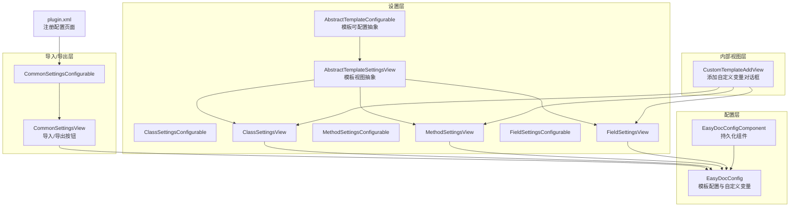
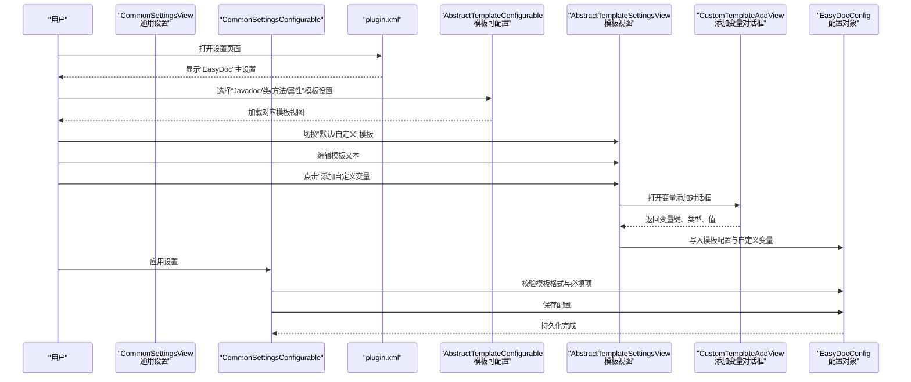
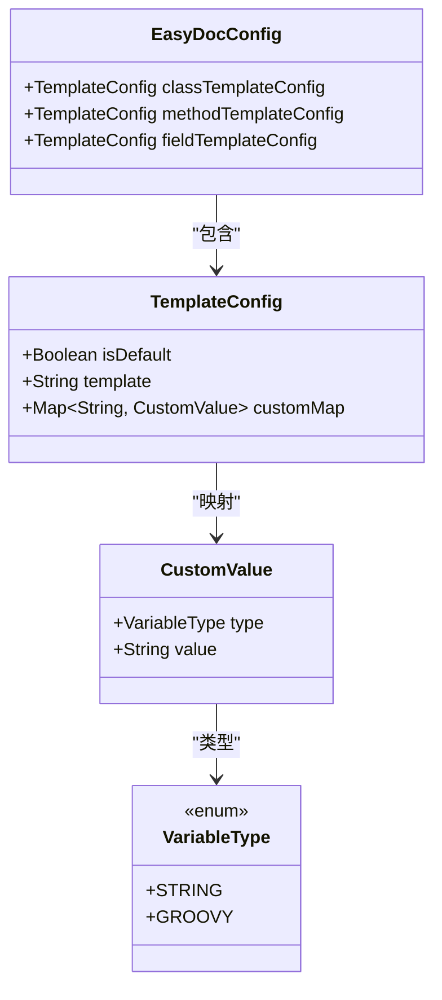
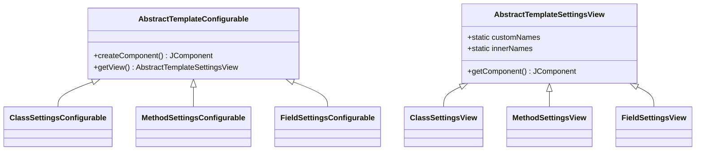
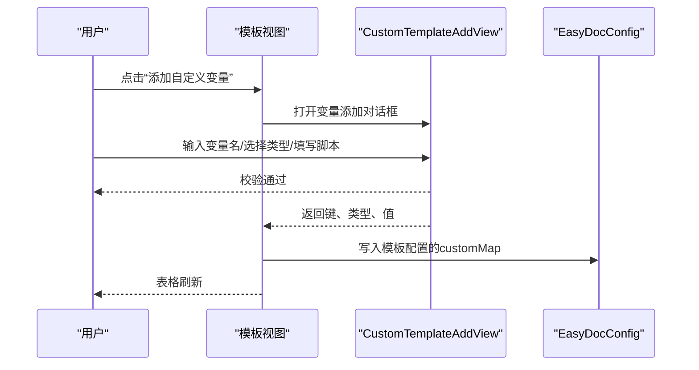
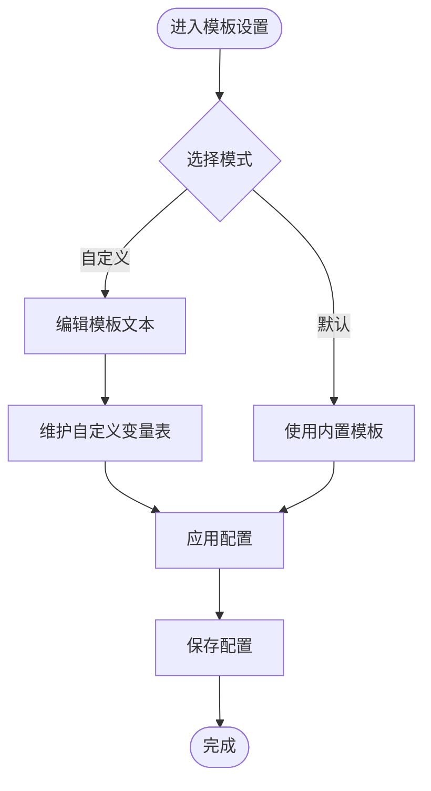
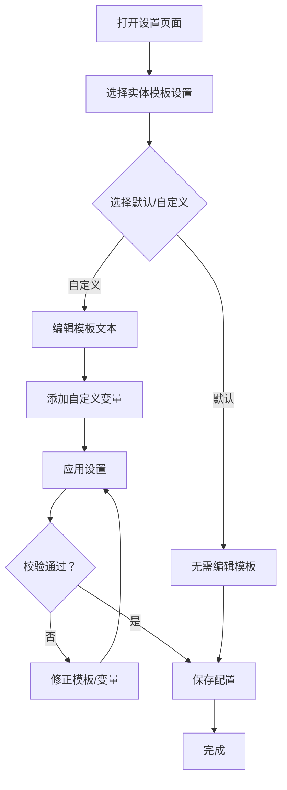
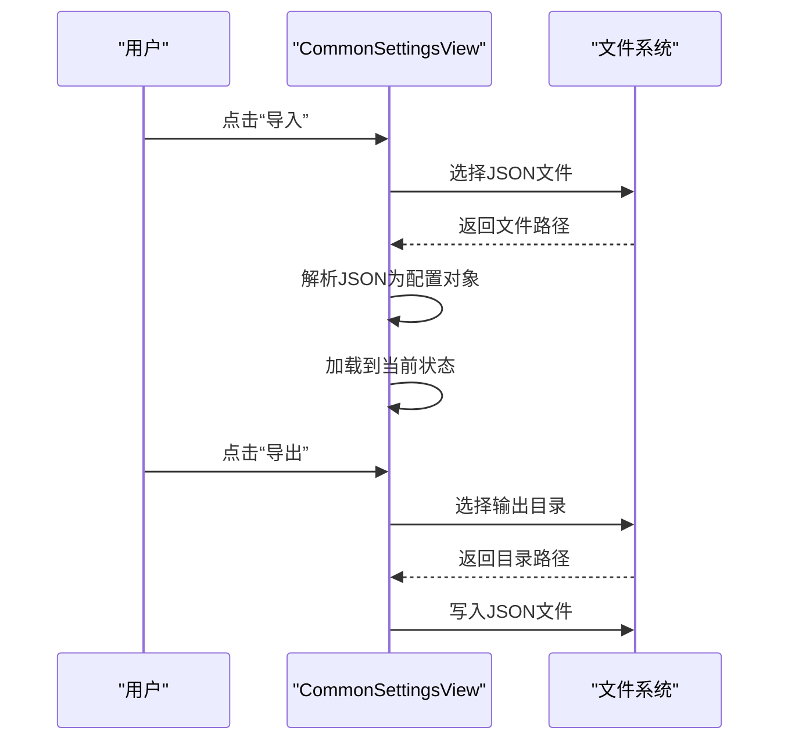
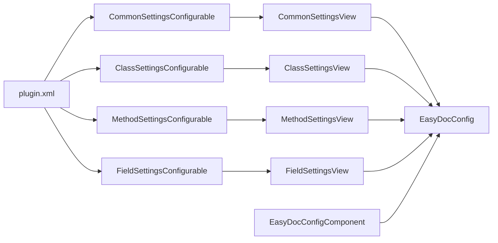

# 自定义模板管理

<cite>
**本文引用的文件**
- [plugin.xml](file://src/main/resources/META-INF/plugin.xml)
- [EasyDocConfig.java](file://src/main/java/com/star/easydoc/config/EasyDocConfig.java)
- [EasyDocConfigComponent.java](file://src/main/java/com/star/easydoc/config/EasyDocConfigComponent.java)
- [AbstractTemplateConfigurable.java](file://src/main/java/com/star/easydoc/view/settings/javadoc/template/AbstractTemplateConfigurable.java)
- [AbstractTemplateSettingsView.java](file://src/main/java/com/star/easydoc/view/settings/javadoc/template/AbstractTemplateSettingsView.java)
- [ClassSettingsConfigurable.java](file://src/main/java/com/star/easydoc/view/settings/javadoc/template/ClassSettingsConfigurable.java)
- [ClassSettingsView.java](file://src/main/java/com/star/easydoc/view/settings/javadoc/template/ClassSettingsView.java)
- [MethodSettingsConfigurable.java](file://src/main/java/com/star/easydoc/view/settings/javadoc/template/MethodSettingsConfigurable.java)
- [MethodSettingsView.java](file://src/main/java/com/star/easydoc/view/settings/javadoc/template/MethodSettingsView.java)
- [FieldSettingsConfigurable.java](file://src/main/java/com/star/easydoc/view/settings/javadoc/template/FieldSettingsConfigurable.java)
- [FieldSettingsView.java](file://src/main/java/com/star/easydoc/view/settings/javadoc/template/FieldSettingsView.java)
- [CustomTemplateAddView.java](file://src/main/java/com/star/easydoc/view/inner/CustomTemplateAddView.java)
- [CustomTemplateAddView.form](file://src/main/java/com/star/easydoc/view/inner/CustomTemplateAddView.form)
- [CommonSettingsView.java](file://src/main/java/com/star/easydoc/view/settings/CommonSettingsView.java)
- [CommonSettingsConfigurable.java](file://src/main/java/com/star/easydoc/view/settings/CommonSettingsConfigurable.java)
- [README.md](file://README.md)
</cite>

## 目录
1. [简介](#简介)
2. [项目结构](#项目结构)
3. [核心组件](#核心组件)
4. [架构总览](#架构总览)
5. [详细组件分析](#详细组件分析)
6. [依赖关系分析](#依赖关系分析)
7. [性能考量](#性能考量)
8. [故障排除指南](#故障排除指南)
9. [结论](#结论)
10. [附录](#附录)

## 简介
本文件面向使用 Easy Javadoc 插件的开发者，系统性讲解“自定义模板管理”的设计与使用方法。内容涵盖：
- 如何通过设置界面添加、编辑、删除自定义模板变量
- 模板命名规则与模板分类管理
- 自定义模板的创建流程（从编辑到保存配置）
- 模板继承机制（默认模板与自定义模板的关系）
- 模板导入/导出功能的使用说明
- 最佳实践与常见问题排查

## 项目结构
围绕“自定义模板管理”，本插件采用分层与模块化的组织方式：
- 配置层：持久化配置对象与组件，承载模板配置、自定义变量等
- 设置层：针对不同实体（类、方法、属性）的模板设置视图与可配置项
- 内部视图层：用于添加自定义变量的对话框
- 导入/导出层：通用设置中的配置导入/导出功能

图表来源
- [plugin.xml:39-51](file://src/main/resources/META-INF/plugin.xml#L39-L51)
- [EasyDocConfig.java:146-159](file://src/main/java/com/star/easydoc/config/EasyDocConfig.java#L146-L159)
- [EasyDocConfigComponent.java:19-56](file://src/main/java/com/star/easydoc/config/EasyDocConfigComponent.java#L19-L56)
- [AbstractTemplateConfigurable.java:13-22](file://src/main/java/com/star/easydoc/view/settings/javadoc/template/AbstractTemplateConfigurable.java#L13-L22)
- [AbstractTemplateSettingsView.java:14-36](file://src/main/java/com/star/easydoc/view/settings/javadoc/template/AbstractTemplateSettingsView.java#L14-L36)
- [ClassSettingsConfigurable.java:20-77](file://src/main/java/com/star/easydoc/view/settings/javadoc/template/ClassSettingsConfigurable.java#L20-L77)
- [ClassSettingsView.java:24-179](file://src/main/java/com/star/easydoc/view/settings/javadoc/template/ClassSettingsView.java#L24-L179)
- [MethodSettingsConfigurable.java](file://src/main/java/com/star/easydoc/view/settings/javadoc/template/MethodSettingsConfigurable.java)
- [MethodSettingsView.java:157-178](file://src/main/java/com/star/easydoc/view/settings/javadoc/template/MethodSettingsView.java#L157-L178)
- [FieldSettingsConfigurable.java](file://src/main/java/com/star/easydoc/view/settings/javadoc/template/FieldSettingsConfigurable.java)
- [FieldSettingsView.java:154-175](file://src/main/java/com/star/easydoc/view/settings/javadoc/template/FieldSettingsView.java#L154-L175)
- [CustomTemplateAddView.java:19-58](file://src/main/java/com/star/easydoc/view/inner/CustomTemplateAddView.java#L19-L58)
- [CommonSettingsView.java:107-148](file://src/main/java/com/star/easydoc/view/settings/CommonSettingsView.java#L107-L148)

章节来源
- [plugin.xml:39-51](file://src/main/resources/META-INF/plugin.xml#L39-L51)
- [EasyDocConfig.java:146-159](file://src/main/java/com/star/easydoc/config/EasyDocConfig.java#L146-L159)
- [EasyDocConfigComponent.java:19-56](file://src/main/java/com/star/easydoc/config/EasyDocConfigComponent.java#L19-L56)

## 核心组件
- 模板配置数据结构
  - 每个实体（类/方法/属性）拥有独立的模板配置对象，包含“是否默认”、“模板文本”、“自定义变量映射”
  - 自定义变量由键（变量名）、类型（固定值/Groovy脚本）、值（字符串或脚本）组成
- 模板设置视图
  - 抽象模板视图定义了“默认/自定义”单选、模板文本区域、内置变量表、自定义变量表与工具栏
  - 针对类/方法/属性分别提供对应的可配置项与视图实现
- 自定义变量添加对话框
  - 提供输入校验：变量名需以特定符号包裹；脚本类型需选择；Groovy脚本不能为空
- 配置持久化
  - 通过持久化组件加载/保存配置，确保重启后配置不丢失

章节来源
- [EasyDocConfig.java:211-254](file://src/main/java/com/star/easydoc/config/EasyDocConfig.java#L211-L254)
- [EasyDocConfig.java:259-292](file://src/main/java/com/star/easydoc/config/EasyDocConfig.java#L259-L292)
- [AbstractTemplateSettingsView.java:14-36](file://src/main/java/com/star/easydoc/view/settings/javadoc/template/AbstractTemplateSettingsView.java#L14-L36)
- [ClassSettingsView.java:24-179](file://src/main/java/com/star/easydoc/view/settings/javadoc/template/ClassSettingsView.java#L24-L179)
- [CustomTemplateAddView.java:19-58](file://src/main/java/com/star/easydoc/view/inner/CustomTemplateAddView.java#L19-L58)
- [EasyDocConfigComponent.java:20-66](file://src/main/java/com/star/easydoc/config/EasyDocConfigComponent.java#L20-L66)

## 架构总览
模板管理的运行时交互流程如下：

图表来源
- [plugin.xml:39-51](file://src/main/resources/META-INF/plugin.xml#L39-L51)
- [AbstractTemplateConfigurable.java:13-22](file://src/main/java/com/star/easydoc/view/settings/javadoc/template/AbstractTemplateConfigurable.java#L13-L22)
- [AbstractTemplateSettingsView.java:14-36](file://src/main/java/com/star/easydoc/view/settings/javadoc/template/AbstractTemplateSettingsView.java#L14-L36)
- [ClassSettingsView.java:72-98](file://src/main/java/com/star/easydoc/view/settings/javadoc/template/ClassSettingsView.java#L72-L98)
- [CustomTemplateAddView.java:19-58](file://src/main/java/com/star/easydoc/view/inner/CustomTemplateAddView.java#L19-L58)
- [CommonSettingsView.java:107-148](file://src/main/java/com/star/easydoc/view/settings/CommonSettingsView.java#L107-L148)
- [CommonSettingsConfigurable.java:94-189](file://src/main/java/com/star/easydoc/view/settings/CommonSettingsConfigurable.java#L94-L189)

## 详细组件分析

### 模板配置数据模型
模板配置由三部分构成：是否默认、模板文本、自定义变量映射。该模型在类/方法/属性三个维度复用。

图表来源
- [EasyDocConfig.java:146-159](file://src/main/java/com/star/easydoc/config/EasyDocConfig.java#L146-L159)
- [EasyDocConfig.java:211-254](file://src/main/java/com/star/easydoc/config/EasyDocConfig.java#L211-L254)
- [EasyDocConfig.java:259-292](file://src/main/java/com/star/easydoc/config/EasyDocConfig.java#L259-L292)
- [EasyDocConfig.java:297-325](file://src/main/java/com/star/easydoc/config/EasyDocConfig.java#L297-L325)

章节来源
- [EasyDocConfig.java:211-292](file://src/main/java/com/star/easydoc/config/EasyDocConfig.java#L211-L292)

### 模板设置视图与可配置项
- 抽象层：定义“默认/自定义”单选、模板文本区域、内置变量表、自定义变量表与工具栏
- 具体实现：类/方法/属性各自提供配置器与视图，统一遵循相同的校验逻辑与保存流程

图表来源
- [AbstractTemplateConfigurable.java:13-22](file://src/main/java/com/star/easydoc/view/settings/javadoc/template/AbstractTemplateConfigurable.java#L13-L22)
- [AbstractTemplateSettingsView.java:14-36](file://src/main/java/com/star/easydoc/view/settings/javadoc/template/AbstractTemplateSettingsView.java#L14-L36)
- [ClassSettingsConfigurable.java:20-77](file://src/main/java/com/star/easydoc/view/settings/javadoc/template/ClassSettingsConfigurable.java#L20-L77)
- [ClassSettingsView.java:24-179](file://src/main/java/com/star/easydoc/view/settings/javadoc/template/ClassSettingsView.java#L24-L179)
- [MethodSettingsConfigurable.java](file://src/main/java/com/star/easydoc/view/settings/javadoc/template/MethodSettingsConfigurable.java)
- [MethodSettingsView.java:157-178](file://src/main/java/com/star/easydoc/view/settings/javadoc/template/MethodSettingsView.java#L157-L178)
- [FieldSettingsConfigurable.java](file://src/main/java/com/star/easydoc/view/settings/javadoc/template/FieldSettingsConfigurable.java)
- [FieldSettingsView.java:154-175](file://src/main/java/com/star/easydoc/view/settings/javadoc/template/FieldSettingsView.java#L154-L175)

章节来源
- [AbstractTemplateConfigurable.java:13-22](file://src/main/java/com/star/easydoc/view/settings/javadoc/template/AbstractTemplateConfigurable.java#L13-L22)
- [AbstractTemplateSettingsView.java:14-36](file://src/main/java/com/star/easydoc/view/settings/javadoc/template/AbstractTemplateSettingsView.java#L14-L36)
- [ClassSettingsConfigurable.java:20-77](file://src/main/java/com/star/easydoc/view/settings/javadoc/template/ClassSettingsConfigurable.java#L20-L77)
- [ClassSettingsView.java:24-179](file://src/main/java/com/star/easydoc/view/settings/javadoc/template/ClassSettingsView.java#L24-L179)
- [MethodSettingsConfigurable.java](file://src/main/java/com/star/easydoc/view/settings/javadoc/template/MethodSettingsConfigurable.java)
- [MethodSettingsView.java:157-178](file://src/main/java/com/star/easydoc/view/settings/javadoc/template/MethodSettingsView.java#L157-L178)
- [FieldSettingsConfigurable.java](file://src/main/java/com/star/easydoc/view/settings/javadoc/template/FieldSettingsConfigurable.java)
- [FieldSettingsView.java:154-175](file://src/main/java/com/star/easydoc/view/settings/javadoc/template/FieldSettingsView.java#L154-L175)

### 自定义变量添加对话框
- 输入校验：变量名必须以特定符号包裹；脚本类型必须选择；Groovy脚本内容不能为空
- 交互：点击“添加”后将变量写入对应实体的模板配置映射中，并刷新表格

图表来源
- [ClassSettingsView.java:72-98](file://src/main/java/com/star/easydoc/view/settings/javadoc/template/ClassSettingsView.java#L72-L98)
- [CustomTemplateAddView.java:19-58](file://src/main/java/com/star/easydoc/view/inner/CustomTemplateAddView.java#L19-L58)
- [CustomTemplateAddView.form:14-81](file://src/main/java/com/star/easydoc/view/inner/CustomTemplateAddView.form#L14-L81)

章节来源
- [CustomTemplateAddView.java:19-58](file://src/main/java/com/star/easydoc/view/inner/CustomTemplateAddView.java#L19-L58)
- [CustomTemplateAddView.form:14-81](file://src/main/java/com/star/easydoc/view/inner/CustomTemplateAddView.form#L14-L81)
- [ClassSettingsView.java:72-98](file://src/main/java/com/star/easydoc/view/settings/javadoc/template/ClassSettingsView.java#L72-L98)

### 模板继承机制
- 默认模板：当“使用默认模板”被勾选时，实体将使用内置模板，不启用自定义变量
- 自定义模板：当“使用自定义模板”被勾选时，实体使用用户提供的模板文本与自定义变量映射
- 继承关系：自定义模板并不覆盖默认模板，而是与默认模板并存；在生成注释时，会优先应用自定义变量映射，再渲染模板文本

图表来源
- [ClassSettingsConfigurable.java:36-75](file://src/main/java/com/star/easydoc/view/settings/javadoc/template/ClassSettingsConfigurable.java#L36-L75)
- [ClassSettingsView.java:103-128](file://src/main/java/com/star/easydoc/view/settings/javadoc/template/ClassSettingsView.java#L103-L128)
- [EasyDocConfig.java:211-254](file://src/main/java/com/star/easydoc/config/EasyDocConfig.java#L211-L254)

章节来源
- [ClassSettingsConfigurable.java:36-75](file://src/main/java/com/star/easydoc/view/settings/javadoc/template/ClassSettingsConfigurable.java#L36-L75)
- [ClassSettingsView.java:103-128](file://src/main/java/com/star/easydoc/view/settings/javadoc/template/ClassSettingsView.java#L103-L128)
- [EasyDocConfig.java:211-254](file://src/main/java/com/star/easydoc/config/EasyDocConfig.java#L211-L254)

### 模板命名规则与分类管理
- 变量命名规则
  - 变量名需以特定符号包裹（由变量添加对话框校验），并在模板中作为占位符使用
- 分类管理
  - 类模板、方法模板、属性模板分别独立配置，互不影响
  - 每个实体的模板配置包含：是否默认、模板文本、自定义变量映射

章节来源
- [CustomTemplateAddView.java:40-51](file://src/main/java/com/star/easydoc/view/inner/CustomTemplateAddView.java#L40-L51)
- [ClassSettingsView.java:38-46](file://src/main/java/com/star/easydoc/view/settings/javadoc/template/ClassSettingsView.java#L38-L46)
- [EasyDocConfig.java:146-159](file://src/main/java/com/star/easydoc/config/EasyDocConfig.java#L146-L159)

### 创建流程：从编辑到保存配置
- 步骤概览
  - 打开设置页面，选择对应实体（类/方法/属性）的模板设置
  - 选择“使用自定义模板”，编辑模板文本
  - 点击“添加自定义变量”，填写变量名、类型与值
  - 应用设置，系统进行格式与必填校验
  - 保存配置，重启后生效
- 关键校验点
  - 自定义模板文本需以特定符号包裹（如注释块）
  - Groovy脚本不能为空
  - 变量名需符合包裹规则

图表来源
- [ClassSettingsConfigurable.java:47-75](file://src/main/java/com/star/easydoc/view/settings/javadoc/template/ClassSettingsConfigurable.java#L47-L75)
- [ClassSettingsView.java:103-128](file://src/main/java/com/star/easydoc/view/settings/javadoc/template/ClassSettingsView.java#L103-L128)
- [CustomTemplateAddView.java:40-51](file://src/main/java/com/star/easydoc/view/inner/CustomTemplateAddView.java#L40-L51)

章节来源
- [ClassSettingsConfigurable.java:47-75](file://src/main/java/com/star/easydoc/view/settings/javadoc/template/ClassSettingsConfigurable.java#L47-L75)
- [ClassSettingsView.java:103-128](file://src/main/java/com/star/easydoc/view/settings/javadoc/template/ClassSettingsView.java#L103-L128)
- [CustomTemplateAddView.java:40-51](file://src/main/java/com/star/easydoc/view/inner/CustomTemplateAddView.java#L40-L51)

### 模板导入/导出功能
- 导入
  - 选择目标 JSON 文件，解析为配置对象并加载到当前状态
- 导出
  - 选择目标目录，写入标准格式的 JSON 文件
- 注意事项
  - 导入前请确认 JSON 格式正确
  - 导出文件名为固定名称，便于识别

图表来源
- [CommonSettingsView.java:107-148](file://src/main/java/com/star/easydoc/view/settings/CommonSettingsView.java#L107-L148)

章节来源
- [CommonSettingsView.java:107-148](file://src/main/java/com/star/easydoc/view/settings/CommonSettingsView.java#L107-L148)

## 依赖关系分析
- 插件注册
  - 通过插件 XML 注册通用设置与各实体模板设置的可配置项
- 配置持久化
  - 持久化组件负责加载/保存配置，确保跨会话一致性
- 视图与配置解耦
  - 抽象模板配置器与视图分离，便于扩展新的实体类型

图表来源
- [plugin.xml:39-51](file://src/main/resources/META-INF/plugin.xml#L39-L51)
- [CommonSettingsConfigurable.java:25-42](file://src/main/java/com/star/easydoc/view/settings/CommonSettingsConfigurable.java#L25-L42)
- [ClassSettingsConfigurable.java:20-33](file://src/main/java/com/star/easydoc/view/settings/javadoc/template/ClassSettingsConfigurable.java#L20-L33)
- [MethodSettingsConfigurable.java](file://src/main/java/com/star/easydoc/view/settings/javadoc/template/MethodSettingsConfigurable.java)
- [FieldSettingsConfigurable.java](file://src/main/java/com/star/easydoc/view/settings/javadoc/template/FieldSettingsConfigurable.java)
- [EasyDocConfigComponent.java:20-56](file://src/main/java/com/star/easydoc/config/EasyDocConfigComponent.java#L20-L56)

章节来源
- [plugin.xml:39-51](file://src/main/resources/META-INF/plugin.xml#L39-L51)
- [EasyDocConfigComponent.java:20-56](file://src/main/java/com/star/easydoc/config/EasyDocConfigComponent.java#L20-L56)

## 性能考量
- 模板渲染
  - 自定义变量映射在生成注释时按需解析，建议避免过于复杂的脚本逻辑
- 配置读写
  - 导入/导出为一次性操作，建议在空闲时段执行，避免频繁 IO
- UI 响应
  - 表格刷新与开关切换为轻量操作，通常无明显延迟

## 故障排除指南
- 模板格式错误
  - 症状：应用设置时报模板格式不正确
  - 处理：确保自定义模板文本以特定符号包裹（如注释块），并符合实体要求
- 自定义变量未生效
  - 症状：变量名未被替换
  - 处理：确认变量名已正确包裹；检查变量类型与值是否填写
- 导入/导出失败
  - 症状：导入提示 JSON 错误；导出无文件
  - 处理：检查文件路径是否存在；确认 JSON 格式正确；导出目录可写
- 快捷键冲突
  - 症状：快捷键无效
  - 处理：检查 IDE 快捷键设置，避免与系统或其他插件冲突

章节来源
- [ClassSettingsConfigurable.java:55-63](file://src/main/java/com/star/easydoc/view/settings/javadoc/template/ClassSettingsConfigurable.java#L55-L63)
- [CommonSettingsView.java:107-148](file://src/main/java/com/star/easydoc/view/settings/CommonSettingsView.java#L107-L148)
- [README.md:71-84](file://README.md#L71-L84)

## 结论
本插件提供了完善的自定义模板管理体系，支持类/方法/属性三类实体的模板配置与自定义变量管理。通过默认/自定义模式的灵活切换、严格的输入校验与便捷的导入/导出能力，开发者可以高效地构建与维护团队级注释规范。建议结合最佳实践（命名规范、版本控制、组织结构）持续优化模板资产。

## 附录
- 最佳实践
  - 命名规范：变量名统一使用特定符号包裹，避免歧义
  - 组织结构：将常用变量沉淀为团队共享模板，减少重复配置
  - 版本控制：通过导入/导出功能在团队间同步配置，配合版本管理
- 相关说明
  - 模板继承：自定义模板与默认模板并存，优先应用自定义变量映射
  - Groovy 脚本：内置变量可用于动态生成注释内容，注意性能与可维护性

章节来源
- [README.md:1-266](file://README.md#L1-L266)