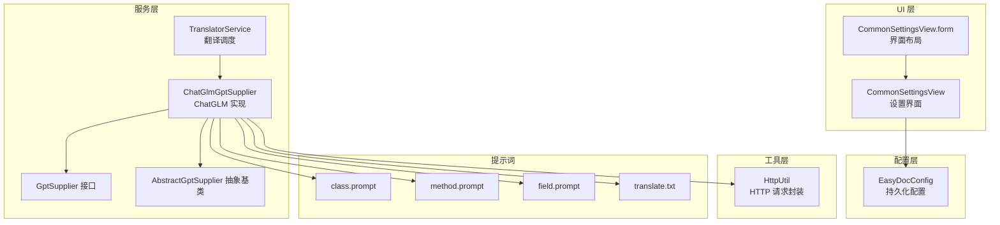
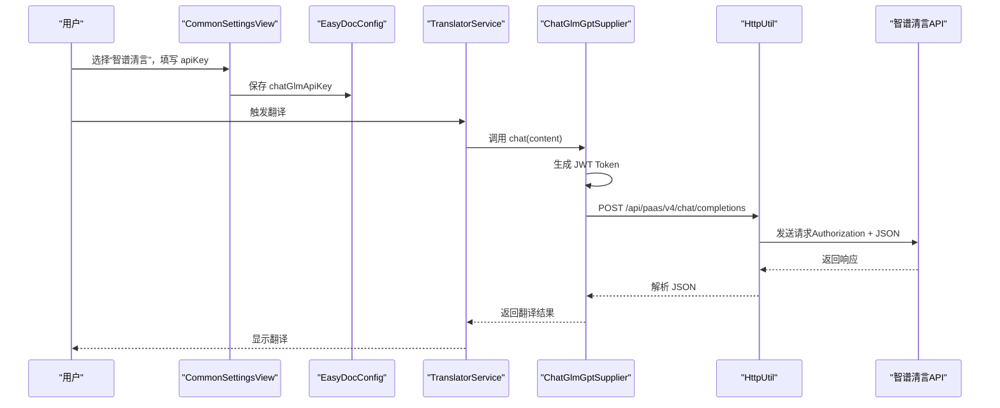
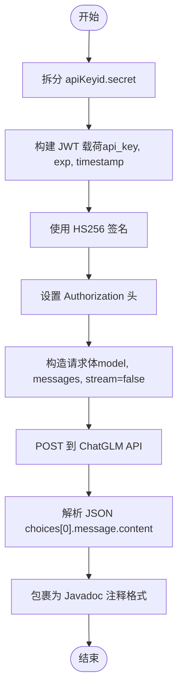
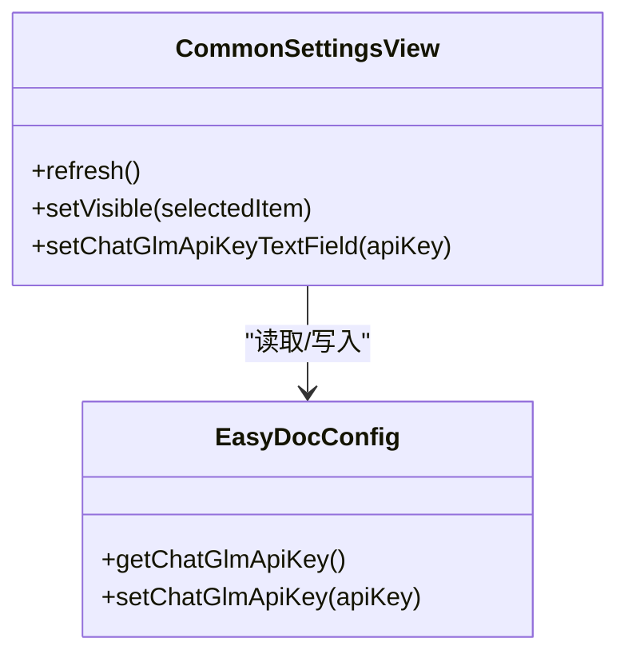
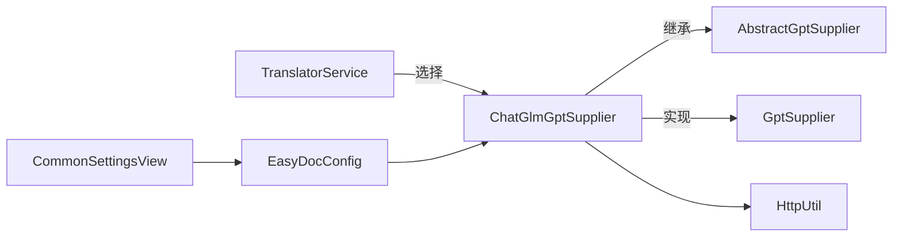

# ChatGLM AI 翻译配置

<cite>
**本文引用的文件**
- [ChatGlmGptSupplier.java](file://src/main/java/com/star/easydoc/service/gpt/impl/ChatGlmGptSupplier.java)
- [AbstractGptSupplier.java](file://src/main/java/com/star/easydoc/service/gpt/impl/AbstractGptSupplier.java)
- [GptSupplier.java](file://src/main/java/com/star/easydoc/service/gpt/GptSupplier.java)
- [HttpUtil.java](file://src/main/java/com/star/easydoc/common/util/HttpUtil.java)
- [EasyDocConfig.java](file://src/main/java/com/star/easydoc/config/EasyDocConfig.java)
- [CommonSettingsView.java](file://src/main/java/com/star/easydoc/view/settings/CommonSettingsView.java)
- [CommonSettingsView.form](file://src/main/java/com/star/easydoc/view/settings/CommonSettingsView.form)
- [Consts.java](file://src/main/java/com/star/easydoc/common/Consts.java)
- [TranslatorService.java](file://src/main/java/com/star/easydoc/service/translator/TranslatorService.java)
- [class.prompt](file://src/main/resources/prompts/chatglm/class.prompt)
- [method.prompt](file://src/main/resources/prompts/chatglm/method.prompt)
- [field.prompt](file://src/main/resources/prompts/chatglm/field.prompt)
- [translate.txt](file://src/main/resources/prompts/translate.txt)
- [README.md](file://README.md)
</cite>

## 目录
1. [简介](#简介)
2. [项目结构](#项目结构)
3. [核心组件](#核心组件)
4. [架构总览](#架构总览)
5. [详细组件分析](#详细组件分析)
6. [依赖关系分析](#依赖关系分析)
7. [性能考虑](#性能考虑)
8. [故障排查指南](#故障排查指南)
9. [结论](#结论)
10. [附录](#附录)

## 简介
本指南面向在 IntelliJ IDEA 插件“Easy Javadoc”中配置与使用 ChatGLM（智谱清言）AI 翻译能力的用户。内容涵盖：
- 在智谱AI平台申请 API Key 的流程与注意事项
- 在插件设置界面中填写 ChatGLM API Key 的完整步骤
- ChatGLM 翻译的认证机制、请求格式与模型选择
- 配置后如何验证与使用
- 常见问题排查（API Key 无效、网络连接失败等）

## 项目结构
与 ChatGLM 集成相关的模块主要分布在以下包与资源：
- 服务层：gpt 与 translator 子系统负责翻译与请求封装
- 配置层：EasyDocConfig 持久化存储 API Key
- UI 层：CommonSettingsView 提供配置界面
- 工具层：HttpUtil 提供 HTTP 请求能力
- 提示词：resources/prompts/chatglm 下的模板文件

图表来源
- [CommonSettingsView.java:1-739](file://src/main/java/com/star/easydoc/view/settings/CommonSettingsView.java#L1-L739)
- [CommonSettingsView.form:1-436](file://src/main/java/com/star/easydoc/view/settings/CommonSettingsView.form#L1-L436)
- [TranslatorService.java:1-238](file://src/main/java/com/star/easydoc/service/translator/TranslatorService.java#L1-L238)
- [GptSupplier.java:1-35](file://src/main/java/com/star/easydoc/service/gpt/GptSupplier.java#L1-L35)
- [AbstractGptSupplier.java:1-26](file://src/main/java/com/star/easydoc/service/gpt/impl/AbstractGptSupplier.java#L1-L26)
- [ChatGlmGptSupplier.java:1-135](file://src/main/java/com/star/easydoc/service/gpt/impl/ChatGlmGptSupplier.java#L1-L135)
- [HttpUtil.java:1-246](file://src/main/java/com/star/easydoc/common/util/HttpUtil.java#L1-L246)
- [class.prompt:1-30](file://src/main/resources/prompts/chatglm/class.prompt#L1-L30)
- [method.prompt:1-31](file://src/main/resources/prompts/chatglm/method.prompt#L1-L31)
- [field.prompt:1-20](file://src/main/resources/prompts/chatglm/field.prompt#L1-L20)
- [translate.txt:1-2](file://src/main/resources/prompts/translate.txt#L1-L2)

章节来源
- [CommonSettingsView.java:1-739](file://src/main/java/com/star/easydoc/view/settings/CommonSettingsView.java#L1-L739)
- [CommonSettingsView.form:1-436](file://src/main/java/com/star/easydoc/view/settings/CommonSettingsView.form#L1-L436)
- [TranslatorService.java:1-238](file://src/main/java/com/star/easydoc/service/translator/TranslatorService.java#L1-L238)
- [GptSupplier.java:1-35](file://src/main/java/com/star/easydoc/service/gpt/GptSupplier.java#L1-L35)
- [AbstractGptSupplier.java:1-26](file://src/main/java/com/star/easydoc/service/gpt/impl/AbstractGptSupplier.java#L1-L26)
- [ChatGlmGptSupplier.java:1-135](file://src/main/java/com/star/easydoc/service/gpt/impl/ChatGlmGptSupplier.java#L1-L135)
- [HttpUtil.java:1-246](file://src/main/java/com/star/easydoc/common/util/HttpUtil.java#L1-L246)
- [class.prompt:1-30](file://src/main/resources/prompts/chatglm/class.prompt#L1-L30)
- [method.prompt:1-31](file://src/main/resources/prompts/chatglm/method.prompt#L1-L31)
- [field.prompt:1-20](file://src/main/resources/prompts/chatglm/field.prompt#L1-L20)
- [translate.txt:1-2](file://src/main/resources/prompts/translate.txt#L1-L2)

## 核心组件
- ChatGlmGptSupplier：实现 ChatGLM API 的认证与请求，负责将用户输入转换为 ChatGLM 请求，并解析响应。
- AbstractGptSupplier/GptSupplier：抽象接口与基类，统一供应商接口与初始化流程。
- HttpUtil：封装 HTTP GET/POST 与 JSON 请求，支持代理与超时控制。
- EasyDocConfig：持久化配置，包含 chatGlmApiKey 字段。
- CommonSettingsView：设置界面，提供翻译方式选择与 API Key 输入控件。
- TranslatorService：根据配置选择具体翻译实现（含 ChatGLM）。

章节来源
- [ChatGlmGptSupplier.java:1-135](file://src/main/java/com/star/easydoc/service/gpt/impl/ChatGlmGptSupplier.java#L1-L135)
- [AbstractGptSupplier.java:1-26](file://src/main/java/com/star/easydoc/service/gpt/impl/AbstractGptSupplier.java#L1-L26)
- [GptSupplier.java:1-35](file://src/main/java/com/star/easydoc/service/gpt/GptSupplier.java#L1-L35)
- [HttpUtil.java:1-246](file://src/main/java/com/star/easydoc/common/util/HttpUtil.java#L1-L246)
- [EasyDocConfig.java:1-680](file://src/main/java/com/star/easydoc/config/EasyDocConfig.java#L1-L680)
- [CommonSettingsView.java:1-739](file://src/main/java/com/star/easydoc/view/settings/CommonSettingsView.java#L1-L739)
- [TranslatorService.java:1-238](file://src/main/java/com/star/easydoc/service/translator/TranslatorService.java#L1-L238)

## 架构总览
ChatGLM 翻译在插件中的调用链路如下：

图表来源
- [CommonSettingsView.java:388-415](file://src/main/java/com/star/easydoc/view/settings/CommonSettingsView.java#L388-L415)
- [EasyDocConfig.java:640-646](file://src/main/java/com/star/easydoc/config/EasyDocConfig.java#L640-L646)
- [TranslatorService.java:157-163](file://src/main/java/com/star/easydoc/service/translator/TranslatorService.java#L157-L163)
- [ChatGlmGptSupplier.java:30-51](file://src/main/java/com/star/easydoc/service/gpt/impl/ChatGlmGptSupplier.java#L30-L51)
- [HttpUtil.java:225-243](file://src/main/java/com/star/easydoc/common/util/HttpUtil.java#L225-L243)

## 详细组件分析

### ChatGLM 认证与请求流程
- 认证机制：ChatGLM 使用基于 HMAC-SHA256 的 JWT 签名，头部包含 alg=HS256 与 sign_type=SIGN；载荷包含 api_key、过期时间与时间戳。
- 请求格式：POST https://open.bigmodel.cn/api/paas/v4/chat/completions，Content-Type: application/json；请求体包含 model、messages、stream 等字段。
- 模型选择：默认模型为 glm-4，可在实现中调整。
- 超时设置：内部使用 30 秒超时常量。

图表来源
- [ChatGlmGptSupplier.java:53-76](file://src/main/java/com/star/easydoc/service/gpt/impl/ChatGlmGptSupplier.java#L53-L76)
- [ChatGlmGptSupplier.java:25-51](file://src/main/java/com/star/easydoc/service/gpt/impl/ChatGlmGptSupplier.java#L25-L51)
- [ChatGlmGptSupplier.java:78-110](file://src/main/java/com/star/easydoc/service/gpt/impl/ChatGlmGptSupplier.java#L78-L110)

章节来源
- [ChatGlmGptSupplier.java:1-135](file://src/main/java/com/star/easydoc/service/gpt/impl/ChatGlmGptSupplier.java#L1-L135)

### 设置界面与配置项
- 翻译方式选择：在设置界面的“翻译方式”下拉框中选择“智谱清言”。
- API Key 输入：在“apiKey”文本框中粘贴从智谱平台获取的完整 apiKey（格式为 id.secret）。
- 可见性逻辑：当选择“智谱清言”时，界面会显示“apiKey”输入框，隐藏其他翻译提供商的输入项。
- 刷新与持久化：CommonSettingsView.refresh() 会从 EasyDocConfig 读取当前配置并填充 UI；设置变更后由插件组件保存至持久化配置。

图表来源
- [CommonSettingsView.java:561-580](file://src/main/java/com/star/easydoc/view/settings/CommonSettingsView.java#L561-L580)
- [CommonSettingsView.java:388-415](file://src/main/java/com/star/easydoc/view/settings/CommonSettingsView.java#L388-L415)
- [CommonSettingsView.form:364-379](file://src/main/java/com/star/easydoc/view/settings/CommonSettingsView.form#L364-L379)
- [EasyDocConfig.java:640-646](file://src/main/java/com/star/easydoc/config/EasyDocConfig.java#L640-L646)

章节来源
- [CommonSettingsView.java:1-739](file://src/main/java/com/star/easydoc/view/settings/CommonSettingsView.java#L1-L739)
- [CommonSettingsView.form:1-436](file://src/main/java/com/star/easydoc/view/settings/CommonSettingsView.form#L1-L436)
- [EasyDocConfig.java:1-680](file://src/main/java/com/star/easydoc/config/EasyDocConfig.java#L1-L680)

### 提示词与翻译风格
- 提示词模板位于 resources/prompts/chatglm/，分别针对类、方法、属性生成符合 Javadoc 规范的注释。
- translate.txt 提供通用翻译提示，用于生成简洁的注释内容。
- ChatGLM 实现会将用户输入内容包装为消息角色为 user 的消息列表，提交给模型。

章节来源
- [class.prompt:1-30](file://src/main/resources/prompts/chatglm/class.prompt#L1-L30)
- [method.prompt:1-31](file://src/main/resources/prompts/chatglm/method.prompt#L1-L31)
- [field.prompt:1-20](file://src/main/resources/prompts/chatglm/field.prompt#L1-L20)
- [translate.txt:1-2](file://src/main/resources/prompts/translate.txt#L1-L2)
- [ChatGlmGptSupplier.java:39-44](file://src/main/java/com/star/easydoc/service/gpt/impl/ChatGlmGptSupplier.java#L39-L44)

## 依赖关系分析
- TranslatorService 根据配置选择翻译实现；当配置为“智谱清言”时，通过 ChatGlmGptSupplier 执行翻译。
- ChatGlmGptSupplier 继承自 AbstractGptSupplier，实现 GptSupplier 接口，复用初始化与配置注入能力。
- HttpUtil 提供统一的 HTTP 访问能力，支持代理与超时设置，被 ChatGlmGptSupplier 直接使用。

图表来源
- [TranslatorService.java:52-77](file://src/main/java/com/star/easydoc/service/translator/TranslatorService.java#L52-L77)
- [Consts.java:36-37](file://src/main/java/com/star/easydoc/common/Consts.java#L36-L37)
- [AbstractGptSupplier.java:1-26](file://src/main/java/com/star/easydoc/service/gpt/impl/AbstractGptSupplier.java#L1-L26)
- [GptSupplier.java:1-35](file://src/main/java/com/star/easydoc/service/gpt/GptSupplier.java#L1-L35)
- [ChatGlmGptSupplier.java:1-135](file://src/main/java/com/star/easydoc/service/gpt/impl/ChatGlmGptSupplier.java#L1-L135)
- [HttpUtil.java:1-246](file://src/main/java/com/star/easydoc/common/util/HttpUtil.java#L1-L246)
- [CommonSettingsView.java:1-739](file://src/main/java/com/star/easydoc/view/settings/CommonSettingsView.java#L1-L739)
- [EasyDocConfig.java:1-680](file://src/main/java/com/star/easydoc/config/EasyDocConfig.java#L1-L680)

章节来源
- [TranslatorService.java:1-238](file://src/main/java/com/star/easydoc/service/translator/TranslatorService.java#L1-L238)
- [Consts.java:1-100](file://src/main/java/com/star/easydoc/common/Consts.java#L1-L100)
- [AbstractGptSupplier.java:1-26](file://src/main/java/com/star/easydoc/service/gpt/impl/AbstractGptSupplier.java#L1-L26)
- [GptSupplier.java:1-35](file://src/main/java/com/star/easydoc/service/gpt/GptSupplier.java#L1-L35)
- [ChatGlmGptSupplier.java:1-135](file://src/main/java/com/star/easydoc/service/gpt/impl/ChatGlmGptSupplier.java#L1-L135)
- [HttpUtil.java:1-246](file://src/main/java/com/star/easydoc/common/util/HttpUtil.java#L1-L246)
- [CommonSettingsView.java:1-739](file://src/main/java/com/star/easydoc/view/settings/CommonSettingsView.java#L1-L739)
- [EasyDocConfig.java:1-680](file://src/main/java/com/star/easydoc/config/EasyDocConfig.java#L1-L680)

## 性能考虑
- 超时控制：ChatGLM 请求使用 30 秒超时常量，避免长时间阻塞。
- 代理支持：HttpUtil 支持系统代理，便于内网环境访问。
- 模型选择：默认使用 glm-4，可根据需求在实现中调整以平衡速度与质量。
- 缓存策略：插件提供翻译缓存与清空缓存入口，减少重复请求。

章节来源
- [ChatGlmGptSupplier.java:27-28](file://src/main/java/com/star/easydoc/service/gpt/impl/ChatGlmGptSupplier.java#L27-L28)
- [HttpUtil.java:155-161](file://src/main/java/com/star/easydoc/common/util/HttpUtil.java#L155-L161)
- [TranslatorService.java:234-236](file://src/main/java/com/star/easydoc/service/translator/TranslatorService.java#L234-L236)

## 故障排查指南
- API Key 无效
  - 确认 apiKey 格式为 id.secret，且未被截断或多余字符。
  - 在设置界面重新粘贴并保存，确保 EasyDocConfig 中已更新。
  - 查看是否有异常日志输出（HttpUtil 对请求异常进行记录）。
- 网络连接失败
  - 检查系统代理设置，确保 IDE 可访问外网。
  - 若处于内网或受限网络，尝试配置代理或更换网络。
  - 超时问题：适当提高超时时间（设置界面存在超时配置项），但需避免过长导致 IDE 卡顿。
- 翻译结果不符合预期
  - 检查提示词模板是否满足需求，必要时在项目中自定义模板。
  - 使用“清空缓存”功能后重试，排除缓存影响。
- 快捷键冲突
  - README 提示最新版 IDEA 的 AI Assistant 插件与本插件快捷键可能冲突，建议修改任一快捷键。

章节来源
- [CommonSettingsView.java:561-580](file://src/main/java/com/star/easydoc/view/settings/CommonSettingsView.java#L561-L580)
- [HttpUtil.java:96-101](file://src/main/java/com/star/easydoc/common/util/HttpUtil.java#L96-L101)
- [README.md:3-3](file://README.md#L3-L3)

## 结论
通过上述配置与使用流程，用户可在 Easy Javadoc 插件中启用 ChatGLM 翻译能力，实现高质量的 Javadoc 注释生成。建议在稳定网络环境下使用，并结合项目实际需求调整提示词与缓存策略，以获得最佳体验。

## 附录

### 在智谱AI平台申请 API Key 的步骤
- 登录智谱AI开放平台，进入控制台
- 创建应用或选择现有应用
- 复制并保存应用的 API Key（格式为 id.secret）
- 在插件设置界面的“apiKey”中粘贴并保存

章节来源
- [README.md:41-47](file://README.md#L41-L47)

### 在插件设置界面填写 API Key 的操作流程
- 打开插件设置页面
- 在“翻译方式”下拉框中选择“智谱清言”
- 在“apiKey”文本框中粘贴从智谱平台复制的 API Key
- 点击“保存/应用”，完成配置

章节来源
- [CommonSettingsView.java:388-415](file://src/main/java/com/star/easydoc/view/settings/CommonSettingsView.java#L388-L415)
- [CommonSettingsView.form:364-379](file://src/main/java/com/star/easydoc/view/settings/CommonSettingsView.form#L364-L379)