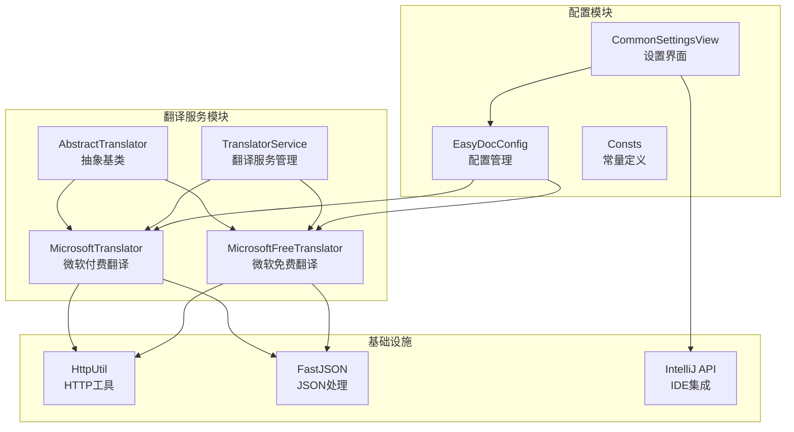
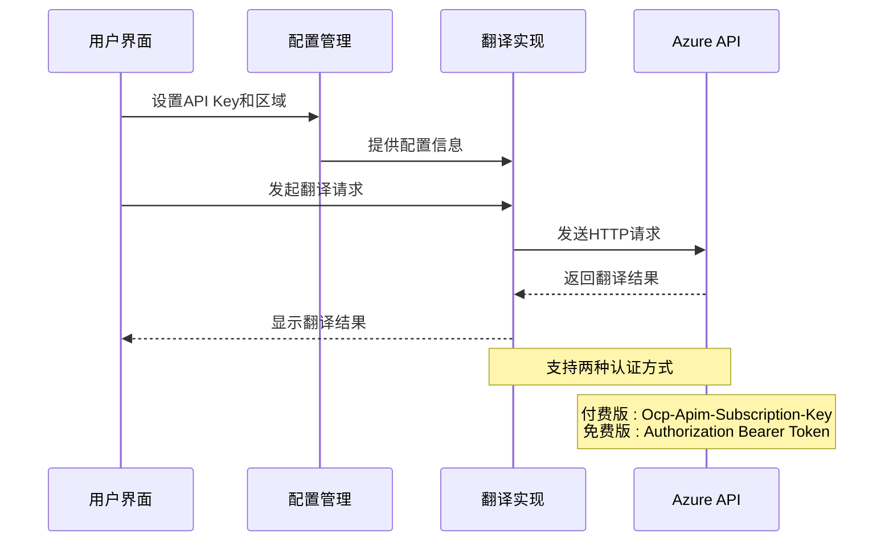
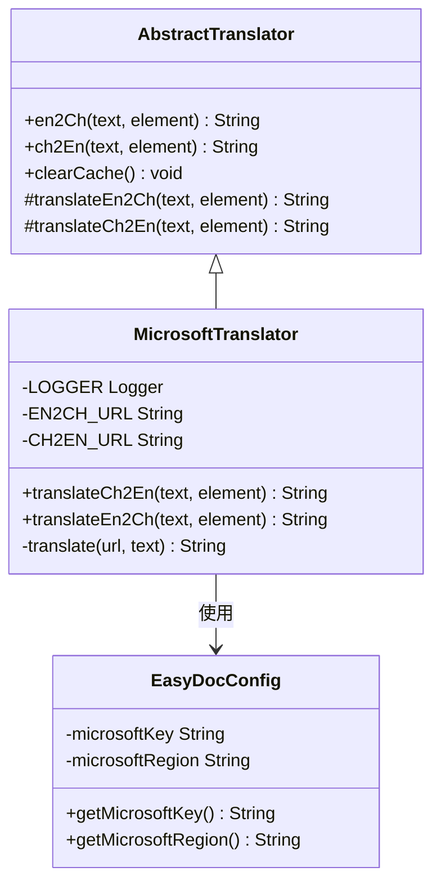
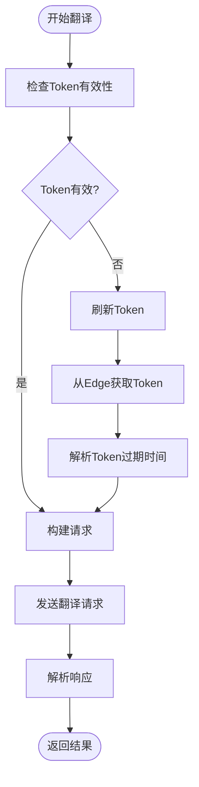
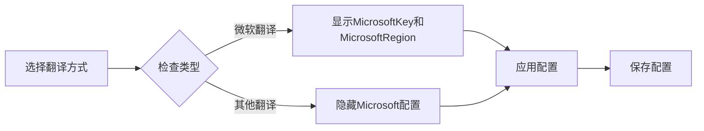
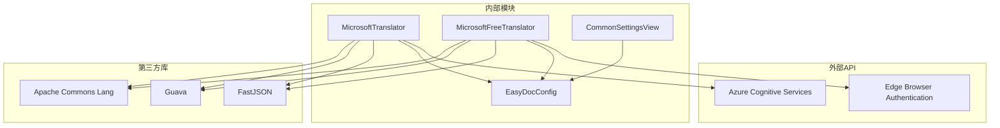

# 微软翻译配置

<cite>
**本文引用的文件列表**
- [MicrosoftTranslator.java](file://src/main/java/com/star/easydoc/service/translator/impl/MicrosoftTranslator.java)
- [MicrosoftFreeTranslator.java](file://src/main/java/com/star/easydoc/service/translator/impl/MicrosoftFreeTranslator.java)
- [EasyDocConfig.java](file://src/main/java/com/star/easydoc/config/EasyDocConfig.java)
- [CommonSettingsView.java](file://src/main/java/com/star/easydoc/view/settings/CommonSettingsView.java)
- [Consts.java](file://src/main/java/com/star/easydoc/common/Consts.java)
- [AbstractTranslator.java](file://src/main/java/com/star/easydoc/service/translator/impl/AbstractTranslator.java)
- [plugin.xml](file://src/main/resources/META-INF/plugin.xml)
- [README.md](file://README.md)
</cite>

## 目录
1. [简介](#简介)
2. [项目结构](#项目结构)
3. [核心组件](#核心组件)
4. [架构概览](#架构概览)
5. [详细组件分析](#详细组件分析)
6. [依赖关系分析](#依赖关系分析)
7. [性能考虑](#性能考虑)
8. [故障排除指南](#故障排除指南)
9. [结论](#结论)

## 简介

本文档提供了Easy Javadoc插件中微软翻译服务的完整配置指南。该插件支持多种翻译服务，其中微软翻译服务通过Azure认知服务翻译API提供高质量的中英互译功能。文档详细说明了Azure认知服务翻译API的配置方法，包括API Key申请、区域信息配置、认证机制、请求格式以及完整的配置步骤。

## 项目结构

Easy Javadoc插件采用模块化的架构设计，微软翻译功能位于翻译服务模块中：

**图表来源**
- [AbstractTranslator.java:14-92](file://src/main/java/com/star/easydoc/service/translator/impl/AbstractTranslator.java#L14-L92)
- [MicrosoftTranslator.java:22-62](file://src/main/java/com/star/easydoc/service/translator/impl/MicrosoftTranslator.java#L22-L62)
- [MicrosoftFreeTranslator.java:23-121](file://src/main/java/com/star/easydoc/service/translator/impl/MicrosoftFreeTranslator.java#L23-L121)

**章节来源**
- [AbstractTranslator.java:14-92](file://src/main/java/com/star/easydoc/service/translator/impl/AbstractTranslator.java#L14-L92)
- [Consts.java:14-100](file://src/main/java/com/star/easydoc/common/Consts.java#L14-L100)

## 核心组件

### 微软翻译实现类

插件提供了两种微软翻译实现：

1. **MicrosoftTranslator**: 付费版本，使用Azure认知服务翻译API
2. **MicrosoftFreeTranslator**: 免费版本，使用Edge浏览器认证机制

### 配置管理

EasyDocConfig类负责管理所有翻译服务的配置信息，包括微软翻译的API Key和区域设置。

**章节来源**
- [MicrosoftTranslator.java:22-62](file://src/main/java/com/star/easydoc/service/translator/impl/MicrosoftTranslator.java#L22-L62)
- [MicrosoftFreeTranslator.java:23-121](file://src/main/java/com/star/easydoc/service/translator/impl/MicrosoftFreeTranslator.java#L23-L121)
- [EasyDocConfig.java:130-135](file://src/main/java/com/star/easydoc/config/EasyDocConfig.java#L130-L135)

## 架构概览

微软翻译服务的架构分为三个层次：

**图表来源**
- [MicrosoftTranslator.java:41-60](file://src/main/java/com/star/easydoc/service/translator/impl/MicrosoftTranslator.java#L41-L60)
- [MicrosoftFreeTranslator.java:102-120](file://src/main/java/com/star/easydoc/service/translator/impl/MicrosoftFreeTranslator.java#L102-L120)

## 详细组件分析

### MicrosoftTranslator 组件分析

MicrosoftTranslator实现了Azure认知服务翻译API的完整集成：

#### 认证机制
- 使用`Ocp-Apim-Subscription-Key`头部进行身份验证
- 支持可选的`Ocp-Apim-Subscription-Region`头部指定区域
- 请求格式遵循Azure API标准

#### 请求格式
- API端点: `https://api.cognitive.microsofttranslator.com/translate`
- 查询参数: `api-version=3.0&textType=plain&from=en&to=zh-Hans`
- 请求体: JSON格式的文本数组
- 响应解析: 提取翻译结果的text字段

**图表来源**
- [AbstractTranslator.java:14-92](file://src/main/java/com/star/easydoc/service/translator/impl/AbstractTranslator.java#L14-L92)
- [MicrosoftTranslator.java:22-62](file://src/main/java/com/star/easydoc/service/translator/impl/MicrosoftTranslator.java#L22-L62)
- [EasyDocConfig.java:624-662](file://src/main/java/com/star/easydoc/config/EasyDocConfig.java#L624-L662)

#### 配置参数
- **API Key**: 在Azure门户创建翻译资源后获得
- **区域**: 可选参数，用于指定API使用的地理区域
- **超时**: 网络请求超时时间设置

**章节来源**
- [MicrosoftTranslator.java:26-29](file://src/main/java/com/star/easydoc/service/translator/impl/MicrosoftTranslator.java#L26-L29)
- [MicrosoftTranslator.java:41-60](file://src/main/java/com/star/easydoc/service/translator/impl/MicrosoftTranslator.java#L41-L60)

### MicrosoftFreeTranslator 组件分析

MicrosoftFreeTranslator提供了无需付费的翻译服务：

#### 认证机制
- 使用Edge浏览器认证流程获取临时Bearer Token
- Token包含过期时间戳，支持自动刷新
- 重试机制确保认证成功

#### 请求流程

**图表来源**
- [MicrosoftFreeTranslator.java:54-90](file://src/main/java/com/star/easydoc/service/translator/impl/MicrosoftFreeTranslator.java#L54-L90)
- [MicrosoftFreeTranslator.java:102-120](file://src/main/java/com/star/easydoc/service/translator/impl/MicrosoftFreeTranslator.java#L102-L120)

**章节来源**
- [MicrosoftFreeTranslator.java:23-121](file://src/main/java/com/star/easydoc/service/translator/impl/MicrosoftFreeTranslator.java#L23-L121)

### 配置界面组件分析

CommonSettingsView提供了直观的配置界面：

#### UI元素
- **MicrosoftKey**: 输入API Key的文本框
- **MicrosoftRegion**: 输入区域的文本框（可选）
- **显示逻辑**: 根据选择的翻译方式动态显示相应配置项

#### 动态显示机制

**图表来源**
- [CommonSettingsView.java:330-359](file://src/main/java/com/star/easydoc/view/settings/CommonSettingsView.java#L330-L359)

**章节来源**
- [CommonSettingsView.java:79-86](file://src/main/java/com/star/easydoc/view/settings/CommonSettingsView.java#L79-L86)
- [CommonSettingsView.java:561-580](file://src/main/java/com/star/easydoc/view/settings/CommonSettingsView.java#L561-L580)

## 依赖关系分析

### 外部依赖

**图表来源**
- [MicrosoftTranslator.java:6-14](file://src/main/java/com/star/easydoc/service/translator/impl/MicrosoftTranslator.java#L6-L14)
- [MicrosoftFreeTranslator.java:7-15](file://src/main/java/com/star/easydoc/service/translator/impl/MicrosoftFreeTranslator.java#L7-L15)

### 内部依赖关系

插件的翻译服务依赖关系清晰明确：

**章节来源**
- [plugin.xml:29-37](file://src/main/resources/META-INF/plugin.xml#L29-L37)
- [Consts.java:64-70](file://src/main/java/com/star/easydoc/common/Consts.java#L64-L70)

## 性能考虑

### 缓存机制
- 实现了双向缓存（中译英和英译中）
- 使用ConcurrentHashMap确保线程安全
- 缓存键基于原文本内容

### 超时配置
- 支持自定义请求超时时间
- 默认超时时间为1秒
- 可根据网络环境调整

### 错误处理
- 详细的异常日志记录
- 网络错误的优雅降级
- 重试机制（免费版）

## 故障排除指南

### 常见配置问题

#### API Key无效
**症状**: 翻译请求返回认证错误
**解决方案**:
1. 确认API Key正确无误
2. 检查Azure订阅状态
3. 验证API Key权限范围

#### 区域不支持
**症状**: 请求返回区域相关错误
**解决方案**:
1. 确认Azure资源所在区域
2. 在MicrosoftRegion字段中填入正确区域
3. 如不确定，可留空使用默认区域

#### 网络连接问题
**症状**: 请求超时或连接失败
**解决方案**:
1. 检查网络连接
2. 配置代理设置
3. 增加超时时间

#### 免费版Token获取失败
**症状**: 免费翻译不可用
**解决方案**:
1. 确保能够访问Edge浏览器认证服务
2. 检查防火墙设置
3. 稍后重试获取Token

### 配置验证步骤

1. **检查API Key格式**: 确保为32位十六进制字符串
2. **验证区域设置**: 区域名称必须与Azure资源匹配
3. **测试网络连通性**: 确保能够访问Azure翻译API端点
4. **检查超时设置**: 确保超时时间足够长

**章节来源**
- [MicrosoftTranslator.java:56-59](file://src/main/java/com/star/easydoc/service/translator/impl/MicrosoftTranslator.java#L56-L59)
- [MicrosoftFreeTranslator.java:115-119](file://src/main/java/com/star/easydoc/service/translator/impl/MicrosoftFreeTranslator.java#L115-L119)

## 结论

Easy Javadoc插件的微软翻译服务提供了完整的Azure认知服务翻译API集成方案。通过直观的配置界面和灵活的认证机制，用户可以轻松配置付费和免费两种翻译服务。

### 主要特性总结

1. **双重认证支持**: 付费版和免费版同时支持
2. **区域灵活性**: 支持指定API使用的地理区域
3. **用户友好界面**: 直观的配置界面和动态显示逻辑
4. **健壮的错误处理**: 完善的异常处理和日志记录
5. **性能优化**: 缓存机制和超时配置

### 最佳实践建议

1. **优先使用付费版**: 获得更稳定的服务和更好的翻译质量
2. **正确配置区域**: 确保API Key和区域设置匹配
3. **合理设置超时**: 根据网络环境调整超时时间
4. **定期检查配置**: 确保API Key有效性和网络连通性

通过遵循本文档的配置指南，用户可以充分利用Easy Javadoc插件的微软翻译功能，提升代码注释生成的效率和质量。