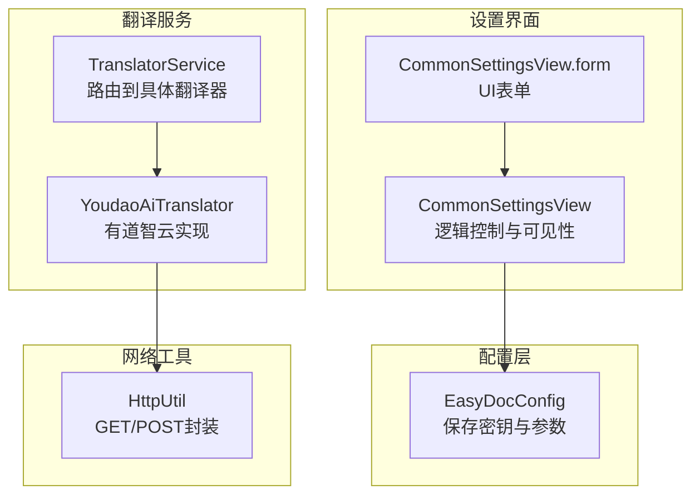
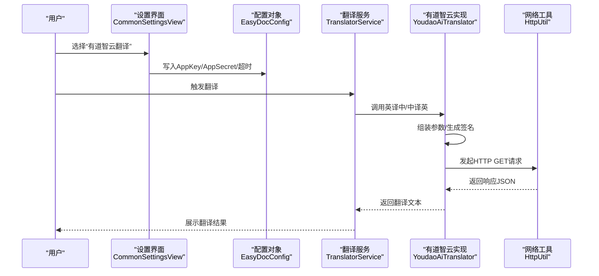
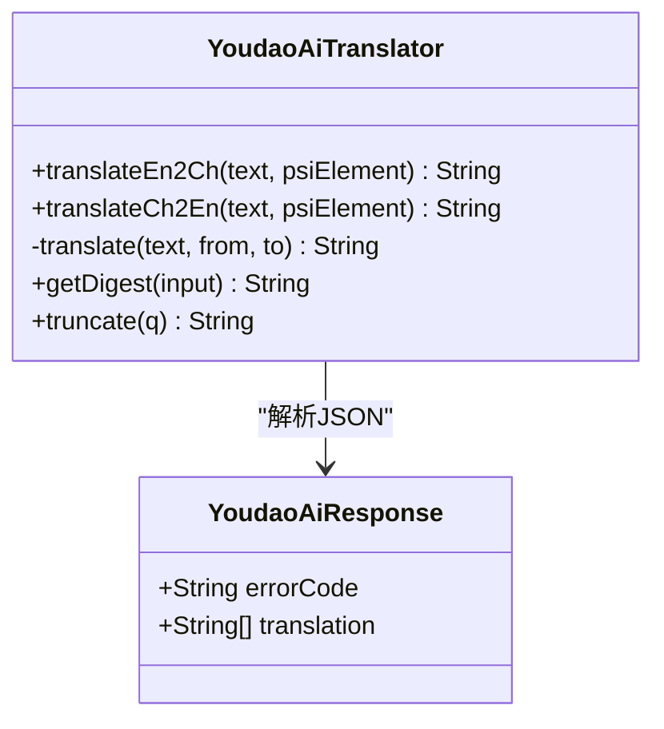
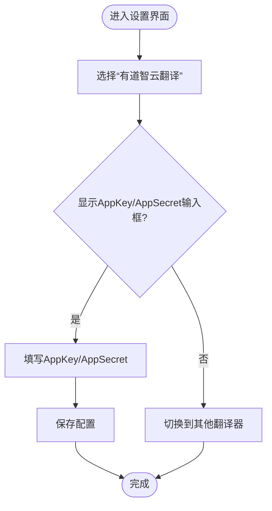
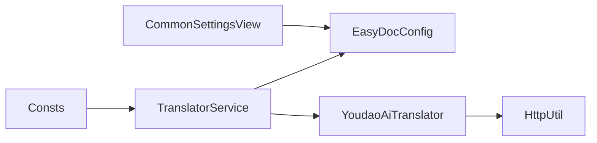

# 有道翻译配置

<cite>
**本文引用的文件列表**
- [YoudaoAiTranslator.java](file://src/main/java/com/star/easydoc/service/translator/impl/YoudaoAiTranslator.java)
- [YoudaoTranslator.java](file://src/main/java/com/star/easydoc/service/translator/impl/YoudaoTranslator.java)
- [EasyDocConfig.java](file://src/main/java/com/star/easydoc/config/EasyDocConfig.java)
- [CommonSettingsView.java](file://src/main/java/com/star/easydoc/view/settings/CommonSettingsView.java)
- [CommonSettingsView.form](file://src/main/java/com/star/easydoc/view/settings/CommonSettingsView.form)
- [Consts.java](file://src/main/java/com/star/easydoc/common/Consts.java)
- [HttpUtil.java](file://src/main/java/com/star/easydoc/common/util/HttpUtil.java)
- [TranslatorService.java](file://src/main/java/com/star/easydoc/service/translator/TranslatorService.java)
- [plugin.xml](file://src/main/resources/META-INF/plugin.xml)
- [README.md](file://README.md)
</cite>

## 目录
1. [简介](#简介)
2. [项目结构与定位](#项目结构与定位)
3. [核心组件](#核心组件)
4. [架构总览](#架构总览)
5. [详细组件分析](#详细组件分析)
6. [依赖关系分析](#依赖关系分析)
7. [性能与超时配置](#性能与超时配置)
8. [故障排查指南](#故障排查指南)
9. [结论](#结论)

## 简介
本指南聚焦于“有道智云翻译”在插件中的配置与使用，涵盖以下内容：
- 如何在有道智云平台申请 APP Key 与 APP Secret，并在插件设置界面中正确填写
- 有道智云翻译的认证机制、请求格式与响应处理
- 插件设置界面中填写 APP Key 与 APP Secret 的完整步骤
- 免费额度、付费套餐与使用限制的说明
- 常见配置问题的排查方法（认证失败、请求超时等）

## 项目结构与定位
- 有道智云翻译由独立实现类负责，位于翻译实现层；配置项存储于全局配置对象；设置界面通过 UI 表单与逻辑类联动。
- 插件通过配置中心统一管理各翻译提供商的密钥与参数，翻译服务根据当前选择的翻译器调用对应实现。

图表来源
- [CommonSettingsView.java:42-739](file://src/main/java/com/star/easydoc/view/settings/CommonSettingsView.java#L42-L739)
- [CommonSettingsView.form:1-436](file://src/main/java/com/star/easydoc/view/settings/CommonSettingsView.form#L1-L436)
- [EasyDocConfig.java:113-119](file://src/main/java/com/star/easydoc/config/EasyDocConfig.java#L113-L119)
- [TranslatorService.java:41-77](file://src/main/java/com/star/easydoc/service/translator/TranslatorService.java#L41-L77)
- [YoudaoAiTranslator.java:24-62](file://src/main/java/com/star/easydoc/service/translator/impl/YoudaoAiTranslator.java#L24-L62)
- [HttpUtil.java:39-246](file://src/main/java/com/star/easydoc/common/util/HttpUtil.java#L39-L246)

章节来源
- [plugin.xml:39-51](file://src/main/resources/META-INF/plugin.xml#L39-L51)
- [Consts.java:60-62](file://src/main/java/com/star/easydoc/common/Consts.java#L60-L62)

## 核心组件
- 有道智云翻译实现：负责构造签名、发送请求、解析响应。
- 配置对象：保存 APP Key、APP Secret、超时等参数。
- 设置界面：提供输入控件、显示/隐藏逻辑、导入/导出、重置等功能。
- 网络工具：封装 HTTP GET 请求与代理支持。
- 翻译服务：根据当前选择的翻译器路由到具体实现。

章节来源
- [YoudaoAiTranslator.java:24-120](file://src/main/java/com/star/easydoc/service/translator/impl/YoudaoAiTranslator.java#L24-L120)
- [EasyDocConfig.java:113-119](file://src/main/java/com/star/easydoc/config/EasyDocConfig.java#L113-L119)
- [CommonSettingsView.java:42-739](file://src/main/java/com/star/easydoc/view/settings/CommonSettingsView.java#L42-L739)
- [HttpUtil.java:39-246](file://src/main/java/com/star/easydoc/common/util/HttpUtil.java#L39-L246)
- [TranslatorService.java:41-77](file://src/main/java/com/star/easydoc/service/translator/TranslatorService.java#L41-L77)

## 架构总览
有道智云翻译的调用链路如下：
- 用户在设置界面选择“有道智云翻译”，并在 AppKey/AppSecret 输入框填入密钥
- 翻译服务根据当前配置选择有道智云实现
- 有道智云实现构造参数、生成签名、调用 HTTP 工具发起请求
- 解析响应后返回翻译结果

图表来源
- [CommonSettingsView.java:42-739](file://src/main/java/com/star/easydoc/view/settings/CommonSettingsView.java#L42-L739)
- [EasyDocConfig.java:113-119](file://src/main/java/com/star/easydoc/config/EasyDocConfig.java#L113-L119)
- [TranslatorService.java:85-163](file://src/main/java/com/star/easydoc/service/translator/TranslatorService.java#L85-L163)
- [YoudaoAiTranslator.java:39-62](file://src/main/java/com/star/easydoc/service/translator/impl/YoudaoAiTranslator.java#L39-L62)
- [HttpUtil.java:76-121](file://src/main/java/com/star/easydoc/common/util/HttpUtil.java#L76-L121)

## 详细组件分析

### 有道智云翻译实现（YoudaoAiTranslator）
- 请求目标：https://openapi.youdao.com/api
- 请求方法：GET
- 参数构成：
  - from：源语言（如 zh-CHS 或 en）
  - to：目标语言（如 zh-CHS 或 en）
  - signType：签名类型，固定为 v3
  - curtime：当前秒级时间戳
  - appKey：从配置读取
  - q：待翻译文本
  - salt：随机盐值
  - sign：基于签名规则生成的 SHA-256 值
- 响应处理：解析 JSON，提取 translation 数组的第一个元素作为翻译结果
- 错误处理：捕获异常并记录日志，返回空字符串

图表来源
- [YoudaoAiTranslator.java:24-120](file://src/main/java/com/star/easydoc/service/translator/impl/YoudaoAiTranslator.java#L24-L120)

章节来源
- [YoudaoAiTranslator.java:29-62](file://src/main/java/com/star/easydoc/service/translator/impl/YoudaoAiTranslator.java#L29-L62)
- [YoudaoAiTranslator.java:67-88](file://src/main/java/com/star/easydoc/service/translator/impl/YoudaoAiTranslator.java#L67-L88)
- [YoudaoAiTranslator.java:98-117](file://src/main/java/com/star/easydoc/service/translator/impl/YoudaoAiTranslator.java#L98-L117)

### 配置对象（EasyDocConfig）
- 存储有道智云密钥字段：
  - youdaoAppKey：AppKey
  - youdaoAppSecret：AppSecret
- 提供 getter/setter 以供设置界面与翻译实现读取/写入
- 同时包含超时等通用配置项

章节来源
- [EasyDocConfig.java:113-119](file://src/main/java/com/star/easydoc/config/EasyDocConfig.java#L113-L119)
- [EasyDocConfig.java:537-551](file://src/main/java/com/star/easydoc/config/EasyDocConfig.java#L537-L551)
- [EasyDocConfig.java:664-670](file://src/main/java/com/star/easydoc/config/EasyDocConfig.java#L664-L670)

### 设置界面（CommonSettingsView + CommonSettingsView.form）
- UI 表单提供“AppKey”“AppSecret”输入框
- 切换翻译器时动态显示/隐藏对应密钥输入框
- 有道智云翻译对应的可见性逻辑在 setVisible 中实现
- 支持导入/导出配置、重置、清空缓存等

图表来源
- [CommonSettingsView.form:257-288](file://src/main/java/com/star/easydoc/view/settings/CommonSettingsView.form#L257-L288)
- [CommonSettingsView.java:213-472](file://src/main/java/com/star/easydoc/view/settings/CommonSettingsView.java#L213-L472)

章节来源
- [CommonSettingsView.form:257-288](file://src/main/java/com/star/easydoc/view/settings/CommonSettingsView.form#L257-L288)
- [CommonSettingsView.java:301-330](file://src/main/java/com/star/easydoc/view/settings/CommonSettingsView.java#L301-L330)
- [CommonSettingsView.java:561-580](file://src/main/java/com/star/easydoc/view/settings/CommonSettingsView.java#L561-L580)

### 网络工具（HttpUtil）
- GET 请求封装，支持超时与代理
- YoudaoAiTranslator 使用该工具发起请求，传入超时配置

章节来源
- [HttpUtil.java:76-121](file://src/main/java/com/star/easydoc/common/util/HttpUtil.java#L76-L121)
- [YoudaoAiTranslator.java](file://src/main/java/com/star/easydoc/service/translator/impl/YoudaoAiTranslator.java#L55)

### 翻译服务（TranslatorService）
- 根据配置选择翻译器实例
- 提供英译中/中译英入口，内部按策略组合自定义映射与第三方翻译

章节来源
- [TranslatorService.java:60-77](file://src/main/java/com/star/easydoc/service/translator/TranslatorService.java#L60-L77)
- [TranslatorService.java:157-163](file://src/main/java/com/star/easydoc/service/translator/TranslatorService.java#L157-L163)

## 依赖关系分析
- 设置界面依赖配置对象以读取/写入密钥
- 翻译服务依赖配置对象以获取当前翻译器与参数
- 有道智云实现依赖网络工具进行 HTTP 请求
- 常量集中定义了“有道智云翻译”的标识

图表来源
- [Consts.java:60-62](file://src/main/java/com/star/easydoc/common/Consts.java#L60-L62)
- [TranslatorService.java:60-77](file://src/main/java/com/star/easydoc/service/translator/TranslatorService.java#L60-L77)
- [YoudaoAiTranslator.java:24-62](file://src/main/java/com/star/easydoc/service/translator/impl/YoudaoAiTranslator.java#L24-L62)
- [HttpUtil.java:39-246](file://src/main/java/com/star/easydoc/common/util/HttpUtil.java#L39-L246)

## 性能与超时配置
- 超时配置项存在于配置对象中，设置界面提供输入框
- YoudaoAiTranslator 在请求时使用配置的超时值
- HttpUtil 的默认连接/读取超时较小，建议在设置界面适当提高以避免频繁超时

章节来源
- [EasyDocConfig.java](file://src/main/java/com/star/easydoc/config/EasyDocConfig.java#L77)
- [EasyDocConfig.java:664-670](file://src/main/java/com/star/easydoc/config/EasyDocConfig.java#L664-L670)
- [CommonSettingsView.java:727-729](file://src/main/java/com/star/easydoc/view/settings/CommonSettingsView.java#L727-L729)
- [YoudaoAiTranslator.java](file://src/main/java/com/star/easydoc/service/translator/impl/YoudaoAiTranslator.java#L55)
- [HttpUtil.java:41-42](file://src/main/java/com/star/easydoc/common/util/HttpUtil.java#L41-L42)

## 故障排查指南

### 1. 认证失败（sign 校验失败）
- 症状：返回错误码或翻译为空
- 排查要点：
  - 确认 AppKey 与 AppSecret 正确无误
  - 确认签名生成逻辑使用的文本截断与时间戳、盐值拼接顺序正确
  - 确认网络环境允许访问 https://openapi.youdao.com/api
- 参考实现细节：
  - 签名生成：基于 appKey + 文本截断 + salt + curtime + appSecret 的 SHA-256
  - 文本截断：长度超过 20 时采用“前10 + 长度 + 后10”的策略

章节来源
- [YoudaoAiTranslator.java:47-52](file://src/main/java/com/star/easydoc/service/translator/impl/YoudaoAiTranslator.java#L47-L52)
- [YoudaoAiTranslator.java:67-88](file://src/main/java/com/star/easydoc/service/translator/impl/YoudaoAiTranslator.java#L67-L88)
- [YoudaoAiTranslator.java:90-96](file://src/main/java/com/star/easydoc/service/translator/impl/YoudaoAiTranslator.java#L90-L96)

### 2. 请求超时
- 症状：日志提示请求失败或响应为空
- 排查要点：
  - 提高设置界面中的“超时时间(ms)”配置
  - 检查 IDE 代理设置是否正确
  - 确认网络可达性与防火墙策略
- 参考实现细节：
  - YoudaoAiTranslator 使用配置的超时值发起请求
  - HttpUtil 支持代理与统一超时配置

章节来源
- [CommonSettingsView.java:727-729](file://src/main/java/com/star/easydoc/view/settings/CommonSettingsView.java#L727-L729)
- [YoudaoAiTranslator.java](file://src/main/java/com/star/easydoc/service/translator/impl/YoudaoAiTranslator.java#L55)
- [HttpUtil.java:84-94](file://src/main/java/com/star/easydoc/common/util/HttpUtil.java#L84-L94)

### 3. 免费额度与使用限制
- 插件 README 明确指出“免费的有道翻译接口已被官方禁用”，推荐使用其他平台的翻译服务
- 有道智云翻译仍可使用，但需自行申请 AppKey/AppSecret 并遵守其计费与配额规则
- 建议在设置界面中合理配置超时与网络代理，确保稳定访问

章节来源
- [README.md:1-50](file://README.md#L1-L50)
- [YoudaoAiTranslator.java](file://src/main/java/com/star/easydoc/service/translator/impl/YoudaoAiTranslator.java#L27)

## 结论
- 有道智云翻译在本插件中通过独立实现类完成请求与响应解析，配置项集中存储于配置对象
- 设置界面提供直观的输入控件与可见性控制，便于用户按需填写密钥
- 若遇到认证失败或超时问题，建议优先核对密钥、签名生成逻辑与网络代理设置
- 由于免费有道翻译接口已停止，建议优先使用有道智云或其他翻译服务，并在插件中正确配置