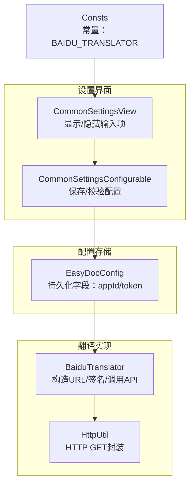
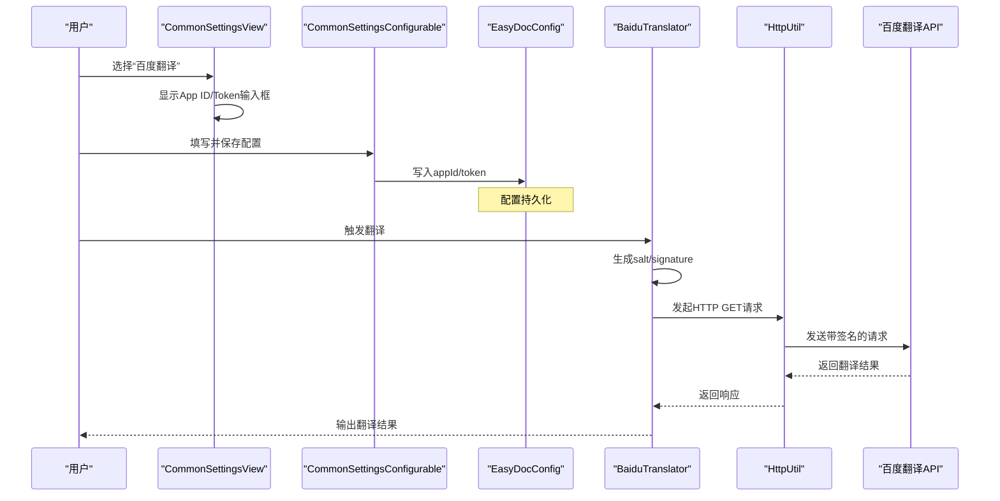
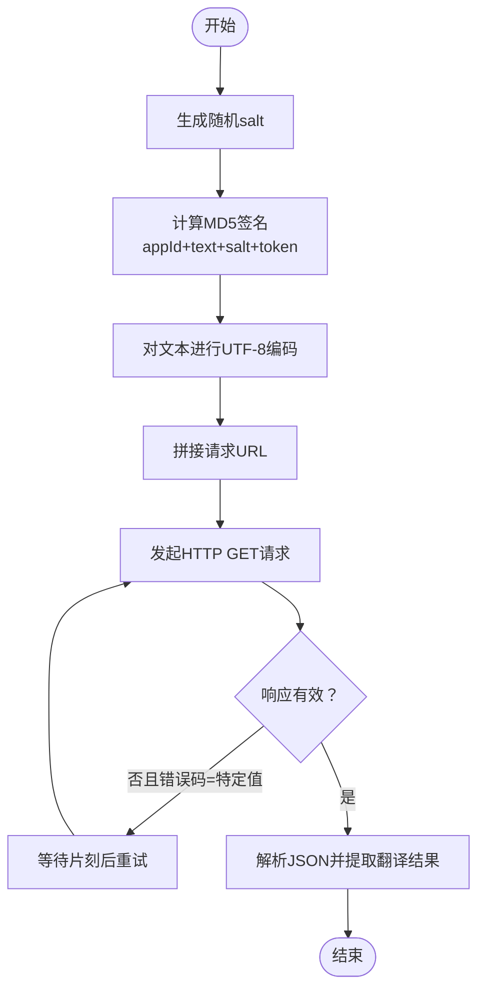
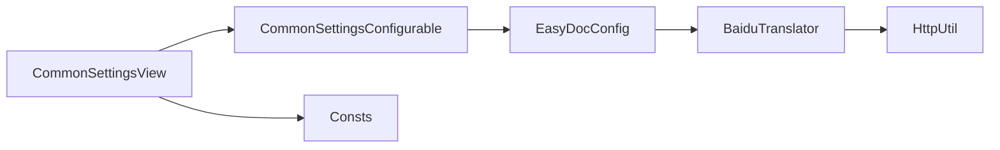

# 百度翻译配置

<cite>
**本文引用的文件**
- [BaiduTranslator.java](file://src/main/java/com/star/easydoc/service/translator/impl/BaiduTranslator.java)
- [EasyDocConfig.java](file://src/main/java/com/star/easydoc/config/EasyDocConfig.java)
- [CommonSettingsView.java](file://src/main/java/com/star/easydoc/view/settings/CommonSettingsView.java)
- [CommonSettingsConfigurable.java](file://src/main/java/com/star/easydoc/view/settings/CommonSettingsConfigurable.java)
- [HttpUtil.java](file://src/main/java/com/star/easydoc/common/util/HttpUtil.java)
- [Consts.java](file://src/main/java/com/star/easydoc/common/Consts.java)
- [plugin.xml](file://src/main/resources/META-INF/plugin.xml)
- [README.md](file://README.md)
</cite>

## 目录
1. [简介](#简介)
2. [项目结构](#项目结构)
3. [核心组件](#核心组件)
4. [架构总览](#架构总览)
5. [详细组件分析](#详细组件分析)
6. [依赖关系分析](#依赖关系分析)
7. [性能与稳定性](#性能与稳定性)
8. [故障排查指南](#故障排查指南)
9. [结论](#结论)
10. [附录](#附录)

## 简介
本指南面向使用 Easy Javadoc 插件的开发者，详细介绍如何在插件中配置百度翻译服务。内容涵盖：
- 在百度翻译开放平台申请 App ID 与 Token 的步骤
- 插件设置界面中填写 App ID 与 Token 的操作流程
- 百度翻译认证流程、API 请求格式与签名机制
- 配额限制、价格策略与使用注意事项
- 常见配置问题的排查与解决方法

## 项目结构
与百度翻译配置直接相关的模块位于以下包与文件中：
- 翻译实现层：service/translator/impl/BaiduTranslator.java
- 配置持久化：config/EasyDocConfig.java
- 设置界面与校验：view/settings/CommonSettingsView.java、view/settings/CommonSettingsConfigurable.java
- HTTP 工具：common/util/HttpUtil.java
- 常量定义：common/Consts.java
- 插件声明：resources/META-INF/plugin.xml
- 项目说明与外部链接：README.md

图表来源
- [CommonSettingsView.java:213-472](file://src/main/java/com/star/easydoc/view/settings/CommonSettingsView.java#L213-L472)
- [CommonSettingsConfigurable.java:94-189](file://src/main/java/com/star/easydoc/view/settings/CommonSettingsConfigurable.java#L94-L189)
- [EasyDocConfig.java:89-95](file://src/main/java/com/star/easydoc/config/EasyDocConfig.java#L89-L95)
- [BaiduTranslator.java:24-62](file://src/main/java/com/star/easydoc/service/translator/impl/BaiduTranslator.java#L24-L62)
- [HttpUtil.java:53-103](file://src/main/java/com/star/easydoc/common/util/HttpUtil.java#L53-L103)
- [Consts.java:44-46](file://src/main/java/com/star/easydoc/common/Consts.java#L44-L46)

章节来源
- [plugin.xml:39-51](file://src/main/resources/META-INF/plugin.xml#L39-L51)
- [README.md:42-47](file://README.md#L42-L47)

## 核心组件
- 百度翻译实现：负责构造请求 URL、生成签名、调用百度翻译 API，并解析响应。
- 配置持久化：保存翻译方式、超时、百度 App ID 与 Token 等。
- 设置界面：根据所选翻译方式动态显示/隐藏对应输入项；保存配置并进行必填校验。
- HTTP 工具：封装 GET 请求与编码逻辑，支持系统代理。
- 常量：定义“百度翻译”翻译方式名称，供界面与配置联动使用。

章节来源
- [BaiduTranslator.java:21-62](file://src/main/java/com/star/easydoc/service/translator/impl/BaiduTranslator.java#L21-L62)
- [EasyDocConfig.java:89-95](file://src/main/java/com/star/easydoc/config/EasyDocConfig.java#L89-L95)
- [CommonSettingsView.java:213-472](file://src/main/java/com/star/easydoc/view/settings/CommonSettingsView.java#L213-L472)
- [CommonSettingsConfigurable.java:94-189](file://src/main/java/com/star/easydoc/view/settings/CommonSettingsConfigurable.java#L94-L189)
- [HttpUtil.java:53-103](file://src/main/java/com/star/easydoc/common/util/HttpUtil.java#L53-L103)
- [Consts.java:44-46](file://src/main/java/com/star/easydoc/common/Consts.java#L44-L46)

## 架构总览
百度翻译在插件中的工作流如下：
- 用户在设置界面选择“百度翻译”，系统显示 App ID 与 Token 输入框
- 用户填写后点击保存，系统进行必填校验
- 生成注释或翻译时，插件通过 BaiduTranslator 构造请求 URL 并发起 HTTP GET
- 请求包含必要参数与签名，服务端验证通过后返回翻译结果

图表来源
- [CommonSettingsView.java:213-242](file://src/main/java/com/star/easydoc/view/settings/CommonSettingsView.java#L213-L242)
- [CommonSettingsConfigurable.java:94-127](file://src/main/java/com/star/easydoc/view/settings/CommonSettingsConfigurable.java#L94-L127)
- [EasyDocConfig.java:489-503](file://src/main/java/com/star/easydoc/config/EasyDocConfig.java#L489-L503)
- [BaiduTranslator.java:38-62](file://src/main/java/com/star/easydoc/service/translator/impl/BaiduTranslator.java#L38-L62)
- [HttpUtil.java:53-103](file://src/main/java/com/star/easydoc/common/util/HttpUtil.java#L53-L103)

## 详细组件分析

### 百度翻译实现（BaiduTranslator）
- 请求 URL 构造：包含 from、to、appid、salt、sign、q 等参数
- 签名算法：对 appId + 文本 + salt + token 进行 MD5 计算
- 编码处理：对待翻译文本进行 UTF-8 编码
- 错误处理：当返回特定错误码时进行短暂等待并重试，最多尝试若干次
- 响应解析：解析 JSON，提取第一条翻译结果

图表来源
- [BaiduTranslator.java:38-62](file://src/main/java/com/star/easydoc/service/translator/impl/BaiduTranslator.java#L38-L62)
- [HttpUtil.java:129-136](file://src/main/java/com/star/easydoc/common/util/HttpUtil.java#L129-L136)

章节来源
- [BaiduTranslator.java:24-62](file://src/main/java/com/star/easydoc/service/translator/impl/BaiduTranslator.java#L24-L62)

### 配置持久化（EasyDocConfig）
- 字段：包含 appId 与 token，用于百度翻译
- 提供 getter/setter，便于界面与服务层读写
- reset 方法会清空百度翻译相关字段

章节来源
- [EasyDocConfig.java:89-95](file://src/main/java/com/star/easydoc/config/EasyDocConfig.java#L89-L95)
- [EasyDocConfig.java:181-182](file://src/main/java/com/star/easydoc/config/EasyDocConfig.java#L181-L182)

### 设置界面与校验（CommonSettingsView/CommonSettingsConfigurable）
- 动态显示：当选中“百度翻译”时，显示 App ID 与 Token 输入框
- 保存与校验：保存时对必填项进行校验，若为空则抛出配置异常
- 刷新：初始化时从配置读取当前值并填充到界面

章节来源
- [CommonSettingsView.java:213-242](file://src/main/java/com/star/easydoc/view/settings/CommonSettingsView.java#L213-L242)
- [CommonSettingsConfigurable.java:94-127](file://src/main/java/com/star/easydoc/view/settings/CommonSettingsConfigurable.java#L94-L127)

### HTTP 工具（HttpUtil）
- GET 请求封装：支持超时、代理、编码
- 编码函数：对 URL 参数进行 UTF-8 编码

章节来源
- [HttpUtil.java:53-103](file://src/main/java/com/star/easydoc/common/util/HttpUtil.java#L53-L103)
- [HttpUtil.java:129-136](file://src/main/java/com/star/easydoc/common/util/HttpUtil.java#L129-L136)

### 常量（Consts）
- 定义“百度翻译”的标识字符串，用于界面联动与配置判断

章节来源
- [Consts.java:44-46](file://src/main/java/com/star/easydoc/common/Consts.java#L44-L46)

## 依赖关系分析
- BaiduTranslator 依赖 EasyDocConfig 获取 appId/token
- CommonSettingsView 与 CommonSettingsConfigurable 负责 UI 与配置的交互
- HttpUtil 为 BaiduTranslator 提供 HTTP 请求能力
- Consts 为 UI 与配置联动提供常量

图表来源
- [CommonSettingsView.java:44-46](file://src/main/java/com/star/easydoc/view/settings/CommonSettingsView.java#L44-L46)
- [CommonSettingsConfigurable.java:28-30](file://src/main/java/com/star/easydoc/view/settings/CommonSettingsConfigurable.java#L28-L30)
- [EasyDocConfig.java:489-503](file://src/main/java/com/star/easydoc/config/EasyDocConfig.java#L489-L503)
- [BaiduTranslator.java:11-13](file://src/main/java/com/star/easydoc/service/translator/impl/BaiduTranslator.java#L11-L13)
- [Consts.java:44-46](file://src/main/java/com/star/easydoc/common/Consts.java#L44-L46)

章节来源
- [plugin.xml:39-51](file://src/main/resources/META-INF/plugin.xml#L39-L51)

## 性能与稳定性
- 重试机制：当遇到特定错误码时，插件会短暂等待并重试，提升成功率
- 超时控制：通过配置超时时间，避免长时间阻塞
- 代理支持：HTTP 工具支持系统代理，便于内网环境使用

章节来源
- [BaiduTranslator.java:42-55](file://src/main/java/com/star/easydoc/service/translator/impl/BaiduTranslator.java#L42-L55)
- [CommonSettingsConfigurable.java:184-188](file://src/main/java/com/star/easydoc/view/settings/CommonSettingsConfigurable.java#L184-L188)
- [HttpUtil.java:84-101](file://src/main/java/com/star/easydoc/common/util/HttpUtil.java#L84-L101)

## 故障排查指南

### 1. 签名错误
- 现象：请求返回错误或翻译失败
- 排查要点：
  - 确认 App ID 与 Token 正确无误
  - 确认文本编码为 UTF-8
  - 确认签名计算顺序与参数拼接正确（appId + 文本 + salt + token）
- 处理建议：
  - 重新在百度翻译开放平台核对密钥
  - 清理缓存并重试

章节来源
- [BaiduTranslator.java:44](file://src/main/java/com/star/easydoc/service/translator/impl/BaiduTranslator.java#L44)
- [HttpUtil.java:129-136](file://src/main/java/com/star/easydoc/common/util/HttpUtil.java#L129-L136)

### 2. 配额不足
- 现象：请求被拒绝或返回配额相关错误
- 排查要点：
  - 查看百度翻译开放平台的配额与计费规则
  - 检查是否超出免费额度
- 处理建议：
  - 付费升级配额或等待周期重置
  - 合理规划调用频率

章节来源
- [README.md:42-47](file://README.md#L42-L47)

### 3. 网络连接问题
- 现象：请求超时或无法访问
- 排查要点：
  - 检查系统代理设置
  - 确认网络可达性
- 处理建议：
  - 配置系统代理
  - 调整超时时间

章节来源
- [HttpUtil.java:84-101](file://src/main/java/com/star/easydoc/common/util/HttpUtil.java#L84-L101)
- [CommonSettingsConfigurable.java:184-188](file://src/main/java/com/star/easydoc/view/settings/CommonSettingsConfigurable.java#L184-L188)

### 4. 设置界面未显示 App ID/Token
- 现象：选择了“百度翻译”，但未显示输入框
- 排查要点：
  - 确认翻译方式选择为“百度翻译”
  - 界面会根据选择动态显示/隐藏输入框
- 处理建议：
  - 重新选择“百度翻译”

章节来源
- [CommonSettingsView.java:213-242](file://src/main/java/com/star/easydoc/view/settings/CommonSettingsView.java#L213-L242)

### 5. 保存时报错“appId/密钥不能为空”
- 现象：保存配置时报错
- 排查要点：
  - 确认已填写 App ID 与 Token
- 处理建议：
  - 补充必填信息后再次保存

章节来源
- [CommonSettingsConfigurable.java:120-127](file://src/main/java/com/star/easydoc/view/settings/CommonSettingsConfigurable.java#L120-L127)

## 结论
通过上述组件与流程，插件实现了对百度翻译服务的完整接入。配置时只需在设置界面选择“百度翻译”，并正确填写 App ID 与 Token，即可启用翻译功能。遇到问题时，可依据本文的排查清单逐项定位并解决。

## 附录

### A. 在百度翻译开放平台申请 App ID 与 Token
- 参考链接：README 中提供的申请地址
- 注意事项：
  - 申请完成后妥善保管 App ID 与 Token
  - 遵循平台的配额与计费规则

章节来源
- [README.md:42-47](file://README.md#L42-L47)

### B. 插件设置界面配置步骤
- 打开设置页面，找到“EasyDoc”配置
- 在“翻译方式”中选择“百度翻译”
- 填写 App ID 与 Token
- 点击保存，完成配置

章节来源
- [CommonSettingsView.java:213-242](file://src/main/java/com/star/easydoc/view/settings/CommonSettingsView.java#L213-L242)
- [CommonSettingsConfigurable.java:94-127](file://src/main/java/com/star/easydoc/view/settings/CommonSettingsConfigurable.java#L94-L127)

### C. 百度翻译认证流程与签名机制
- 认证流程：
  - 选择“百度翻译”
  - 填写 App ID 与 Token
  - 插件生成 salt 与签名，发起请求
- 签名机制：
  - 对 appId + 文本 + salt + token 进行 MD5 计算
  - 对文本进行 UTF-8 编码

章节来源
- [BaiduTranslator.java:24-62](file://src/main/java/com/star/easydoc/service/translator/impl/BaiduTranslator.java#L24-L62)
- [HttpUtil.java:129-136](file://src/main/java/com/star/easydoc/common/util/HttpUtil.java#L129-L136)

### D. API 请求格式
- 请求方式：HTTP GET
- 请求 URL：包含 from、to、appid、salt、sign、q 等参数
- 编码：UTF-8

章节来源
- [BaiduTranslator.java:24-47](file://src/main/java/com/star/easydoc/service/translator/impl/BaiduTranslator.java#L24-L47)
- [HttpUtil.java:129-136](file://src/main/java/com/star/easydoc/common/util/HttpUtil.java#L129-L136)

### E. 配额限制与价格策略
- 配额与价格以百度翻译开放平台为准
- 建议关注平台公告与账单，合理规划用量

章节来源
- [README.md:42-47](file://README.md#L42-L47)