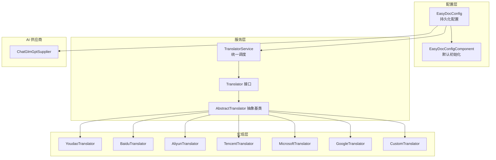
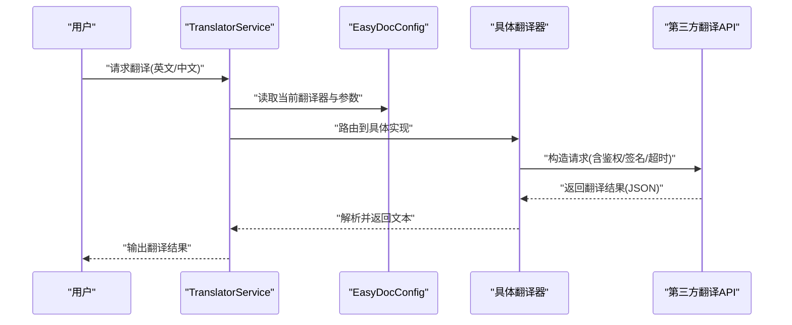
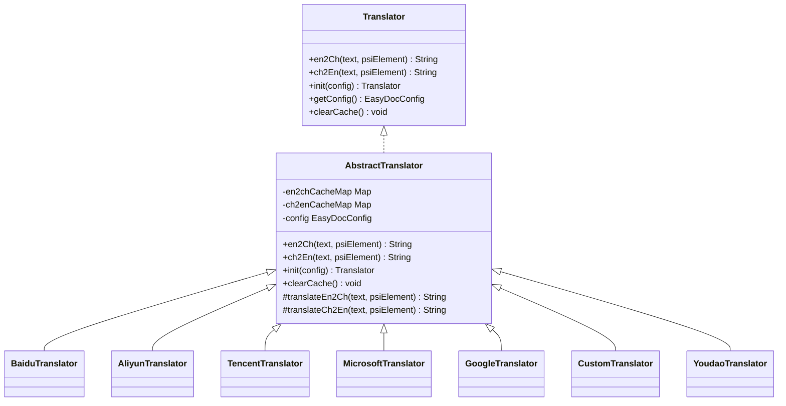
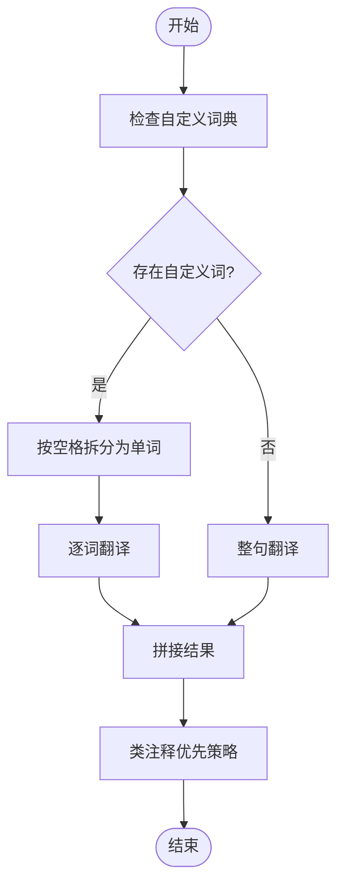
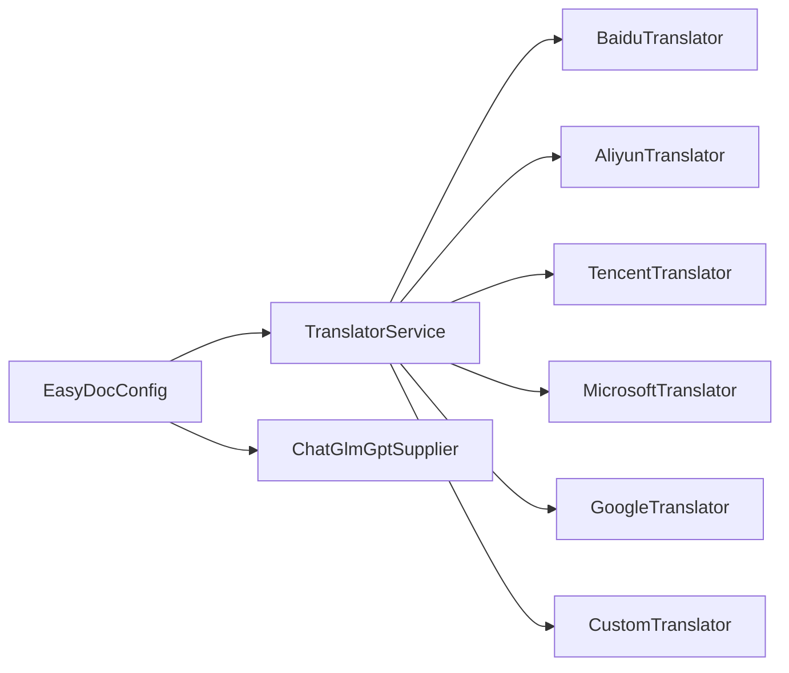

# 翻译服务配置

<cite>
**本文引用的文件**
- [EasyDocConfig.java](file://src/main/java/com/star/easydoc/config/EasyDocConfig.java)
- [EasyDocConfigComponent.java](file://src/main/java/com/star/easydoc/config/EasyDocConfigComponent.java)
- [Consts.java](file://src/main/java/com/star/easydoc/common/Consts.java)
- [TranslatorService.java](file://src/main/java/com/star/easydoc/service/translator/TranslatorService.java)
- [Translator.java](file://src/main/java/com/star/easydoc/service/translator/Translator.java)
- [AbstractTranslator.java](file://src/main/java/com/star/easydoc/service/translator/impl/AbstractTranslator.java)
- [YoudaoTranslator.java](file://src/main/java/com/star/easydoc/service/translator/impl/YoudaoTranslator.java)
- [BaiduTranslator.java](file://src/main/java/com/star/easydoc/service/translator/impl/BaiduTranslator.java)
- [AliyunTranslator.java](file://src/main/java/com/star/easydoc/service/translator/impl/AliyunTranslator.java)
- [TencentTranslator.java](file://src/main/java/com/star/easydoc/service/translator/impl/TencentTranslator.java)
- [MicrosoftTranslator.java](file://src/main/java/com/star/easydoc/service/translator/impl/MicrosoftTranslator.java)
- [GoogleTranslator.java](file://src/main/java/com/star/easydoc/service/translator/impl/GoogleTranslator.java)
- [CustomTranslator.java](file://src/main/java/com/star/easydoc/service/translator/impl/CustomTranslator.java)
- [ChatGlmGptSupplier.java](file://src/main/java/com/star/easydoc/service/gpt/impl/ChatGlmGptSupplier.java)
</cite>

## 目录
1. [简介](#简介)
2. [项目结构](#项目结构)
3. [核心组件](#核心组件)
4. [架构总览](#架构总览)
5. [详细组件分析](#详细组件分析)
6. [依赖分析](#依赖分析)
7. [性能考虑](#性能考虑)
8. [故障排查指南](#故障排查指南)
9. [结论](#结论)
10. [附录](#附录)

## 简介
本指南面向 Easy Javadoc 插件的“翻译服务”配置，系统性讲解如何为多种翻译器配置密钥与参数，并说明超时、自定义 URL、翻译优先级等高级选项。文档同时对比各翻译器特点，给出选择建议与常见问题排查方法。

## 项目结构
翻译相关的核心代码集中在以下模块：
- 配置层：持久化配置与默认初始化
- 服务层：统一调度与路由到具体翻译器
- 接口与抽象：定义翻译器契约与通用缓存
- 实现层：各平台翻译器的具体实现
- AI 供应商：ChatGLM 等大模型翻译能力

图表来源
- [EasyDocConfig.java:1-680](file://src/main/java/com/star/easydoc/config/EasyDocConfig.java#L1-L680)
- [EasyDocConfigComponent.java:1-69](file://src/main/java/com/star/easydoc/config/EasyDocConfigComponent.java#L1-L69)
- [TranslatorService.java:1-238](file://src/main/java/com/star/easydoc/service/translator/TranslatorService.java#L1-L238)
- [Translator.java:1-54](file://src/main/java/com/star/easydoc/service/translator/Translator.java#L1-L54)
- [AbstractTranslator.java:1-92](file://src/main/java/com/star/easydoc/service/translator/impl/AbstractTranslator.java#L1-L92)
- [YoudaoTranslator.java:1-161](file://src/main/java/com/star/easydoc/service/translator/impl/YoudaoTranslator.java#L1-L161)
- [BaiduTranslator.java:1-138](file://src/main/java/com/star/easydoc/service/translator/impl/BaiduTranslator.java#L1-L138)
- [AliyunTranslator.java:1-283](file://src/main/java/com/star/easydoc/service/translator/impl/AliyunTranslator.java#L1-L283)
- [TencentTranslator.java:1-184](file://src/main/java/com/star/easydoc/service/translator/impl/TencentTranslator.java#L1-L184)
- [MicrosoftTranslator.java:1-62](file://src/main/java/com/star/easydoc/service/translator/impl/MicrosoftTranslator.java#L1-L62)
- [GoogleTranslator.java:1-52](file://src/main/java/com/star/easydoc/service/translator/impl/GoogleTranslator.java#L1-L52)
- [CustomTranslator.java:1-61](file://src/main/java/com/star/easydoc/service/translator/impl/CustomTranslator.java#L1-L61)
- [ChatGlmGptSupplier.java:1-135](file://src/main/java/com/star/easydoc/service/gpt/impl/ChatGlmGptSupplier.java#L1-L135)

章节来源
- [EasyDocConfig.java:1-680](file://src/main/java/com/star/easydoc/config/EasyDocConfig.java#L1-L680)
- [EasyDocConfigComponent.java:1-69](file://src/main/java/com/star/easydoc/config/EasyDocConfigComponent.java#L1-L69)
- [TranslatorService.java:1-238](file://src/main/java/com/star/easydoc/service/translator/TranslatorService.java#L1-L238)

## 核心组件
- 配置对象：集中管理翻译器类型、密钥、超时、自定义 URL、优先级等
- 配置组件：负责默认值注入与持久化加载
- 翻译服务：根据配置选择具体翻译器，支持整句/分词混合策略
- 翻译器接口与抽象：统一契约、缓存、初始化流程
- 各翻译器实现：封装第三方 API 的请求与响应解析
- AI 供应商：基于 ChatGLM 的令牌签发与请求

章节来源
- [EasyDocConfig.java:74-136](file://src/main/java/com/star/easydoc/config/EasyDocConfig.java#L74-L136)
- [EasyDocConfigComponent.java:29-66](file://src/main/java/com/star/easydoc/config/EasyDocConfigComponent.java#L29-L66)
- [TranslatorService.java:41-111](file://src/main/java/com/star/easydoc/service/translator/TranslatorService.java#L41-L111)
- [Translator.java:13-53](file://src/main/java/com/star/easydoc/service/translator/Translator.java#L13-L53)
- [AbstractTranslator.java:14-91](file://src/main/java/com/star/easydoc/service/translator/impl/AbstractTranslator.java#L14-L91)

## 架构总览
翻译服务采用“配置驱动 + 多实现适配”的架构：
- 配置层决定使用哪个翻译器、超时、自定义 URL 等
- 服务层按策略进行整句或分词翻译，并结合自定义词典
- 实现层各自封装第三方 API 的鉴权、签名、请求与错误处理
- AI 供应商独立于传统翻译器，通过令牌生成与模型调用完成翻译

图表来源
- [TranslatorService.java:85-163](file://src/main/java/com/star/easydoc/service/translator/TranslatorService.java#L85-L163)
- [BaiduTranslator.java:38-62](file://src/main/java/com/star/easydoc/service/translator/impl/BaiduTranslator.java#L38-L62)
- [AliyunTranslator.java:59-73](file://src/main/java/com/star/easydoc/service/translator/impl/AliyunTranslator.java#L59-L73)
- [TencentTranslator.java:42-76](file://src/main/java/com/star/easydoc/service/translator/impl/TencentTranslator.java#L42-L76)
- [MicrosoftTranslator.java:41-60](file://src/main/java/com/star/easydoc/service/translator/impl/MicrosoftTranslator.java#L41-L60)
- [GoogleTranslator.java:37-49](file://src/main/java/com/star/easydoc/service/translator/impl/GoogleTranslator.java#L37-L49)
- [CustomTranslator.java:34-58](file://src/main/java/com/star/easydoc/service/translator/impl/CustomTranslator.java#L34-L58)

## 详细组件分析

### 配置项与参数总览
- 翻译器类型：可在常量集中选择（如有道、百度、阿里云、腾讯、微软、谷歌、自定义等）
- 密钥与参数：
  - 百度：App ID、Token
  - 腾讯：SecretId、SecretKey
  - 阿里云：AccessKeyId、AccessKeySecret
  - 有道：App Key、App Secret（注意免费接口已停用，需私有账号）
  - 谷歌：API Key
  - 微软：订阅 Key、区域（可选）
  - ChatGLM：API Key（格式为“ID.密钥”，用于签发 JWT）
  - 自定义：自定义 URL（支持占位符替换）
- 超时：毫秒，默认值由配置类提供
- 翻译优先级：支持“类注释优先/仅翻译”两种模式
- 自定义词典：支持全局与项目级映射，提升术语一致性

章节来源
- [Consts.java:29-99](file://src/main/java/com/star/easydoc/common/Consts.java#L29-L99)
- [EasyDocConfig.java:80-136](file://src/main/java/com/star/easydoc/config/EasyDocConfig.java#L80-L136)
- [EasyDocConfig.java:664-678](file://src/main/java/com/star/easydoc/config/EasyDocConfig.java#L664-L678)
- [EasyDocConfig.java:632-646](file://src/main/java/com/star/easydoc/config/EasyDocConfig.java#L632-L646)

### 翻译器选择与初始化
- 服务层在启动时构建“名称 → 翻译器实例”的映射表，按配置选择当前翻译器
- 每个翻译器实现均继承抽象基类，具备缓存、初始化与清理缓存的能力
- 若未找到对应翻译器，翻译服务会返回空字符串

图表来源
- [Translator.java:13-53](file://src/main/java/com/star/easydoc/service/translator/Translator.java#L13-L53)
- [AbstractTranslator.java:14-91](file://src/main/java/com/star/easydoc/service/translator/impl/AbstractTranslator.java#L14-L91)
- [BaiduTranslator.java:21-138](file://src/main/java/com/star/easydoc/service/translator/impl/BaiduTranslator.java#L21-L138)
- [AliyunTranslator.java:35-283](file://src/main/java/com/star/easydoc/service/translator/impl/AliyunTranslator.java#L35-L283)
- [TencentTranslator.java:27-184](file://src/main/java/com/star/easydoc/service/translator/impl/TencentTranslator.java#L27-L184)
- [MicrosoftTranslator.java:22-62](file://src/main/java/com/star/easydoc/service/translator/impl/MicrosoftTranslator.java#L22-L62)
- [GoogleTranslator.java:19-52](file://src/main/java/com/star/easydoc/service/translator/impl/GoogleTranslator.java#L19-L52)
- [CustomTranslator.java:20-61](file://src/main/java/com/star/easydoc/service/translator/impl/CustomTranslator.java#L20-L61)
- [YoudaoTranslator.java:22-161](file://src/main/java/com/star/easydoc/service/translator/impl/YoudaoTranslator.java#L22-L161)

章节来源
- [TranslatorService.java:41-77](file://src/main/java/com/star/easydoc/service/translator/TranslatorService.java#L41-L77)
- [AbstractTranslator.java:14-91](file://src/main/java/com/star/easydoc/service/translator/impl/AbstractTranslator.java#L14-L91)

### 翻译流程与策略
- 自定义词典优先：若输入包含自定义词，逐词翻译；否则整句翻译
- 类注释优先：当“类注释优先”开启时，优先从源码类注释提取，再进行翻译
- 缓存机制：英译中与中译英分别维护缓存，避免重复请求
- 错误处理：各实现捕获异常并记录日志，必要时提示用户检查密钥与网络

图表来源
- [TranslatorService.java:85-148](file://src/main/java/com/star/easydoc/service/translator/TranslatorService.java#L85-L148)
- [AbstractTranslator.java:22-52](file://src/main/java/com/star/easydoc/service/translator/impl/AbstractTranslator.java#L22-L52)

章节来源
- [TranslatorService.java:85-148](file://src/main/java/com/star/easydoc/service/translator/TranslatorService.java#L85-L148)
- [AbstractTranslator.java:22-52](file://src/main/java/com/star/easydoc/service/translator/impl/AbstractTranslator.java#L22-L52)

### 各翻译器配置要点与参数说明

- 百度翻译
  - 必填参数：App ID、Token
  - 签名算法：MD5(AppId + 文本 + Salt + Token)
  - 超时：由配置类提供默认值
  - 错误重试：针对特定错误码自动等待后重试
  - 参考路径：[BaiduTranslator.java:24-62](file://src/main/java/com/star/easydoc/service/translator/impl/BaiduTranslator.java#L24-L62)

- 阿里云翻译
  - 必填参数：AccessKeyId、AccessKeySecret
  - 鉴权流程：MD5+BASE64、HMAC-SHA1、Authorization 头部
  - 请求体：JSON，包含源语言、目标语言、文本、场景等字段
  - 参考路径：[AliyunTranslator.java:39-153](file://src/main/java/com/star/easydoc/service/translator/impl/AliyunTranslator.java#L39-L153)

- 腾讯翻译
  - 必填参数：SecretId、SecretKey
  - 签名算法：HmacSHA1，按规范拼接待签名串
  - 请求参数：Action、Version、Region、SourceText、Source、Target 等
  - 错误重试：针对“请求限流”自动等待后重试
  - 参考路径：[TencentTranslator.java:42-93](file://src/main/java/com/star/easydoc/service/translator/impl/TencentTranslator.java#L42-L93)

- 有道翻译
  - 注意：官方免费接口已停用，实现仅作提示
  - 私有账号建议：切换到“有道智云翻译”或其他付费服务
  - 参考路径：[YoudaoTranslator.java:32-42](file://src/main/java/com/star/easydoc/service/translator/impl/YoudaoTranslator.java#L32-L42)

- 微软翻译
  - 必填参数：订阅 Key；区域可选
  - 请求头：Ocp-Apim-Subscription-Key、可选 Ocp-Apim-Subscription-Region
  - 参考路径：[MicrosoftTranslator.java:41-60](file://src/main/java/com/star/easydoc/service/translator/impl/MicrosoftTranslator.java#L41-L60)

- 谷歌翻译
  - 必填参数：API Key
  - 请求方式：GET，携带 q、source、target、key、format
  - 参考路径：[GoogleTranslator.java:37-49](file://src/main/java/com/star/easydoc/service/translator/impl/GoogleTranslator.java#L37-L49)

- 自定义 HTTP 接口
  - 必填参数：自定义 URL（支持 {from}、{to}、{query}、{type} 占位符）
  - 返回格式：需包含 code 与 data 字段，code 为 0 表示成功
  - 参考路径：[CustomTranslator.java:34-58](file://src/main/java/com/star/easydoc/service/translator/impl/CustomTranslator.java#L34-L58)

- ChatGLM AI 翻译
  - 必填参数：API Key（格式为“ID.密钥”），用于签发 JWT
  - 令牌生成：HMAC256，包含 api_key、过期时间、时间戳等声明
  - 参考路径：[ChatGlmGptSupplier.java:53-76](file://src/main/java/com/star/easydoc/service/gpt/impl/ChatGlmGptSupplier.java#L53-L76)

章节来源
- [BaiduTranslator.java:24-62](file://src/main/java/com/star/easydoc/service/translator/impl/BaiduTranslator.java#L24-L62)
- [AliyunTranslator.java:39-153](file://src/main/java/com/star/easydoc/service/translator/impl/AliyunTranslator.java#L39-L153)
- [TencentTranslator.java:42-93](file://src/main/java/com/star/easydoc/service/translator/impl/TencentTranslator.java#L42-L93)
- [YoudaoTranslator.java:32-42](file://src/main/java/com/star/easydoc/service/translator/impl/YoudaoTranslator.java#L32-L42)
- [MicrosoftTranslator.java:41-60](file://src/main/java/com/star/easydoc/service/translator/impl/MicrosoftTranslator.java#L41-L60)
- [GoogleTranslator.java:37-49](file://src/main/java/com/star/easydoc/service/translator/impl/GoogleTranslator.java#L37-L49)
- [CustomTranslator.java:34-58](file://src/main/java/com/star/easydoc/service/translator/impl/CustomTranslator.java#L34-L58)
- [ChatGlmGptSupplier.java:53-76](file://src/main/java/com/star/easydoc/service/gpt/impl/ChatGlmGptSupplier.java#L53-L76)

### 高级选项与最佳实践
- 翻译超时设置
  - 使用配置类提供的默认超时值，按网络环境适当调整
  - 参考路径：[EasyDocConfig.java:77](file://src/main/java/com/star/easydoc/config/EasyDocConfig.java#L77)

- 自定义 URL 配置
  - 支持 {from}、{to}、{query}、{type} 占位符，便于对接内部翻译服务
  - 返回 JSON 需包含 code 与 data 字段，code 为 0 成功
  - 参考路径：[CustomTranslator.java:44-58](file://src/main/java/com/star/easydoc/service/translator/impl/CustomTranslator.java#L44-L58)

- 翻译优先级
  - “类注释优先”：优先使用已有类注释，减少重复翻译
  - “仅翻译”：直接翻译，不参考现有注释
  - 参考路径：[TranslatorService.java:119-148](file://src/main/java/com/star/easydoc/service/translator/TranslatorService.java#L119-L148)

- 自定义词典
  - 支持全局与项目级映射，提升术语一致性
  - 参考路径：[EasyDocConfig.java:426-450](file://src/main/java/com/star/easydoc/config/EasyDocConfig.java#L426-L450)

章节来源
- [EasyDocConfig.java:77](file://src/main/java/com/star/easydoc/config/EasyDocConfig.java#L77)
- [CustomTranslator.java:44-58](file://src/main/java/com/star/easydoc/service/translator/impl/CustomTranslator.java#L44-L58)
- [TranslatorService.java:119-148](file://src/main/java/com/star/easydoc/service/translator/TranslatorService.java#L119-L148)
- [EasyDocConfig.java:426-450](file://src/main/java/com/star/easydoc/config/EasyDocConfig.java#L426-L450)

## 依赖分析
- 组件耦合
  - TranslatorService 依赖 EasyDocConfig 与各翻译器实现
  - 各翻译器实现依赖 EasyDocConfig 读取密钥与超时
  - ChatGLM 供应商独立于传统翻译器，但同样依赖 EasyDocConfig 读取密钥
- 外部依赖
  - HTTP 工具类用于发送 GET/POST 请求
  - JSON 解析库用于解析第三方返回
  - 日志框架用于错误记录与通知

图表来源
- [TranslatorService.java:60-76](file://src/main/java/com/star/easydoc/service/translator/TranslatorService.java#L60-L76)
- [ChatGlmGptSupplier.java:30-51](file://src/main/java/com/star/easydoc/service/gpt/impl/ChatGlmGptSupplier.java#L30-L51)

章节来源
- [TranslatorService.java:60-76](file://src/main/java/com/star/easydoc/service/translator/TranslatorService.java#L60-L76)
- [ChatGlmGptSupplier.java:30-51](file://src/main/java/com/star/easydoc/service/gpt/impl/ChatGlmGptSupplier.java#L30-L51)

## 性能考虑
- 缓存策略：英译中与中译英分别缓存，显著降低重复请求次数
- 整句 vs 分词：无自定义词时整句翻译更准确；有自定义词时逐词翻译保证术语一致性
- 超时与重试：针对限流与网络抖动，实现内置等待与重试逻辑
- 建议：在高并发或大量注释场景下，合理设置超时与启用缓存

章节来源
- [AbstractTranslator.java:16-72](file://src/main/java/com/star/easydoc/service/translator/impl/AbstractTranslator.java#L16-L72)
- [BaiduTranslator.java:42-55](file://src/main/java/com/star/easydoc/service/translator/impl/BaiduTranslator.java#L42-L55)
- [TencentTranslator.java:65-71](file://src/main/java/com/star/easydoc/service/translator/impl/TencentTranslator.java#L65-L71)

## 故障排查指南
- 通用检查
  - 确认翻译器类型与密钥配置正确
  - 检查网络连通性与代理设置
  - 查看日志输出中的错误信息与响应体
- 常见问题
  - 百度翻译报错：检查 App ID 与 Token，确认签名算法与字符编码
    - 参考路径：[BaiduTranslator.java:42-62](file://src/main/java/com/star/easydoc/service/translator/impl/BaiduTranslator.java#L42-L62)
  - 阿里云翻译失败：核对 AccessKeyId/AccessKeySecret，检查头部签名与时间戳
    - 参考路径：[AliyunTranslator.java:117-153](file://src/main/java/com/star/easydoc/service/translator/impl/AliyunTranslator.java#L117-L153)
  - 腾讯翻译限流：关注错误码“RequestLimitExceeded”，适当延长重试间隔
    - 参考路径：[TencentTranslator.java:65-71](file://src/main/java/com/star/easydoc/service/translator/impl/TencentTranslator.java#L65-L71)
  - 有道翻译不可用：官方免费接口已停用，请使用私有账号或切换其他翻译器
    - 参考路径：[YoudaoTranslator.java:32-42](file://src/main/java/com/star/easydoc/service/translator/impl/YoudaoTranslator.java#L32-L42)
  - 微软翻译鉴权失败：确认订阅 Key 与区域设置，检查请求头
    - 参考路径：[MicrosoftTranslator.java:48-59](file://src/main/java/com/star/easydoc/service/translator/impl/MicrosoftTranslator.java#L48-L59)
  - 谷歌翻译失败：确认 API Key 有效，检查请求 URL 与编码
    - 参考路径：[GoogleTranslator.java:40-49](file://src/main/java/com/star/easydoc/service/translator/impl/GoogleTranslator.java#L40-L49)
  - 自定义接口返回非 0：检查返回 JSON 结构与业务状态码
    - 参考路径：[CustomTranslator.java:49-57](file://src/main/java/com/star/easydoc/service/translator/impl/CustomTranslator.java#L49-L57)
  - ChatGLM 令牌无效：确认 API Key 格式为“ID.密钥”，检查过期时间与签名算法
    - 参考路径：[ChatGlmGptSupplier.java:53-76](file://src/main/java/com/star/easydoc/service/gpt/impl/ChatGlmGptSupplier.java#L53-L76)

章节来源
- [BaiduTranslator.java:42-62](file://src/main/java/com/star/easydoc/service/translator/impl/BaiduTranslator.java#L42-L62)
- [AliyunTranslator.java:117-153](file://src/main/java/com/star/easydoc/service/translator/impl/AliyunTranslator.java#L117-L153)
- [TencentTranslator.java:65-71](file://src/main/java/com/star/easydoc/service/translator/impl/TencentTranslator.java#L65-L71)
- [YoudaoTranslator.java:32-42](file://src/main/java/com/star/easydoc/service/translator/impl/YoudaoTranslator.java#L32-L42)
- [MicrosoftTranslator.java:48-59](file://src/main/java/com/star/easydoc/service/translator/impl/MicrosoftTranslator.java#L48-L59)
- [GoogleTranslator.java:40-49](file://src/main/java/com/star/easydoc/service/translator/impl/GoogleTranslator.java#L40-L49)
- [CustomTranslator.java:49-57](file://src/main/java/com/star/easydoc/service/translator/impl/CustomTranslator.java#L49-L57)
- [ChatGlmGptSupplier.java:53-76](file://src/main/java/com/star/easydoc/service/gpt/impl/ChatGlmGptSupplier.java#L53-L76)

## 结论
- 对于需要稳定与私有化的团队，推荐使用付费翻译服务（如阿里云、腾讯、微软、谷歌）
- 免费接口（如有道免费版）可能受限，建议优先配置私有账号
- 自定义 HTTP 接口适合企业内网翻译服务集成
- ChatGLM 适合需要 AI 辅助的高质量翻译场景，注意密钥格式与令牌有效期

## 附录
- 常用配置清单
  - 百度：App ID、Token、超时
  - 腾讯：SecretId、SecretKey、超时
  - 阿里云：AccessKeyId、AccessKeySecret、超时
  - 有道：App Key、App Secret（注意免费接口限制）
  - 微软：订阅 Key、区域（可选）、超时
  - 谷歌：API Key、超时
  - ChatGLM：API Key（ID.密钥）、超时
  - 自定义：自定义 URL（含占位符）、超时
- 术语与优先级
  - 自定义词典：全局/项目级映射
  - 翻译优先级：类注释优先/仅翻译

章节来源
- [Consts.java:29-99](file://src/main/java/com/star/easydoc/common/Consts.java#L29-L99)
- [EasyDocConfig.java:80-136](file://src/main/java/com/star/easydoc/config/EasyDocConfig.java#L80-L136)
- [EasyDocConfig.java:632-646](file://src/main/java/com/star/easydoc/config/EasyDocConfig.java#L632-L646)
- [EasyDocConfig.java:426-450](file://src/main/java/com/star/easydoc/config/EasyDocConfig.java#L426-L450)