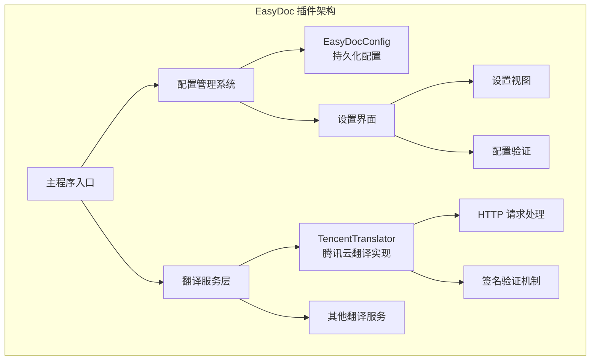
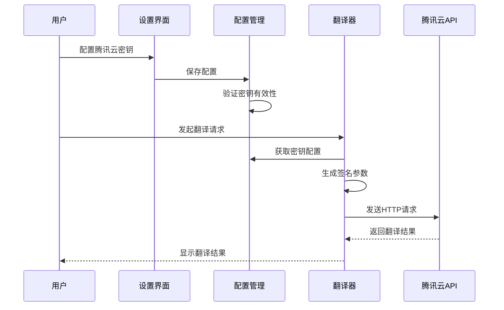
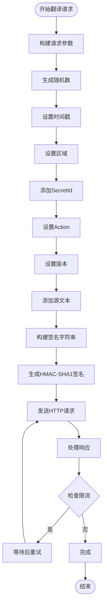
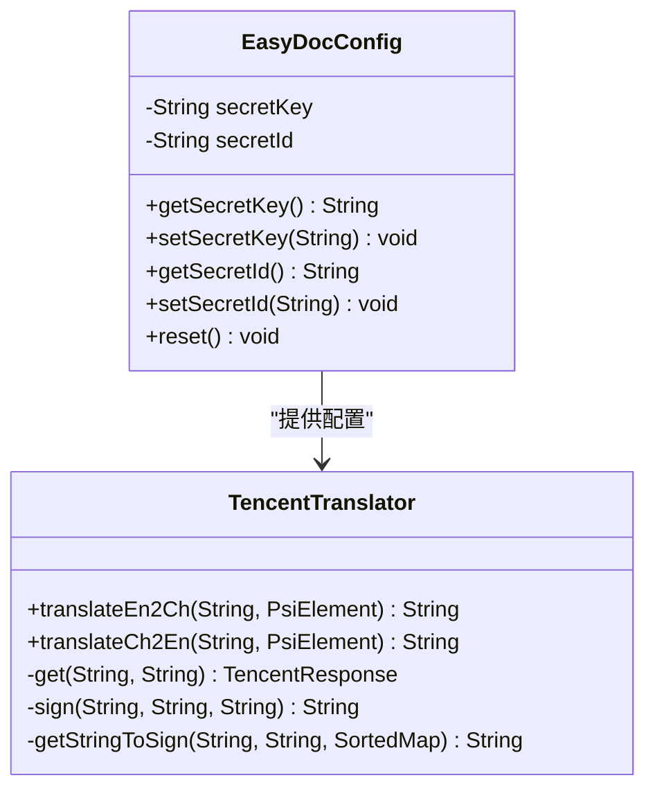
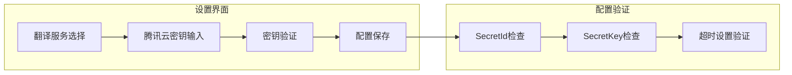
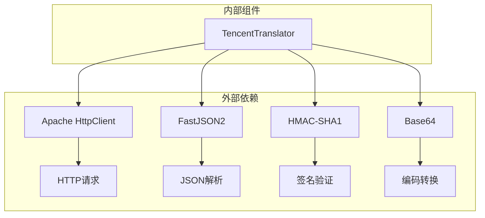
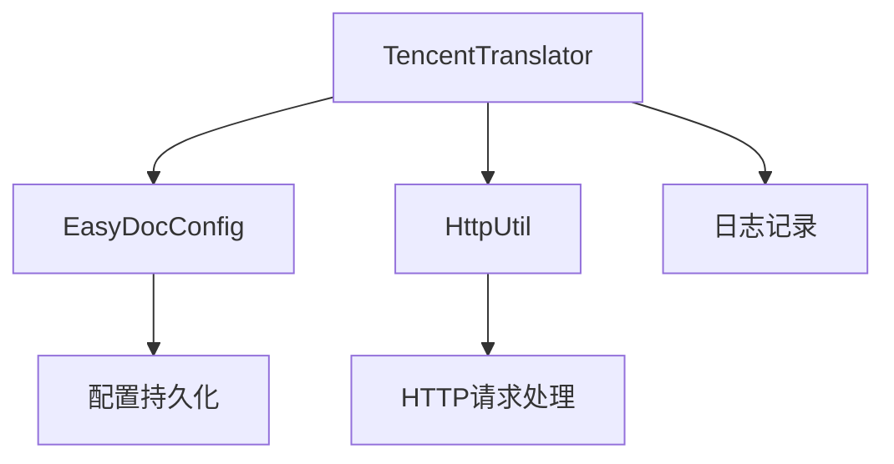
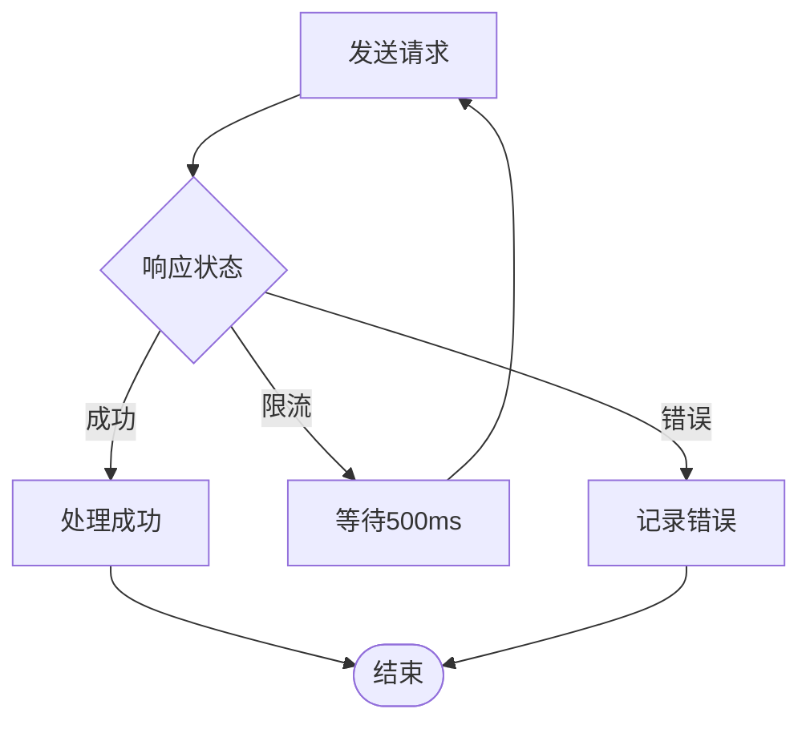

# 腾讯翻译配置

<cite>
**本文档引用的文件**
- [TencentTranslator.java](file://src/main/java/com/star/easydoc/service/translator/impl/TencentTranslator.java)
- [EasyDocConfig.java](file://src/main/java/com/star/easydoc/config/EasyDocConfig.java)
- [CommonSettingsView.java](file://src/main/java/com/star/easydoc/view/settings/CommonSettingsView.java)
- [CommonSettingsConfigurable.java](file://src/main/java/com/star/easydoc/view/settings/CommonSettingsConfigurable.java)
- [Consts.java](file://src/main/java/com/star/easydoc/common/Consts.java)
- [HttpUtil.java](file://src/main/java/com/star/easydoc/common/util/HttpUtil.java)
</cite>

## 目录
1. [简介](#简介)
2. [项目结构](#项目结构)
3. [核心组件](#核心组件)
4. [架构概览](#架构概览)
5. [详细组件分析](#详细组件分析)
6. [依赖关系分析](#依赖关系分析)
7. [性能考虑](#性能考虑)
8. [故障排除指南](#故障排除指南)
9. [结论](#结论)

## 简介

本文档提供了腾讯云机器翻译服务在 EasyDoc 插件中的完整配置指南。腾讯云翻译服务是基于腾讯云 API 的机器翻译解决方案，支持中英文互译功能。本文档详细说明了如何在腾讯云控制台申请 Secret ID 和 Secret Key，以及这些密钥在插件中的配置位置和使用方法。

## 项目结构

EasyDoc 插件采用模块化的架构设计，翻译功能作为独立的服务模块集成在整体系统中：

**图表来源**
- [TencentTranslator.java:1-184](file://src/main/java/com/star/easydoc/service/translator/impl/TencentTranslator.java#L1-L184)
- [EasyDocConfig.java:1-680](file://src/main/java/com/star/easydoc/config/EasyDocConfig.java#L1-L680)

**章节来源**
- [TencentTranslator.java:1-184](file://src/main/java/com/star/easydoc/service/translator/impl/TencentTranslator.java#L1-L184)
- [EasyDocConfig.java:1-680](file://src/main/java/com/star/easydoc/config/EasyDocConfig.java#L1-L680)

## 核心组件

### 腾讯云翻译实现类

腾讯云翻译服务的核心实现位于 `TencentTranslator` 类中，该类继承自抽象翻译器基类，实现了具体的翻译逻辑。

### 配置管理系统

EasyDocConfig 类负责管理所有翻译服务的配置信息，包括腾讯云翻译所需的 Secret ID 和 Secret Key。

### 设置界面系统

设置界面通过 `CommonSettingsView` 和 `CommonSettingsConfigurable` 提供用户友好的配置界面，支持多种翻译服务的选择和配置。

**章节来源**
- [TencentTranslator.java:27-76](file://src/main/java/com/star/easydoc/service/translator/impl/TencentTranslator.java#L27-L76)
- [EasyDocConfig.java:97-103](file://src/main/java/com/star/easydoc/config/EasyDocConfig.java#L97-L103)
- [CommonSettingsView.java:42-472](file://src/main/java/com/star/easydoc/view/settings/CommonSettingsView.java#L42-L472)

## 架构概览

腾讯云翻译服务在整个 EasyDoc 插件架构中的位置和交互关系如下：

**图表来源**
- [CommonSettingsConfigurable.java:95-189](file://src/main/java/com/star/easydoc/view/settings/CommonSettingsConfigurable.java#L95-L189)
- [TencentTranslator.java:42-76](file://src/main/java/com/star/easydoc/service/translator/impl/TencentTranslator.java#L42-L76)

## 详细组件分析

### 腾讯云翻译实现

#### 认证机制

腾讯云翻译采用基于 HMAC-SHA1 的签名验证机制：

**图表来源**
- [TencentTranslator.java:42-76](file://src/main/java/com/star/easydoc/service/translator/impl/TencentTranslator.java#L42-L76)
- [TencentTranslator.java:78-84](file://src/main/java/com/star/easydoc/service/translator/impl/TencentTranslator.java#L78-L84)

#### 请求格式

腾讯云翻译 API 的请求参数结构：

| 参数名称 | 必填 | 说明 | 示例值 |
|---------|------|------|--------|
| SecretId | 是 | 腾讯云访问密钥ID | AKIDxxxxxxxxxxxxxxxxxxxxxxxx |
| Action | 是 | API操作类型 | TextTranslate |
| Version | 是 | API版本 | 2018-03-21 |
| Region | 是 | 服务区域 | ap-beijing |
| Timestamp | 是 | 时间戳 | 当前Unix时间戳 |
| Nonce | 是 | 随机数 | 随机整数 |
| Source | 是 | 源语言 | auto |
| Target | 是 | 目标语言 | zh 或 en |
| SourceText | 是 | 源文本内容 | 要翻译的文本 |
| ProjectId | 否 | 项目ID | 0 |

#### 签名验证流程

签名验证采用 HMAC-SHA1 算法，具体步骤如下：

1. **参数排序**：将所有请求参数按字典序排序
2. **字符串拼接**：按照特定格式拼接签名字符串
3. **HMAC计算**：使用 Secret Key 对签名字符串进行 HMAC-SHA1 计算
4. **Base64编码**：将计算结果进行 Base64 编码

**章节来源**
- [TencentTranslator.java:42-93](file://src/main/java/com/star/easydoc/service/translator/impl/TencentTranslator.java#L42-L93)

### 配置管理系统

#### EasyDocConfig 配置类

EasyDocConfig 类提供了完整的配置管理功能，包括腾讯云翻译的密钥存储：

**图表来源**
- [EasyDocConfig.java:97-103](file://src/main/java/com/star/easydoc/config/EasyDocConfig.java#L97-L103)
- [TencentTranslator.java:27-76](file://src/main/java/com/star/easydoc/service/translator/impl/TencentTranslator.java#L27-L76)

#### 设置界面系统

设置界面提供了直观的配置操作：

**图表来源**
- [CommonSettingsView.java:243-271](file://src/main/java/com/star/easydoc/view/settings/CommonSettingsView.java#L243-L271)
- [CommonSettingsConfigurable.java:128-135](file://src/main/java/com/star/easydoc/view/settings/CommonSettingsConfigurable.java#L128-L135)

**章节来源**
- [EasyDocConfig.java:97-103](file://src/main/java/com/star/easydoc/config/EasyDocConfig.java#L97-L103)
- [CommonSettingsView.java:243-271](file://src/main/java/com/star/easydoc/view/settings/CommonSettingsView.java#L243-L271)
- [CommonSettingsConfigurable.java:128-135](file://src/main/java/com/star/easydoc/view/settings/CommonSettingsConfigurable.java#L128-L135)

## 依赖关系分析

### 外部依赖

腾讯云翻译服务依赖以下外部组件：

**图表来源**
- [TencentTranslator.java:13-19](file://src/main/java/com/star/easydoc/service/translator/impl/TencentTranslator.java#L13-L19)

### 内部依赖关系

**图表来源**
- [TencentTranslator.java:18-19](file://src/main/java/com/star/easydoc/service/translator/impl/TencentTranslator.java#L18-L19)
- [EasyDocConfig.java:1-10](file://src/main/java/com/star/easydoc/config/EasyDocConfig.java#L1-L10)

**章节来源**
- [TencentTranslator.java:13-19](file://src/main/java/com/star/easydoc/service/translator/impl/TencentTranslator.java#L13-L19)
- [HttpUtil.java:39-45](file://src/main/java/com/star/easydoc/common/util/HttpUtil.java#L39-L45)

## 性能考虑

### 超时设置

腾讯云翻译服务支持可配置的超时时间，默认超时时间为 1000 毫秒：

- **连接超时**：1000 毫秒
- **读取超时**：1000 毫秒
- **最大重试次数**：10次
- **重试间隔**：500毫秒

### 限流处理

当遇到请求频率限制时，系统会自动进行重试：

**图表来源**
- [TencentTranslator.java:65-71](file://src/main/java/com/star/easydoc/service/translator/impl/TencentTranslator.java#L65-L71)

## 故障排除指南

### 常见配置问题及解决方案

#### 签名验证失败

**问题描述**：出现签名验证错误，无法正常进行翻译。

**可能原因**：
1. Secret ID 或 Secret Key 输入错误
2. 时间戳过期或服务器时间不同步
3. 参数排序不正确
4. 字符编码问题

**解决步骤**：
1. 在腾讯云控制台重新生成密钥
2. 确认密钥大小写和特殊字符
3. 检查系统时间是否正确
4. 验证网络连接稳定性

#### 权限不足

**问题描述**：翻译请求返回权限不足错误。

**解决步骤**：
1. 登录腾讯云控制台，进入机器翻译服务页面
2. 确认已开通机器翻译服务
3. 检查密钥的权限范围
4. 验证账户余额和配额情况

#### 请求频率限制

**问题描述**：频繁出现 RequestLimitExceeded 错误。

**解决步骤**：
1. 检查当前的请求频率
2. 增加重试间隔时间
3. 考虑升级到更高配额的套餐
4. 实现请求队列管理

#### 网络连接问题

**问题描述**：HTTP请求超时或连接失败。

**解决步骤**：
1. 检查网络连接状态
2. 验证代理设置
3. 确认防火墙设置
4. 测试直接访问 API 地址

**章节来源**
- [TencentTranslator.java:72-74](file://src/main/java/com/star/easydoc/service/translator/impl/TencentTranslator.java#L72-L74)
- [CommonSettingsConfigurable.java:128-135](file://src/main/java/com/star/easydoc/view/settings/CommonSettingsConfigurable.java#L128-L135)

## 结论

腾讯云翻译服务为 EasyDoc 插件提供了强大而可靠的机器翻译能力。通过本文档的详细配置指南，用户可以顺利完成腾讯云翻译服务的配置和使用。

### 关键要点总结

1. **配置准确性**：确保 Secret ID 和 Secret Key 的准确性和完整性
2. **网络稳定性**：保持稳定的网络连接和适当的超时设置
3. **权限管理**：正确配置腾讯云服务权限和配额
4. **错误处理**：建立完善的错误处理和重试机制
5. **性能优化**：合理设置请求频率和超时时间

通过遵循本文档提供的配置步骤和最佳实践，用户可以充分发挥腾讯云翻译服务的优势，提升代码注释生成的效率和质量。