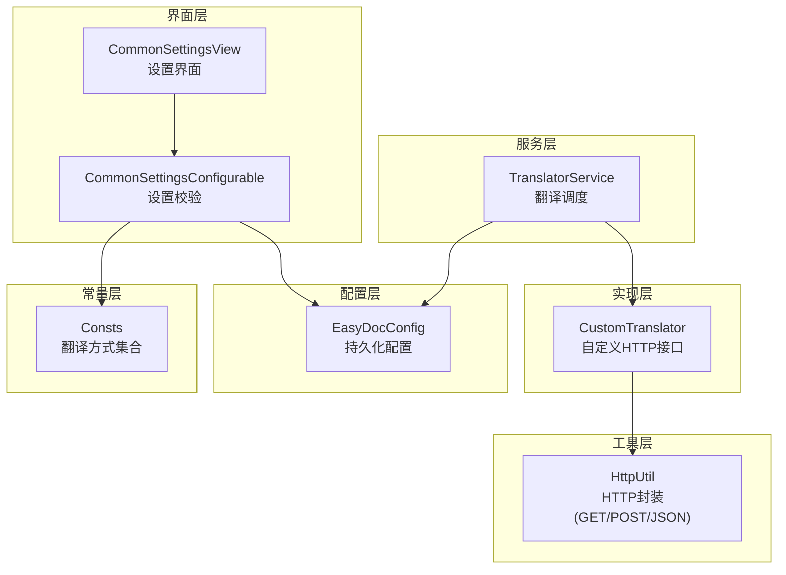
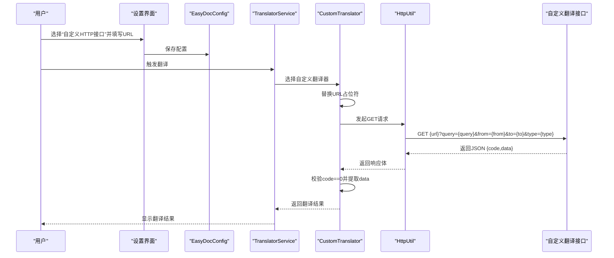
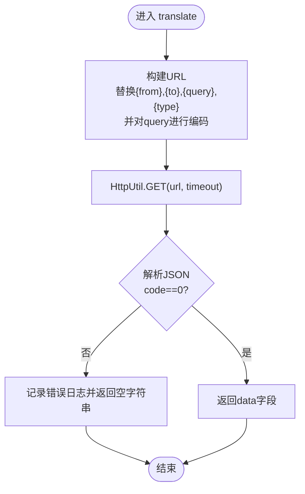
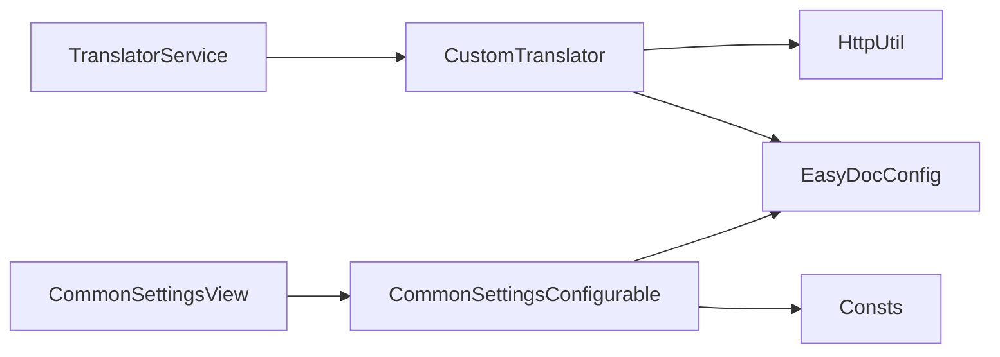

# 自定义翻译配置

<cite>
**本文引用的文件列表**
- [CustomTranslator.java](file://src/main/java/com/star/easydoc/service/translator/impl/CustomTranslator.java)
- [Translator.java](file://src/main/java/com/star/easydoc/service/translator/Translator.java)
- [TranslatorService.java](file://src/main/java/com/star/easydoc/service/translator/TranslatorService.java)
- [EasyDocConfig.java](file://src/main/java/com/star/easydoc/config/EasyDocConfig.java)
- [HttpUtil.java](file://src/main/java/com/star/easydoc/common/util/HttpUtil.java)
- [Consts.java](file://src/main/java/com/star/easydoc/common/Consts.java)
- [CommonSettingsConfigurable.java](file://src/main/java/com/star/easydoc/view/settings/CommonSettingsConfigurable.java)
- [CommonSettingsView.java](file://src/main/java/com/star/easydoc/view/settings/CommonSettingsView.java)
- [plugin.xml](file://src/main/resources/META-INF/plugin.xml)
- [自定义接口说明.md](file://doc/自定义接口说明.md)
- [README.md](file://README.md)
</cite>

## 目录
1. [简介](#简介)
2. [项目结构与核心组件](#项目结构与核心组件)
3. [架构总览](#架构总览)
4. [详细组件分析](#详细组件分析)
5. [依赖关系分析](#依赖关系分析)
6. [性能与可靠性考量](#性能与可靠性考量)
7. [故障排查指南](#故障排查指南)
8. [结论](#结论)
9. [附录：完整配置步骤与最佳实践](#附录完整配置步骤与最佳实践)

## 简介
本指南面向需要在插件中接入“自定义翻译接口”的用户，详细说明如何配置自定义翻译服务，包括：
- 自定义 URL 的占位符与编码规则
- 请求与响应格式要求
- 插件设置界面中的配置步骤
- 超时设置、错误处理与适用场景
- 常见问题排查与最佳实践

## 项目结构与核心组件
自定义翻译能力由以下模块协同实现：
- 配置层：EasyDocConfig 提供持久化配置项，包括自定义 URL、超时等
- 服务层：TranslatorService 统一调度翻译器，按策略选择具体实现
- 实现层：CustomTranslator 通过 HTTP GET 方式调用自定义接口
- 工具层：HttpUtil 提供 HTTP 请求封装（GET/POST/JSON），支持代理与超时
- 界面层：CommonSettingsConfigurable/CommonSettingsView 提供设置界面与校验逻辑
- 常量层：Consts 定义可用翻译方式集合，含“自定义HTTP接口”

图表来源
- [TranslatorService.java:41-77](file://src/main/java/com/star/easydoc/service/translator/TranslatorService.java#L41-L77)
- [CustomTranslator.java:20-60](file://src/main/java/com/star/easydoc/service/translator/impl/CustomTranslator.java#L20-L60)
- [HttpUtil.java:39-245](file://src/main/java/com/star/easydoc/common/util/HttpUtil.java#L39-L245)
- [CommonSettingsConfigurable.java:25-195](file://src/main/java/com/star/easydoc/view/settings/CommonSettingsConfigurable.java#L25-L195)
- [Consts.java:14-99](file://src/main/java/com/star/easydoc/common/Consts.java#L14-L99)

章节来源
- [EasyDocConfig.java:135-136](file://src/main/java/com/star/easydoc/config/EasyDocConfig.java#L135-L136)
- [Consts.java:88-90](file://src/main/java/com/star/easydoc/common/Consts.java#L88-L90)

## 架构总览
自定义翻译的调用链路如下：
- 用户在设置界面选择“自定义HTTP接口”，并填写自定义 URL
- TranslatorService 根据配置选择 CustomTranslator
- CustomTranslator 将占位符替换后发起 HTTP GET 请求
- HttpUtil 执行请求，返回 JSON；CustomTranslator 解析并返回翻译结果
- 若返回 code 非 0 或异常，记录日志并返回空字符串

图表来源
- [CustomTranslator.java:34-58](file://src/main/java/com/star/easydoc/service/translator/impl/CustomTranslator.java#L34-L58)
- [HttpUtil.java:53-103](file://src/main/java/com/star/easydoc/common/util/HttpUtil.java#L53-L103)
- [CommonSettingsConfigurable.java:95-189](file://src/main/java/com/star/easydoc/view/settings/CommonSettingsConfigurable.java#L95-L189)

## 详细组件分析

### 自定义翻译器实现（CustomTranslator）
- 功能要点
  - 根据 PSI 元素类型（类/方法/字段/默认）设置 type 占位符
  - 将 {from}/{to}/{query}/{type} 替换为实际值，并对 query 进行 URL 编码
  - 使用配置中的超时时间发起 GET 请求
  - 解析 JSON，要求 code 字段为 0 才视为成功，否则记录错误日志并返回空字符串

图表来源
- [CustomTranslator.java:34-58](file://src/main/java/com/star/easydoc/service/translator/impl/CustomTranslator.java#L34-L58)

章节来源
- [CustomTranslator.java:24-58](file://src/main/java/com/star/easydoc/service/translator/impl/CustomTranslator.java#L24-L58)

### 翻译服务调度（TranslatorService）
- 功能要点
  - 初始化时注册所有翻译器，包括“自定义HTTP接口”
  - 提供统一入口：translate/autoTranslate/translateCh2En
  - 在翻译前先尝试自定义单词映射，再回退到所选翻译器

章节来源
- [TranslatorService.java:41-77](file://src/main/java/com/star/easydoc/service/translator/TranslatorService.java#L41-L77)
- [TranslatorService.java:85-111](file://src/main/java/com/star/easydoc/service/translator/TranslatorService.java#L85-L111)

### 配置与常量（EasyDocConfig、Consts）
- EasyDocConfig
  - 提供 customUrl、timeout 等配置项
  - 提供 reset/mergeProject 等辅助方法
- Consts
  - 定义 ENABLE_TRANSLATOR_SET，包含“自定义HTTP接口”常量

章节来源
- [EasyDocConfig.java:135-136](file://src/main/java/com/star/easydoc/config/EasyDocConfig.java#L135-L136)
- [EasyDocConfig.java:664-678](file://src/main/java/com/star/easydoc/config/EasyDocConfig.java#L664-L678)
- [Consts.java:88-90](file://src/main/java/com/star/easydoc/common/Consts.java#L88-L90)

### HTTP 工具（HttpUtil）
- 功能要点
  - 提供 GET/POST/JSON 封装
  - 支持连接与读超时配置
  - 自动识别系统代理
  - 对异常进行日志记录

章节来源
- [HttpUtil.java:53-103](file://src/main/java/com/star/easydoc/common/util/HttpUtil.java#L53-L103)
- [HttpUtil.java:147-180](file://src/main/java/com/star/easydoc/common/util/HttpUtil.java#L147-L180)
- [HttpUtil.java:225-243](file://src/main/java/com/star/easydoc/common/util/HttpUtil.java#L225-L243)

### 设置界面与校验（CommonSettingsConfigurable、CommonSettingsView）
- 功能要点
  - 设置界面提供“自定义URL”输入框与“超时时间”输入框
  - 应用时进行严格校验：
    - 自定义URL必须以 http/https 开头
    - 必须包含 {from}、{to}、{query} 占位符
    - 超时必须为正整数
  - 支持导入/导出配置、重置、清空缓存等操作

章节来源
- [CommonSettingsConfigurable.java:95-189](file://src/main/java/com/star/easydoc/view/settings/CommonSettingsConfigurable.java#L95-L189)
- [CommonSettingsView.java:89-91](file://src/main/java/com/star/easydoc/view/settings/CommonSettingsView.java#L89-L91)
- [CommonSettingsView.java:199-200](file://src/main/java/com/star/easydoc/view/settings/CommonSettingsView.java#L199-L200)

## 依赖关系分析
- 组件耦合
  - TranslatorService 依赖 EasyDocConfig 与各翻译器实现
  - CustomTranslator 依赖 HttpUtil 与 EasyDocConfig
  - 设置界面依赖 EasyDocConfig 与 Consts 进行校验
- 外部依赖
  - Apache HttpClient（用于 HTTP 请求）
  - IntelliJ 平台组件（ServiceManager、Logger、UI 组件）

图表来源
- [TranslatorService.java:41-77](file://src/main/java/com/star/easydoc/service/translator/TranslatorService.java#L41-L77)
- [CustomTranslator.java:20-60](file://src/main/java/com/star/easydoc/service/translator/impl/CustomTranslator.java#L20-L60)
- [HttpUtil.java:39-245](file://src/main/java/com/star/easydoc/common/util/HttpUtil.java#L39-L245)
- [CommonSettingsConfigurable.java:25-195](file://src/main/java/com/star/easydoc/view/settings/CommonSettingsConfigurable.java#L25-L195)
- [Consts.java:14-99](file://src/main/java/com/star/easydoc/common/Consts.java#L14-L99)

## 性能与可靠性考量
- 超时控制
  - 自定义 URL 的超时来自 EasyDocConfig.timeout，默认值为毫秒级
  - HttpUtil 的连接与读超时均使用该值
- 缓存策略
  - 抽象翻译器内置英译中/中译英两级缓存，减少重复请求
- 错误处理
  - 自定义翻译器在 JSON 解析失败或 code 非 0 时返回空字符串并记录日志
  - HttpUtil 对网络异常进行捕获并记录警告日志
- 重试机制
  - 当前自定义翻译未实现重试；部分第三方翻译器实现了指数退避与重试（如腾讯翻译），可作为参考

章节来源
- [EasyDocConfig.java:77-87](file://src/main/java/com/star/easydoc/config/EasyDocConfig.java#L77-L87)
- [HttpUtil.java:76-102](file://src/main/java/com/star/easydoc/common/util/HttpUtil.java#L76-L102)
- [AbstractTranslator.java:14-72](file://src/main/java/com/star/easydoc/service/translator/impl/AbstractTranslator.java#L14-L72)

## 故障排查指南
- URL 格式错误
  - 症状：设置界面提示“自定义地址只支持http或https接口”
  - 排查：确保自定义 URL 以 http:// 或 https:// 开头
  - 参考：[CommonSettingsConfigurable.java:171-172](file://src/main/java/com/star/easydoc/view/settings/CommonSettingsConfigurable.java#L171-L172)
- 缺少必要占位符
  - 症状：设置界面提示缺少 {from}/{to}/{query} 占位符
  - 排查：确认 URL 包含 {from}、{to}、{query}；type 为可选但建议保留
  - 参考：[CommonSettingsConfigurable.java:174-182](file://src/main/java/com/star/easydoc/view/settings/CommonSettingsConfigurable.java#L174-L182)
- 超时设置无效
  - 症状：请求超时或卡顿
  - 排查：确认超时为正整数；过长可能导致 IDE 卡顿
  - 参考：[CommonSettingsConfigurable.java:184-188](file://src/main/java/com/star/easydoc/view/settings/CommonSettingsConfigurable.java#L184-L188)
- 请求格式不匹配
  - 症状：接口返回非 0 或解析失败
  - 排查：确认接口返回 JSON，且包含 code 与 data 字段；code 为 0 表示成功
  - 参考：[自定义接口说明.md:23-32](file://doc/自定义接口说明.md#L23-L32)
- 日志定位
  - 自定义翻译器会在失败时记录错误日志，包含 URL 与响应体
  - 参考：[CustomTranslator.java:49-56](file://src/main/java/com/star/easydoc/service/translator/impl/CustomTranslator.java#L49-L56)

章节来源
- [CommonSettingsConfigurable.java:171-188](file://src/main/java/com/star/easydoc/view/settings/CommonSettingsConfigurable.java#L171-L188)
- [CustomTranslator.java:49-56](file://src/main/java/com/star/easydoc/service/translator/impl/CustomTranslator.java#L49-L56)
- [自定义接口说明.md:23-32](file://doc/自定义接口说明.md#L23-L32)

## 结论
- 自定义翻译通过占位符与 JSON 响应规范，提供了灵活的对接能力
- 设置界面提供了严格的校验，确保 URL 与超时配置正确
- 建议在企业内网或私有部署场景使用自定义接口，以满足安全与合规需求
- 若需更强健的稳定性，可在自定义接口侧增加幂等性与重试策略

## 附录：完整配置步骤与最佳实践

### 完整配置步骤（设置界面）
1. 打开插件设置页面
   - 通过菜单找到“EasyDoc”设置项
   - 参考：[plugin.xml:39-51](file://src/main/resources/META-INF/plugin.xml#L39-L51)
2. 选择翻译方式
   - 在“翻译方式”下拉框中选择“自定义HTTP接口”
   - 参考：[Consts.java:88-90](file://src/main/java/com/star/easydoc/common/Consts.java#L88-L90)
3. 填写自定义 URL
   - 必须以 http:// 或 https:// 开头
   - 必须包含 {from}、{to}、{query} 占位符
   - 可选包含 {type} 占位符（用于区分类/方法/字段/默认）
   - 参考：[CommonSettingsConfigurable.java:171-182](file://src/main/java/com/star/easydoc/view/settings/CommonSettingsConfigurable.java#L171-L182)
4. 设置超时时间
   - 输入正整数（单位：毫秒）
   - 参考：[CommonSettingsConfigurable.java:184-188](file://src/main/java/com/star/easydoc/view/settings/CommonSettingsConfigurable.java#L184-L188)
5. 应用并验证
   - 点击“应用”触发校验
   - 若提示错误，请根据提示修正
   - 参考：[CommonSettingsConfigurable.java:95-189](file://src/main/java/com/star/easydoc/view/settings/CommonSettingsConfigurable.java#L95-L189)

章节来源
- [plugin.xml:39-51](file://src/main/resources/META-INF/plugin.xml#L39-L51)
- [Consts.java:88-90](file://src/main/java/com/star/easydoc/common/Consts.java#L88-L90)
- [CommonSettingsConfigurable.java:95-189](file://src/main/java/com/star/easydoc/view/settings/CommonSettingsConfigurable.java#L95-L189)

### 自定义接口规范（请求与响应）
- 请求方式
  - GET
  - URL 中必须包含 {query}、{from}、{to} 占位符
  - 可选包含 {type} 占位符
  - 参考：[自定义接口说明.md:10-21](file://doc/自定义接口说明.md#L10-L21)
- 请求参数
  - {query}：待翻译文本，需进行 URL 编码
  - {from}/{to}：源语言/目标语言，取值为 ch/en
  - {type}：请求类型，取值 class/method/field/default
  - 参考：[自定义接口说明.md:11-18](file://doc/自定义接口说明.md#L11-L18)
- 响应格式
  - JSON，包含 code 与 data 字段
  - code 为 0 表示成功，否则视为失败
  - 参考：[自定义接口说明.md:23-32](file://doc/自定义接口说明.md#L23-L32)

章节来源
- [自定义接口说明.md:10-32](file://doc/自定义接口说明.md#L10-L32)

### 适用场景与最佳实践
- 适用场景
  - 企业内网环境，需避免外网依赖
  - 需要特定领域术语的定制化翻译
  - 对隐私数据敏感，不允许外泄
- 最佳实践
  - 在自定义接口侧实现幂等性与限流
  - 明确 code 语义与 data 结构，便于前端解析
  - 提供健康检查端点与可观测性指标
  - 参考：[README.md:91-91](file://README.md#L91-L91)

章节来源
- [README.md:91-91](file://README.md#L91-L91)