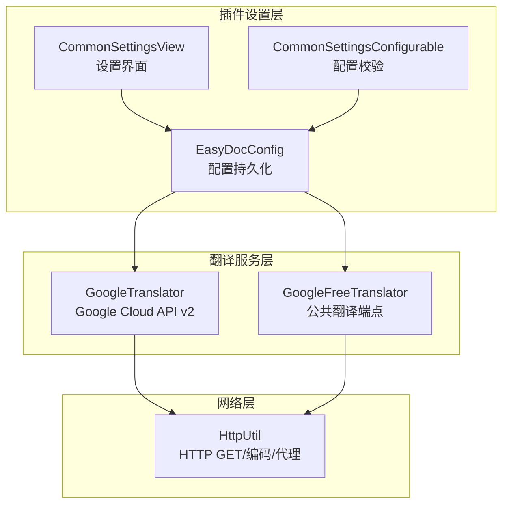
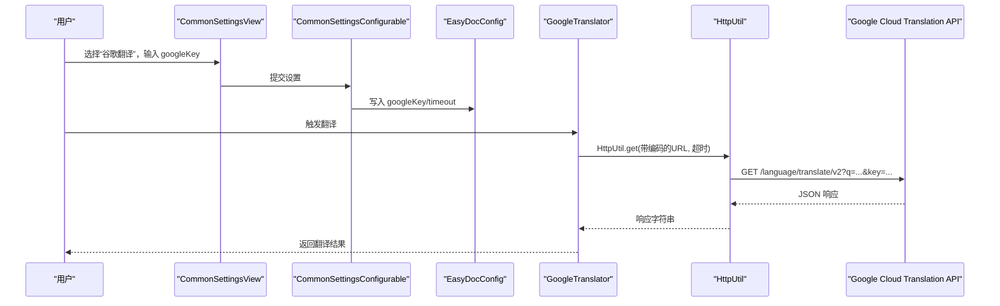
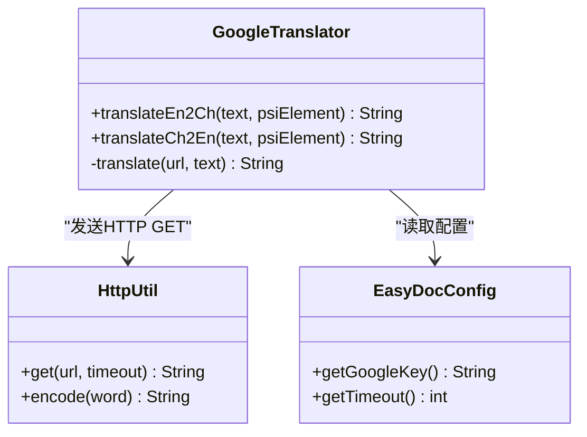
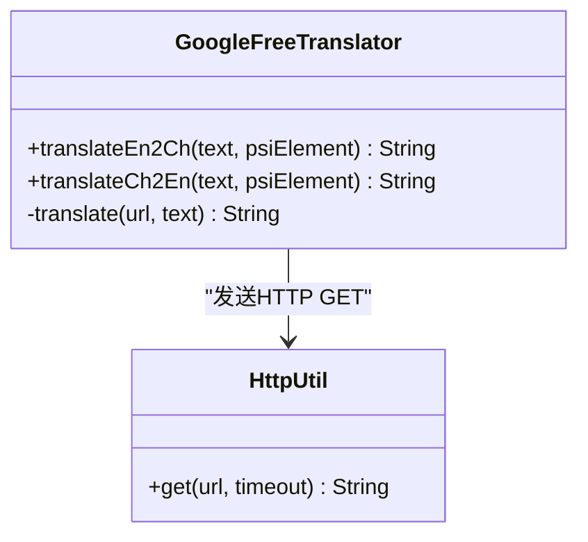
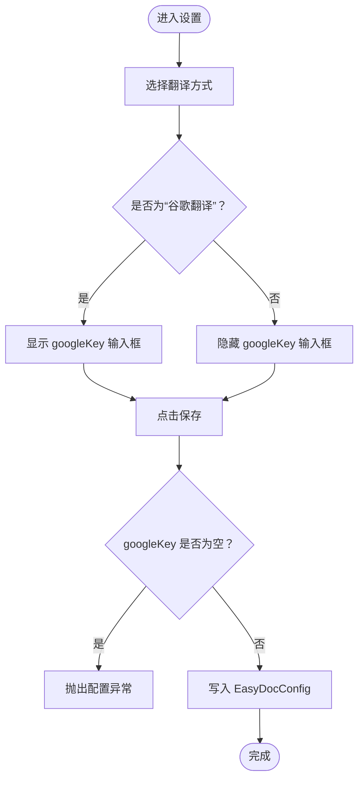
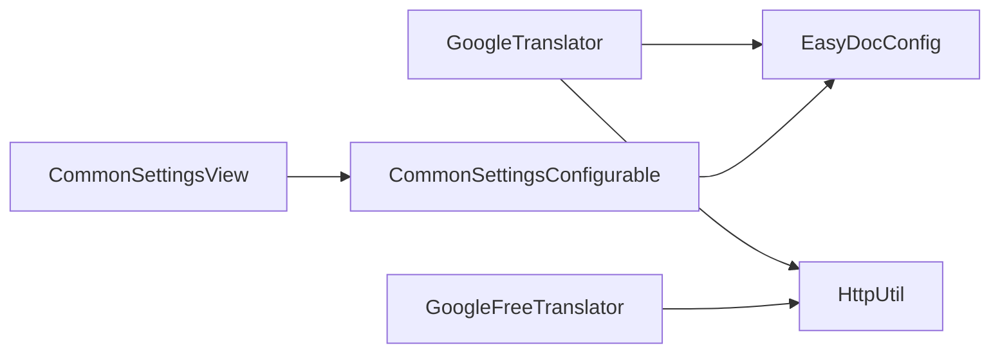

# 谷歌翻译配置

<cite>
**本文引用的文件**
- [GoogleTranslator.java](file://src/main/java/com/star/easydoc/service/translator/impl/GoogleTranslator.java)
- [GoogleFreeTranslator.java](file://src/main/java/com/star/easydoc/service/translator/impl/GoogleFreeTranslator.java)
- [HttpUtil.java](file://src/main/java/com/star/easydoc/common/util/HttpUtil.java)
- [EasyDocConfig.java](file://src/main/java/com/star/easydoc/config/EasyDocConfig.java)
- [CommonSettingsView.java](file://src/main/java/com/star/easydoc/view/settings/CommonSettingsView.java)
- [CommonSettingsConfigurable.java](file://src/main/java/com/star/easydoc/view/settings/CommonSettingsConfigurable.java)
- [Consts.java](file://src/main/java/com/star/easydoc/common/Consts.java)
- [plugin.xml](file://src/main/resources/META-INF/plugin.xml)
- [README.md](file://README.md)
- [自定义接口说明.md](file://doc/自定义接口说明.md)
</cite>

## 目录
1. [简介](#简介)
2. [项目结构与定位](#项目结构与定位)
3. [核心组件](#核心组件)
4. [架构总览](#架构总览)
5. [详细组件分析](#详细组件分析)
6. [依赖关系分析](#依赖关系分析)
7. [性能与超时配置](#性能与超时配置)
8. [配置步骤与界面操作](#配置步骤与界面操作)
9. [认证机制与请求格式](#认证机制与请求格式)
10. [配额与计费说明](#配额与计费说明)
11. [常见问题排查](#常见问题排查)
12. [结论](#结论)

## 简介
本指南面向使用 Easy Javadoc 插件的开发者，聚焦“谷歌翻译”与“谷歌免费翻译”的配置与使用。内容涵盖：
- 在 Google Cloud Console 创建项目、启用翻译 API、创建服务账号并获取 API Key 的方法
- 插件设置界面中填写 API Key 的完整操作流程
- 谷歌翻译的认证机制、请求格式与配额管理
- 配置验证规则、常见问题排查与最佳实践

## 项目结构与定位
- 谷歌翻译能力由两个实现类提供：
  - GoogleTranslator：基于 Google Cloud Translation API v2（需 API Key）
  - GoogleFreeTranslator：基于公共翻译端点（无需 Key，但可能受限）
- 配置持久化与校验位于 EasyDocConfig、CommonSettingsView、CommonSettingsConfigurable
- HTTP 请求封装在 HttpUtil，统一处理超时与代理

图表来源
- [CommonSettingsView.java:359-387](file://src/main/java/com/star/easydoc/view/settings/CommonSettingsView.java#L359-L387)
- [CommonSettingsConfigurable.java:157-161](file://src/main/java/com/star/easydoc/view/settings/CommonSettingsConfigurable.java#L157-L161)
- [GoogleTranslator.java:22-25](file://src/main/java/com/star/easydoc/service/translator/impl/GoogleTranslator.java#L22-L25)
- [GoogleFreeTranslator.java:20-23](file://src/main/java/com/star/easydoc/service/translator/impl/GoogleFreeTranslator.java#L20-L23)
- [HttpUtil.java:53-103](file://src/main/java/com/star/easydoc/common/util/HttpUtil.java#L53-L103)

章节来源
- [plugin.xml:39-51](file://src/main/resources/META-INF/plugin.xml#L39-L51)
- [Consts.java:72-78](file://src/main/java/com/star/easydoc/common/Consts.java#L72-L78)

## 核心组件
- GoogleTranslator：调用 Google Cloud Translation API v2，通过 URL 查询参数携带 API Key
- GoogleFreeTranslator：调用公共翻译端点，无需 API Key
- EasyDocConfig：存储 googleKey、timeout 等配置项
- CommonSettingsView：设置界面渲染与可见性控制
- CommonSettingsConfigurable：保存配置时的必填校验
- HttpUtil：统一的 HTTP GET 请求、编码与代理处理

章节来源
- [GoogleTranslator.java:22-49](file://src/main/java/com/star/easydoc/service/translator/impl/GoogleTranslator.java#L22-L49)
- [GoogleFreeTranslator.java:20-45](file://src/main/java/com/star/easydoc/service/translator/impl/GoogleFreeTranslator.java#L20-L45)
- [EasyDocConfig.java:121-123](file://src/main/java/com/star/easydoc/config/EasyDocConfig.java#L121-L123)
- [CommonSettingsView.java:359-387](file://src/main/java/com/star/easydoc/view/settings/CommonSettingsView.java#L359-L387)
- [CommonSettingsConfigurable.java:157-161](file://src/main/java/com/star/easydoc/view/settings/CommonSettingsConfigurable.java#L157-L161)
- [HttpUtil.java:53-103](file://src/main/java/com/star/easydoc/common/util/HttpUtil.java#L53-L103)

## 架构总览
谷歌翻译在插件中的调用链路如下：
- 用户在设置界面选择“谷歌翻译”
- 保存配置时触发校验，确保 googleKey 非空
- 生成翻译请求时，GoogleTranslator 通过 HttpUtil 发送 GET 请求，URL 中拼接 API Key
- 解析响应 JSON，提取翻译结果

图表来源
- [CommonSettingsView.java:359-387](file://src/main/java/com/star/easydoc/view/settings/CommonSettingsView.java#L359-L387)
- [CommonSettingsConfigurable.java:157-161](file://src/main/java/com/star/easydoc/view/settings/CommonSettingsConfigurable.java#L157-L161)
- [EasyDocConfig.java:616-622](file://src/main/java/com/star/easydoc/config/EasyDocConfig.java#L616-L622)
- [GoogleTranslator.java:37-49](file://src/main/java/com/star/easydoc/service/translator/impl/GoogleTranslator.java#L37-L49)
- [HttpUtil.java:53-103](file://src/main/java/com/star/easydoc/common/util/HttpUtil.java#L53-L103)

## 详细组件分析

### GoogleTranslator 组件
- 请求 URL：包含查询参数 q、source、target、key、format
- 超时：从 EasyDocConfig 获取
- 错误处理：捕获异常并记录日志，返回空字符串

图表来源
- [GoogleTranslator.java:22-49](file://src/main/java/com/star/easydoc/service/translator/impl/GoogleTranslator.java#L22-L49)
- [HttpUtil.java:53-103](file://src/main/java/com/star/easydoc/common/util/HttpUtil.java#L53-L103)
- [EasyDocConfig.java:616-622](file://src/main/java/com/star/easydoc/config/EasyDocConfig.java#L616-L622)

章节来源
- [GoogleTranslator.java:22-49](file://src/main/java/com/star/easydoc/service/translator/impl/GoogleTranslator.java#L22-L49)

### GoogleFreeTranslator 组件
- 请求 URL：公共翻译端点，无需 API Key
- 错误处理：捕获异常并记录日志，返回空字符串

图表来源
- [GoogleFreeTranslator.java:20-45](file://src/main/java/com/star/easydoc/service/translator/impl/GoogleFreeTranslator.java#L20-L45)
- [HttpUtil.java:53-103](file://src/main/java/com/star/easydoc/common/util/HttpUtil.java#L53-L103)

章节来源
- [GoogleFreeTranslator.java:20-45](file://src/main/java/com/star/easydoc/service/translator/impl/GoogleFreeTranslator.java#L20-L45)

### 设置界面与配置校验
- 界面可见性：选择“谷歌翻译”时显示 googleKey 输入框
- 保存校验：保存时若未填写 googleKey 则抛出配置异常
- 配置持久化：写入 EasyDocConfig 的 googleKey 字段

图表来源
- [CommonSettingsView.java:359-387](file://src/main/java/com/star/easydoc/view/settings/CommonSettingsView.java#L359-L387)
- [CommonSettingsConfigurable.java:157-161](file://src/main/java/com/star/easydoc/view/settings/CommonSettingsConfigurable.java#L157-L161)
- [EasyDocConfig.java:616-622](file://src/main/java/com/star/easydoc/config/EasyDocConfig.java#L616-L622)

章节来源
- [CommonSettingsView.java:359-387](file://src/main/java/com/star/easydoc/view/settings/CommonSettingsView.java#L359-L387)
- [CommonSettingsConfigurable.java:157-161](file://src/main/java/com/star/easydoc/view/settings/CommonSettingsConfigurable.java#L157-L161)

## 依赖关系分析
- GoogleTranslator 依赖 HttpUtil 进行网络请求，依赖 EasyDocConfig 读取 googleKey 与 timeout
- GoogleFreeTranslator 同样依赖 HttpUtil
- 设置界面通过 Configurable 对配置进行校验与持久化

图表来源
- [GoogleTranslator.java:10-11](file://src/main/java/com/star/easydoc/service/translator/impl/GoogleTranslator.java#L10-L11)
- [GoogleFreeTranslator.java:8-9](file://src/main/java/com/star/easydoc/service/translator/impl/GoogleFreeTranslator.java#L8-L9)
- [HttpUtil.java:39-45](file://src/main/java/com/star/easydoc/common/util/HttpUtil.java#L39-L45)
- [CommonSettingsConfigurable.java:25-30](file://src/main/java/com/star/easydoc/view/settings/CommonSettingsConfigurable.java#L25-L30)

章节来源
- [Consts.java:72-78](file://src/main/java/com/star/easydoc/common/Consts.java#L72-L78)

## 性能与超时配置
- 超时参数来自 EasyDocConfig.timeout，默认值在 EasyDocConfig.DEFAULT_TIMEOUT
- HttpUtil.get 支持连接超时与读超时，均使用传入的超时值
- 建议根据网络环境适当调整超时时间，避免频繁超时导致翻译失败

章节来源
- [EasyDocConfig.java:77-77](file://src/main/java/com/star/easydoc/config/EasyDocConfig.java#L77-L77)
- [HttpUtil.java:64-103](file://src/main/java/com/star/easydoc/common/util/HttpUtil.java#L64-L103)

## 配置步骤与界面操作
以下为在插件设置界面中填写谷歌翻译 API Key 的完整流程（以“谷歌翻译”为例）：
1. 打开插件设置页面
2. 在“翻译方式”下拉框中选择“谷歌翻译”
3. 在“googleKey”输入框中粘贴从 Google Cloud Console 获取的 API Key
4. 点击“保存”，插件将校验 googleKey 非空并写入配置
5. 之后在使用翻译功能时，插件会通过 Google Cloud Translation API v2 发送请求

章节来源
- [CommonSettingsView.java:359-387](file://src/main/java/com/star/easydoc/view/settings/CommonSettingsView.java#L359-L387)
- [CommonSettingsConfigurable.java:157-161](file://src/main/java/com/star/easydoc/view/settings/CommonSettingsConfigurable.java#L157-L161)
- [EasyDocConfig.java:616-622](file://src/main/java/com/star/easydoc/config/EasyDocConfig.java#L616-L622)

## 认证机制与请求格式
- 谷歌翻译（需 API Key）
  - 请求方式：HTTP GET
  - 请求地址：包含查询参数 q、source、target、key、format
  - 认证方式：通过 URL 查询参数携带 API Key
  - 超时：从 EasyDocConfig 读取
- 谷歌免费翻译（无需 API Key）
  - 请求方式：HTTP GET
  - 请求地址：公共翻译端点，包含客户端标识与目标语言参数
  - 认证方式：无需 Key
  - 超时：从 EasyDocConfig 读取

章节来源
- [GoogleTranslator.java:22-25](file://src/main/java/com/star/easydoc/service/translator/impl/GoogleTranslator.java#L22-L25)
- [GoogleFreeTranslator.java:20-23](file://src/main/java/com/star/easydoc/service/translator/impl/GoogleFreeTranslator.java#L20-L23)
- [HttpUtil.java:53-103](file://src/main/java/com/star/easydoc/common/util/HttpUtil.java#L53-L103)

## 配额与计费说明
- 插件 README 明确指出各翻译平台每月有免费额度，基本够用，需要自行申请密钥
- 谷歌翻译需要翻墙并前往 Google Cloud Console 申请
- README 提供了各平台的申请入口链接，包括谷歌翻译

章节来源
- [README.md:41-47](file://README.md#L41-L47)

## 常见问题排查
- 认证失败（API Key 无效）
  - 确认在设置界面已正确填写 googleKey
  - 确认所选翻译方式为“谷歌翻译”
  - 查看日志输出，确认请求 URL 中的 key 参数是否正确拼接
- 网络不通或超时
  - 检查网络连通性，必要时配置系统代理
  - 调整超时时间（timeout），避免过短导致请求失败
- 配额耗尽
  - 各平台均有免费额度，超出后可能产生费用或限制访问
  - 可考虑切换到“谷歌免费翻译”或其它翻译方式
- 翻译结果为空
  - 检查输入文本是否为空或被正确编码
  - 查看日志输出，确认网络请求是否成功

章节来源
- [CommonSettingsConfigurable.java:157-161](file://src/main/java/com/star/easydoc/view/settings/CommonSettingsConfigurable.java#L157-L161)
- [GoogleTranslator.java:45-48](file://src/main/java/com/star/easydoc/service/translator/impl/GoogleTranslator.java#L45-L48)
- [HttpUtil.java:96-102](file://src/main/java/com/star/easydoc/common/util/HttpUtil.java#L96-L102)

## 结论
- “谷歌翻译”需要在 Google Cloud Console 获取 API Key，并在插件设置中填写
- “谷歌免费翻译”无需 API Key，适合轻量使用
- 配置保存时会进行必填校验，确保 googleKey 非空
- 网络请求由 HttpUtil 统一封装，支持超时与代理
- 各平台有免费额度，超出后可能影响使用，建议合理规划与监控