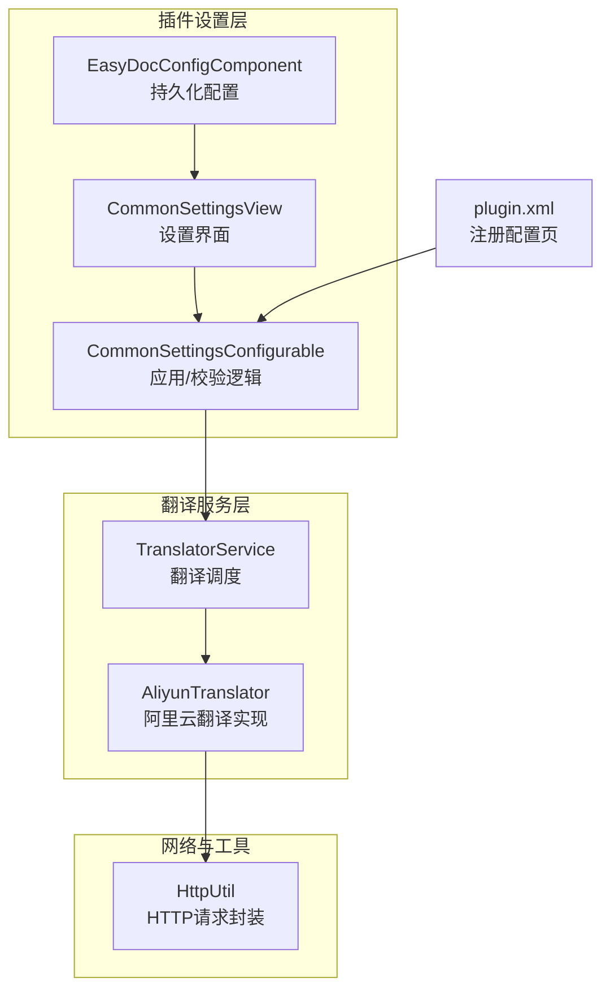
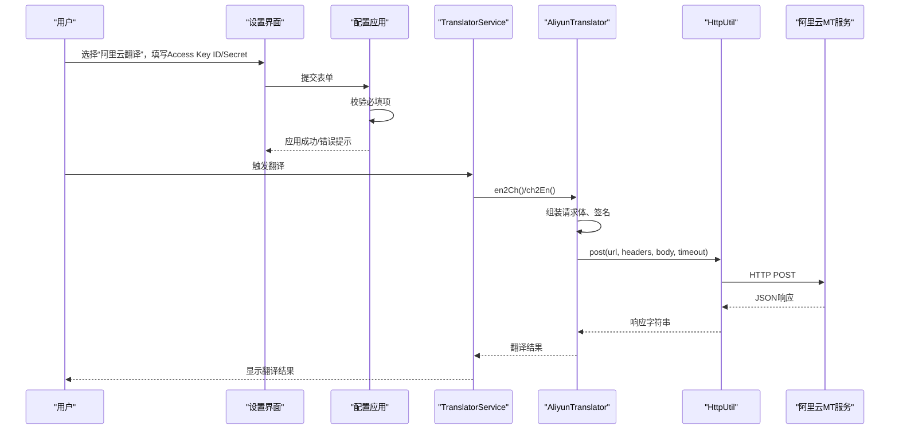
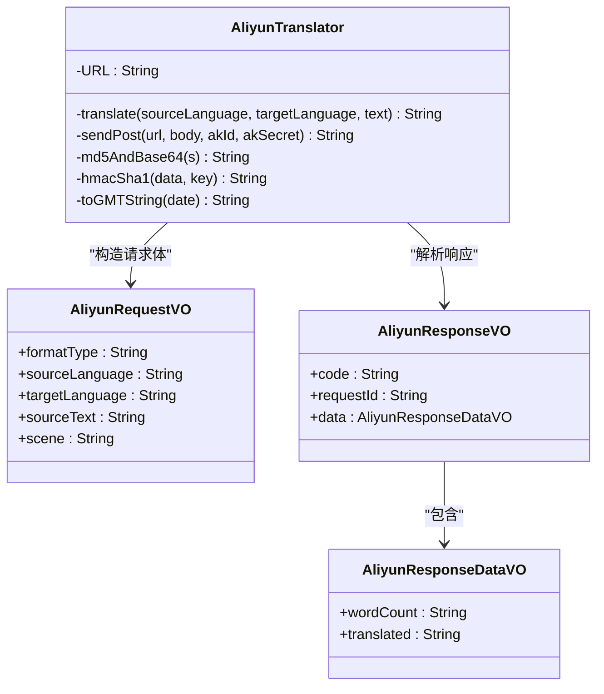
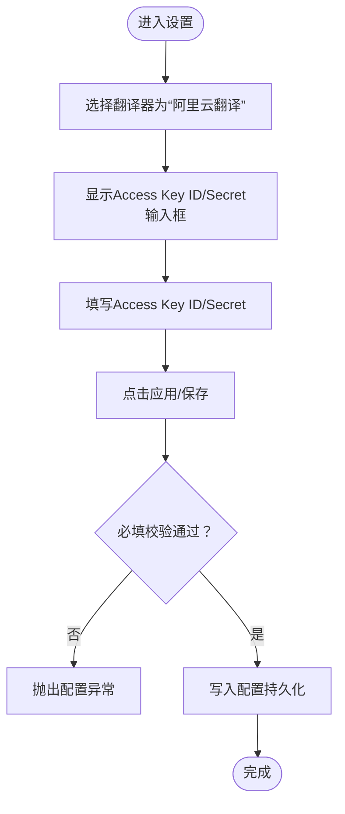
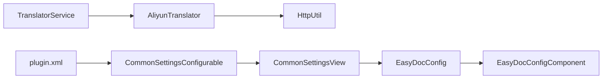

# 阿里云翻译配置

<cite>
**本文引用的文件列表**
- [AliyunTranslator.java](file://src/main/java/com/star/easydoc/service/translator/impl/AliyunTranslator.java)
- [EasyDocConfig.java](file://src/main/java/com/star/easydoc/config/EasyDocConfig.java)
- [CommonSettingsView.java](file://src/main/java/com/star/easydoc/view/settings/CommonSettingsView.java)
- [CommonSettingsConfigurable.java](file://src/main/java/com/star/easydoc/view/settings/CommonSettingsConfigurable.java)
- [Consts.java](file://src/main/java/com/star/easydoc/common/Consts.java)
- [HttpUtil.java](file://src/main/java/com/star/easydoc/common/util/HttpUtil.java)
- [plugin.xml](file://src/main/resources/META-INF/plugin.xml)
- [EasyDocConfigComponent.java](file://src/main/java/com/star/easydoc/config/EasyDocConfigComponent.java)
- [自定义接口说明.md](file://doc/自定义接口说明.md)
</cite>

## 目录
1. [简介](#简介)
2. [项目结构与定位](#项目结构与定位)
3. [核心组件](#核心组件)
4. [架构总览](#架构总览)
5. [详细组件解析](#详细组件解析)
6. [依赖关系分析](#依赖关系分析)
7. [性能与超时配置](#性能与超时配置)
8. [故障排查指南](#故障排查指南)
9. [结论](#结论)
10. [附录](#附录)

## 简介
本指南面向在 IntelliJ IDEA 插件“Easy Javadoc”中配置并使用阿里云机器翻译服务的用户，详细说明如何在阿里云控制台申请 Access Key ID 与 Access Key Secret，并在插件设置界面完成配置；解释阿里云翻译的认证机制、请求格式与区域设置；提供完整的配置步骤与常见问题排查方法。

## 项目结构与定位
- 阿里云翻译能力由独立的翻译实现类负责，通过统一的翻译服务入口进行调度。
- 配置持久化存储在全局配置组件中，设置界面负责展示与校验输入。
- 插件在 IDE 的“设置/首选项”中提供统一的配置入口。

图表来源
- [plugin.xml:39-40](file://src/main/resources/META-INF/plugin.xml#L39-L40)
- [CommonSettingsConfigurable.java:25-42](file://src/main/java/com/star/easydoc/view/settings/CommonSettingsConfigurable.java#L25-L42)
- [CommonSettingsView.java:42-46](file://src/main/java/com/star/easydoc/view/settings/CommonSettingsView.java#L42-L46)
- [TranslatorService.java:41-77](file://src/main/java/com/star/easydoc/service/translator/TranslatorService.java#L41-L77)
- [AliyunTranslator.java:35-39](file://src/main/java/com/star/easydoc/service/translator/impl/AliyunTranslator.java#L35-L39)
- [HttpUtil.java:39-45](file://src/main/java/com/star/easydoc/common/util/HttpUtil.java#L39-L45)

章节来源
- [plugin.xml:39-40](file://src/main/resources/META-INF/plugin.xml#L39-L40)
- [CommonSettingsConfigurable.java:25-42](file://src/main/java/com/star/easydoc/view/settings/CommonSettingsConfigurable.java#L25-L42)
- [CommonSettingsView.java:42-46](file://src/main/java/com/star/easydoc/view/settings/CommonSettingsView.java#L42-L46)
- [TranslatorService.java:41-77](file://src/main/java/com/star/easydoc/service/translator/TranslatorService.java#L41-L77)
- [AliyunTranslator.java:35-39](file://src/main/java/com/star/easydoc/service/translator/impl/AliyunTranslator.java#L35-L39)
- [HttpUtil.java:39-45](file://src/main/java/com/star/easydoc/common/util/HttpUtil.java#L39-L45)

## 核心组件
- 阿里云翻译实现：负责构造请求、签名、发送 HTTP 请求并解析响应。
- 配置持久化：保存 Access Key ID/Secret、超时等配置。
- 设置界面与校验：提供 UI 输入、按翻译器类型显示对应字段、必填校验。
- 翻译服务调度：根据当前选择的翻译器调用具体实现。

章节来源
- [AliyunTranslator.java:35-39](file://src/main/java/com/star/easydoc/service/translator/impl/AliyunTranslator.java#L35-L39)
- [EasyDocConfig.java:105-111](file://src/main/java/com/star/easydoc/config/EasyDocConfig.java#L105-L111)
- [CommonSettingsView.java:66-69](file://src/main/java/com/star/easydoc/view/settings/CommonSettingsView.java#L66-L69)
- [CommonSettingsConfigurable.java:136-143](file://src/main/java/com/star/easydoc/view/settings/CommonSettingsConfigurable.java#L136-L143)
- [TranslatorService.java:62-62](file://src/main/java/com/star/easydoc/service/translator/TranslatorService.java#L62-L62)

## 架构总览
阿里云翻译在插件中的调用链路如下：

图表来源
- [CommonSettingsConfigurable.java:95-189](file://src/main/java/com/star/easydoc/view/settings/CommonSettingsConfigurable.java#L95-L189)
- [CommonSettingsView.java:272-300](file://src/main/java/com/star/easydoc/view/settings/CommonSettingsView.java#L272-L300)
- [TranslatorService.java:157-163](file://src/main/java/com/star/easydoc/service/translator/TranslatorService.java#L157-L163)
- [AliyunTranslator.java:59-73](file://src/main/java/com/star/easydoc/service/translator/impl/AliyunTranslator.java#L59-L73)
- [HttpUtil.java:147-180](file://src/main/java/com/star/easydoc/common/util/HttpUtil.java#L147-L180)

## 详细组件解析

### 阿里云翻译实现（AliyunTranslator）
- 请求地址与场景：实现中固定使用阿里云机器翻译服务的电商场景接口地址。
- 请求参数模型：包含源语言、目标语言、原文文本、格式类型、场景等字段。
- 认证与签名：
  - 使用 HMAC-SHA1 对特定字符串进行签名。
  - 请求头包含 Content-MD5、Date、Host、Authorization、签名随机数与版本等。
  - Authorization 头格式为“acs {Access Key ID}:{签名}”。
- 响应解析：解析返回的 JSON，提取翻译结果与字数统计。

图表来源
- [AliyunTranslator.java:39-39](file://src/main/java/com/star/easydoc/service/translator/impl/AliyunTranslator.java#L39-L39)
- [AliyunTranslator.java:158-214](file://src/main/java/com/star/easydoc/service/translator/impl/AliyunTranslator.java#L158-L214)
- [AliyunTranslator.java:219-253](file://src/main/java/com/star/easydoc/service/translator/impl/AliyunTranslator.java#L219-L253)
- [AliyunTranslator.java:258-281](file://src/main/java/com/star/easydoc/service/translator/impl/AliyunTranslator.java#L258-L281)

章节来源
- [AliyunTranslator.java:39-153](file://src/main/java/com/star/easydoc/service/translator/impl/AliyunTranslator.java#L39-L153)
- [AliyunTranslator.java:158-281](file://src/main/java/com/star/easydoc/service/translator/impl/AliyunTranslator.java#L158-L281)

### 配置持久化与设置界面
- 配置项：在配置类中提供 accessKeyId 与 accessKeySecret 字段。
- 设置界面：当选择“阿里云翻译”时，显示 Access Key ID 与 Access Key Secret 的输入框。
- 应用与校验：提交时校验必填项，否则抛出配置异常。

图表来源
- [CommonSettingsView.java:272-300](file://src/main/java/com/star/easydoc/view/settings/CommonSettingsView.java#L272-L300)
- [CommonSettingsConfigurable.java:136-143](file://src/main/java/com/star/easydoc/view/settings/CommonSettingsConfigurable.java#L136-L143)
- [EasyDocConfig.java:105-111](file://src/main/java/com/star/easydoc/config/EasyDocConfig.java#L105-L111)

章节来源
- [CommonSettingsView.java:272-300](file://src/main/java/com/star/easydoc/view/settings/CommonSettingsView.java#L272-L300)
- [CommonSettingsConfigurable.java:136-143](file://src/main/java/com/star/easydoc/view/settings/CommonSettingsConfigurable.java#L136-L143)
- [EasyDocConfig.java:105-111](file://src/main/java/com/star/easydoc/config/EasyDocConfig.java#L105-L111)

### 翻译服务调度
- TranslatorService 在初始化时注册各翻译器实现，包括阿里云翻译。
- 当用户触发翻译时，根据当前配置选择具体实现并执行翻译。

章节来源
- [TranslatorService.java:60-77](file://src/main/java/com/star/easydoc/service/translator/TranslatorService.java#L60-L77)
- [Consts.java](file://src/main/java/com/star/easydoc/common/Consts.java#L58)

## 依赖关系分析
- 阿里云翻译实现依赖 HTTP 工具类进行网络请求。
- 设置界面与配置应用依赖配置持久化组件。
- 插件在 plugin.xml 中注册了配置页面。

图表来源
- [AliyunTranslator.java](file://src/main/java/com/star/easydoc/service/translator/impl/AliyunTranslator.java#L25)
- [HttpUtil.java](file://src/main/java/com/star/easydoc/common/util/HttpUtil.java#L39)
- [EasyDocConfig.java](file://src/main/java/com/star/easydoc/config/EasyDocConfig.java#L22)
- [EasyDocConfigComponent.java](file://src/main/java/com/star/easydoc/config/EasyDocConfigComponent.java#L20)
- [CommonSettingsView.java](file://src/main/java/com/star/easydoc/view/settings/CommonSettingsView.java#L45)
- [CommonSettingsConfigurable.java](file://src/main/java/com/star/easydoc/view/settings/CommonSettingsConfigurable.java#L28)
- [TranslatorService.java](file://src/main/java/com/star/easydoc/service/translator/TranslatorService.java#L43)
- [plugin.xml](file://src/main/resources/META-INF/plugin.xml#L39)

章节来源
- [AliyunTranslator.java](file://src/main/java/com/star/easydoc/service/translator/impl/AliyunTranslator.java#L25)
- [HttpUtil.java](file://src/main/java/com/star/easydoc/common/util/HttpUtil.java#L39)
- [EasyDocConfig.java](file://src/main/java/com/star/easydoc/config/EasyDocConfig.java#L22)
- [EasyDocConfigComponent.java](file://src/main/java/com/star/easydoc/config/EasyDocConfigComponent.java#L20)
- [CommonSettingsView.java](file://src/main/java/com/star/easydoc/view/settings/CommonSettingsView.java#L45)
- [CommonSettingsConfigurable.java](file://src/main/java/com/star/easydoc/view/settings/CommonSettingsConfigurable.java#L28)
- [TranslatorService.java](file://src/main/java/com/star/easydoc/service/translator/TranslatorService.java#L43)
- [plugin.xml](file://src/main/resources/META-INF/plugin.xml#L39)

## 性能与超时配置
- 超时设置：配置类提供超时字段，默认值较小，可在设置界面修改。
- 网络工具：HTTP 工具类支持连接与读取超时，实际请求超时受配置影响。
- 建议：在网络不稳定时适当提高超时值以避免频繁失败。

章节来源
- [EasyDocConfig.java](file://src/main/java/com/star/easydoc/config/EasyDocConfig.java#L77)
- [CommonSettingsConfigurable.java:184-188](file://src/main/java/com/star/easydoc/view/settings/CommonSettingsConfigurable.java#L184-L188)
- [HttpUtil.java:41-42](file://src/main/java/com/star/easydoc/common/util/HttpUtil.java#L41-L42)

## 故障排查指南

### 认证失败
- 现象：日志提示“请检查 appkey 与网络”，翻译返回为空。
- 排查要点：
  - 确认已正确填写 Access Key ID 与 Access Key Secret。
  - 确认网络可达阿里云 MT 服务地址。
  - 检查签名算法与请求头是否完整（Content-MD5、Date、Authorization 等）。

章节来源
- [AliyunTranslator.java](file://src/main/java/com/star/easydoc/service/translator/impl/AliyunTranslator.java#L70)
- [CommonSettingsConfigurable.java:136-143](file://src/main/java/com/star/easydoc/view/settings/CommonSettingsConfigurable.java#L136-L143)

### 区域不匹配
- 现象：请求返回区域相关错误或无法访问。
- 说明：当前实现固定使用某区域的服务地址，若业务要求不同区域，请确认所用服务实例与地址一致。
- 建议：根据阿里云官方文档选择正确的区域与服务地址。

章节来源
- [AliyunTranslator.java](file://src/main/java/com/star/easydoc/service/translator/impl/AliyunTranslator.java#L39)

### 请求格式错误
- 现象：返回 JSON 解析失败或业务错误。
- 排查要点：
  - 确认请求体 JSON 结构与字段名称符合实现类定义。
  - 确认 Content-Type 为 application/json;charset=utf-8。
  - 确认 Content-MD5 与签名一致。

章节来源
- [AliyunTranslator.java:140-152](file://src/main/java/com/star/easydoc/service/translator/impl/AliyunTranslator.java#L140-L152)
- [AliyunTranslator.java:158-214](file://src/main/java/com/star/easydoc/service/translator/impl/AliyunTranslator.java#L158-L214)

### 网络代理与超时
- 现象：请求超时或代理环境导致失败。
- 排查要点：
  - 检查 IDE 代理设置与系统代理。
  - 适当提高超时时间。

章节来源
- [HttpUtil.java:201-215](file://src/main/java/com/star/easydoc/common/util/HttpUtil.java#L201-L215)
- [CommonSettingsConfigurable.java:184-188](file://src/main/java/com/star/easydoc/view/settings/CommonSettingsConfigurable.java#L184-L188)

## 结论
- 阿里云翻译在本插件中通过专用实现类完成认证与请求，配置项集中在设置界面并通过配置组件持久化。
- 正确填写 Access Key ID/Secret 并确保网络可达即可正常使用。
- 若遇到认证或区域问题，建议对照实现类的签名与请求头细节逐一排查。

## 附录

### 阿里云控制台申请 Access Key
- 登录阿里云控制台，进入“访问控制”页面，创建子用户并授予机器翻译相关权限。
- 创建后获取 Access Key ID 与 Access Key Secret，用于插件配置。

### 插件设置界面配置步骤
- 打开“设置/首选项” -> “EasyDoc” -> “EasyDocJavadoc/EasyDocKdoc”。
- 在“翻译方式”中选择“阿里云翻译”。
- 填写“Access Key ID”与“Access Key Secret”。
- 点击“应用”保存，必要时调整“超时时间”。

章节来源
- [CommonSettingsView.java:272-300](file://src/main/java/com/star/easydoc/view/settings/CommonSettingsView.java#L272-L300)
- [CommonSettingsConfigurable.java:95-189](file://src/main/java/com/star/easydoc/view/settings/CommonSettingsConfigurable.java#L95-L189)
- [plugin.xml:39-40](file://src/main/resources/META-INF/plugin.xml#L39-L40)