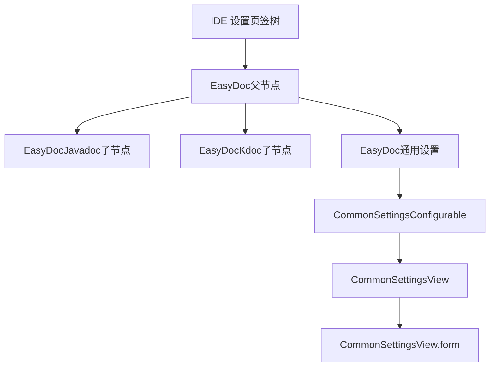
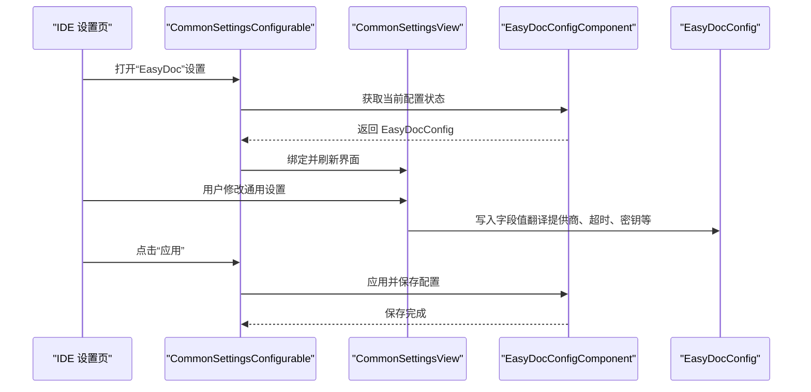
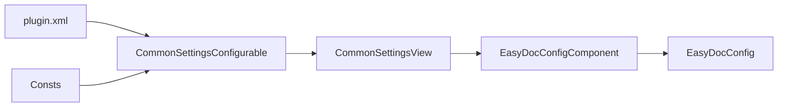

# 通用设置

<cite>
**本文引用的文件列表**
- [plugin.xml](file://src/main/resources/META-INF/plugin.xml)
- [CommonSettingsConfigurable.java](file://src/main/java/com/star/easydoc/view/settings/CommonSettingsConfigurable.java)
- [CommonSettingsView.java](file://src/main/java/com/star/easydoc/view/settings/CommonSettingsView.java)
- [CommonSettingsView.form](file://src/main/java/com/star/easydoc/view/settings/CommonSettingsView.form)
- [EasyDocConfig.java](file://src/main/java/com/star/easydoc/config/EasyDocConfig.java)
- [EasyDocConfigComponent.java](file://src/main/java/com/star/easydoc/config/EasyDocConfigComponent.java)
- [Consts.java](file://src/main/java/com/star/easydoc/common/Consts.java)
- [JavadocSettingsConfigurable.java](file://src/main/java/com/star/easydoc/view/settings/javadoc/JavadocSettingsConfigurable.java)
- [JavadocSettingsView.java](file://src/main/java/com/star/easydoc/view/settings/javadoc/JavadocSettingsView.java)
- [JavadocSettingsView.form](file://src/main/java/com/star/easydoc/view/settings/javadoc/JavadocSettingsView.form)
</cite>

## 目录
1. [简介](#简介)
2. [项目结构与入口](#项目结构与入口)
3. [核心组件](#核心组件)
4. [架构总览](#架构总览)
5. [详细组件解析](#详细组件解析)
6. [依赖关系分析](#依赖关系分析)
7. [性能与可用性考量](#性能与可用性考量)
8. [故障排查指南](#故障排查指南)
9. [结论](#结论)
10. [附录：配置项速查与最佳实践](#附录配置项速查与最佳实践)

## 简介
本指南聚焦 Easy Javadoc 插件的“通用设置”，系统讲解以下关键配置项及其作用：
- 作者信息设置（默认作者名称）
- 日期格式配置（默认日期显示格式）
- 注释优先级设置（类注释优先 / 仅翻译）
- 覆盖模式配置（忽略 / 智能合并 / 强制覆盖）

同时，结合界面布局与配置逻辑，说明这些设置如何影响文档生成行为，并提供不同场景下的最佳实践建议与常见问题解决方案。

## 项目结构与入口
- 设置入口通过插件扩展注册到 IDE 设置页签树中，父节点为“EasyDoc”，子节点包含“EasyDocJavadoc”“EasyDocKdoc”等。
- 通用设置对应可配置实现类与视图类，负责翻译提供商、超时时间、单词映射、项目级单词映射等通用能力。

图表来源
- [plugin.xml:39-51](file://src/main/resources/META-INF/plugin.xml#L39-L51)
- [CommonSettingsConfigurable.java:25-42](file://src/main/java/com/star/easydoc/view/settings/CommonSettingsConfigurable.java#L25-L42)
- [CommonSettingsView.java:42-621](file://src/main/java/com/star/easydoc/view/settings/CommonSettingsView.java#L42-L621)
- [CommonSettingsView.form:1-436](file://src/main/java/com/star/easydoc/view/settings/CommonSettingsView.form#L1-436)

章节来源
- [plugin.xml:39-51](file://src/main/resources/META-INF/plugin.xml#L39-L51)
- [CommonSettingsConfigurable.java:25-42](file://src/main/java/com/star/easydoc/view/settings/CommonSettingsConfigurable.java#L25-L42)

## 核心组件
- EasyDocConfig：持久化配置模型，包含作者、日期格式、注释优先级、覆盖模式、翻译提供商、超时时间、各类模板配置、单词映射等。
- EasyDocConfigComponent：应用级服务，负责配置的初始化与持久化存储。
- CommonSettingsConfigurable：通用设置的可配置实现，负责读取/写入配置、校验输入、刷新视图。
- CommonSettingsView：通用设置界面视图，负责渲染表单、处理交互、导入/导出配置、清空缓存等。
- JavadocSettingsConfigurable/JavadocSettingsView：Javadoc 专用设置（含作者、日期格式、注释优先级、覆盖模式），用于对比理解通用设置与专用设置的关系。

章节来源
- [EasyDocConfig.java:22-680](file://src/main/java/com/star/easydoc/config/EasyDocConfig.java#L22-L680)
- [EasyDocConfigComponent.java:20-68](file://src/main/java/com/star/easydoc/config/EasyDocConfigComponent.java#L20-L68)
- [CommonSettingsConfigurable.java:25-196](file://src/main/java/com/star/easydoc/view/settings/CommonSettingsConfigurable.java#L25-L196)
- [CommonSettingsView.java:42-739](file://src/main/java/com/star/easydoc/view/settings/CommonSettingsView.java#L42-L739)
- [JavadocSettingsConfigurable.java:25-66](file://src/main/java/com/star/easydoc/view/settings/javadoc/JavadocSettingsConfigurable.java#L25-L66)
- [JavadocSettingsView.java:75-217](file://src/main/java/com/star/easydoc/view/settings/javadoc/JavadocSettingsView.java#L75-L217)

## 架构总览
通用设置在插件中的位置与职责如下：
- 插件扩展注册：将“EasyDoc”作为设置根节点，挂载通用设置与各语言模板设置。
- 配置持久化：通过 EasyDocConfigComponent 实现状态持久化，首次启动时填充默认值。
- 界面交互：CommonSettingsView 负责渲染表单字段与交互事件；CommonSettingsConfigurable 负责数据绑定、校验与应用。

图表来源
- [plugin.xml:39-51](file://src/main/resources/META-INF/plugin.xml#L39-L51)
- [CommonSettingsConfigurable.java:94-189](file://src/main/java/com/star/easydoc/view/settings/CommonSettingsConfigurable.java#L94-L189)
- [CommonSettingsView.java:102-211](file://src/main/java/com/star/easydoc/view/settings/CommonSettingsView.java#L102-L211)
- [EasyDocConfigComponent.java:31-66](file://src/main/java/com/star/easydoc/config/EasyDocConfigComponent.java#L31-L66)

## 详细组件解析

### 通用设置界面与字段说明
- 翻译方式（下拉框）：支持多种翻译提供商（如百度、腾讯、阿里云、有道智云、微软、谷歌、智谱清言、本地词典、自定义HTTP接口、仅单词分割、关闭等）。界面表单直接列出可选项。
- APP ID、密钥、SecretId、SecretKey、AccessKeyId、AccessKeySecret、AppKey、AppSecret、MicrosoftKey、MicrosoftRegion、GoogleKey、apiKey、HTTP地址、超时时间等：按所选翻译提供商动态显示对应字段。
- 导入/导出：支持将当前配置以 JSON 形式导入/导出，便于团队共享或备份。
- 重置：一键恢复默认配置。
- 清空缓存：调用翻译服务清理缓存。
- 全局单词映射与项目级单词映射：支持增删改查，项目级映射按当前打开项目自动补齐。

章节来源
- [CommonSettingsView.form:43-436](file://src/main/java/com/star/easydoc/view/settings/CommonSettingsView.form#L43-L436)
- [CommonSettingsView.java:102-211](file://src/main/java/com/star/easydoc/view/settings/CommonSettingsView.java#L102-L211)
- [CommonSettingsView.java:477-559](file://src/main/java/com/star/easydoc/view/settings/CommonSettingsView.java#L477-L559)
- [CommonSettingsView.java:561-580](file://src/main/java/com/star/easydoc/view/settings/CommonSettingsView.java#L561-L580)

### 通用设置配置逻辑与校验
- isModified：比较当前内存配置与界面输入，判断是否已修改。
- apply：将界面输入写回配置对象，并进行严格校验：
  - 翻译提供商必须在允许集合内。
  - 不同提供商要求必填字段不同（如百度需 appId 与 token，腾讯需 secretKey 与 secretId，阿里云需 accessKeyId 与 accessKeySecret，有道智云需 appKey 与 appSecret，微软需 microsoftKey，谷歌需 googleKey，智谱清言需 apiKey，自定义HTTP接口需 http(s) 地址且包含 {from}/{to}/{query} 占位符）。
  - 超时时间必须为正整数。
- reset：将界面刷新为当前配置状态。

章节来源
- [CommonSettingsConfigurable.java:45-92](file://src/main/java/com/star/easydoc/view/settings/CommonSettingsConfigurable.java#L45-L92)
- [CommonSettingsConfigurable.java:94-189](file://src/main/java/com/star/easydoc/view/settings/CommonSettingsConfigurable.java#L94-L189)
- [Consts.java:29-34](file://src/main/java/com/star/easydoc/common/Consts.java#L29-L34)

### 通用设置与持久化
- EasyDocConfigComponent 在首次启动时初始化默认值（如作者、日期格式、注释优先级、覆盖模式、翻译提供商、超时、模板配置、单词映射等），并确保配置对象存在。
- EasyDocConfig 提供丰富的 getter/setter 以及 reset 合并项目映射的方法，保证配置的可序列化与可迁移。

章节来源
- [EasyDocConfigComponent.java:31-66](file://src/main/java/com/star/easydoc/config/EasyDocConfigComponent.java#L31-L66)
- [EasyDocConfig.java:170-206](file://src/main/java/com/star/easydoc/config/EasyDocConfig.java#L170-L206)

### 与 Javadoc 专用设置的对比
- Javadoc 专用设置同样包含作者、日期格式、注释优先级、覆盖模式等字段，但其界面与校验逻辑位于 JavadocSettingsView 与 JavadocSettingsConfigurable。
- 通用设置与专用设置在“作者”“日期格式”“注释优先级”“覆盖模式”等字段上保持一致语义，便于统一管理。

章节来源
- [JavadocSettingsView.form:27-126](file://src/main/java/com/star/easydoc/view/settings/javadoc/JavadocSettingsView.form#L27-L126)
- [JavadocSettingsView.java:202-215](file://src/main/java/com/star/easydoc/view/settings/javadoc/JavadocSettingsView.java#L202-L215)
- [JavadocSettingsConfigurable.java:37-57](file://src/main/java/com/star/easydoc/view/settings/javadoc/JavadocSettingsConfigurable.java#L37-L57)

## 依赖关系分析
- 插件扩展注册：plugin.xml 将通用设置与 Javadoc/Kdoc 设置注册为可配置项。
- 配置服务：EasyDocConfigComponent 作为应用级服务，提供配置状态与持久化。
- 界面层：CommonSettingsView 依赖 EasyDocConfigComponent 的状态，CommonSettingsConfigurable 负责数据绑定与校验。
- 常量与校验：Consts 定义了允许的翻译提供商集合，用于校验输入。

图表来源
- [plugin.xml:39-51](file://src/main/resources/META-INF/plugin.xml#L39-L51)
- [CommonSettingsConfigurable.java:25-42](file://src/main/java/com/star/easydoc/view/settings/CommonSettingsConfigurable.java#L25-L42)
- [CommonSettingsView.java:42-621](file://src/main/java/com/star/easydoc/view/settings/CommonSettingsView.java#L42-L621)
- [EasyDocConfigComponent.java:20-68](file://src/main/java/com/star/easydoc/config/EasyDocConfigComponent.java#L20-L68)
- [Consts.java:29-34](file://src/main/java/com/star/easydoc/common/Consts.java#L29-L34)

章节来源
- [plugin.xml:39-51](file://src/main/resources/META-INF/plugin.xml#L39-L51)
- [CommonSettingsConfigurable.java:25-42](file://src/main/java/com/star/easydoc/view/settings/CommonSettingsConfigurable.java#L25-L42)
- [CommonSettingsView.java:42-621](file://src/main/java/com/star/easydoc/view/settings/CommonSettingsView.java#L42-L621)
- [EasyDocConfigComponent.java:20-68](file://src/main/java/com/star/easydoc/config/EasyDocConfigComponent.java#L20-L68)
- [Consts.java:29-34](file://src/main/java/com/star/easydoc/common/Consts.java#L29-L34)

## 性能与可用性考量
- 超时时间：建议设置为合理范围（例如 3000-10000ms），过短可能导致请求失败，过长可能造成 IDE 卡顿。
- 翻译提供商选择：根据网络环境与稳定性选择合适的翻译源；自定义 HTTP 接口需确保响应格式与占位符满足要求。
- 单词映射：全局与项目级映射可提升术语一致性，建议定期维护与导出备份。

[本节为通用建议，不直接分析具体文件]

## 故障排查指南
- 翻译提供商校验失败
  - 现象：应用设置时报错“请选择正确的翻译方式”。
  - 处理：确认所选翻译提供商在允许集合内。
  - 参考
    - [CommonSettingsConfigurable.java:117-119](file://src/main/java/com/star/easydoc/view/settings/CommonSettingsConfigurable.java#L117-L119)
    - [Consts.java:29-34](file://src/main/java/com/star/easydoc/common/Consts.java#L29-L34)
- 必填字段缺失
  - 现象：应用设置时报错“xxx不能为空”。
  - 处理：根据所选提供商补齐对应密钥字段。
  - 参考
    - [CommonSettingsConfigurable.java:120-183](file://src/main/java/com/star/easydoc/view/settings/CommonSettingsConfigurable.java#L120-L183)
- 自定义 HTTP 接口格式错误
  - 现象：应用设置时报错“自定义地址不能为空/只支持http或https/需要包含{from}/{to}/{query}占位符”。
  - 处理：确保地址以 http/https 开头，包含三个占位符。
  - 参考
    - [CommonSettingsConfigurable.java:167-183](file://src/main/java/com/star/easydoc/view/settings/CommonSettingsConfigurable.java#L167-L183)
- 超时时间格式错误
  - 现象：应用设置时报错“超时时间必须为数字”。
  - 处理：输入正整数。
  - 参考
    - [CommonSettingsConfigurable.java:184-188](file://src/main/java/com/star/easydoc/view/settings/CommonSettingsConfigurable.java#L184-L188)
- 导入/导出失败
  - 现象：导入/导出 JSON 文件时报错。
  - 处理：检查文件是否存在、格式是否为合法 JSON；导出路径需存在。
  - 参考
    - [CommonSettingsView.java:107-148](file://src/main/java/com/star/easydoc/view/settings/CommonSettingsView.java#L107-L148)

章节来源
- [CommonSettingsConfigurable.java:117-188](file://src/main/java/com/star/easydoc/view/settings/CommonSettingsConfigurable.java#L117-L188)
- [CommonSettingsView.java:107-148](file://src/main/java/com/star/easydoc/view/settings/CommonSettingsView.java#L107-L148)
- [Consts.java:29-34](file://src/main/java/com/star/easydoc/common/Consts.java#L29-L34)

## 结论
通用设置是 Easy Javadoc 插件配置体系的重要一环，它统一管理翻译提供商、超时时间、作者与日期格式等基础能力，并通过严格的校验保障配置正确性。结合全局与项目级单词映射，可显著提升文档生成的一致性与效率。建议在团队内统一翻译提供商与超时策略，并定期导出配置以备迁移与备份。

[本节为总结，不直接分析具体文件]

## 附录：配置项速查与最佳实践

### 通用设置项速查
- 翻译方式：支持多种提供商，按需选择。
- APP ID/密钥/SecretId/SecretKey/AccessKeyId/AccessKeySecret/AppKey/AppSecret/MicrosoftKey/MicrosoftRegion/GoogleKey/apiKey/HTTP地址：按所选提供商显示对应字段。
- 超时时间（ms）：建议 3000-10000。
- 导入/导出：JSON 格式，便于团队共享。
- 重置：恢复默认配置。
- 清空缓存：清理翻译缓存。

章节来源
- [CommonSettingsView.form:43-436](file://src/main/java/com/star/easydoc/view/settings/CommonSettingsView.form#L43-L436)
- [CommonSettingsView.java:102-211](file://src/main/java/com/star/easydoc/view/settings/CommonSettingsView.java#L102-L211)
- [CommonSettingsConfigurable.java:94-189](file://src/main/java/com/star/easydoc/view/settings/CommonSettingsConfigurable.java#L94-L189)

### 与 Javadoc 专用设置的差异
- Javadoc 专用设置包含“类注释优先级”“注释覆盖模式”等字段，通用设置不包含这些字段。
- 两者在“作者”“日期格式”“覆盖模式”等字段上保持一致语义。

章节来源
- [JavadocSettingsView.form:50-126](file://src/main/java/com/star/easydoc/view/settings/javadoc/JavadocSettingsView.form#L50-L126)
- [JavadocSettingsView.java:202-215](file://src/main/java/com/star/easydoc/view/settings/javadoc/JavadocSettingsView.java#L202-L215)
- [JavadocSettingsConfigurable.java:37-66](file://src/main/java/com/star/easydoc/view/settings/javadoc/JavadocSettingsConfigurable.java#L37-L66)

### 最佳实践建议
- 团队协作
  - 统一翻译提供商与超时时间，避免因网络波动导致生成失败。
  - 使用“导入/导出”在团队间同步配置。
- 术语一致性
  - 利用“全局单词映射”与“项目级单词映射”统一术语，减少歧义。
- 配置迁移
  - 在更换开发机或迁移项目时，先导入配置，再验证翻译提供商与密钥有效性。
- 安全与合规
  - 不在公开仓库中提交密钥信息；必要时使用环境变量或 IDE 安全存储。

[本节为通用建议，不直接分析具体文件]