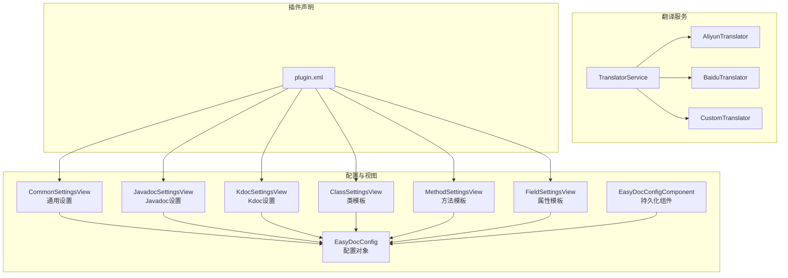
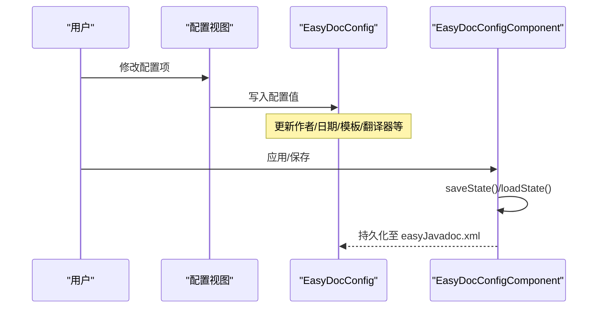
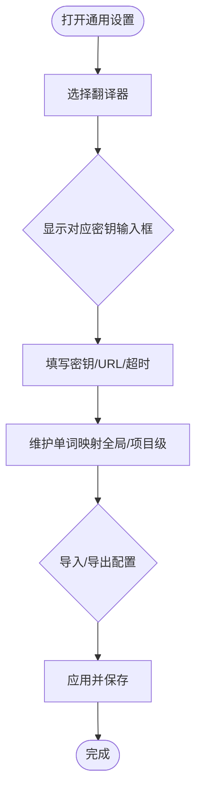
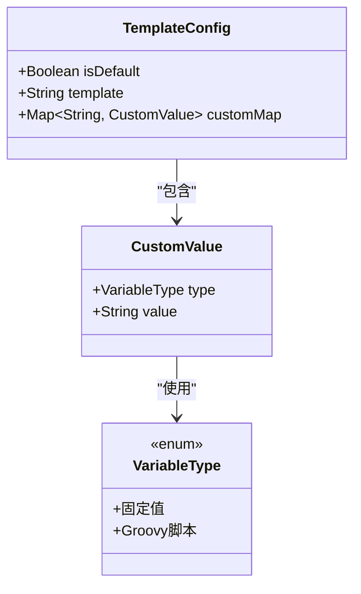
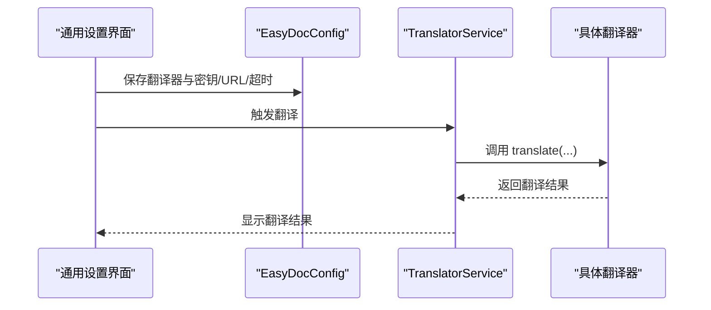
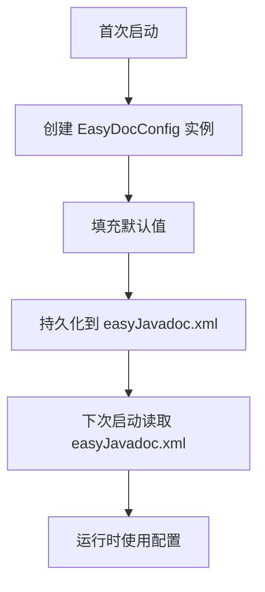
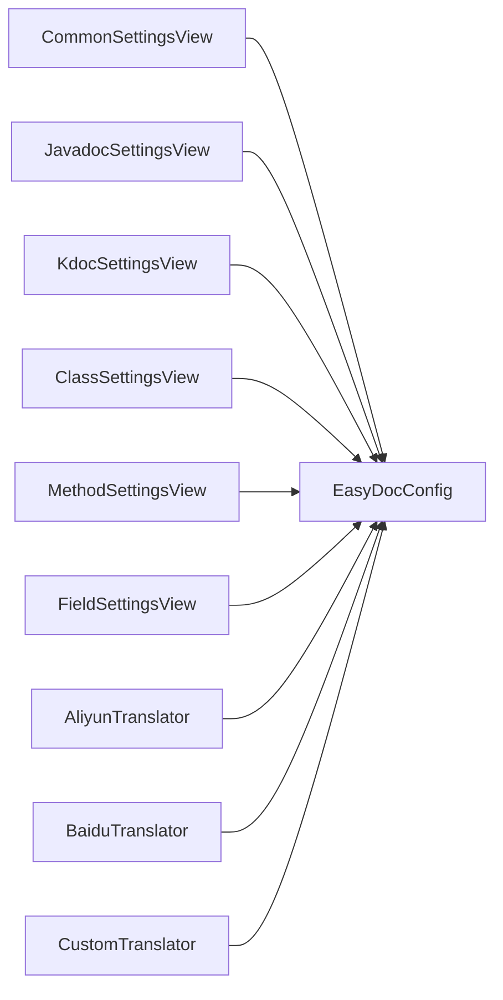

# 配置指南

<cite>
**本文档引用的文件**
- [EasyDocConfig.java](file://src/main/java/com/star/easydoc/config/EasyDocConfig.java)
- [EasyDocConfigComponent.java](file://src/main/java/com/star/easydoc/config/EasyDocConfigComponent.java)
- [CommonSettingsView.java](file://src/main/java/com/star/easydoc/view/settings/CommonSettingsView.java)
- [JavadocSettingsView.java](file://src/main/java/com/star/easydoc/view/settings/javadoc/JavadocSettingsView.java)
- [KdocSettingsView.kt](file://src/main/kotlin/com/star/easydoc/view/settings/kdoc/KdocSettingsView.kt)
- [plugin.xml](file://src/main/resources/META-INF/plugin.xml)
- [Consts.java](file://src/main/java/com/star/easydoc/common/Consts.java)
- [ClassSettingsView.java](file://src/main/java/com/star/easydoc/view/settings/javadoc/template/ClassSettingsView.java)
- [MethodSettingsView.java](file://src/main/java/com/star/easydoc/view/settings/javadoc/template/MethodSettingsView.java)
- [FieldSettingsView.java](file://src/main/java/com/star/easydoc/view/settings/javadoc/template/FieldSettingsView.java)
- [AliyunTranslator.java](file://src/main/java/com/star/easydoc/service/translator/impl/AliyunTranslator.java)
- [BaiduTranslator.java](file://src/main/java/com/star/easydoc/service/translator/impl/BaiduTranslator.java)
- [CustomTranslator.java](file://src/main/java/com/star/easydoc/service/translator/impl/CustomTranslator.java)
- [class.prompt](file://src/main/resources/prompts/chatglm/class.prompt)
</cite>

## 目录
1. [简介](#简介)
2. [项目结构](#项目结构)
3. [核心组件](#核心组件)
4. [架构总览](#架构总览)
5. [详细组件分析](#详细组件分析)
6. [依赖分析](#依赖分析)
7. [性能考虑](#性能考虑)
8. [故障排除指南](#故障排除指南)
9. [结论](#结论)
10. [附录](#附录)

## 简介
本指南面向使用 Easy Javadoc 插件的开发者，系统讲解插件的配置界面与各项配置项，涵盖通用设置、Javadoc 设置、Kdoc 设置；详解翻译服务配置（各翻译器密钥、API 地址、超时时间等）；说明模板配置的完整流程（模板编辑、变量定义、自定义模板创建）；并给出配置文件结构与持久化机制说明，以及常见场景的最佳实践与故障排除建议。

## 项目结构
插件通过 IntelliJ 平台的服务与配置扩展点组织功能模块：
- 配置层：EasyDocConfig 为核心配置对象，EasyDocConfigComponent 提供持久化存储
- 视图层：CommonSettingsView、JavadocSettingsView、KdocSettingsView 提供配置界面
- 模板层：ClassSettingsView、MethodSettingsView、FieldSettingsView 提供模板配置界面
- 翻译层：多种翻译器实现（如阿里云、百度、自定义等）
- 插件声明：plugin.xml 定义配置页入口与服务注册

图表来源
- [plugin.xml:39-51](file://src/main/resources/META-INF/plugin.xml#L39-L51)
- [CommonSettingsView.java:42-45](file://src/main/java/com/star/easydoc/view/settings/CommonSettingsView.java#L42-L45)
- [JavadocSettingsView.java:14-16](file://src/main/java/com/star/easydoc/view/settings/javadoc/JavadocSettingsView.java#L14-L16)
- [KdocSettingsView.kt:14-16](file://src/main/kotlin/com/star/easydoc/view/settings/kdoc/KdocSettingsView.kt#L14-L16)
- [ClassSettingsView.java:24-26](file://src/main/java/com/star/easydoc/view/settings/javadoc/template/ClassSettingsView.java#L24-L26)
- [MethodSettingsView.java:24-26](file://src/main/java/com/star/easydoc/view/settings/javadoc/template/MethodSettingsView.java#L24-L26)
- [FieldSettingsView.java:24-26](file://src/main/java/com/star/easydoc/view/settings/javadoc/template/FieldSettingsView.java#L24-L26)
- [AliyunTranslator.java:35-49](file://src/main/java/com/star/easydoc/service/translator/impl/AliyunTranslator.java#L35-L49)
- [BaiduTranslator.java:21-36](file://src/main/java/com/star/easydoc/service/translator/impl/BaiduTranslator.java#L21-L36)
- [CustomTranslator.java:20-32](file://src/main/java/com/star/easydoc/service/translator/impl/CustomTranslator.java#L20-L32)

章节来源
- [plugin.xml:27-51](file://src/main/resources/META-INF/plugin.xml#L27-L51)

## 核心组件
- EasyDocConfig：集中管理所有配置项，包括作者、日期格式、字段模式、方法返回类型、注释优先级、覆盖模式、翻译器及密钥、超时、自定义 URL、单词映射、模板配置等，并提供 reset 合并项目映射等能力
- EasyDocConfigComponent：基于 IntelliJ 的 PersistentStateComponent，负责配置的初始化、加载与保存，持久化文件名为 easyJavadoc.xml

章节来源
- [EasyDocConfig.java:22-679](file://src/main/java/com/star/easydoc/config/EasyDocConfig.java#L22-L679)
- [EasyDocConfigComponent.java:19-68](file://src/main/java/com/star/easydoc/config/EasyDocConfigComponent.java#L19-L68)

## 架构总览
配置从 UI 到持久化的路径如下：
- 用户在 CommonSettingsView、JavadocSettingsView、KdocSettingsView、模板视图中修改配置
- 配置写入 EasyDocConfig 实例
- EasyDocConfigComponent 负责将配置序列化到磁盘（easyJavadoc.xml）
- 下次启动或需要读取配置时，通过 EasyDocConfigComponent.getState() 获取最新配置

图表来源
- [CommonSettingsView.java:107-148](file://src/main/java/com/star/easydoc/view/settings/CommonSettingsView.java#L107-L148)
- [JavadocSettingsView.java:108-133](file://src/main/java/com/star/easydoc/view/settings/javadoc/JavadocSettingsView.java#L108-L133)
- [KdocSettingsView.kt:56-67](file://src/main/kotlin/com/star/easydoc/view/settings/kdoc/KdocSettingsView.kt#L56-L67)
- [EasyDocConfigComponent.java:31-66](file://src/main/java/com/star/easydoc/config/EasyDocConfigComponent.java#L31-L66)

## 详细组件分析

### 通用设置（CommonSettingsView）
- 功能：统一管理翻译器选择、密钥输入、超时、自定义 URL、单词映射导入导出、缓存清理、重置等
- 翻译器可见性：根据所选翻译器动态显示对应密钥输入框（如百度、腾讯、阿里云、有道智云、微软、谷歌、ChatGLM、自定义 URL 等）
- 单词映射：支持全局与项目级映射，提供增删改查操作
- 导入导出：JSON 格式导入导出配置，便于团队共享
- 缓存与重置：一键清理翻译缓存；重置后恢复默认值

图表来源
- [CommonSettingsView.java:213-472](file://src/main/java/com/star/easydoc/view/settings/CommonSettingsView.java#L213-L472)
- [CommonSettingsView.java:107-148](file://src/main/java/com/star/easydoc/view/settings/CommonSettingsView.java#L107-L148)
- [CommonSettingsView.java:582-613](file://src/main/java/com/star/easydoc/view/settings/CommonSettingsView.java#L582-L613)

章节来源
- [CommonSettingsView.java:42-739](file://src/main/java/com/star/easydoc/view/settings/CommonSettingsView.java#L42-L739)
- [Consts.java:29-99](file://src/main/java/com/star/easydoc/common/Consts.java#L29-L99)

### Javadoc 设置（JavadocSettingsView）
- 功能：控制类/方法/属性注释生成行为
- 选项：
  - 字段注释模式：简单模式/普通模式
  - 方法返回类型：代码类型/链接类型/文档类型
  - 注释优先级：注释优先/仅翻译
  - 覆盖模式：忽略/智能合并/强制覆盖
  - 作者与日期格式
- UI 行为：互斥单选按钮联动，确保状态一致性

章节来源
- [JavadocSettingsView.java:14-218](file://src/main/java/com/star/easydoc/view/settings/javadoc/JavadocSettingsView.java#L14-L218)

### Kdoc 设置（KdocSettingsView）
- 功能：针对 Kotlin 文档注释的配置
- 选项：
  - 字段注释模式：简单模式/普通模式
  - 参数类型：普通模式/中括号模式
  - 作者与日期格式
- UI 行为：简单/普通模式互斥切换

章节来源
- [KdocSettingsView.kt:14-107](file://src/main/kotlin/com/star/easydoc/view/settings/kdoc/KdocSettingsView.kt#L14-L107)

### 模板配置（类/方法/属性）
- 类模板（ClassSettingsView）
  - 内置变量：注释信息、作者、日期、版本、起始版本、SEE 链接等
  - 支持自定义变量：键名、类型（固定值/Groovy 脚本）、值
  - 默认/自定义模式切换：禁用/启用模板编辑与变量表
- 方法模板（MethodSettingsView）
  - 内置变量：注释信息、参数列表、返回值、异常、SEE 引用
  - 自定义变量同上
- 属性模板（FieldSettingsView）
  - 内置变量：注释信息、字段类型
  - 自定义变量同上

图表来源
- [EasyDocConfig.java:211-325](file://src/main/java/com/star/easydoc/config/EasyDocConfig.java#L211-L325)

章节来源
- [ClassSettingsView.java:24-179](file://src/main/java/com/star/easydoc/view/settings/javadoc/template/ClassSettingsView.java#L24-L179)
- [MethodSettingsView.java:24-179](file://src/main/java/com/star/easydoc/view/settings/javadoc/template/MethodSettingsView.java#L24-L179)
- [FieldSettingsView.java:24-176](file://src/main/java/com/star/easydoc/view/settings/javadoc/template/FieldSettingsView.java#L24-L176)

### 翻译服务配置
- 支持的翻译器集合：有道翻译、百度翻译、腾讯翻译、阿里云翻译、有道智云翻译、微软翻译/免费、谷歌翻译/免费、ChatGLM、本地词典、仅单词分割、关闭（仅自定义翻译）、自定义 HTTP 接口
- 各翻译器密钥/参数：
  - 百度：App ID、Token
  - 腾讯：SecretId、SecretKey
  - 阿里云：AccessKeyId、AccessKeySecret
  - 有道智云：AppKey、AppSecret
  - 微软：Key、区域
  - 谷歌：Key
  - ChatGLM：API Key
  - 自定义：自定义 URL（含占位符替换）
- 超时时间：统一配置项，单位毫秒
- 自定义翻译协议：请求需返回 JSON，包含 code 与 data 字段，code 为 0 表示成功

图表来源
- [CommonSettingsView.java:107-148](file://src/main/java/com/star/easydoc/view/settings/CommonSettingsView.java#L107-L148)
- [Consts.java:29-99](file://src/main/java/com/star/easydoc/common/Consts.java#L29-L99)
- [CustomTranslator.java:34-58](file://src/main/java/com/star/easydoc/service/translator/impl/CustomTranslator.java#L34-L58)

章节来源
- [Consts.java:29-99](file://src/main/java/com/star/easydoc/common/Consts.java#L29-L99)
- [AliyunTranslator.java:35-153](file://src/main/java/com/star/easydoc/service/translator/impl/AliyunTranslator.java#L35-L153)
- [BaiduTranslator.java:21-62](file://src/main/java/com/star/easydoc/service/translator/impl/BaiduTranslator.java#L21-L62)
- [CustomTranslator.java:20-60](file://src/main/java/com/star/easydoc/service/translator/impl/CustomTranslator.java#L20-L60)

### 配置文件结构与持久化机制
- 文件位置：easyJavadoc.xml（由 @Storage 指定）
- 初始化与默认值：首次启动时由 EasyDocConfigComponent 初始化默认配置（作者、日期格式、字段模式、模板配置、翻译器、超时等）
- 加载与保存：通过 PersistentStateComponent 的 getState/loadState 实现序列化/反序列化
- 配置合并：项目级单词映射会自动合并当前已打开项目名称

图表来源
- [EasyDocConfigComponent.java:31-66](file://src/main/java/com/star/easydoc/config/EasyDocConfigComponent.java#L31-L66)
- [EasyDocConfig.java:201-206](file://src/main/java/com/star/easydoc/config/EasyDocConfig.java#L201-L206)

章节来源
- [EasyDocConfigComponent.java:19-68](file://src/main/java/com/star/easydoc/config/EasyDocConfigComponent.java#L19-L68)
- [EasyDocConfig.java:22-679](file://src/main/java/com/star/easydoc/config/EasyDocConfig.java#L22-L679)

## 依赖分析
- 配置与视图：CommonSettingsView/JavadocSettingsView/KdocSettingsView 依赖 EasyDocConfigComponent 获取/写入配置
- 模板视图：Class/Method/FieldSettingsView 依赖 EasyDocConfig 的 TemplateConfig/CustomValue
- 翻译服务：各翻译器实现依赖 EasyDocConfig 获取密钥/URL/超时等配置
- 插件声明：plugin.xml 注册配置页与服务，形成 UI 与实现的绑定

图表来源
- [CommonSettingsView.java:44-45](file://src/main/java/com/star/easydoc/view/settings/CommonSettingsView.java#L44-L45)
- [JavadocSettingsView.java:16-16](file://src/main/java/com/star/easydoc/view/settings/javadoc/JavadocSettingsView.java#L16-L16)
- [KdocSettingsView.kt:16-16](file://src/main/kotlin/com/star/easydoc/view/settings/kdoc/KdocSettingsView.kt#L16-L16)
- [ClassSettingsView.java:100-101](file://src/main/java/com/star/easydoc/view/settings/javadoc/template/ClassSettingsView.java#L100-L101)
- [MethodSettingsView.java:99-100](file://src/main/java/com/star/easydoc/view/settings/javadoc/template/MethodSettingsView.java#L99-L100)
- [FieldSettingsView.java:96-97](file://src/main/java/com/star/easydoc/view/settings/javadoc/template/FieldSettingsView.java#L96-L97)
- [AliyunTranslator.java:66-68](file://src/main/java/com/star/easydoc/service/translator/impl/AliyunTranslator.java#L66-L68)
- [BaiduTranslator.java:46-47](file://src/main/java/com/star/easydoc/service/translator/impl/BaiduTranslator.java#L46-L47)
- [CustomTranslator.java:44-45](file://src/main/java/com/star/easydoc/service/translator/impl/CustomTranslator.java#L44-L45)

章节来源
- [plugin.xml:39-51](file://src/main/resources/META-INF/plugin.xml#L39-L51)

## 性能考虑
- 超时设置：合理设置超时时间，避免网络波动导致长时间阻塞
- 翻译器选择：优先选择稳定且低延迟的服务；自定义翻译需保证响应时间与成功率
- 模板复杂度：自定义变量（尤其是 Groovy 脚本）可能增加生成耗时，建议简化逻辑或缓存结果
- 单词映射规模：项目级映射过大可能影响读取性能，建议按需维护

## 故障排除指南
- 翻译失败
  - 检查密钥/URL/超时是否正确配置
  - 查看日志输出，定位具体翻译器错误信息
  - 对于自定义翻译，确认返回 JSON 结构与约定一致（code=0 成功）
- 配置未生效
  - 确认已在“应用”后保存配置
  - 如需重置，使用“重置”按钮恢复默认值
  - 清理翻译缓存后重试
- 模板变量不生效
  - 确认模板处于“自定义模式”，并正确填写变量键名与类型
  - 对于 Groovy 脚本，检查语法与上下文可用变量
- 项目级单词映射缺失
  - 在“通用设置”的项目列表中选择对应项目，重新添加映射

章节来源
- [CommonSettingsView.java:150-165](file://src/main/java/com/star/easydoc/view/settings/CommonSettingsView.java#L150-L165)
- [CommonSettingsView.java:194-208](file://src/main/java/com/star/easydoc/view/settings/CommonSettingsView.java#L194-L208)
- [CustomTranslator.java:44-58](file://src/main/java/com/star/easydoc/service/translator/impl/CustomTranslator.java#L44-L58)

## 结论
通过本指南，您可以：
- 在通用设置中完成翻译器与密钥配置、超时与自定义 URL 设置
- 在 Javadoc/Kdoc 设置中调整注释生成策略与样式
- 在模板配置中灵活定义内置与自定义变量，满足团队规范
- 了解配置持久化机制，保障跨会话一致性
- 面对常见问题时快速定位与修复

## 附录

### 常见配置场景与最佳实践
- 团队协作
  - 使用“导出配置”分享团队统一的配置；在“通用设置”中导入
  - 统一作者与日期格式，保持文档风格一致
- 翻译策略
  - 优先使用稳定翻译器；若需私有化，配置自定义 URL 并严格遵循返回格式
  - 合理设置超时，避免阻塞 IDE
- 模板定制
  - 先使用内置变量，再按需添加自定义变量
  - 对复杂逻辑使用 Groovy 脚本，但注意性能与可维护性
- 项目级映射
  - 为不同项目维护独立单词映射，提升翻译准确性

### 配置项速查
- 通用设置
  - 翻译器：选择翻译服务
  - 密钥/URL：按所选翻译器填写
  - 超时：单位毫秒
  - 单词映射：全局与项目级
- Javadoc 设置
  - 字段注释模式：简单/普通
  - 方法返回类型：代码/链接/文档
  - 注释优先级：注释优先/仅翻译
  - 覆盖模式：忽略/智能合并/强制覆盖
  - 作者与日期格式
- Kdoc 设置
  - 字段注释模式：简单/普通
  - 参数类型：普通/中括号
  - 作者与日期格式
- 模板设置
  - 类/方法/属性模板：默认/自定义
  - 内置变量与自定义变量（键名、类型、值）