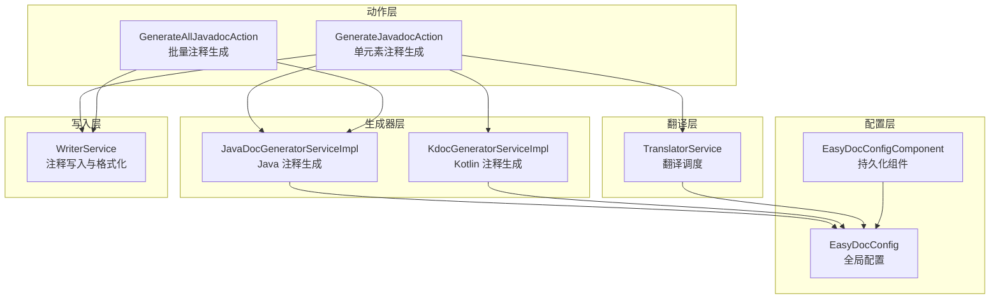
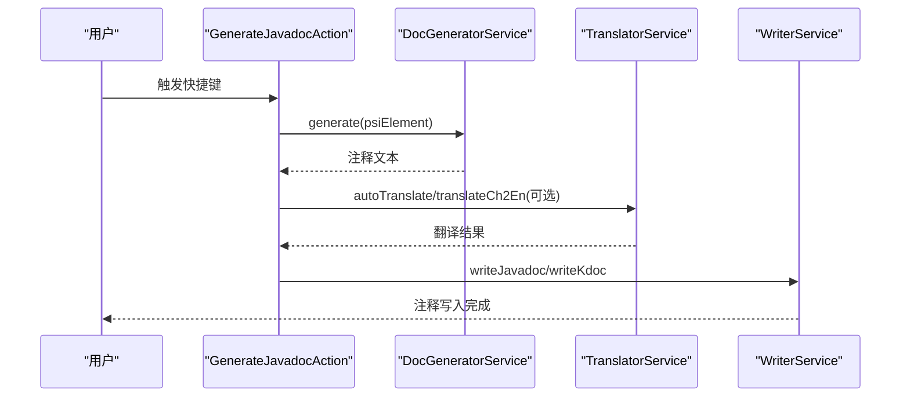
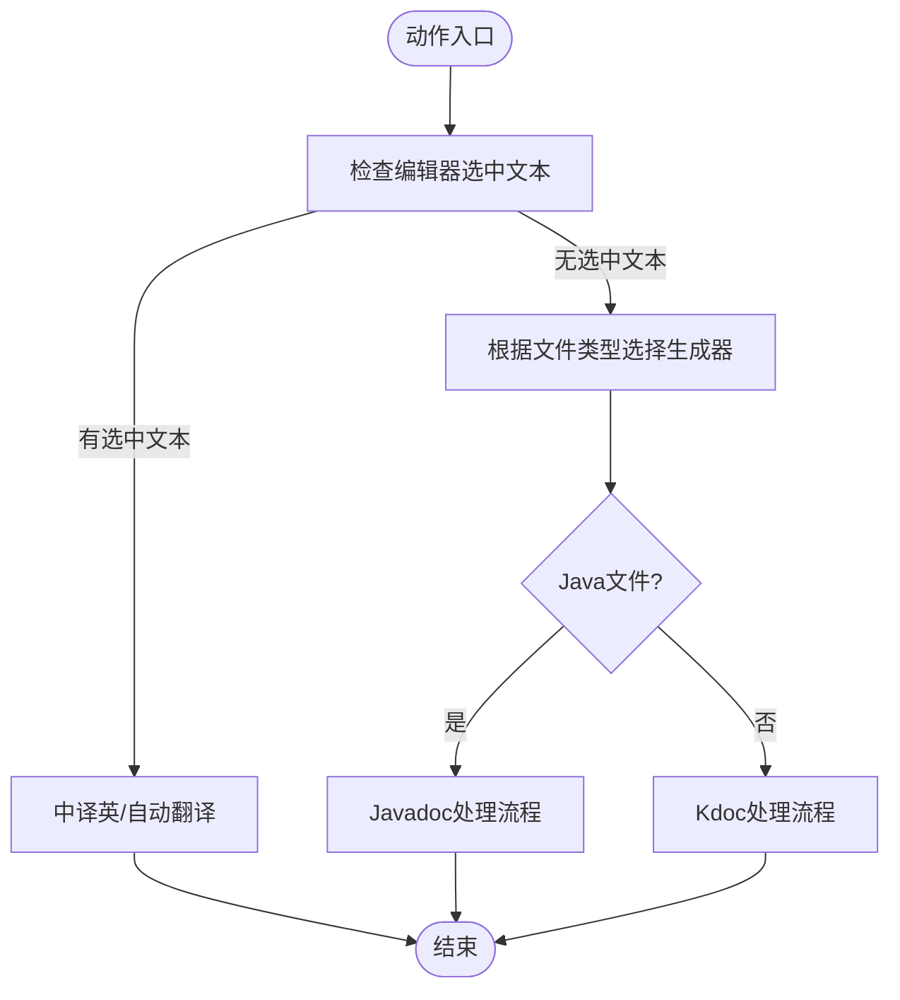
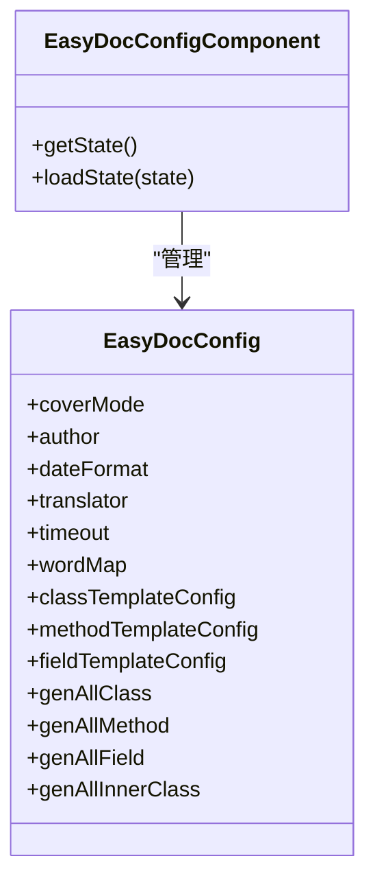
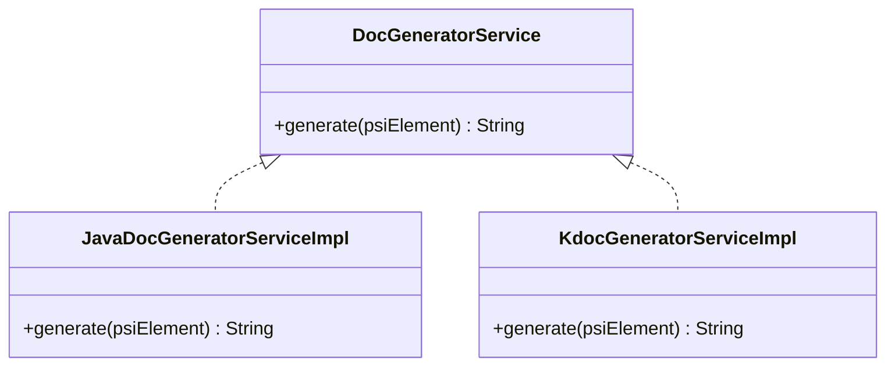
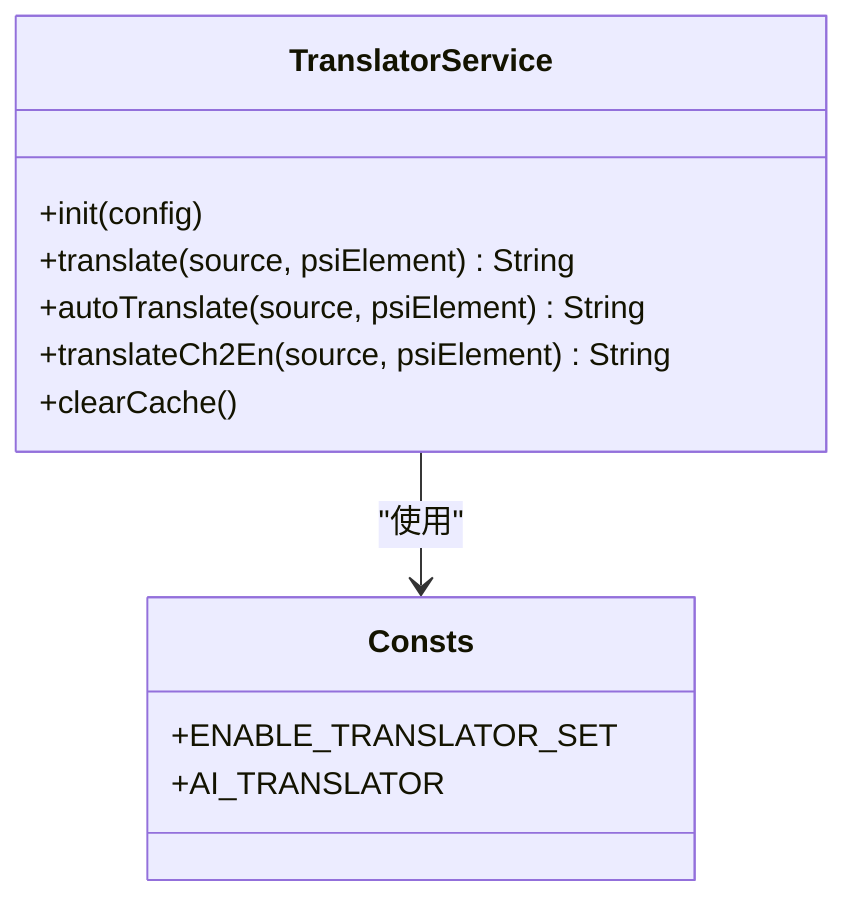
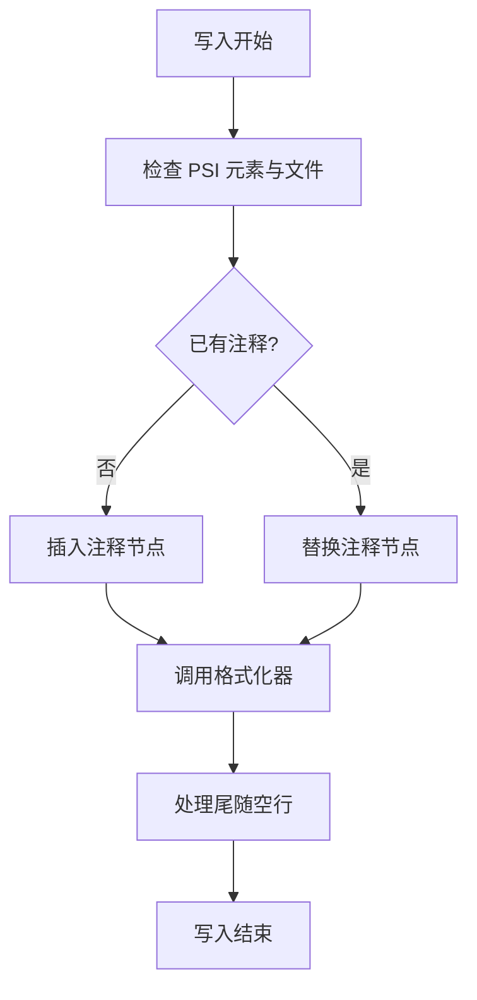
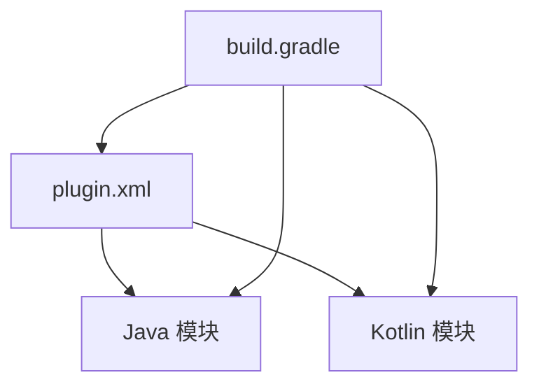

# 项目概述

<cite>
**本文引用的文件**
- [README.md](file://README.md)
- [plugin.xml](file://src/main/resources/META-INF/plugin.xml)
- [build.gradle](file://build.gradle)
- [settings.gradle](file://settings.gradle)
- [GenerateJavadocAction.java](file://src/main/java/com/star/easydoc/action/GenerateJavadocAction.java)
- [GenerateAllJavadocAction.java](file://src/main/java/com/star/easydoc/action/GenerateAllJavadocAction.java)
- [EasyDocConfig.java](file://src/main/java/com/star/easydoc/config/EasyDocConfig.java)
- [EasyDocConfigComponent.java](file://src/main/java/com/star/easydoc/config/EasyDocConfigComponent.java)
- [TranslatorService.java](file://src/main/java/com/star/easydoc/service/translator/TranslatorService.java)
- [JavaDocGeneratorServiceImpl.java](file://src/main/java/com/star/easydoc/javadoc/service/JavaDocGeneratorServiceImpl.java)
- [KdocGeneratorServiceImpl.kt](file://src/main/kotlin/com/star/easydoc/kdoc/service/KdocGeneratorServiceImpl.kt)
- [KtClassDocGenerator.kt](file://src/main/kotlin/com/star/easydoc/kdoc/service/generator/impl/KtClassDocGenerator.kt)
- [KtNamedFunctionDocGenerator.kt](file://src/main/kotlin/com/star/easydoc/kdoc/service/generator/impl/KtNamedFunctionDocGenerator.kt)
- [KtPropertyDocGenerator.kt](file://src/main/kotlin/com/star/easydoc/kdoc/service/generator/impl/KtPropertyDocGenerator.kt)
- [WriterService.java](file://src/main/java/com/star/easydoc/service/WriterService.java)
- [DocGeneratorService.java](file://src/main/java/com/star/easydoc/service/DocGeneratorService.java)
- [Consts.java](file://src/main/java/com/star/easydoc/common/Consts.java)
- [StringUtil.java](file://src/main/java/com/star/easydoc/common/util/StringUtil.java)
</cite>

## 目录
1. [引言](#引言)
2. [项目结构](#项目结构)
3. [核心组件](#核心组件)
4. [架构总览](#架构总览)
5. [详细组件分析](#详细组件分析)
6. [依赖关系分析](#依赖关系分析)
7. [性能考量](#性能考量)
8. [故障排查指南](#故障排查指南)
9. [结论](#结论)
10. [附录](#附录)

## 引言
Easy Javadoc 是一款面向 IntelliJ IDEA 的开源插件，旨在帮助 Java 与 Kotlin 开发者高效生成 Javadoc 与 Kdoc 文档注释。它通过自动化注释生成、多语言翻译服务、智能模板系统与变量替换机制，显著降低团队在文档维护上的重复劳动，提升代码可读性与协作效率。插件支持的 IDE 版本为 2019.1 及以上，并在持续迭代中引入 AI 大模型与本地词典翻译能力，满足不同场景下的注释生成需求。

## 项目结构
该插件采用模块化设计，按功能域划分目录，主要包括：
- 动作入口：提供快捷键触发的注释生成与批量生成动作
- 配置中心：持久化用户配置，含模板、翻译、覆盖策略等
- 生成器层：针对 Java 与 Kotlin 的注释生成器，支持类、方法、属性等元素
- 翻译服务：统一调度多种翻译渠道（云端、本地、AI）
- 写入服务：安全地将生成的注释写入 PSI 元素并格式化
- 视图与设置：提供图形化配置界面与模板管理
- 资源与提示：包含插件描述、变更日志、提示文案与模板资源

图表来源
- [GenerateJavadocAction.java:46-175](file://src/main/java/com/star/easydoc/action/GenerateJavadocAction.java#L46-L175)
- [GenerateAllJavadocAction.java:47-218](file://src/main/java/com/star/easydoc/action/GenerateAllJavadocAction.java#L47-L218)
- [EasyDocConfig.java:22-680](file://src/main/java/com/star/easydoc/config/EasyDocConfig.java#L22-L680)
- [EasyDocConfigComponent.java:20-69](file://src/main/java/com/star/easydoc/config/EasyDocConfigComponent.java#L20-L69)
- [JavaDocGeneratorServiceImpl.java:25-50](file://src/main/java/com/star/easydoc/javadoc/service/JavaDocGeneratorServiceImpl.java#L25-L50)
- [KdocGeneratorServiceImpl.kt:21-52](file://src/main/kotlin/com/star/easydoc/kdoc/service/KdocGeneratorServiceImpl.kt#L21-L52)
- [TranslatorService.java:41-238](file://src/main/java/com/star/easydoc/service/translator/TranslatorService.java#L41-L238)
- [WriterService.java:25-139](file://src/main/java/com/star/easydoc/service/WriterService.java#L25-L139)

章节来源
- [plugin.xml:1-82](file://src/main/resources/META-INF/plugin.xml#L1-L82)
- [build.gradle:1-78](file://build.gradle#L1-L78)
- [settings.gradle:1-3](file://settings.gradle#L1-L3)

## 核心组件
- 动作入口
  - GenerateJavadocAction：支持在类、方法、属性上生成注释；支持选中文本进行中译英或自动翻译展示
  - GenerateAllJavadocAction：支持批量生成类、方法、属性注释，支持包信息生成
- 配置中心
  - EasyDocConfig：集中管理作者、日期格式、模板配置、翻译参数、覆盖模式、超时等
  - EasyDocConfigComponent：负责配置的初始化与持久化
- 生成器层
  - JavaDocGeneratorServiceImpl：根据 PSI 元素类型分派到对应 DocGenerator
  - KdocGeneratorServiceImpl：针对 Kotlin 元素（类、对象、函数、属性）的注释生成
- 翻译服务
  - TranslatorService：统一调度多种翻译实现（百度、腾讯、阿里云、有道、微软、谷歌、本地词典、自定义 HTTP、AI 等），支持单词级与整句级翻译
- 写入服务
  - WriterService：在事务中写入注释，调用 IDE 格式化器进行格式化，并处理尾随空行

章节来源
- [GenerateJavadocAction.java:71-175](file://src/main/java/com/star/easydoc/action/GenerateJavadocAction.java#L71-L175)
- [GenerateAllJavadocAction.java:59-218](file://src/main/java/com/star/easydoc/action/GenerateAllJavadocAction.java#L59-L218)
- [EasyDocConfig.java:22-680](file://src/main/java/com/star/easydoc/config/EasyDocConfig.java#L22-L680)
- [EasyDocConfigComponent.java:20-69](file://src/main/java/com/star/easydoc/config/EasyDocConfigComponent.java#L20-L69)
- [JavaDocGeneratorServiceImpl.java:25-50](file://src/main/java/com/star/easydoc/javadoc/service/JavaDocGeneratorServiceImpl.java#L25-L50)
- [KdocGeneratorServiceImpl.kt:21-52](file://src/main/kotlin/com/star/easydoc/kdoc/service/KdocGeneratorServiceImpl.kt#L21-L52)
- [TranslatorService.java:41-238](file://src/main/java/com/star/easydoc/service/translator/TranslatorService.java#L41-L238)
- [WriterService.java:25-139](file://src/main/java/com/star/easydoc/service/WriterService.java#L25-L139)

## 架构总览
插件遵循“动作入口 -> 生成器 -> 翻译 -> 写入”的流水线式架构，配置贯穿始终，确保可定制性与一致性。

图表来源
- [GenerateJavadocAction.java:71-175](file://src/main/java/com/star/easydoc/action/GenerateJavadocAction.java#L71-L175)
- [JavaDocGeneratorServiceImpl.java:35-48](file://src/main/java/com/star/easydoc/javadoc/service/JavaDocGeneratorServiceImpl.java#L35-L48)
- [KdocGeneratorServiceImpl.kt:35-51](file://src/main/kotlin/com/star/easydoc/kdoc/service/KdocGeneratorServiceImpl.kt#L35-L51)
- [TranslatorService.java:157-163](file://src/main/java/com/star/easydoc/service/translator/TranslatorService.java#L157-L163)
- [WriterService.java:36-75](file://src/main/java/com/star/easydoc/service/WriterService.java#L36-L75)

## 详细组件分析

### 动作入口与控制流
- GenerateJavadocAction
  - 支持选中文本的中译英与自动翻译展示
  - 针对 Java 与 Kotlin 文件分别调用对应的生成器
  - 对包目录与 package-info.java 进行特殊处理
- GenerateAllJavadocAction
  - 支持批量生成类、方法、属性注释
  - 提供交互式选择与持久化上次选择项
  - 递归处理内部类（Java）

图表来源
- [GenerateJavadocAction.java:71-175](file://src/main/java/com/star/easydoc/action/GenerateJavadocAction.java#L71-L175)

章节来源
- [GenerateJavadocAction.java:71-175](file://src/main/java/com/star/easydoc/action/GenerateJavadocAction.java#L71-L175)
- [GenerateAllJavadocAction.java:59-136](file://src/main/java/com/star/easydoc/action/GenerateAllJavadocAction.java#L59-L136)

### 配置系统与模板
- EasyDocConfig
  - 覆盖模式：忽略、智能合并、强制覆盖
  - 模板配置：类、方法、属性三类模板，支持默认与自定义
  - 翻译参数：多渠道密钥、超时、自定义 URL、本地词典
  - 变量类型：固定值与 Groovy 脚本
- EasyDocConfigComponent
  - 初始化默认配置，加载持久化状态

图表来源
- [EasyDocConfig.java:22-680](file://src/main/java/com/star/easydoc/config/EasyDocConfig.java#L22-L680)
- [EasyDocConfigComponent.java:20-69](file://src/main/java/com/star/easydoc/config/EasyDocConfigComponent.java#L20-L69)

章节来源
- [EasyDocConfig.java:22-680](file://src/main/java/com/star/easydoc/config/EasyDocConfig.java#L22-L680)
- [EasyDocConfigComponent.java:20-69](file://src/main/java/com/star/easydoc/config/EasyDocConfigComponent.java#L20-L69)

### 生成器与变量系统
- JavaDocGeneratorServiceImpl
  - 基于 PSI 元素类型映射到具体 DocGenerator（类、方法、属性、包）
- KdocGeneratorServiceImpl
  - 针对 Kotlin 元素（类、对象、函数、属性）的注释生成
  - 默认模板与自定义模板支持
  - 变量注入：作者、日期、分支、项目名、方法参数、返回类型等

图表来源
- [DocGeneratorService.java:11-21](file://src/main/java/com/star/easydoc/service/DocGeneratorService.java#L11-L21)
- [JavaDocGeneratorServiceImpl.java:25-50](file://src/main/java/com/star/easydoc/javadoc/service/JavaDocGeneratorServiceImpl.java#L25-L50)
- [KdocGeneratorServiceImpl.kt:21-52](file://src/main/kotlin/com/star/easydoc/kdoc/service/KdocGeneratorServiceImpl.kt#L21-L52)

章节来源
- [JavaDocGeneratorServiceImpl.java:25-50](file://src/main/java/com/star/easydoc/javadoc/service/JavaDocGeneratorServiceImpl.java#L25-L50)
- [KdocGeneratorServiceImpl.kt:21-52](file://src/main/kotlin/com/star/easydoc/kdoc/service/KdocGeneratorServiceImpl.kt#L21-L52)
- [KtClassDocGenerator.kt:16-81](file://src/main/kotlin/com/star/easydoc/kdoc/service/generator/impl/KtClassDocGenerator.kt#L16-L81)
- [KtNamedFunctionDocGenerator.kt:19-88](file://src/main/kotlin/com/star/easydoc/kdoc/service/generator/impl/KtNamedFunctionDocGenerator.kt#L19-L88)
- [KtPropertyDocGenerator.kt:20-84](file://src/main/kotlin/com/star/easydoc/kdoc/service/generator/impl/KtPropertyDocGenerator.kt#L20-L84)

### 翻译服务与多语言支持
- TranslatorService
  - 统一注册与调度多种翻译实现
  - 支持单词级与整句级翻译策略
  - 支持自定义词典与项目级词典
  - 支持 AI 翻译与本地词典
- 常量与可用翻译集合
  - Consts 定义了可用翻译渠道与 AI 翻译集合

图表来源
- [TranslatorService.java:41-238](file://src/main/java/com/star/easydoc/service/translator/TranslatorService.java#L41-L238)
- [Consts.java:14-100](file://src/main/java/com/star/easydoc/common/Consts.java#L14-L100)

章节来源
- [TranslatorService.java:41-238](file://src/main/java/com/star/easydoc/service/translator/TranslatorService.java#L41-L238)
- [Consts.java:14-100](file://src/main/java/com/star/easydoc/common/Consts.java#L14-L100)

### 写入服务与格式化
- WriterService
  - 在事务中写入注释，避免并发与格式化问题
  - 调用 IDE 格式化器进行统一格式化
  - 处理尾随空行，保证注释风格一致

图表来源
- [WriterService.java:36-75](file://src/main/java/com/star/easydoc/service/WriterService.java#L36-L75)

章节来源
- [WriterService.java:25-139](file://src/main/java/com/star/easydoc/service/WriterService.java#L25-L139)

## 依赖关系分析
- 插件元数据与依赖
  - 插件 ID、名称、供应商、描述与变更日志
  - 依赖 Java 与 Kotlin 模块，最低构建号为 191（对应 2019.1）
- 构建与运行环境
  - Gradle 插件版本、IntelliJ 平台版本、Kotlin 版本
  - Java 17 编译与运行目标

图表来源
- [plugin.xml:1-82](file://src/main/resources/META-INF/plugin.xml#L1-L82)
- [build.gradle:51-56](file://build.gradle#L51-L56)

章节来源
- [plugin.xml:1-82](file://src/main/resources/META-INF/plugin.xml#L1-L82)
- [build.gradle:1-78](file://build.gradle#L1-L78)
- [settings.gradle:1-3](file://settings.gradle#L1-L3)

## 性能考量
- 翻译策略
  - 无自定义词典时采用整句翻译，准确性更高；存在自定义词典时逐词翻译，兼顾可控性
  - 支持超时配置与缓存清理，减少网络请求开销
- 写入与格式化
  - 使用 WriteCommandAction 保证线程安全与事务一致性
  - 仅对注释区域进行格式化，避免全文件重排带来的性能损耗
- 批量生成
  - GenerateAllJavadocAction 支持用户交互确认与选择，避免误操作引发大规模写入

## 故障排查指南
- 快捷键不生效
  - 确认光标位于类名、方法名或属性名上，而非选中文本或鼠标点击
  - 检查 IDE 快捷键是否与 AI Assistant 等插件冲突
- 单行注释不生效
  - 修改 IDE 格式化设置，避免将单行注释转换为多行
- 文档标签顺序被 IDE 格式化
  - 关闭 Javadoc 格式化，或调整模板顺序以适配 IDE 默认行为
- 翻译失败或质量不佳
  - 检查翻译渠道密钥与网络连通性
  - 启用本地词典或自定义词典，提升特定术语翻译质量
  - 调整超时时间与翻译策略

章节来源
- [README.md:71-85](file://README.md#L71-L85)
- [TranslatorService.java:157-163](file://src/main/java/com/star/easydoc/service/translator/TranslatorService.java#L157-L163)

## 结论
Easy Javadoc 插件通过清晰的动作入口、灵活的配置系统、强大的生成器与翻译服务，以及稳健的写入与格式化机制，有效解决了 Java/Kotlin 开发者在注释生成与维护上的痛点。其支持的多语言翻译、智能模板与变量系统、覆盖策略与批量生成能力，使其在团队协作与知识沉淀方面具备显著价值。随着版本演进，插件持续增强 AI 翻译与本地词典能力，进一步提升注释生成的准确性与一致性。

## 附录
- 版本与更新
  - 最新版本：v4.4.1（2025-09-24）
  - 支持 IDE 版本：2019.1 及以上（最低构建号 191）
  - 主要特性：AI 翻译、本地词典、自定义 HTTP 接口、覆盖模式、批量生成等
- 安装与使用
  - 在 IDEA 插件市场搜索“Easy Javadoc”安装
  - 快捷键：Windows/Ctrl+\ 与 Ctrl+Shift+\；macOS/Command+\ 与 Command+Shift+\
  - 批量生成：在类上使用快捷键，弹出选择框后确认生成

章节来源
- [README.md:5-266](file://README.md#L5-L266)
- [plugin.xml:25-82](file://src/main/resources/META-INF/plugin.xml#L25-L82)
- [build.gradle:12-56](file://build.gradle#L12-L56)